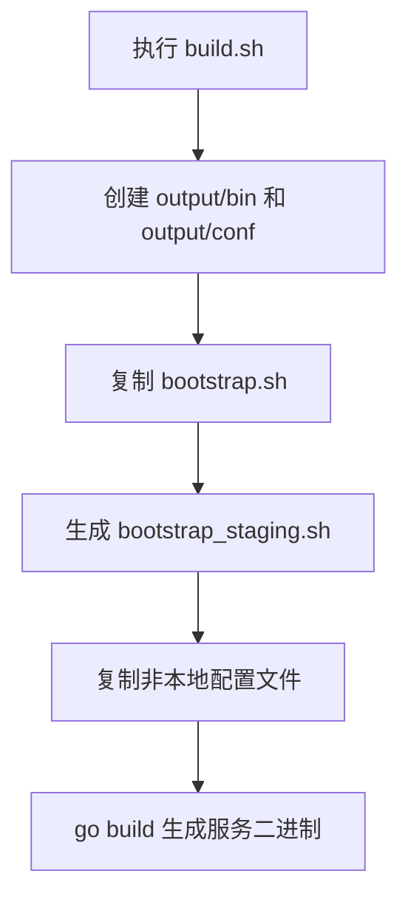

# Other — build.sh

## 模块概览

`build.sh` 是项目的构建与产物整理脚本。它负责创建 `output/` 目录结构，复制启动脚本和配置文件，并将当前 Go 项目编译为可执行文件：

```bash
output/bin/toutiao.videoarch.general_console
```

该脚本没有被代码调用图识别为某个运行时模块的依赖；它更像是仓库级的构建入口，通常由本地开发、CI/CD 或发布流程直接执行。

## 执行流程



核心流程如下：

1. 设置运行产物名称：

```bash
RUN_NAME="toutiao.videoarch.general_console"
```

该变量决定最终 Go 二进制文件名。

2. 创建构建产物目录：

```bash
mkdir -p output/bin output/conf
```

`output/bin` 用于放置编译后的可执行文件，`output/conf` 用于放置运行配置。

3. 复制启动脚本：

```bash
cp script/bootstrap.sh output 2>/dev/null
chmod +x output/bootstrap.sh
cp script/bootstrap.sh output/bootstrap_staging.sh
chmod +x output/bootstrap_staging.sh
```

同一个 `script/bootstrap.sh` 会生成两个启动入口：

- `output/bootstrap.sh`
- `output/bootstrap_staging.sh`

两者都会被设置为可执行文件。`bootstrap_staging.sh` 目前只是 `bootstrap.sh` 的副本，并没有在 `build.sh` 内注入额外的 staging 差异。

4. 复制配置文件：

```bash
find conf/ -type f ! -name "*_local.*" | xargs -I{} cp {} output/conf/
```

该命令会查找 `conf/` 下的所有普通文件，并排除文件名匹配 `*_local.*` 的本地配置文件，然后复制到 `output/conf/`。

这意味着本地开发专用配置不会进入构建产物，例如：

```text
conf/app_local.yaml
conf/service_local.toml
```

需要注意的是，`cp {} output/conf/` 会把文件复制到同一个目标目录下，不保留 `conf/` 内的子目录结构。如果 `conf/` 的不同子目录中存在同名文件，后复制的文件可能覆盖先复制的文件。

5. 编译 Go 程序：

```bash
go build -o output/bin/${RUN_NAME}
```

该命令从当前目录构建 Go 主程序，并将输出写入：

```text
output/bin/toutiao.videoarch.general_console
```

因此，执行 `build.sh` 时应位于仓库根目录，并且当前目录应包含可被 `go build` 识别的 Go 入口包。

## 产物结构

成功执行后，脚本期望生成如下结构：

```text
output/
├── bootstrap.sh
├── bootstrap_staging.sh
├── bin/
│   └── toutiao.videoarch.general_console
└── conf/
    └── 非 *_local.* 的配置文件
```

`output/` 是后续运行、打包或发布流程最可能消费的目录。

## 与代码库的关系

`build.sh` 本身不定义 Go 函数、结构体或包，也没有运行时调用关系。它连接代码库的方式主要体现在三个路径约定上：

- `script/bootstrap.sh`：服务启动脚本来源。
- `conf/`：运行配置来源。
- 当前 Go 模块：通过 `go build` 编译为服务二进制。

因此，修改以下内容时通常需要考虑 `build.sh`：

- 服务二进制命名规则变化。
- 启动脚本路径或启动方式变化。
- 配置目录结构变化。
- 发布系统期望的 `output/` 目录结构变化。

## 维护注意事项

脚本没有启用 `set -e`，因此中间命令失败时不一定会立即终止，最终退出码主要取决于最后的 `go build` 结果。例如第一次复制 `script/bootstrap.sh` 的错误被重定向到 `/dev/null`，但随后的 `chmod +x output/bootstrap.sh` 仍可能失败。

配置复制使用 `find | xargs`，没有使用 `-print0` / `xargs -0`，因此不适合包含空格或特殊换行字符的配置文件名。当前项目配置文件命名应保持简单、稳定。

如果未来需要保留 `conf/` 子目录结构，当前的复制方式需要调整；否则所有配置文件都会被拍平到 `output/conf/`。