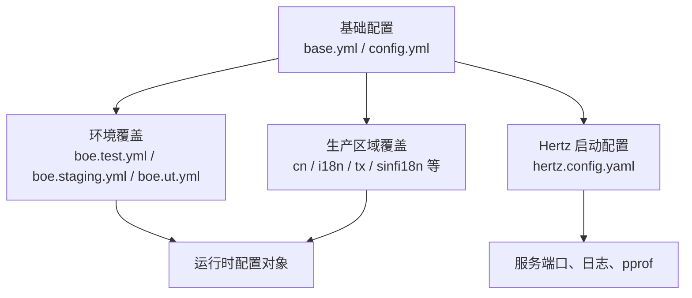

# Other — conf

## 配置模块（conf）

`conf` 模块保存服务运行所需的 YAML 配置，覆盖基础配置、环境覆盖配置、区域覆盖配置以及 Hertz 服务启动配置。该目录本身不包含 Go 函数、类或可执行逻辑；调用图中也没有内部调用、外部调用或入口调用。它通过约定的配置文件名和字段结构，被代码库中的配置加载逻辑读取后注入到数据库、IAM、ByteTree、CloudIAM、MDAP、TOS 等客户端初始化流程中。

## 配置组织方式

核心模式是“基础配置 + 环境/区域覆盖”：



`base.yml` 是最完整的默认配置，包含大多数业务依赖的默认字段。`config.yml` 只保留 `Meta`、`RetryTimes`、`ReadDB`、`WriteDB`，更像基础模板或轻量默认配置。其他 `*.prod.yml`、`boe.*.yml` 文件只声明需要按环境覆盖的字段。

## 基础配置

`base.yml` 定义服务通用默认值：

- `Meta.PSM`：服务 PSM，当前为 `toutiao.videoarch.general_console`。
- `RetryTimes`：通用重试次数，默认 `3`。
- `ReadDB` / `WriteDB`：读写 MySQL 配置模板，包括 `DSNTemplate`、账号、库名、Consul 名称、超时和连接池参数。
- `GuardianAPI`：Guardian 服务调用配置，包含 `PSM`、`AccessKey`、`SecretKey`。
- `JingleAPI`：Jingle/IAM 相关访问配置，包含 `UserName`、`Password`、`Host`。
- `JumpUrl`：前端或业务流程跳转地址，包括 IAM 申请、账号创建、域名修改。
- `ByteTreeConfig`：ByteTree 域名、分区和密钥。
- `JwtRegion`：JWT 区域标识，例如 `cn`、`i18n`、`us`、`tx`、`sinfi18n`。
- `CloudIAM`：Cloud IAM 网关租户、网关域名和服务账号。
- `MDAP`：MDAP 相关 ByteTree、集群和 IAM 配置。
- `VCloudControlConfig`：VCloud 控制面访问凭证配置。

数据库配置采用同一 DSN 模板：

```yaml
DSNTemplate: "%s:%s@tcp(%s)/%s?charset=utf8&parseTime=True&loc=Local&timeout=%s&readTimeout=%s&writeTimeout=%s"
```

运行时通常需要把 `Username`、`Password`、`ConsulName` 解析出的地址、`DBName`、`Timeout`、`ReadTimeout`、`WriteTimeout` 填入模板，生成最终 MySQL DSN。

## Hertz 配置

`hertz.config.yaml` 独立描述 Web 服务运行参数，分为 `Develop` 和 `Product` 两套：

- `ServicePort`：业务服务端口，当前两套环境均为 `6789`。
- `DebugPort`：调试端口，当前为 `6790`。
- `EnablePprof`：是否启用 pprof。
- `LogLevel`：开发环境为 `debug`，生产环境为 `info`。
- `ConsoleLog`：开发环境开启，生产环境关闭。
- `AgentLog` / `FileLog`：两套环境均开启。

这份配置与业务依赖配置分离，适合由 Hertz 启动层或框架初始化代码单独读取。

## 环境覆盖配置

BOE 相关文件包括：

- `boe.staging.yml`
- `boe.test.yml`
- `boe.ut.yml`
- `boei18n.staging.yml`

前三者配置相同，覆盖 `WriteDB`、`ReadDB` 和 `JumpUrl`，数据库均指向 `videoarch_account`，Consul 名称分别为 `consul:toutiao.mysql.videoarch_account_write` 和 `consul:toutiao.mysql.videoarch_account_read`。跳转地址使用 BOE 域名。

`boei18n.staging.yml` 同样使用 `videoarch_account`，但跳转地址切换到 BOE i18n 域名，并覆盖 `JingleAPI.Host` 为 BOE i18n IAM 地址。

## 生产区域配置

生产配置按机房或区域拆分，文件名遵循 `<区域>.prod.yml`：

- 国内账号库区域：`gl2.prod.yml`、`hj.prod.yml`、`hl.prod.yml`、`jj.prod.yml`、`lf.prod.yml`、`lq.prod.yml`、`xh.prod.yml`、`zb.prod.yml`、`zjg.prod.yml`
- 国际化或海外 VCloud 区域：`ie.prod.yml`、`maliva.prod.yml`、`my.prod.yml`、`my3.prod.yml`、`no1a.prod.yml`、`sg1.prod.yml`、`useast2a.prod.yml`、`useast2b.prod.yml`
- 非 TT / sinf 区域：`mya.prod.yml`、`myb.prod.yml`
- TX/TTP 区域：`useast5.prod.yml`、`useast8.prod.yml`
- 新加坡公共账号区域：`sgcomm1.prod.yml`

主要差异集中在以下字段：

- `ReadDB` / `WriteDB`：决定连接 `videoarch_account`、`videoarch_vcloud` 或 `videoarch_account_nontt`。
- `ByteTreeConfig.Domain` 和 `ByteTreeConfig.Partition`：区分 `cn`、`i18n`、`us`、`sg`、`tx`、`sinfi18n` 等分区。
- `JwtRegion`：决定 JWT 区域语义。
- `JingleAPI.Host`：按国内、海外、useast 等 IAM 地址切换。
- `JumpUrl`：按 BOE、i18n、GCP、TTP、US 等流程入口切换。
- `CloudIAM.GatewayTenant` / `GatewayHost`：按 Cloud IAM 租户和网关域名切换。
- `VCloudControlConfig`：仅部分国内区域覆盖。
- `NonTTTOS`：仅 `mya.prod.yml`、`myb.prod.yml` 提供。

## NonTTTOS 配置

`mya.prod.yml` 和 `myb.prod.yml` 增加 `NonTTTOS` 节点，用于非 TT TOS 场景：

```yaml
NonTTTOS:
  Addr: "..."
  UseDomain: true
  RetryTimes: 3
  RetryTimeout: "200ms"
  Creator: "wukuanxin"
  IamAddress: "..."
  S3Region: "ap-southeast-1"
  S3Endpoint: "dualstack-s3.ap-southeast-1.tos.bytepluses.com"
```

该配置同时包含内部 OpenAPI 地址、IAM 地址、S3 区域和 S3 Endpoint。贡献相关逻辑时，应确认调用方是否同时依赖 `Addr` 和 S3 兼容字段，避免只更新其中一侧导致跨云访问异常。

## 与代码库的连接点

该模块没有可被调用的函数或类，连接方式是配置字段契约。代码中的配置结构体、初始化函数或客户端构造逻辑需要与这些 YAML key 保持一致。例如：

- 数据库初始化逻辑应读取 `ReadDB` 和 `WriteDB`，并使用 `DSNTemplate` 拼接 DSN。
- IAM/Jingle 客户端应读取 `JingleAPI.UserName`、`JingleAPI.Password`、`JingleAPI.Host`。
- ByteTree 客户端应读取 `ByteTreeConfig.Domain`、`Partition`、`SecretKey`。
- Cloud IAM 客户端应读取 `CloudIAM.GatewayTenant`、`GatewayHost`、`ServiceAccount`。
- 业务跳转或审批链接生成逻辑应读取 `JumpUrl.IAMApplyUrl`、`CreateAccountUrl`、`ModifyDomainUrl`。
- 非 TT TOS 逻辑应只在存在 `NonTTTOS` 配置的区域启用对应能力。

由于 YAML 文件中大量使用局部覆盖，新增字段时应先放入 `base.yml` 或 `config.yml` 的默认结构，再在需要差异化的环境文件中覆盖。这样可以降低运行时缺字段的风险。

## 维护注意事项

配置文件包含明文访问凭证、密钥和密码字段，例如 `SecretKey`、`AccessKey`、`Password`、`VCloudControlConfig`。提交前应确认这些值符合当前仓库的密钥管理规范；如果项目支持环境变量、KMS 或配置中心，优先将敏感值迁移到受控系统。

修改区域配置时，不要只看文件名判断区域语义。部分区域虽然文件名不同，但共享同一组数据库、ByteTree、CloudIAM 或 JumpUrl 配置；也有区域使用相同 `JwtRegion` 但不同 `GatewayHost`。建议按字段逐项比对后再修改。

新增生产区域配置时，至少需要确认：

- 读写库名和 Consul 名称是否匹配。
- ByteTree 域名、分区和密钥是否属于目标区域。
- `JwtRegion` 是否与认证侧期望一致。
- `JingleAPI.Host` 是否指向正确 IAM 环境。
- `JumpUrl` 的审批流程 `cid` 是否属于目标区域。
- `CloudIAM.GatewayTenant` 和 `GatewayHost` 是否与云环境一致。
- 是否需要 `NonTTTOS` 或 `VCloudControlConfig` 的区域专属配置。