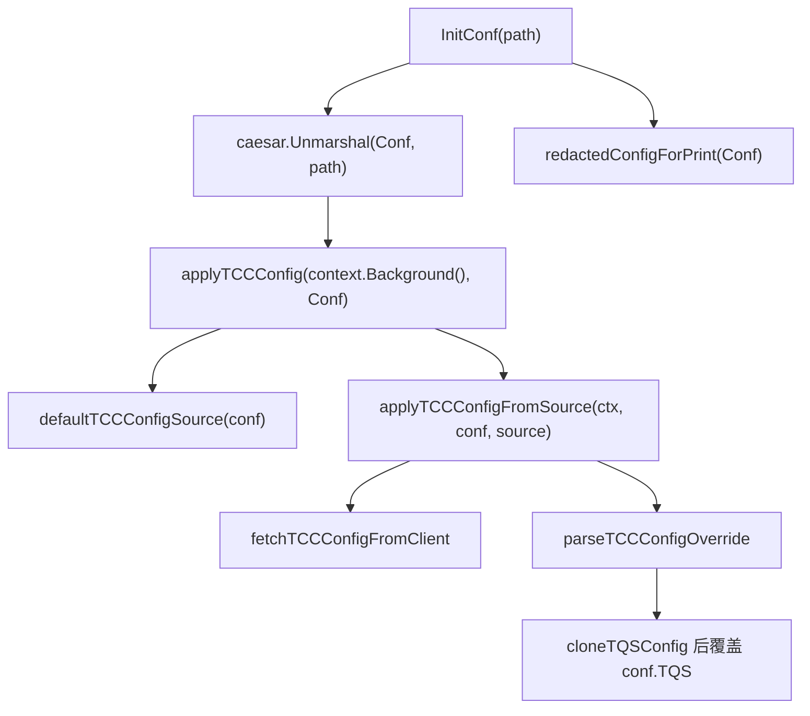

# Other — config

## 配置模块

`biz/config` 负责加载服务运行配置，并向其他业务代码暴露全局配置对象 `Conf *Config`。模块的核心入口是 `InitConf(path string)`：它从本地配置目录读取静态 YAML 配置，然后尝试从 TCC 拉取 `TQS` 动态覆盖配置，最后打印脱敏后的配置内容。



## 配置结构

主配置类型是 `Config`，字段通过 `yaml` tag 与配置文件绑定：

```go
type Config struct {
    Meta                Meta
    WriteDB             *Mysql
    ReadDB              *Mysql
    GuardianAPI         *GuardianAPI
    JingleAPI           *JingleAPI
    VCloudControlConfig *VCloudControlConfig
    JumpUrl             *JumpUrl
    ByteTreeConfig      *ByteTreeConfig
    CloudIAM            *CloudIAMConfig
    MDAP                *MDAPConfig
    TQS                 *TQSConfig
    JwtRegion           string
    TOS                 NonTTTOS
}
```

其中 `Meta.PSM` 会影响 TCC 客户端使用的服务 PSM；如果为空，TCC 默认使用 `toutiao.videoarch.general_console`。

`TQSConfig` 是当前动态覆盖逻辑的重点配置：

```go
type TQSConfig struct {
    AppID                 string
    AppKey                string
    UserName              string
    Cluster               string
    Timeout               time.Duration
    PollInterval          time.Duration
    YarnClusterName       string
    MapReduceJobQueueName string
    AuthMode              string
}
```

`AuthMode` 已标记为废弃字段，仅保留旧 YAML 兼容；Hive import 始终使用服务 PSM token。

## 初始化流程

`InitConf(path string)` 会执行三个步骤：

1. 初始化全局变量 `Conf = new(Config)`。
2. 调用 `caesar.Unmarshal(Conf, path)` 从指定路径加载静态配置。
3. 调用 `applyTCCConfig(context.Background(), Conf)` 尝试用 TCC 中的 `TQS` 配置覆盖本地配置。

如果 `caesar.Unmarshal` 失败，函数会通过 `logs.Fatal` 记录错误并 `panic`。TCC 加载失败不会中断启动；模块会记录 warn 日志并保留本地配置。

测试环境中，`base_test.go` 的 `TestMain` 会先执行：

```go
local.LoadConf()
InitConf(local.ConfDir())
```

因此 `mysql_test.go` 和 `tcc_test.go` 都依赖同一套初始化后的 `Conf`。

## TCC 覆盖机制

TCC 相关逻辑集中在 `tcc.go`。默认配置源由 `defaultTCCConfigSource(conf *Config)` 构造：

- `Key` 固定为 `general_console_cfg`
- `ServicePSM` 优先使用 `strings.TrimSpace(conf.Meta.PSM)`
- `ServicePSM` 为空时回退到 `defaultTCCServicePSM`
- `Confspace` 来自 `tccclient.GetClusterFromEnv()`
- `Fetch` 使用 `fetchTCCConfigFromClient`

实际覆盖由 `applyTCCConfigFromSource(ctx, conf, source)` 完成。它会规范化 `Key`、`ServicePSM`、`Confspace`，调用 `source.Fetch` 获取 YAML 内容，然后通过 `parseTCCConfigOverride` 解析。

TCC YAML 当前只支持覆盖 `TQS`：

```yaml
TQS:
  AppID: "app"
  AppKey: "key"
  UserName: "user"
  Cluster: "lq"
  Timeout: "1s"
```

覆盖前会调用 `isCompleteTQSConfig` 校验必要字段：

- `AppID` 非空
- `AppKey` 非空
- `UserName` 非空
- `Cluster` 非空
- `Timeout > 0`

只有完整配置才会覆盖 `conf.TQS`。覆盖时使用 `cloneTQSConfig`，它会复制配置并 trim 字符串字段，避免把 TCC 中多余空格传播到运行时配置。

如果发生以下情况，`applyTCCConfigFromSource` 返回 `applied=false`，并保持原有静态 `TQS` 不变：

- `source.Fetch` 返回错误
- TCC 配置不存在，即 `tccclient.ConfigNotFoundError`
- YAML 解析失败
- `TQS` 配置不完整
- `conf == nil`
- `source.Fetch == nil`

`applyTCCConfig` 会区分配置不存在和普通失败日志，但二者都会保留本地配置。

## TCC 客户端调用

`fetchTCCConfigFromClient(ctx, servicePSM, confspace, key)` 使用 `tccclient.NewConfigV2()` 构造客户端配置：

```go
cfg.Confspace = confspace
cfg.SetFirstGetRetry(1)
cfg.SetFirstGetTimeout(defaultTCCFirstGetTimeout)
```

默认超时常量为：

```go
defaultTCCFirstGetTimeout = 200 * time.Millisecond
defaultTCCGetTimeout      = 500 * time.Millisecond
```

如果传入的 `ctx` 没有 deadline，函数会额外创建一个 `500ms` 的超时上下文，再执行 `client.Get(ctx, key)`。

## MySQL 配置

MySQL 配置由 `Mysql` 结构承载：

```go
type Mysql struct {
    DSNTemplate  string
    Username     string
    Password     string
    DBName       string
    ConsulName   string
    Timeout      string
    ReadTimeout  string
    WriteTimeout string
    MaxIdle      int
    MaxOpen      int
}
```

`GetDSN()` 根据环境生成连接串：

- 如果 `IsCodebaseCIEnvironment()` 返回 true，直接返回固定 CI DSN。
- 否则用 `fmt.Sprintf` 将 `Username`、`Password`、`ConsulName`、`DBName`、`Timeout`、`ReadTimeout`、`WriteTimeout` 填入 `DSNTemplate`。

`IsCodebaseCIEnvironment()` 通过环境变量判断：

```go
return len(os.Getenv("CI_REPO_NAME")) > 0
```

`NewDB()` 使用 `gorm.Open("mysql2", m.GetDSN())` 建立连接，并配置：

- `db.LogMode(true)`
- `SetMaxIdleConns(m.MaxIdle)`
- `SetMaxOpenConns(m.MaxOpen)`
- `db.SingularTable(true)`

因此调用方通常应通过 `Conf.ReadDB.NewDB()` 或 `Conf.WriteDB.NewDB()` 创建数据库连接。

## 脱敏打印

`redactedConfigForPrint(conf *Config)` 用于初始化结束时打印配置，避免泄露 `TQS.AppKey`。

它的行为是：

- `conf == nil` 时直接返回
- `conf.TQS == nil` 时直接返回
- `conf.TQS.AppKey == ""` 时直接返回
- 否则浅拷贝 `Config`，再拷贝 `TQSConfig`，只把副本中的 `TQS.AppKey` 改为 `"<redacted>"`

原始 `conf.TQS.AppKey` 不会被修改。测试 `TestRedactedConfigForPrint_redactsTQSAppKey` 覆盖了这一点。

## 与代码库其他部分的连接方式

该模块通过全局变量 `Conf` 向外提供配置。业务代码不需要重复解析 YAML，而是直接读取 `config.Conf` 上的字段，例如数据库、TQS、CloudIAM、MDAP、TOS 等配置。

初始化顺序很重要：任何依赖 `config.Conf` 的代码都必须在 `InitConf` 之后运行。测试中由 `TestMain` 保证这一点；服务启动代码也应遵循同样模式。

TCC 覆盖目前只影响 `Conf.TQS`，不会修改数据库、IAM、TOS 或其他配置域。因此新增动态配置时，需要扩展 `tccConfigOverride`、完整性校验和覆盖逻辑，而不是假设 TCC YAML 会自动合并到整个 `Config`。