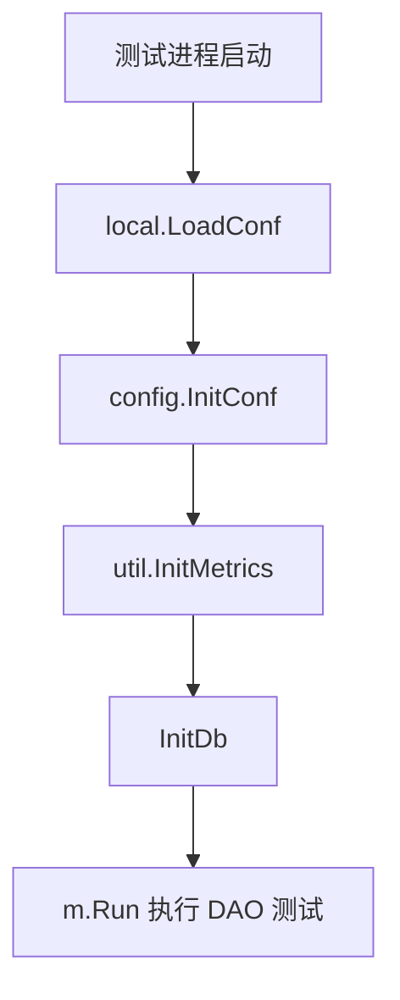

# Other — dal

## 模块概览

`biz/dal` 这一组代码负责数据访问层相关的数据库结构和 DAO 行为验证。当前给出的源码主要覆盖两类权限数据：

- 账号与用户授权关系：`v_account_user_rel`
- 管理员用户：`v_account_admin`

测试代码位于 `biz/dal/dao`，数据库建表 SQL 位于 `biz/dal/db/db.sql`。DAO 的具体实现函数不在本片段中，但测试明确依赖这些真实接口：`InitDb`、`RollbackTX`、`Db.CreateAuthorizeInfo`、`Db.CheckAuthorizeInfo`、`Db.GetAuthorizedAccountIdsOfUser`、`Db.DeleteAuthorizeInfo`、`Db.CreateAdminUserInfo`、`Db.CheckAdminUserInfo`、`Db.DeleteAdminUserInfo`。

## 数据库结构

`biz/dal/db/db.sql` 定义了两个表。

### `v_account_user_rel`

该表保存账号授权给用户的关系。

```sql
CREATE TABLE IF NOT EXISTS `v_account_user_rel` (
    `id` INT unsigned NOT NULL AUTO_INCREMENT,
    `account_id` BIGINT NOT NULL,
    `account_name` VARCHAR(128) NOT NULL,
    `user_name` VARCHAR(128) NOT NULL,
    `operator` VARCHAR(128) NOT NULL,
    `created_at` timestamp NOT NULL DEFAULT CURRENT_TIMESTAMP,
    PRIMARY KEY (`id`),
    UNIQUE KEY uniq_pair (`account_id`, `user_name`)
) ENGINE=InnoDB DEFAULT CHARSET=utf8mb4;
```

关键约束：

- `account_id` 与 `user_name` 组成唯一键 `uniq_pair`，防止同一个账号重复授权给同一个用户。
- `operator` 记录执行授权操作的人。
- `created_at` 由数据库默认写入当前时间。

该表对应测试中使用的 `dto.AuthorizeInfo`，字段包括：

- `AccountId`
- `AccountName`
- `ToAuthorizeUserName`
- `Operator`

### `v_account_admin`

该表保存管理员用户。

```sql
CREATE TABLE IF NOT EXISTS `v_account_admin` (
    `id` INT UNSIGNED NOT NULL AUTO_INCREMENT,
    `user_name` VARCHAR(128) NOT NULL,
    `operator` VARCHAR(128) NOT NULL,
    `created_at` timestamp NOT NULL DEFAULT CURRENT_TIMESTAMP,
    PRIMARY KEY (`id`),
    UNIQUE KEY uniq_name(`user_name`)
) ENGINE=InnoDB DEFAULT CHARSET=utf8mb4;
```

关键约束：

- `user_name` 通过唯一键 `uniq_name` 保证管理员用户不重复。
- `operator` 记录创建该管理员记录的操作人。
- `created_at` 由数据库默认生成。

该表对应测试中使用的 `dto.AdminUserInfo`，字段包括：

- `UserName`
- `Operator`

## 测试初始化流程

`biz/dal/dao/base_test.go` 中的 `TestMain` 是 DAO 测试的统一入口。

```go
func TestMain(m *testing.M) {
	local.LoadConf()
	config.InitConf(local.ConfDir())
	util.InitMetrics()
	InitDb()
	code := m.Run()
	os.Exit(code)
}
```

执行顺序为：

1. `local.LoadConf()` 加载本地配置。
2. `config.InitConf(local.ConfDir())` 初始化业务配置。
3. `util.InitMetrics()` 初始化指标能力。
4. `InitDb()` 初始化数据库连接。
5. `m.Run()` 执行当前包内测试。
6. `os.Exit(code)` 使用测试结果退出。

这意味着 `biz/dal/dao` 下的测试依赖完整运行环境配置和真实数据库初始化，而不是纯内存单元测试。



## 授权关系 DAO 行为

`Test_AllAuthorityInterface` 验证账号授权关系的完整生命周期。

核心流程：

```go
info := dto.AuthorizeInfo{
	AccountId:           99999999,
	AccountName:         "test-account-ut",
	ToAuthorizeUserName: "test",
	Operator:            "ut_test",
}

ctx := context.TODO()

err := Db.CreateAuthorizeInfo(ctx, &info)
err = Db.CheckAuthorizeInfo(ctx, info.AccountId, info.ToAuthorizeUserName)

authorizedId, err := Db.GetAuthorizedAccountIdsOfUser(ctx, info.ToAuthorizeUserName)

err = Db.DeleteAuthorizeInfo(ctx, info.AccountId, info.ToAuthorizeUserName)
```

涉及的 DAO 接口语义如下：

- `Db.CreateAuthorizeInfo(ctx, &info)`：创建账号到用户的授权关系。
- `Db.CheckAuthorizeInfo(ctx, accountId, userName)`：检查指定账号是否已授权给指定用户。
- `Db.GetAuthorizedAccountIdsOfUser(ctx, userName)`：查询指定用户已被授权访问的账号 ID 列表。
- `Db.DeleteAuthorizeInfo(ctx, accountId, userName)`：删除指定账号与用户之间的授权关系。

测试中断言：

```go
assert.Nil(t, err)
assert.Equal(t, len(authorizedId), 1)
assert.Equal(t, authorizedId[0], info.AccountId)
```

这说明测试期望在当前测试数据下，`GetAuthorizedAccountIdsOfUser` 返回且只返回刚创建的 `AccountId`。

需要注意，测试使用固定数据：

- `AccountId: 99999999`
- `ToAuthorizeUserName: "test"`

由于数据库表存在唯一键 `uniq_pair(account_id, user_name)`，如果测试环境中残留相同记录，`CreateAuthorizeInfo` 可能因唯一键冲突失败。因此该测试更接近依赖干净测试库的集成测试。

## 管理员用户 DAO 行为

`Test_AllAdminUserInterface` 验证管理员用户的创建、检查和删除。

核心流程：

```go
admin := dto.AdminUserInfo{
	UserName: "ut_test",
	Operator: "ut_test",
}

ctx := context.TODO()

err := Db.CreateAdminUserInfo(ctx, admin.UserName, admin.Operator)
err = Db.CheckAdminUserInfo(ctx, admin.UserName)
err = Db.DeleteAdminUserInfo(ctx, admin.UserName)
```

涉及的 DAO 接口语义如下：

- `Db.CreateAdminUserInfo(ctx, userName, operator)`：创建管理员用户记录。
- `Db.CheckAdminUserInfo(ctx, userName)`：检查指定用户是否为管理员。
- `Db.DeleteAdminUserInfo(ctx, userName)`：删除管理员用户记录。

表 `v_account_admin` 对 `user_name` 设置唯一键，因此测试同样依赖测试环境中没有残留的 `ut_test` 管理员记录。

## 事务回滚工具

`biz/dal/dao/utils_test.go` 测试 `RollbackTX` 的错误处理行为。

测试构造了一个 `*gorm.DB`，并通过 `gomonkey.ApplyMethod` patch `Rollback` 方法，模拟不同回滚结果：

```go
patches := gomonkey.ApplyMethod(reflect.TypeOf(db), "Rollback", func(db *gorm.DB) *gorm.DB {
	db.Error = errors.New("tx err")
	return db
})
defer patches.Reset()
```

覆盖场景：

- `NormalErr`：调用方已有错误，`Rollback` 本身没有产生新错误，`RollbackTX` 返回原始错误。
- `TxErr`：调用方没有错误，但 `Rollback` 产生 `"tx err"`，`RollbackTX` 返回事务错误。
- `GormErr`：调用方传入 `gorm.Errors`，`Rollback` 又产生 `"tx err"`，`RollbackTX` 返回合并后的 GORM 错误集合。

测试断言方式为比较错误字符串：

```go
if err := RollbackTX(tt.args.tx, tt.args.err); err.Error() != tt.wantErr.Error() {
	t.Errorf("RollbackTX() error = %v, wantErr %v", err, tt.wantErr)
}
```

这表明 `RollbackTX` 的重要职责不是简单调用 `tx.Rollback()`，而是保留并合并调用方原有错误与事务回滚错误。

## 与代码库其他部分的连接

该模块连接了配置、指标、DTO 和 DAO 实现：

- `code.byted.org/middleware/hertz/byted/config/local`：测试启动时加载本地配置。
- `code.byted.org/videoarch/general_console/biz/config`：初始化业务配置。
- `code.byted.org/videoarch/general_console/biz/util`：初始化 metrics。
- `code.byted.org/videoarch/general_console/biz/dal/dto`：提供 `AuthorizeInfo` 和 `AdminUserInfo` 数据结构。
- `code.byted.org/gopkg/gorm`：DAO 层事务和错误处理依赖的 ORM。
- `code.byted.org/gopkg/gomonkey`：测试中用于 patch `Rollback`，验证异常路径。

整体上，`biz/dal` 是业务逻辑与数据库之间的持久化边界。业务层不应直接拼接访问 `v_account_user_rel` 或 `v_account_admin`，而应通过 `Db` 上的 DAO 方法完成授权关系和管理员记录的读写。

## 贡献注意事项

修改该模块时需要重点关注以下约束：

- 新增授权关系写入逻辑时，应保持 `account_id + user_name` 的唯一性语义。
- 新增管理员写入逻辑时，应保持 `user_name` 的唯一性语义。
- 涉及事务的 DAO 逻辑应复用 `RollbackTX` 的错误合并模式，避免回滚错误覆盖原始业务错误。
- 修改 `InitDb` 或测试初始化链路时，需要确认 `TestMain` 中的配置加载、metrics 初始化和数据库初始化顺序仍然有效。
- 当前 DAO 测试使用真实配置和数据库连接，测试数据应避免与环境中已有数据冲突，并在测试结束时清理。