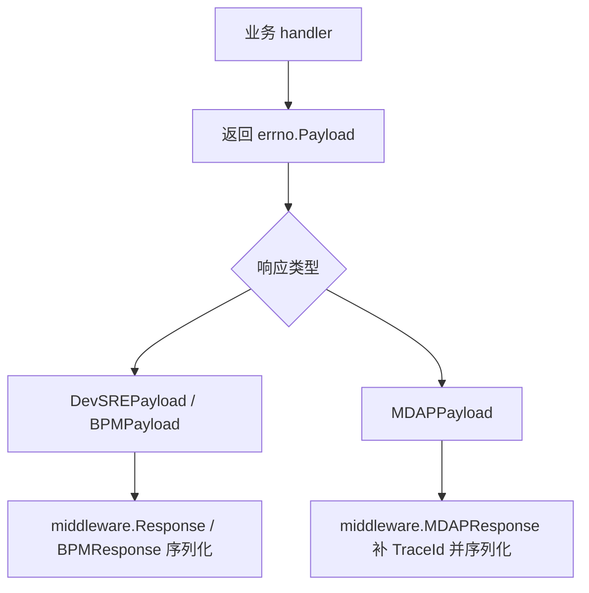

# Other — errno

## 模块概览

`biz/errno` 提供统一的业务响应结构和错误码常量。它不负责处理请求、记录日志或写 HTTP 响应，而是为 handler 和 middleware 构造实现了 `Payload` 接口的返回值。

核心职责：

- 定义业务错误码：`CodeOKZero`、`CodeBadRequest`、`CodeForbidden`、`CodeInternalErr` 等。
- 定义响应包裹结构：`DevSREPayload`、`BPMPayload`、`MDAPPayload`。
- 提供响应构造函数：`DevSreOK`、`DevSreErrorWithCode`、`BpmOK`、`MDAPErrorWithResponse` 等。
- 通过 `Payload` 接口让 `biz/middleware` 可以统一接收 handler 返回值。

## 核心接口

```go
type Payload interface {
	GetCode() int
	GetMessage() string
}
```

`Payload` 是 middleware 和 handler 之间的响应契约。业务 handler 通常返回 `errno.Payload`，middleware 再将其序列化为 JSON。

当前实现该接口的结构包括：

- `DevSREPayload`
- `BPMPayload`
- `MDAPPayload`

`JanusPayload` 也定义在本模块中，但当前代码中没有实现 `GetCode()` / `GetMessage()`，因此不满足 `Payload` 接口。

## 错误码

错误码定义在 `biz/errno/error.go`，按业务语义分组：

```go
const (
	CodeOKZero = 0
	CodeWarn  = 2

	CodeBadRequest   = 4000
	CodeUnauthorized = 4001
	CodeForbidden    = 4003
	CodeNotFound     = 4004

	CodeInternalErr  = 5000
	CodeGetDataErr   = 5012
	CodeParseDataErr = 5013
	CodeDbErr        = 5014
)
```

注意：HTTP 层通常仍返回 `http.StatusOK`，真实业务状态放在 payload 的 `Code` 字段中。比如 `CodeForbidden` 会被序列化进响应体，而不一定对应 HTTP 403。

## 响应结构

### `DevSREPayload`

```go
type DevSREPayload struct {
	Code     int         `json:"code"`
	Message  string      `json:"message"`
	Response interface{} `json:"response"`
	TraceId  string      `json:"trace_id"`
}
```

这是普通控制台接口使用较多的响应格式。数据字段叫 `response`。

常用构造函数：

- `DevSreOK(data interface{})`
- `DevSreError(err error)`
- `DevSreErrorWithCode(code int, err error)`

`DevSreError(nil)` 会退化为成功响应：

```go
DevSreOK(nil)
// Code: CodeOKZero
// Message: "ok"
```

`DevSreErrorWithCode` 会把 `Response` 设置为 `map[string]string{}`，用于显式错误返回。

### `BPMPayload`

```go
type BPMPayload struct {
	Code    int         `json:"code"`
	Message string      `json:"message"`
	Data    interface{} `json:"data"`
	TraceId string      `json:"trace_id"`
}
```

BPM 接口使用 `data` 作为业务数据字段，而不是 `response`。

常用构造函数：

- `BpmOK(data interface{})`
- `BpmError(err error)`
- `BpmErrorWithCode(code int, err error)`

`BpmError(nil)` 同样返回成功响应：

```go
BpmOK(nil)
```

### `MDAPPayload`

```go
type MDAPPayload struct {
	Code     int         `json:"Code"`
	Message  string      `json:"Message"`
	Response interface{} `json:"Response"`
	TraceId  string      `json:"TraceId"`
}
```

`MDAPPayload` 专用于 `/mdap/v1` 路由下的接口。它和 `DevSREPayload` 的主要区别是 JSON 字段名采用大写开头的驼峰格式，例如 `Code`、`Message`、`Response`、`TraceId`。

常用构造函数：

- `MDAPOK(data interface{})`
- `MDAPError(err error)`
- `MDAPErrorWithCode(code int, err error)`
- `MDAPErrorWithResponse(code int, err error, response interface{})`
- `MDAPAuthErrorWithApplyURL(applyURL string)`

`MDAPErrorWithResponse` 用于错误场景仍需要返回结构化响应体的情况。例如批量创建、批处理任务中，部分或全部失败时可以携带详细结果。

`MDAPAuthErrorWithApplyURL` 固定返回：

```go
MDAPPayload{
	Code:    CodeForbidden,
	Message: "permission denied, applyURL: " + applyURL,
}
```

## 分页响应辅助结构

```go
type DevSREPageGetPayloadResp struct {
	Data          interface{} `json:"data"`
	Total         int64       `json:"total"`
	Current       int         `json:"current"`
	PageSize      int         `json:"pageSize"`
	SortField     string      `json:"sortField"`
	SortDirection string      `json:"sortDirection"`
}
```

`DevSREPageGetPayloadResp` 是 DevSRE 风格分页接口的业务数据结构，常作为 `DevSreOK(...)` 的 `Response` 使用，例如账号、域名、授权列表等分页查询接口。

## 典型执行路径



handler 通常只负责构造 payload：

```go
return errno.DevSreOK(data)
return errno.DevSreErrorWithCode(errno.CodeBadRequest, err)

return errno.BpmOK(result)
return errno.BpmErrorWithCode(errno.CodeInternalErr, err)

return errno.MDAPOK(resp)
return errno.MDAPErrorWithResponse(errno.CodeBadRequest, err, detail)
```

middleware 负责把 `errno.Payload` 转成 JSON。`MDAPResponse` 还会在 `MDAPPayload.TraceId` 为空时从上下文读取或生成 trace id。

## 与其他模块的连接

`biz/middleware/base.go` 定义了统一 handler 签名：

```go
type MyHandlerFunc func(context.Context, *app.RequestContext) errno.Payload
```

因此业务 handler 可以只返回 `errno.Payload`，无需直接操作 JSON 序列化。

主要连接方式：

- 普通控制台接口通过 `middleware.Response(...)` 调用 handler，并序列化 `DevSREPayload`。
- BPM 接口通过 `middleware.BPMResponse(...)` 做 JWT 校验后序列化 `BPMPayload`。
- MDAP 接口通过 `middleware.MDAPResponse(...)` 序列化 `MDAPPayload`，并自动补齐 `TraceId`。
- `biz/handler/mdap_*` 中大量使用 `MDAPOK`、`MDAPErrorWithCode`、`MDAPErrorWithResponse`。
- `biz/handler/bpm.go` 和 `biz/handler/script.go` 使用 `BpmOK`、`BpmErrorWithCode`。
- `biz/handler/account.go`、`authorize.go`、`config.go`、`domain.go` 等普通控制台接口使用 `DevSreOK`、`DevSreErrorWithCode`。

## 使用约定

成功响应优先使用对应业务线的 `OK` 构造函数：

```go
return errno.DevSreOK(resp)
return errno.BpmOK(resp)
return errno.MDAPOK(resp)
```

带明确业务错误码的失败响应使用 `ErrorWithCode`：

```go
return errno.MDAPErrorWithCode(errno.CodeBadRequest, err)
return errno.DevSreErrorWithCode(errno.CodeGetDataErr, err)
return errno.BpmErrorWithCode(errno.CodeInternalErr, err)
```

需要在错误响应中返回额外业务数据时，使用 `MDAPErrorWithResponse`：

```go
return errno.MDAPErrorWithResponse(errno.CodeBadRequest, err, resp)
```

不要把 `nil` error 传给 `DevSreErrorWithCode`、`BpmErrorWithCode` 或 `MDAPErrorWithCode`，这些函数会直接调用 `err.Error()`。只有 `DevSreError`、`BpmError`、`MDAPError` 对 `nil` 做了成功响应处理。

## 测试覆盖

`biz/errno/response_test.go` 覆盖了三类响应格式的关键行为：

- `DevSreError(nil)`、`BpmError(nil)`、`MDAPError(nil)` 返回成功响应。
- `DevSreErrorWithCode`、`BpmErrorWithCode`、`MDAPErrorWithCode` 保留传入错误码和错误消息。
- `DevSreOK` 使用 `Response` 字段。
- `BpmOK` 使用 `Data` 字段。
- `MDAPOK` 使用大写 JSON 风格对应的结构字段。
- `MDAPErrorWithResponse` 能携带自定义 `Response`。
- `MDAPAuthErrorWithApplyURL` 返回 `CodeForbidden` 并把申请链接拼入 `Message`。

`biz/errno/base_test.go` 的 `TestMain` 会加载本地配置、初始化 metrics 和数据库，保证包测试在接近真实运行环境的上下文中执行。