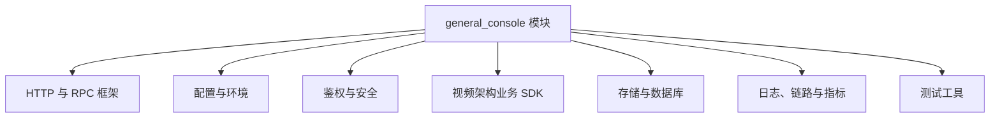

# Other — go.mod

## go.mod 模块说明

`go.mod` 定义了当前仓库的 Go 模块边界、语言版本、依赖集合以及依赖替换规则。该文件本身不包含函数、结构体或可执行逻辑，因此没有内部调用、外部调用或执行流；它通过 Go Modules 机制影响整个代码库的编译、测试、依赖解析和版本选择。

模块路径为：

```go
module code.byted.org/videoarch/general_console
```

这意味着仓库内代码在互相引用时，会以 `code.byted.org/videoarch/general_console/...` 作为包路径前缀。

## Go 版本

```go
go 1.18
```

该声明表示模块按 Go 1.18 的模块语义进行解析。开发和 CI 环境应至少使用兼容 Go 1.18 的工具链，否则可能出现依赖解析、语法或标准库行为不一致的问题。

## 依赖结构

`go.mod` 使用两个 `require` 块：

第一个 `require` 块是项目显式依赖，通常对应业务代码中直接 `import` 的包。

第二个 `require` 块标记为 `// indirect`，表示这些依赖主要由直接依赖传递引入。它们仍会参与版本选择，保证构建结果可复现。

整体上，该模块依赖可以按职责理解为以下几类：



## HTTP 与 RPC 框架

该模块同时引入 Hertz、Kitex、Thrift 和 Overpass 相关依赖，说明代码库既有 HTTP 服务能力，也可能调用或暴露 RPC 能力。

主要依赖包括：

```go
code.byted.org/middleware/hertz v1.14.1
github.com/cloudwego/hertz v0.10.2
code.byted.org/kite/kitex v1.20.3
code.byted.org/kite/kitex-overpass-suite v0.0.36
code.byted.org/kite/kitex/pkg/protocol/bthrift v0.0.0-20250625032607-82820c47ec0e
github.com/apache/thrift v0.16.0
```

其中：

- `code.byted.org/middleware/hertz` 和 `github.com/cloudwego/hertz` 提供 HTTP 服务框架能力。
- `code.byted.org/kite/kitex` 提供内部 Kitex RPC 能力。
- `code.byted.org/kite/kitex-overpass-suite` 支持通过 Overpass 调用内部服务。
- `code.byted.org/kite/kitex/pkg/protocol/bthrift` 和 `github.com/apache/thrift` 与 Thrift 协议编解码相关。

需要注意的是，文件底部存在 `replace` 规则：

```go
replace github.com/apache/thrift => github.com/apache/thrift v0.13.0
```

虽然直接依赖声明中写的是 `github.com/apache/thrift v0.16.0`，但实际构建会使用 `v0.13.0`。修改 Thrift 相关代码或升级依赖时，必须同时检查该替换规则是否仍然必要，否则可能引入协议兼容性或生成代码兼容性问题。

## 配置、环境与服务发现

配置和运行环境相关依赖集中在以下包：

```go
code.byted.org/gopkg/consul v1.2.6
code.byted.org/gopkg/env v1.7.19
code.byted.org/gopkg/tccclient v1.6.8
code.byted.org/videoarch/caesar_config v1.0.9
```

这些依赖通常承担以下职责：

- `consul`：服务发现或配置发现。
- `env`：运行环境识别和环境变量处理。
- `tccclient`：TCC 配置读取。
- `caesar_config`：视频架构内部配置能力。

开发新功能时，如果需要读取配置，应优先查找代码库中已有的配置封装方式，而不是直接散落读取环境变量或硬编码配置名。

## 鉴权、账号与安全能力

直接依赖中包含多组内部鉴权和账号相关 SDK：

```go
code.byted.org/bytecloud/iam_sdk v0.0.7
code.byted.org/videoarch/iamsdk v1.0.56
code.byted.org/videoarch/account-sdk v1.0.52
code.byted.org/videoarch/mdap_auth v0.0.0-20260318031725-da44661884ca
code.byted.org/inf/infsecc v1.0.3
```

这些依赖说明该服务可能涉及：

- 用户或服务身份识别。
- IAM 权限校验。
- 视频架构账号体系访问。
- MDAP 相关鉴权。
- 内部安全能力接入。

贡献鉴权相关代码时，应确认当前调用路径使用的是哪套 SDK，避免在同一业务链路中混用多个权限来源导致语义不一致。

## 视频架构业务 SDK

该模块显式依赖多个 `code.byted.org/videoarch/...` 包，是当前服务连接视频架构业务能力的主要入口：

```go
code.byted.org/videoarch/cloud_gopkg v1.1.226
code.byted.org/videoarch/bktmeta-sdk-go v1.0.57
code.byted.org/videoarch/general_file_manager_go v0.1.6
code.byted.org/videoarch/uploader_v5 v1.0.40
code.byted.org/videoarch/vvid v1.1.24
```

这些依赖大致覆盖：

- 云相关通用能力：`cloud_gopkg`
- Bucket 元数据：`bktmeta-sdk-go`
- 通用文件管理：`general_file_manager_go`
- 上传能力：`uploader_v5`
- 视频 ID 或资源标识：`vvid`

此外，Overpass 客户端依赖也属于业务服务调用入口：

```go
code.byted.org/overpass/bytedance_videoarch_compound v0.0.0-20260422072211-6c5be2272914
code.byted.org/overpass/toutiao_videoarch_video_data_access v0.0.0-20260409053906-2dea154fe7d3
```

这些包通常由生成代码或内部服务定义驱动。升级时应重点关注 IDL 变更、字段兼容性和调用方错误处理逻辑。

## 存储与数据库

数据库相关直接依赖包括：

```go
code.byted.org/gopkg/gorm v1.0.5
code.byted.org/gopkg/mysql-driver v1.2.7
```

间接依赖中还包含：

```go
gorm.io/gorm v1.23.8 // indirect
```

这表明项目可能使用内部封装的 GORM 和 MySQL driver。新增数据库访问代码时，应先查找仓库已有 DAO、model 或 repository 模式，保持连接初始化、事务处理、错误包装和日志字段一致。

## 日志、指标与链路上下文

可观测性相关依赖包括：

```go
code.byted.org/gopkg/ctxvalues v0.5.0
code.byted.org/gopkg/logid v0.0.0-20241008043456-230d03adb830
code.byted.org/gopkg/logs v1.2.26
code.byted.org/gopkg/metrics/v3 v3.1.35
```

这些包通常用于：

- 从 `context.Context` 中传递请求级信息。
- 生成或读取 `logid`。
- 输出结构化日志。
- 上报业务或系统指标。

在新增入口逻辑、RPC 调用、数据库访问或关键业务分支时，应复用已有日志和指标模式，确保排查问题时能串联请求上下文。

## 序列化与数据格式

直接依赖中包含：

```go
github.com/bytedance/sonic v1.15.0
gopkg.in/yaml.v3 v3.0.1
```

`sonic` 通常用于高性能 JSON 编解码，`yaml.v3` 用于 YAML 配置或数据结构解析。若已有代码使用 `sonic`，新增 JSON 处理逻辑应尽量保持一致，避免同一模块内混用多个 JSON 库带来的行为差异。

## 测试依赖

测试相关直接依赖包括：

```go
code.byted.org/gopkg/gomonkey v0.1.4
github.com/agiledragon/gomonkey/v2 v2.13.0
github.com/stretchr/testify v1.10.0
github.com/kr/pretty v0.3.1
github.com/niemeyer/pretty v0.0.0-20200227124842-a10e7caefd8e
```

其中：

- `testify` 常用于断言和 mock 辅助。
- `gomonkey` 用于函数、方法或变量打桩。
- `pretty` 用于测试输出中的结构体差异展示。

新增测试时，应优先使用项目已有测试风格。使用 `gomonkey` 时要注意 patch 生命周期，通常需要在测试结束时释放 patch，避免影响同一进程内其他测试。

## indirect 依赖的意义

第二个 `require` 块中的依赖虽然标记为 `// indirect`，但并不表示“不重要”。它们由直接依赖引入，并被 Go Modules 记录下来，以固定最小版本选择结果。

常见间接依赖类别包括：

- 链路追踪：`code.byted.org/bytedtrace/...`、`code.byted.org/trace/trace-client-go`
- 指标与监控：`prometheus`、`metrics_core`、`monitoring-common-go`
- 安全和证书：`code.byted.org/security/...`
- Kitex、Hertz、Thrift 的底层运行时：`github.com/cloudwego/...`
- Protobuf 与 gRPC：`google.golang.org/protobuf`、`google.golang.org/grpc`
- 配置解析：`viper`、`toml`、`yaml.v2`

不要手动删除 `// indirect` 依赖来“精简”文件。应通过 Go 工具链维护：

```bash
go mod tidy
```

## 依赖维护建议

修改 `go.mod` 时应遵循以下原则：

1. 新增业务依赖前，先确认仓库中是否已经存在同类内部 SDK 或封装。
2. 升级 `kitex`、`hertz`、`thrift`、`gorm` 等基础依赖时，应运行完整测试，并重点验证生成代码、RPC 调用和 HTTP handler 行为。
3. 修改 `replace github.com/apache/thrift` 前，应确认所有 Thrift 生成代码和运行时协议兼容。
4. 不要直接编辑大量 `// indirect` 项；优先使用 `go mod tidy` 让工具链收敛。
5. 如果依赖升级改变了 `go.sum`，应把 `go.mod` 和 `go.sum` 一起提交，保证其他开发者和 CI 能复现同样的解析结果。

## 与代码库其他部分的关系

`go.mod` 是整个 `code.byted.org/videoarch/general_console` 模块的依赖入口。仓库中的业务包、HTTP handler、RPC client、DAO、配置初始化、鉴权逻辑和测试代码都会受它影响。

由于该文件没有执行流，理解它的关键不是调用关系，而是依赖边界：

- 它定义当前代码库可以导入哪些外部包。
- 它固定核心框架和内部 SDK 的版本。
- 它通过 `replace` 改写实际使用的 Thrift 版本。
- 它为构建、测试、代码生成和 CI 提供一致的模块解析基础。