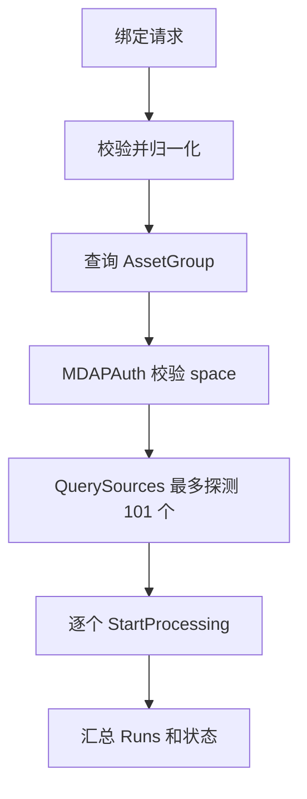

# Other — handler

## 其他 handler 模块

该模块覆盖 `biz/handler` 中偏基础设施和批处理性质的入口：服务初始化、BPM 账号/桶流程、脚本工具、MDAP 处理任务、从 Hive 导入 MDAP Source，以及相关测试支撑。它们共同依赖 `GeneralConsoleServer` 聚合外部 SDK/RPC 客户端，并通过 `middleware.BPMResponse`、`middleware.MDAPResponse` 或 `middleware.Response` 统一输出 `errno.Payload`。

### 服务对象与初始化

核心对象是 `GeneralConsoleServer`。`NewGeneralConsoleServer` 会初始化账号、GFM、ODM、ByteTree、Cloud IAM、Uploader、MDAP Auth、MDAP Compound、Hive VID Reader 等客户端，并保存 `db` 与 `topAccounts`。

初始化要点：

- `mdapCompoundClient` 使用 `bytedance_videoarch_compound.NewClientWithBytedConfig`，集群来自 `config.Conf.MDAP.Cluster`，默认是 `mdap`。
- Hive 导入能力通过 `NewTQSHiveVIDReaderFromConfig(config.Conf.TQS, config.Conf.Meta.PSM)` 注入；配置不完整时不会启用，后续会退化为 `notConfiguredHiveVIDReader`。
- `VCloudControlConfig` 存在且包含 `AccessKey`、`SecretKey` 时才调用 `passportclient.DefaultInstance.SetAuth`。
- `MDAP.IAM` 缺失或字段不完整时跳过；字段完整但 `iam.NewClient` 失败会 `panic`。
- `InitTopAccounts` 会请求 Guardian API `/v1/folders`，按 `nextPageToken` 分页，把 folder id 映射到展示名。

测试入口 `TestMain` 默认会执行 `local.LoadConf`、`config.InitConf`、`dao.InitDb`、`util.InitMetrics` 和 `NewGeneralConsoleServer`。需要跳过真实初始化时设置 `GC_SKIP_HANDLER_TESTMAIN_INIT=1`。

### BPM 账号与桶流程

BPM 入口统一使用 `middleware.BPMResponse` 包装，例如：

- `BPMCreateAccount` -> `handleBPMCreateAccount`
- `BPMCreateAccountBuckets` -> `handleBPMCreateAccountBuckets`
- `BPMCheckUserTreePolicy` -> `handleBPMCheckUserTreePolicy`

`handleBPMCreateAccount` 处理 `BPMCreateAccountWorkflow`：

1. 解析请求，并读取 `x-bpm-bkt_skip`、`x-bpm-bkt_name`、`x-bpm-bkt_async`。
2. 如果账号已存在，复用 `KeyPair`，但如果当前区域已有 `account.ModuleStorage` 配置则返回 `CodeBadRequest`。
3. 如果账号不存在，先通过 `createByteTreeResource` 创建服务树资源，再调用 `accountClient.Create`。
4. 创建成功后调用 `authorizeUser` 授权用户为 `AdminUser`。
5. 调用 `createDomain` 创建 CDN/Internal/InternalRD/ExternalOrigin 域名及账号关系。
6. 默认调用 `rpc.CreateBucket` 创建 object 桶；设置 `x-bpm-bkt_skip` 时走测试/跳过路径。
7. 非异步建桶时，通过 `accountClient.MCreateConfig` 写入 `"object": bucket` 存储配置。

`handleBPMCheckUserTreePolicy` 校验创建资源权限，实际调用 `checkUserByteTreePolicy(ctx, creator, serviceTreeNodeId, "groot.nodes.create_resource")`。`service_tree_node_id` 为 0 会直接报错；权限检查走 `cloudIAMCli.IAM.IAuthCheckerV3.HasPermissionV3Ctx`。

批量建桶逻辑集中在 `doCreateBPMAccountBuckets`。它使用三组映射决定桶名、服务树节点和 TOS vRegion：

- `categoryShortNameMap`：业务分类到短名，例如 `TTS -> "tts"`。
- `shortCategoryServiceTreeNodeIdMap`：短名到服务树节点，例如 `"tts" -> 153535`。
- `sceneTosVRegionMap`：`idc_短名` 到 vRegion；`getSceneTosVRegion` 对 TTS 有 fallback，会退回到 `Original` 对应的短名 `"v"`。

低频桶会按区域调整 `StorageClass` 和 vRegion。桶创建完成后，如果 `WriteAccountConfig` 为真且桶创建未失败，会为 category、低频或 source 派生出的 ckey 调用 `accountClient.MCreateConfig`。

### 脚本入口

脚本类接口使用 `middleware.Response`，面向内部批处理或辅助操作。

`ScriptCreateAccountTree` -> `handleScriptCreateAccountTree` 接收账号列表，逐个执行：

1. `accountClient.GetAccountByName`
2. `createByteTreeResource`
3. 写回 `acct.ServiceTreeNodeId`
4. `accountClient.UpdateAccount`

返回值是 `map[string]string`，每个账号对应 `"ok"` 或错误信息。

`handleScriptBatchCreateBucket` 解析 `model.BatchCreateBucketReq` 并调用 `rpc.BatchCreateBucket`。注意：`ScriptBatchCreateBucket` 当前绑定的是 `svr.handleScriptCreateAccountTree`，而不是 `handleScriptBatchCreateBucket`；修改路由时需要确认这里是否符合预期。

`ScriptUploadFile` -> `handleScriptUploadFile` 从 multipart 字段 `file` 读取内容，写入临时文件，再调用 `uploadCli.UploadFile(ctx, tmpFile.Name(), consts.OBJECT, space, accountId, uploader.WithFileExt(filepath.Ext(fileExt)))`。`space`、`accountId`、`fileExt` 来自 query 参数，临时文件会在请求结束后删除。

### MDAP 处理任务

`CreateMDAPProcessingTask` 是同步 fan-out 入口，包装方法为 `middleware.MDAPResponse(ctx, c, "mdap.processing_task.create", svr.handleCreateMDAPProcessingTask)`。核心逻辑在纯函数 `createMDAPProcessingTask`，方便用 fake backend 测试。

请求结构是 `CreateMDAPProcessingTaskRequest`，校验规则由 `validateMDAPProcessingTaskRequest` 执行：

- `AssetGroupID` 不能为空。
- `OutputStorage` 会转大写，只允许 `TOS` 或 `HDFS`。
- `DatasetListener` 必须显式传入。
- `ResourceMode` 只允许 `exclusive` 或 `shared`。
- `TaskType` 只允许 `template`。
- `Template` 只允许 `snapshot`。
- `TemplateId` 去空格后不能为空。

执行流程：

`mdapProcessingBackend` 抽象了 `MGetAssetGroups`、`QuerySources`、`StartProcessing`。生产实现是 `mdapProcessingCompoundBackend`，其中 `QuerySources` 和 `StartProcessing` 使用 5 秒 RPC timeout。

任务最多处理 100 个 source：查询时 limit 使用 `101`，用于发现超限；如果 source 为空、数量超过 100，或 `Total > 100`，返回 `CodeBadRequest`。每个 source 通过 `startMDAPProcessingForSource` 调用 `StartProcessing`，请求中固定 `OperatorId = "Snapshot"`，`TemplateId` 来自用户请求，`Auth` 来自 `middleware.MDAPAuth`。

响应状态规则：

- 全部成功：`Status = "submitted"`，返回 `errno.MDAPOK`。
- 部分失败：`Status = "partial_failed"`，仍返回 `errno.MDAPOK`。
- 全部失败：`Status = "failed"`，返回 `errno.MDAPErrorWithResponse(errno.CodeInternalErr, ..., resp)`，响应体仍包含每个 run 的失败原因。

### 从 Hive 导入 MDAP Source

`ImportMDAPSourcesFromHive` 负责把 Hive 表中的 `vid` 列转换为 MDAP Source 批量创建请求。入口包装为 `middleware.MDAPResponse(ctx, c, "mdap.source.import_hive", svr.handleImportMDAPSourcesFromHive)`。

请求结构 `ImportMDAPSourcesFromHiveRequest` 包含：

- `AssetGroupID`
- `VODSpaces`
- `HiveTable`：`Cluster`、`Database`、`Table`、`Partitions`、`ExtraFilters`
- `SourceConfig`
- `Tags`
- `Options`：`DryRun`、`SkipCheckMediaType`

`normalizeHiveImportRequest` 会裁剪字符串和 map 中的空格。非 dry-run 模式要求 `AssetGroupID`、`VODSpaces`、`HiveTable.Partitions` 非空，并且显式传入的 `SourceConfig.Type` 必须是 `mdap_model.SourceType_VDA`。dry-run 模式允许跳过资产组、点播空间、分区和 SourceConfig 类型校验，但 `HiveTable.Cluster`、`Database`、`Table` 仍必须存在。

dry-run 模式只调用 `runHiveImportDryRunPrecheck`，最终走 `HiveVIDReader.PrecheckVIDs`，并强制 `Limit = 1`。成功时返回空 `Summary` 和空 `Results`；如果错误包含 `errHiveImportBadRequest`，返回 `CodeBadRequest`，否则返回 `CodeGetDataErr`。

非 dry-run 模式会先调用 `prepareMDAPSourceBatchCreateForHive` 校验资产组权限与存在性，再通过 `resolveHiveImportSourceConfig` 决定 SourceConfig：请求未传时使用 `group.SourceConfigs[0]`，最终类型必须是 VDA。随后 `startHiveImportInBackground` 异步执行真正导入，并立即返回 `CodeOKZero`。

后台任务 `runHiveImportBackground` 使用 `context.Background()`，不会因为原 HTTP 请求取消而中断。它读取 Hive VID 后调用 `buildHiveImportResults` 分类结果：空 VID 标记为 `invalid/empty_vid`，重复 VID 会计入 `DuplicateVIDRows`，但不会去重，也不会截断，重复项仍会进入批创建候选列表。批创建请求由 `buildHiveImportBatchRequest` 生成，默认 `SkipCheckMediaType = true`，并调用 `runMDAPSourceBatchCreator`；默认实现最终走 `batchCreateMDAPSourcesWithGroupOptions(..., dedupeIdenticalSources: false)`。

批创建结果通过 `mergeHiveImportBatchResults` 合并：

- `Source != nil`：`created`
- 错误包含 `"sourceMediaType"`：`skipped`
- 缺少批创建结果或其他错误：`failed`

### TQS Hive VID Reader

`TQSHiveVIDReader` 是 `HiveVIDReader` 的 TQS 实现，由 `NewTQSHiveVIDReaderFromConfig` 创建。配置必须包含 `AppID`、`AppKey`、`UserName`、`Cluster` 和正数 `Timeout`；`PollInterval` 缺省为 3 秒。`servicePSM` 为空时使用 `toutiao.videoarch.general_console`。

`ReadVIDs` 和 `PrecheckVIDs` 共用 `prepareTQSQueryJob`：

1. `buildTQSHiveVIDSQL` 生成 `SELECT \`vid\` FROM \`db\`.\`table\``。
2. `validateQueueConfig` 要求 `YarnClusterName` 和 `MapReduceJobQueueName` 要么同时配置，要么都不配置。
3. `gotqs.MakeTqsClient` 使用配置里的 TQS `cluster`，不是请求里的 Hive `Cluster`。
4. 通过 `infsecc.GetToken(false)` 获取 PSM token，并写入 `tqs.inf.sec.token`。
5. 可选写入 `yarn.cluster.name` 和 `mapreduce.job.queuename`。

SQL 构造只允许安全标识符：`^[A-Za-z_][A-Za-z0-9_]*$`。`Partitions` 与 `ExtraFilters` 会按 key 排序后拼成等值条件，字符串值用单引号包裹并转义内部单引号。`Limit > 0` 时追加 `LIMIT n`。

`ReadVIDs` 创建普通 TQS job，等待 `STATUS_COMPLETE` 后拉取结果并调用 `buildHiveVIDReadResultFromTQSRows`。`PrecheckVIDs` 创建 dry-run job，不拉取结果，只等待 `AnalysisCompleted` 或 `STATUS_COMPLETE`，最长等待时间会限制在 10 秒。

`tqsReadError` 会记录 `stage`、`job_id`、`status`、`detail` 和 `cause`。错误详情会通过 `sanitizeTQSErrorDetail` 脱敏：替换 AppKey、InfSec token、JWT 类字符串，并把超长详情截断到 `maxTQSReadErrorDetailSize`。

### 测试与扩展点

测试代码主要通过 fake 和注入函数隔离外部依赖：

- `fakeMDAPProcessingBackend` 覆盖 MDAP 处理任务的资产组查询、source 查询和处理启动。
- `fakeHiveVIDReader` 覆盖 dry-run precheck 与后台读取。
- `fakeTQSQueryClient` 覆盖 TQS job 创建、轮询、结果拉取和取消。
- `patchNewGeneralConsoleServerDeps` 用 gomonkey 替换 `NewGeneralConsoleServer` 中的大部分外部客户端构造函数。
- `mdapSourceBatchPreparer`、`mdapSourceBatchCreator`、`hiveImportAsyncRunner` 是 `GeneralConsoleServer` 上的显式测试/扩展注入点。

新增逻辑时优先把可测试的核心行为拆成纯函数或小接口，例如 `createMDAPProcessingTask`、`normalizeHiveImportRequest`、`buildHiveImportResults`、`buildTQSHiveVIDSQL` 这种模式。这样可以避免在单元测试中启动完整配置、数据库和外部 RPC。