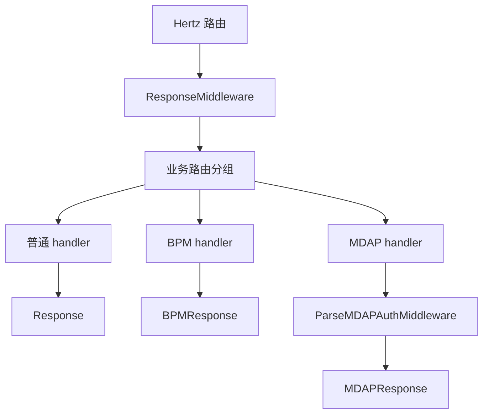

# Other — middleware

## 概览

`biz/middleware` 提供 General Console 的 Hertz 请求中间件和统一响应出口。它不承载业务逻辑，主要负责：

- 将 handler 返回的 `errno.Payload` 序列化为约定 JSON 响应。
- 为普通接口、MDAP 接口、BPM 接口提供不同的响应包装行为。
- 在 MDAP 请求中解析鉴权凭证并写入 `RequestContext`。
- 为 MDAP 响应补齐 `TraceId`。
- 为 BPM 请求校验 `x-jwt-token`。

核心实现位于：

- `biz/middleware/base.go`
- `biz/middleware/parse_mdap_auth.go`

## 响应模型

所有响应包装函数都接收同一种业务 handler 签名：

```go
type MyHandlerFunc func(context.Context, *app.RequestContext) errno.Payload
```

业务 handler 返回 `errno.Payload`，由 middleware 负责写 HTTP 响应。`errno.Payload` 当前要求实现：

```go
type Payload interface {
	GetCode() int
	GetMessage() string
}
```

实际常用响应结构定义在 `biz/errno/response.go`：

- `errno.DevSREPayload`：普通 General Console 接口使用，JSON 字段为小写，例如 `code`、`message`、`response`、`trace_id`。
- `errno.MDAPPayload`：`/mdap/v1` 接口使用，JSON 字段为大写驼峰，例如 `Code`、`Message`、`Response`、`TraceId`。
- `errno.BPMPayload`：BPM 响应结构，当前 `BPMResponse` 实际仍常配合 `errno.DevSreOK` / `errno.DevSreErrorWithCode` 使用。

## 请求执行关系



`router.go` 中的接入方式：

- 全局调用 `r.Use(middleware.ResponseMiddleware())`。
- `/general-console/v1` 下普通接口由 handler 内部调用 `middleware.Response(...)`。
- `/general-console/v1/bpm` 下 BPM 接口由 handler 内部调用 `middleware.BPMResponse(...)`。
- `/mdap/v1` 路由分组挂载 `middleware.ParseMDAPAuthMiddleware()`，然后由 handler 内部调用 `middleware.MDAPResponse(...)`。

`main.go` 在服务启动时调用：

```go
middleware.InitJwtValidator(config.Conf.JwtRegion)
```

用于初始化 BPM JWT 校验器。

## `Response`

```go
func Response(ctx context.Context, c *app.RequestContext, key string, f MyHandlerFunc)
```

`Response` 是普通 General Console 接口的统一出口。

执行流程：

1. 调用业务函数 `f(ctx, c)` 获取 `errno.Payload`。
2. 使用 `json.Marshal(data)` 序列化响应。
3. 序列化失败时调用 `c.JSON(http.StatusOK, errno.DevSreErrorWithCode(errno.CodeInternalErr, err))`。
4. 调用 `c.Data(http.StatusOK, "application/json", bytes)` 写响应体。
5. 将传入的业务 key 写入请求上下文：`c.Set(MKeyContextKey, key)`。

`key` 固定存储在：

```go
const MKeyContextKey = "mkey"
```

常见调用模式：

```go
middleware.Response(ctx, c, "config.module.list", svr.getConfigModuleList)
```

业务 handler 通常返回：

```go
return errno.DevSreOK(data)
```

对应 JSON 格式：

```json
{
  "code": 0,
  "message": "ok",
  "response": {},
  "trace_id": ""
}
```

注意：当前实现中，`json.Marshal` 失败后没有 `return`，后续仍会执行 `c.Data(...)`。因此修改这段逻辑时要留意现有测试对该行为的覆盖，以及真实序列化失败时响应体可能被后续写入覆盖。

## `MDAPResponse`

```go
func MDAPResponse(ctx context.Context, c *app.RequestContext, key string, f MyHandlerFunc)
```

`MDAPResponse` 是 `/mdap/v1` 接口的统一出口，核心差异是响应字段名和 `TraceId` 处理。

执行流程：

1. 调用业务函数 `f(ctx, c)` 获取 `errno.Payload`。
2. 从 `ctx` 中读取 log id：`logid.GetLogIDFromCtx(ctx)`。
3. 如果 ctx 中没有 log id，则调用 `logid.GenLogID()` 生成。
4. 如果业务返回的是 `errno.MDAPPayload` 或 `*errno.MDAPPayload`，并且 `TraceId` 为空，则写入上一步得到的 trace id。
5. 使用 `json.Marshal(data)` 序列化响应。
6. 序列化失败时构造 `errno.MDAPErrorWithCode(errno.CodeInternalErr, err)`，并显式设置 `TraceId`。
7. 调用 `c.Data(http.StatusOK, "application/json", bytes)` 写响应体。
8. 写入 `MKeyContextKey`。

常见调用模式：

```go
middleware.MDAPResponse(ctx, c, "mdap.space.detail", svr.handleGetMDAPSpaceDetail)
```

业务 handler 通常返回：

```go
return errno.MDAPOK(data)
```

对应 JSON 格式：

```json
{
  "Code": 0,
  "Message": "ok",
  "Response": {},
  "TraceId": "logid-test"
}
```

`TraceId` 规则：

- 业务返回 `errno.MDAPPayload{TraceId: "exist"}` 时保留原值。
- 业务返回 `errno.MDAPPayload{TraceId: ""}` 时使用 ctx 中的 log id。
- ctx 中没有 log id 时使用 `logid.GenLogID()`。
- 指针形式 `*errno.MDAPPayload` 也会被补齐。
- 如果返回的 payload 不是 `MDAPPayload` 或 `*MDAPPayload`，不会自动注入 `TraceId`。

和 `Response` 一样，当前 `json.Marshal` 失败后没有提前返回，后续仍会执行 `c.Data(...)`。

## `ParseMDAPAuthMiddleware`

```go
const MDAPAuth = "mdap_auth"

func ParseMDAPAuthMiddleware() app.HandlerFunc
```

`ParseMDAPAuthMiddleware` 只挂载在 `/mdap/v1` 分组上，用于从请求头提取 MDAP 鉴权凭证。

解析顺序：

1. 优先读取 `X-Jwt-Token`。
2. 如果为空，回退读取 `Authorization`。
3. 如果仍为空，返回 MDAP 错误响应并中止请求。
4. 如果读取成功，将凭证写入 `RequestContext`：`c.Set(MDAPAuth, auth)`。
5. 调用 `c.Next(ctx)` 继续后续 handler。

缺少鉴权头时返回 HTTP 200，业务码为 `4001`：

```json
{
  "Code": 4001,
  "Message": "empty auth, need X-Jwt-Token or Authorization header",
  "TraceId": "..."
}
```

`TraceId` 获取规则与 `MDAPResponse` 一致：优先从 ctx log id 读取，缺失时调用 `logid.GenLogID()`。

后续业务代码通过下面方式读取凭证：

```go
credential := c.GetString(middleware.MDAPAuth)
```

例如 `GeneralConsoleServer.MDAPAuth` 会将该凭证传给 `svr.mdapauthClient.ExtractPrincipal(...)`，再调用 `CheckPermission(...)` 做资源权限校验。

## `BPMResponse`

```go
func BPMResponse(ctx context.Context, c *app.RequestContext, key string, f MyHandlerFunc)
```

`BPMResponse` 是 `/general-console/v1/bpm` 接口的统一出口。它在执行业务 handler 前先校验 JWT。

执行流程：

1. 从请求头读取 `x-jwt-token`。
2. 调用全局 `jwtValidator.Validate(ctx, token)`。
3. 校验失败时记录错误日志，并返回：

```go
errno.DevSreErrorWithCode(errno.CodeUnauthorized, err)
```

4. 校验成功时记录操作者用户名：`payload.Username`。
5. 调用业务函数 `f(ctx, c)` 获取响应 payload。
6. 序列化响应并写入 HTTP 200 JSON。
7. 写入 `MKeyContextKey`。

JWT 校验器由下面函数初始化：

```go
func InitJwtValidator(region string) {
    jwtValidator = jwt.NewValidator([]string{"cn", "i18n", "us", "tx", "sinfi18n", "i18nbd"})
}
```

当前实现接收 `region string` 参数，但没有使用该参数，而是使用固定 region 列表初始化 validator。

`BPMResponse` 的失败响应使用 DevSRE 格式：

```json
{
  "code": 4001,
  "message": "invalid jwt",
  "response": {}
}
```

校验失败时不会调用业务 handler，也不会设置 `MKeyContextKey`。

## `ResponseMiddleware`

```go
func ResponseMiddleware() app.HandlerFunc
```

这是一个非常薄的全局 middleware：

```go
return func(ctx context.Context, c *app.RequestContext) {
    c.Next(ctx)
}
```

它当前不修改请求或响应，只负责把请求继续传递给后续 handler。虽然名字叫 `ResponseMiddleware`，真正的响应包装发生在 handler 主动调用的 `Response`、`MDAPResponse`、`BPMResponse` 中。

## 与 handler 层的约定

本模块要求 handler 遵守一个明确模式：路由方法本身不直接写响应，而是把实际业务函数交给 middleware 包装。

普通接口示例：

```go
func (svr *GeneralConsoleServer) GetConfigModuleList(ctx context.Context, c *app.RequestContext) {
    middleware.Response(ctx, c, "config.module.list", svr.getConfigModuleList)
}
```

MDAP 接口示例：

```go
func (svr *GeneralConsoleServer) GetMDAPSpaceDetail(ctx context.Context, c *app.RequestContext) {
    middleware.MDAPResponse(ctx, c, "mdap.space.detail", svr.handleGetMDAPSpaceDetail)
}
```

BPM 接口示例：

```go
func (svr *GeneralConsoleServer) BPMCheckAccountName(ctx context.Context, c *app.RequestContext) {
    middleware.BPMResponse(ctx, c, "account.checkName.bpm", svr.handleCheckAccountName)
}
```

贡献新接口时，应根据路由分组选择对应包装函数：

- `/general-console/v1` 普通接口使用 `Response`。
- `/general-console/v1/bpm` 接口使用 `BPMResponse`。
- `/mdap/v1` 接口使用 `MDAPResponse`，并返回 `errno.MDAPPayload` 相关结构。

## 测试覆盖重点

当前单元测试主要覆盖这些行为：

- `Response` 正常响应、设置 `MKeyContextKey`、处理 `json.Marshal` 错误。
- `MDAPResponse` 自动填充 `TraceId`、保留已有 `TraceId`、支持指针 payload、处理序列化错误。
- `BPMResponse` 在 JWT 无效时返回 `CodeUnauthorized`，JWT 有效时继续执行业务函数。
- `ResponseMiddleware` 会调用 `c.Next(ctx)`。
- `ParseMDAPAuthMiddleware` 支持 `X-Jwt-Token`、`Authorization` fallback，并在缺少鉴权头时 abort。

修改此模块时，最容易影响的是响应 JSON 字段名、HTTP 状态码始终为 200 的约定、`TraceId` 生成规则，以及 `RequestContext` 中 `mkey` / `mdap_auth` 的存储行为。