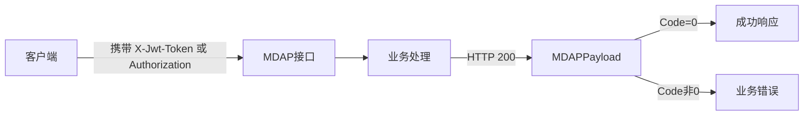

# Other — openapi

## OpenAPI 描述模块

`docs/openapi/mdap_v1.yaml` 是 `/mdap/v1` 路由的 OpenAPI 3.0.3 描述文件，用于记录 General Console 中 MDAP 相关接口的请求、响应、鉴权方式和领域模型。该模块本身是静态契约文件，不包含运行时代码，因此没有内部调用、外部调用或可检测的执行流。

## 核心约定

所有接口都挂在 `/mdap/v1` 下，并统一使用 HTTP 200 返回。业务成功或失败由响应体中的 `Code` 判断，`Code=0` 表示成功。

通用响应结构由 `MDAPPayloadBase` 定义：

```yaml
Code: 0
Message: ok
Response: {}
TraceId: ""
```

鉴权通过 `components.securitySchemes` 声明：

- `MDAPJwtToken`：读取 Header `X-Jwt-Token`，服务端优先使用。
- `Authorization`：兼容 Header，语义等价于 `X-Jwt-Token`。



## 接口分组

### MDAP Space

Space 管理接口集中在 `MDAP Space` 标签下，描述空间创建、查询、更新、鉴权检查和授权能力。

关键操作：

- `CreateMDAPTenant`：`POST /mdap/v1/spaces/create`，创建 MDAP Space，请求体为 `CreateMDAPSpaceReq`。
- `GetMDAPSpaceDetail`：`GET /mdap/v1/spaces/{space_name}/detail`，查询 Space 详情，权限点为 `mdap.tenant.view_detail`。
- `PageGetMDAPSpaces`：`GET /mdap/v1/spaces/page`，返回全量 `Type=MDAP` 的 Space 列表，不做分页。
- `UpdateMDAPSpace`：`PUT /mdap/v1/spaces/update`，更新 Space，服务端要求 `SpaceName` 非空。
- `PageGetMDAPVODSpaces`：`GET /mdap/v1/spaces/vod_list`，通过 `query_name`、`offset`、`limit` 查询 VOD 空间名。
- `CheckMDAPSpaceAuth`：`GET /mdap/v1/spaces/{space_name}/auth_check`，检查 `mdap.tenant.query_source` 权限；无权限时约定返回 `Code=4030`。
- `GrantMDAPSpaceRole`：`POST /mdap/v1/spaces/{space_name}/grant_role`，为空间主体授权，调用方必须是 Space owner 或 `mdap.admin`。

主要模型包括 `CreateMDAPSpaceReq`、`UpdateMDAPSpaceReq`、`MDAPSpaceSummary`、`MDAPSpaceResp`、`RolePrincipal`、`GrantMDAPSpaceRoleRequest` 和 `GrantMDAPSpaceRoleResponse`。

### MDAP AssetGroup

AssetGroup 接口使用 `MDAP AssetGroup` 标签，覆盖数据集分组的创建、详情、删除和列表查询。

关键操作：

- `CreateMDAPAssetGroup`：`POST /mdap/v1/asset_groups`，创建 AssetGroup，权限点为 `mdap.tenant.create_asset_group`。
- `GetMDAPAssetGroup`：`GET /mdap/v1/asset_groups/{id}/detail`，按 ID 获取详情，权限点为 `mdap.tenant.query_asset_group`。
- `DeleteMDAPAssetGroup`：`DELETE /mdap/v1/asset_groups/{id}`，删除 AssetGroup，权限点为 `mdap.tenant.create_asset_group`。
- `ListMDAPAssetGroups`：`POST /mdap/v1/asset_groups/list`，按 `Space`、`Name`、`MediaTypes`、`Offset`、`Limit` 查询。

`CreateAssetGroupRequest` 保持底层 thrift/kitex 类型的大写 JSON 字段风格，例如 `Space`、`Name`、`MediaTypes`、`SourceConfigs`、`Base`。其中 `Base` 当前在 general_console 接口中未使用，但底层 thrift 定义为 required，调用方通常传空对象。

### MDAP Source

Source 接口位于 `MDAP Source` 标签下，负责创建、批量创建、Hive 导入和分页查询。

关键操作：

- `CreateMDAPSource`：`POST /mdap/v1/sources`，创建单个 Source。`BizID` 必填，`Name` 为空时服务端默认使用 `BizID`。
- `BatchCreateMDAPSource`：`POST /mdap/v1/sources/batch`，在同一 `AssetGroupID` 下批量创建 Source。
- `ImportMDAPSourcesFromHive`：`POST /mdap/v1/sources/import/hive`，从 Hive 快照表固定读取 `vid` 列并提交后台导入。
- `QueryMDAPSources`：`POST /mdap/v1/sources/query`，按 `AssetGroupID` 分页查询 Sources，权限点为 `mdap.tenant.query_source`。

批量创建时，`BatchCreateMDAPSourceRequest.SkipCheckMediaType` 决定媒体类型不匹配的处理方式：默认 `false` 时整体返回参数错误；为 `true` 时跳过不匹配条目，并在对应 `BatchCreateMDAPSourceResult.Error` 中记录失败原因。

Hive 导入接口区分 dry-run 和真实导入：`HiveImportOptions.DryRun=true` 时只做轻量 Hive/TQS 可访问性预检，不创建 Source，也不返回实际 VID；`DryRun=false` 时完成参数与权限校验后立即返回，真实读取和创建在后台执行。

### MDAP Processing

`CreateMDAPProcessingTask` 对应 `POST /mdap/v1/processing_tasks`，用于提交短期的模板处理任务。当前契约只覆盖模板任务和抽帧场景：

- `TaskType` 仅支持 `template`。
- `Template` 仅支持 `snapshot`。
- `TemplateId` 会原样透传到 Compound `StartProcessing.TemplateId`。
- `OutputStorage`、`DatasetListener`、`ResourceMode` 当前只作为前端交互字段接收和回显，不传给 `StartProcessing`。

响应模型 `CreateMDAPProcessingTaskResponse` 使用 `Runs` 返回每个 Source 的提交结果，单条结果由 `MDAPProcessingRun` 表示。

### MDAP Artifact

Artifact 查询接口由 `QueryArtifacts` 描述，对应 `POST /mdap/v1/artifacts/query`，权限点为 `mdap.tenant.query_artifact`。

请求模型 `QueryArtifactsRequest` 支持按 `Space`、`SourceBizIDs`、`Types`、`Name`、`DeriveType`、`DeriveIDs`、`WithContents`、`Offset` 和 `Limit` 查询。响应模型 `QueryArtifactsResponse` 返回 `Artifacts` 和 `Total`。

## 领域模型

`AssetGroup` 是 Source 和 Artifact 的上层组织结构，包含 `ID`、`Space`、`Name`、`MediaTypes`、`SourceCount`、`Size`、`SourceConfigs` 和 `ArtifactConfig` 等字段。

`Source` 表示进入 MDAP 处理链路的源数据，核心字段包括 `ID`、`BizID`、`AssetGroupID`、`Name`、`MediaType`、`Format`、`Config`、`Tags`、`CreatedTime` 和 `UpdatedTime`。

`SourceConfig` 描述 Source 的来源配置，`Type` 枚举值为 `0=VDA`、`1=MessEngine`、`2=TOS`、`3=URL`、`4=HDFS`。`StoreLocation.Type` 枚举值为 `0=TOS`、`1=HDFS`、`2=NAS`。

`Artifact` 表示处理产物，支持 `DeriveType`、`DeriveID`、`Name`、`Size`、`Contents`、`CreatedTime` 和 `UpdatedTime`。`ArtifactType` 枚举值为 `0=Snapshots`、`1=Audio`、`2=Image`。

## 维护注意事项

新增或修改 `/mdap/v1` 接口时，需要同步更新 `paths` 下的路径、`operationId`、请求体 schema、响应 schema 和权限说明。响应应继续复用 `MDAPPayloadBase` 的包装模式，并为具体接口定义形如 `MDAPPayload_QueryArtifactsResponse` 的 typed payload schema。

如果后端字段来自 thrift/kitex 类型，应保持实际 JSON tag 风格，不要为了 OpenAPI 统一命名而改成小驼峰。例如 `CreateAssetGroupRequest`、`QueryAssetGroupsRequest`、`SourceConfig` 和 `StoreLocation` 都使用大写字段名。

对于异步语义接口，需要在 `description` 中明确 `Code=0` 的含义。当前 `ImportMDAPSourcesFromHive` 的成功只表示后台导入已提交，`CreateMDAPProcessingTask` 的成功只表示至少一个 Source 成功提交到 Compound。