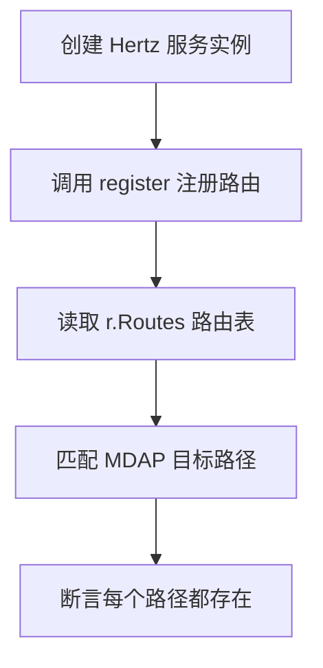

# Other — router_test.go

## 模块概览

`router_test.go` 是路由注册的回归测试模块，当前只包含一个测试函数：`Test_register_routes_contains_mdap`。它验证 `register` 在 Hertz 服务实例上注册路由后，关键 MDAP 接口路径确实存在。

该测试保护的是路由表契约，而不是具体业务逻辑。它不会调用 handler，也不会发起 HTTP 请求，只检查 `server.Hertz.Routes()` 返回的路由元数据。

## 测试目标

`Test_register_routes_contains_mdap` 覆盖以下路径是否被注册：

```go
"/mdap/v1/spaces/create"
"/mdap/v1/asset_groups/list"
"/mdap/v1/sources/import/hive"
"/mdap/v1/processing_tasks"
```

这些路径由 `register` 注册到 Hertz 服务中。测试通过后，可以确认 MDAP 相关入口没有因为路由生成、注册逻辑调整或 handler 结构变化而从路由表中消失。

## 执行流程



测试代码的核心流程如下：

1. 使用 `server.New()` 创建一个新的 Hertz 服务实例。
2. 调用 `register(r, &handler.GeneralConsoleServer{})` 注册路由。
3. 通过 `r.Routes()` 获取注册后的路由列表。
4. 使用 `want map[string]bool` 保存必须存在的 MDAP 路径。
5. 遍历路由表，如果某个 `rt.Path` 命中 `want`，就将对应值标记为 `true`。
6. 最后使用 `assert.True(t, found, "missing route: %s", path)` 逐个断言路径已注册。

## 关键组件

### `Test_register_routes_contains_mdap`

这是本模块唯一的测试函数。它不依赖请求上下文，也不执行真实 handler，只关心路由注册结果。

测试关注点是 `rt.Path` 字段，因此它只验证路径存在性。它不会验证：

- HTTP 方法是否正确
- 路由绑定的 handler 是否正确
- 中间件链是否正确
- 路由分组或注册顺序是否正确

如果未来需要覆盖这些内容，应在现有路径存在性测试之外新增更具体的断言。

### `register`

`register` 定义在 `router_gen.go`，由本测试直接调用。测试假设 `register` 是服务启动时使用的实际路由注册入口，因此它能够覆盖生成路由表是否包含 MDAP 接口。

如果 `router_gen.go` 的生成逻辑发生变化，或者 MDAP 路由被迁移到其他注册函数，本测试可能失败，需要同步更新测试入口或目标路径。

### `handler.GeneralConsoleServer`

测试传入 `&handler.GeneralConsoleServer{}` 作为路由注册时的 handler 接收者。这里不会执行 `GeneralConsoleServer` 的业务方法，但它必须满足 `register` 所需的 handler 结构。

如果 `register` 对 `GeneralConsoleServer` 的方法集有编译期依赖，相关 handler 方法被删除或签名变化时，该测试也会在编译阶段暴露问题。

## 与代码库的连接

`router_test.go` 位于 `package main`，因此可以直接访问同包内的 `register`。它连接了三个主要部分：

- Hertz 服务框架：`code.byted.org/middleware/hertz/pkg/app/server`
- 路由注册入口：`register`
- 业务 handler 类型：`code.byted.org/videoarch/general_console/biz/handler.GeneralConsoleServer`

这使得测试更接近真实服务初始化路径，而不是单独测试某个路由常量或配置片段。

## 维护建议

新增或删除 MDAP 路由时，应同步检查 `want` 中的路径列表。该列表应该只包含对服务兼容性重要、需要防止误删的入口，避免把所有路由机械加入测试导致维护成本过高。

如果某个路径被有意重命名或迁移，测试失败是预期信号。更新测试前应确认调用方、网关配置、前端请求或外部依赖是否已经完成对应迁移。

如果需要验证方法或 handler 绑定，可以扩展遍历逻辑，检查 `rt.Method` 等路由元数据，而不是只比较 `rt.Path`。