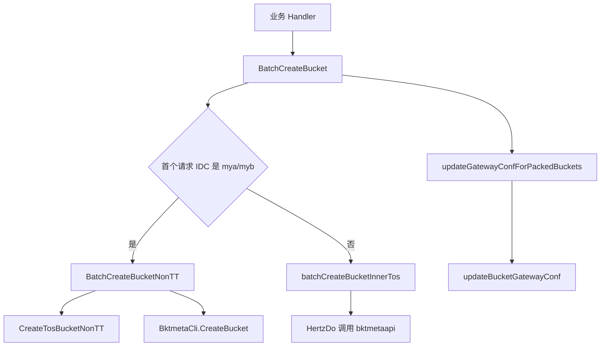

# Other — rpc

## 模块定位

`biz/rpc` 封装了建桶相关的外部 RPC/HTTP 调用，主要连接三类系统：

- `bktmetaapi`：内网 TOS 建桶、BPM 建桶、建桶状态查询。
- NonTT TOS OpenAPI：`mya`、`myb` IDC 的外部 TOS 建桶。
- `bktmeta-sdk-go`：查询、创建、更新 bktmeta 桶元数据。

模块入口通常由 `main.go` 调用 `InitRPC(config.Conf)` 完成初始化；业务侧通过 `biz/handler/script.go` 和 `biz/handler/bpm.go` 调用 `BatchCreateBucket`、`CreateBucket`、`CheckBucketCreateStatus`。

## 初始化

`InitRPC(conf *config.Config)` 初始化模块级全局依赖：

- `jwtGenerator`：使用 `conf.TOS.IamAddress` 创建，用于 NonTT TOS 请求签名。
- `hertzCli`：共享 Hertz HTTP client，供 `HertzDo` 使用。
- `tosToken`：从环境变量 `TOS_TOKEN` 读取。
- `tosConfig`：保存 `conf.TOS`，包含 `Addr`、`UseDomain`、`Cluster`、`Creator`、`S3Region`、`S3Endpoint` 等字段。
- `BktmetaCli`：通过 `bktmeta.NewClient(bktmeta.WithCallingPSM(conf.Meta.PSM))` 创建。

初始化失败会 `panic`，因此调用 RPC 函数前必须保证 `InitRPC` 已执行。

## 批量建桶主流程

`BatchCreateBucket(ctx, batchReq)` 是脚本和 BPM 流程共用的批量建桶入口。



关键行为：

- 空请求直接返回空的 `model.BatchCreateBucketResp{}`。
- 分流只检查 `batchReq[0].IDC`：
  - `mya` 或 `myb` 调用 `BatchCreateBucketNonTT`。
  - 其他 IDC 调用 `batchCreateBucketInnerTos`。
- 建桶失败时直接返回错误，不执行网关配置更新。
- 建桶成功后会对特定打包类目调用 `updateGatewayConfForPackedBuckets`。

调用方应保证同一个 `BatchCreateBucketReq` 中的桶属于同一类 IDC 路径；混合 IDC 会按首个元素分流。

## 内网 TOS 批量建桶

`batchCreateBucketInnerTos(ctx, batchReq)` 调用：

```text
POST http://toutiao.videoarch.bktmetaapi/gateway/v1/buckets/batch
```

请求体是 `model.BatchCreateBucketReq` 的 JSON。请求使用 Hertz `protocol.Request`，并设置：

- `Content-Type: application/json`
- `discovery.WithSD(true)`
- `discovery.WithDestinationCluster("default")`
- `hconfig.WithRequestTimeout(getBktmetaTimeout())`

响应解析到 `errno.JanusPayload`。当 `res.Code == 0` 时，将 `res.Response` 再转换为 `model.BatchCreateBucketResp`；否则返回 `res.Message` 对应的错误。

`getBktmetaTimeout()` 从环境变量 `BKTMETA_TIMEOUT` 读取超时时间：

- 空值使用默认 `30s`。
- 支持 Go duration 字符串，例如 `45s`。
- 支持纯数字秒数，例如 `12` 表示 `12s`。
- 非法值或非正数回退到默认值。

## NonTT TOS 建桶

`BatchCreateBucketNonTT(ctx, batchReq)` 逐个处理桶：

1. 先用 `BktmetaCli.GetBucket` 查询桶是否已存在。
2. 如果存在，将桶名加入 `model.BatchCreateSkip`。
3. 如果不存在，构造 `CreateBucketParam` 并调用 `CreateTosBucketNonTT`。
4. NonTT TOS 创建成功后，再构造 `meta.Bucket` 和 `meta.S3Bucket`，调用 `BktmetaCli.CreateBucket` 写入 bktmeta。
5. 任一步失败都会把桶名加入 `model.BatchCreateFailed`；成功加入 `model.BatchCreateSuccess`。

`CreateTosBucketNonTT(ctx, param)` 调用：

```text
POST {tosConfig.Addr}/public/v3/bucketbu
```

它会通过 `jwtGenerator.Generate(ctx, tosToken)` 生成 JWT，并设置请求头：

- `x-jwt-token`
- `Content-Type: application/json`

请求是否走服务发现由 `tosConfig.UseDomain` 决定：`discovery.WithSD(!tosConfig.UseDomain)`。

响应解析为 `model.CreateBucketResult`。`result.IsOK()` 或 `result.IsDuplicateError()` 都视为成功，并返回 `result.Data`；其他情况返回 `result.GetError()`。

## BPM 建桶与状态查询

`CreateBucket(ctx, bpm)` 面向 BPM 建桶流程，调用：

```text
POST http://toutiao.videoarch.bktmetaapi/gateway/v1/bpm/buckets/tos/create
```

请求类型是 `model.BPMCreateTOSBucketsRequest`，响应通过 `errno.DevSREPayload` 解析。成功时返回 `model.CreateTosBucketBPMResp`，其中包含：

- `BucketsCategories map[string]string`
- `AsyncCreate bool`

`CheckBucketCreateStatus(ctx, buckets)` 调用：

```text
POST http://toutiao.videoarch.bktmetaapi/gateway/v1/bpm/buckets/tos/register/status
```

请求体为：

```json
{
  "buckets": ["bucket-a", "bucket-b"]
}
```

成功时返回 `model.CheckBucketCreateStatusResp`，包含整体状态 `WholeStatus` 和逐桶状态 `BucketStatus`。

## 打包类目网关配置

建桶完成后，`BatchCreateBucket` 会调用 `updateGatewayConfForPackedBuckets`，只处理以下类目：

- `medigest.image.zip`
- `vframe:zip`

`shouldUpdateGatewayConf(category)` 负责这个判断。

只有响应状态为 `model.BatchCreateSuccess` 或 `model.BatchCreateSkip` 的桶才会尝试更新网关配置。实际更新由 `updateBucketGatewayConf(ctx, bucketName)` 完成：

1. `BktmetaCli.GetBucket` 获取桶元数据。
2. 写入 `meta.GatewayConfig`：
   - `Pack.Enable = true`
   - `Pack.Delimiter = "$TOS$"`
   - `Pack.AllowedMethods = []string{"PUT", "GET", "HEAD"}`
   - `Pack.WriteContentType = "tos/zip"`
3. `BktmetaCli.UpdateBucket` 更新桶。

更新失败时，`updateGatewayConfForPackedBuckets` 会记录日志，并调用 `moveBucketStatus(resp, success, failed, bucketName)`。注意：这里仅会把 `success` 中的桶移动到 `failed`；如果桶原本在 `skip` 中，更新失败不会改变其状态。

每个桶更新后会 `time.Sleep(time.Second)`，用于给下游状态传播留出间隔；单测中通过 monkey patch 跳过该等待。

## 通用 HTTP 执行器

`HertzDo(ctx, req, v)` 是模块内 Hertz 请求的共享执行函数：

- 创建 `protocol.Response`。
- 设置 `X-TT-LOGID` 为 `ctxvalues.LogIDDefault(ctx)`。
- 使用全局 `hertzCli.Do(ctx, req, rsp)` 发起请求。
- HTTP 状态码非 `200 OK` 时返回响应体字符串作为错误。
- 成功后用 `sonic.Unmarshal(rsp.Body(), v)` 解析响应体。

`batchCreateBucketInnerTos` 和 `CreateTosBucketNonTT` 都依赖它。

## 主要数据结构

`model.BatchCreateBucketReq` 是 `[]model.ScriptCreateBucketReq`，包含桶名、IDC、Owner、ServiceNode、VRegion、Category、Public、Qos 等建桶参数。

`model.BatchCreateBucketResp` 是：

```go
map[model.BucketCreateStatus][]string
```

状态常量包括：

- `model.BatchCreateSuccess`
- `model.BatchCreateSkip`
- `model.BatchCreateFailed`
- `model.BatchCreateWaitApprove`

`CreateBucketParam` 是 NonTT TOS OpenAPI 的请求结构，字段包括 `Name`、`Creator`、`ServiceNode`、`Public`、`ReadQPS`、`WriteQPS`、`ReadRate`、`WriteRate`、`SecurityLevel`、`VRegion` 等。

## 贡献注意事项

- 这个包大量使用模块级全局变量，新增测试时通常需要保存旧值并在 `t.Cleanup` 中恢复。
- `BatchCreateBucket` 的 IDC 分流依赖首个请求元素，修改调用方批量聚合逻辑时要避免混合 IDC。
- NonTT 路径同时创建真实 TOS 桶和 bktmeta 记录，两个步骤的失败处理不同，改动时要保持 `success`、`skip`、`failed` 语义一致。
- 打包类目的网关配置是建桶后的补充步骤，不属于底层建桶 API 本身；新增打包类目时应同步更新 `shouldUpdateGatewayConf` 和相关单测。
- `tosConfig.TosToken` 存在于配置结构中，但当前代码实际读取环境变量 `TOS_TOKEN`。