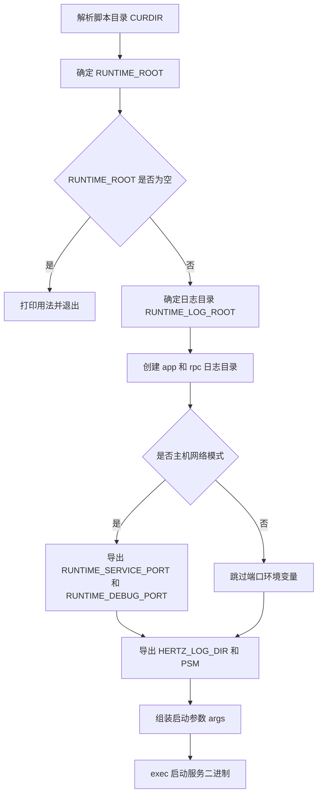

# Other — script

## 模块概览

`script/bootstrap.sh` 是服务进程的启动脚本，负责根据运行目录、端口和部署环境变量组装启动参数，创建日志目录，然后通过 `exec` 启动二进制文件：

```bash
$CURDIR/bin/toutiao.videoarch.general_console
```

脚本本身不定义函数，也没有模块内调用关系。它的核心职责是把部署环境转换成服务进程需要的命令行参数和环境变量。

## 启动入口

脚本接收两个位置参数：

```bash
./bootstrap.sh [RUNTIME_ROOT] [PORT]
```

参数含义：

- `$1`：`RUNTIME_ROOT`，运行根目录。未传入时默认使用脚本所在目录 `CURDIR`。
- `$2`：`PORT`，可选服务端口。传入后会追加到启动参数 `-port=$PORT`。

脚本通过以下逻辑确定当前目录：

```bash
CURDIR=$(cd $(dirname $0); pwd)
```

因此无论从哪个工作目录执行脚本，二进制路径和配置目录都会相对于 `bootstrap.sh` 所在目录解析。

## 执行流程



## 路径与目录约定

### 脚本目录：`CURDIR`

`CURDIR` 是 `bootstrap.sh` 所在目录，后续这些路径都基于它：

- 二进制文件：`$CURDIR/bin/toutiao.videoarch.general_console`
- 配置目录：`$CURDIR/conf/`

### 运行根目录：`RUNTIME_ROOT`

`RUNTIME_ROOT` 来自第一个参数，未传时退回到 `CURDIR`：

```bash
if [ "X$1" != "X" ]; then
    RUNTIME_ROOT=$1
else
    RUNTIME_ROOT=${CURDIR}
fi
```

脚本还设置了：

```bash
RUNTIME_CONF_ROOT=$RUNTIME_ROOT/conf
```

但当前实现没有继续使用 `RUNTIME_CONF_ROOT`。实际传给服务进程的配置目录是：

```bash
CONF_DIR=$CURDIR/conf/
```

这意味着即使调用方传入了不同的 `RUNTIME_ROOT`，配置仍然从脚本目录下的 `conf/` 读取。

### 日志目录：`RUNTIME_LOG_ROOT`

日志根目录根据部署环境决定：

```bash
if [ "${IS_TCE_DOCKER_ENV}" == 1 ] && [ -n "${RUNTIME_LOGDIR}" ]; then
    RUNTIME_LOG_ROOT=$RUNTIME_LOGDIR
else
    RUNTIME_LOG_ROOT=$RUNTIME_ROOT/log
fi
```

规则如下：

- 在 TCE Docker 环境中，且 `RUNTIME_LOGDIR` 非空时，使用 `RUNTIME_LOGDIR`。
- 其他情况下，使用 `$RUNTIME_ROOT/log`。

脚本会确保以下目录存在：

```bash
$RUNTIME_LOG_ROOT/app
$RUNTIME_LOG_ROOT/rpc
```

随后导出：

```bash
export HERTZ_LOG_DIR=$RUNTIME_LOG_ROOT
```

服务进程会通过 `HERTZ_LOG_DIR` 感知日志根目录，同时命令行参数也会传入：

```bash
-log-dir=$HERTZ_LOG_DIR
```

## 服务身份

脚本固定服务名和二进制名：

```bash
SVC_NAME=toutiao.videoarch.general_console
BinaryName=toutiao.videoarch.general_console
```

服务名会通过两种方式传递给进程：

```bash
export PSM=$SVC_NAME
-psm=$SVC_NAME
```

这说明运行时既可能通过环境变量 `PSM` 获取服务身份，也可能通过命令行参数 `-psm` 获取。

## 端口处理

第二个参数 `PORT` 是普通服务端口。传入时追加到启动参数：

```bash
-port=$PORT
```

在主机网络模式下，脚本还会读取外部环境变量：

```bash
if [ "$IS_HOST_NETWORK" == "1" ]; then
    export RUNTIME_SERVICE_PORT=$PORT0
    export RUNTIME_DEBUG_PORT=$PORT1
fi
```

这里的约定是：

- `IS_HOST_NETWORK=1` 表示使用主机网络模式。
- `PORT0` 被导出为 `RUNTIME_SERVICE_PORT`。
- `PORT1` 被导出为 `RUNTIME_DEBUG_PORT`。

这些变量不会直接追加到 `args`，而是通过环境变量暴露给服务进程或运行时框架。

## 启动参数

最终命令行参数由 `args` 变量组装：

```bash
args="-psm=$SVC_NAME -conf-dir=$CONF_DIR -log-dir=$HERTZ_LOG_DIR"
```

如果传入了第二个参数：

```bash
args+=" -port=$PORT"
```

最终启动命令形态为：

```bash
$CURDIR/bin/toutiao.videoarch.general_console \
  -psm=toutiao.videoarch.general_console \
  -conf-dir=$CURDIR/conf/ \
  -log-dir=$RUNTIME_LOG_ROOT \
  [-port=$PORT]
```

脚本会先打印完整命令，再使用 `exec` 替换当前 shell 进程：

```bash
exec $CURDIR/bin/${BinaryName} $args
```

使用 `exec` 后，`bootstrap.sh` 不再作为父进程保留；当前进程会直接变成服务二进制进程。这对容器和进程管理系统很重要，因为信号会直接发送到服务进程。

## 与代码库其他部分的连接

该脚本位于 `script/bootstrap.sh`，属于部署和运行入口层。它不调用仓库中的其他脚本或函数，而是通过文件布局和运行时约定连接到服务主体：

- 依赖 `bin/toutiao.videoarch.general_console` 已存在且可执行。
- 依赖 `conf/` 目录位于脚本目录下。
- 为服务导出 `PSM`、`HERTZ_LOG_DIR`、`RUNTIME_SERVICE_PORT`、`RUNTIME_DEBUG_PORT` 等环境变量。
- 通过 `-psm`、`-conf-dir`、`-log-dir`、`-port` 参数把启动配置传给二进制。

因此修改该脚本时，重点要确认服务二进制对这些参数和环境变量的兼容性。

## 使用示例

使用脚本所在目录作为运行根目录：

```bash
./script/bootstrap.sh
```

指定运行根目录：

```bash
./script/bootstrap.sh /opt/toutiao.videoarch.general_console
```

指定运行根目录和服务端口：

```bash
./script/bootstrap.sh /opt/toutiao.videoarch.general_console 8080
```

TCE Docker 环境中指定日志目录：

```bash
IS_TCE_DOCKER_ENV=1 \
RUNTIME_LOGDIR=/var/log/toutiao.videoarch.general_console \
./script/bootstrap.sh /runtime 8080
```

主机网络模式下传入端口环境变量：

```bash
IS_HOST_NETWORK=1 \
PORT0=8080 \
PORT1=9090 \
./script/bootstrap.sh /runtime
```

## 维护注意事项

路径变量在脚本中没有统一加引号，例如 `mkdir -p $RUNTIME_LOG_ROOT/app` 和 `exec $CURDIR/bin/${BinaryName} $args`。部署路径应避免包含空格或特殊 shell 字符。

`RUNTIME_CONF_ROOT` 当前只被赋值，没有参与后续启动参数。如果后续希望配置目录跟随 `RUNTIME_ROOT`，需要同步调整 `CONF_DIR` 的来源。

`exit -1` 在 shell 中通常会表现为退出码 `255`。如果调用方依赖具体退出码，修改前需要确认部署系统的约定。