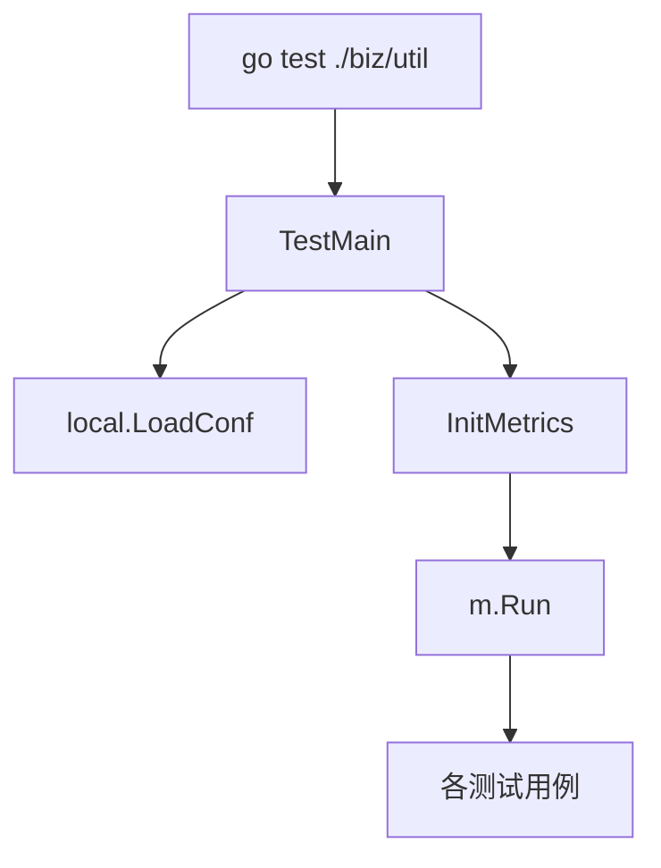

# Other — util

## util 模块测试说明

`biz/util` 的测试代码覆盖两个主要能力：IAM 请求签名和指标上报初始化/调用。测试文件与被测代码同属 `package util`，因此可以直接访问该包中的函数、常量和初始化逻辑。

## 测试入口

`base_test.go` 定义了包级测试入口：

```go
func TestMain(m *testing.M) {
	local.LoadConf()
	InitMetrics()
	code := m.Run()
	os.Exit(code)
}
```

所有 `biz/util` 测试执行前都会先调用：

- `local.LoadConf()`：加载本地配置。
- `InitMetrics()`：初始化指标系统，供后续 `EmitError`、`EmitLatency`、`EmitThroughput` 使用。
- `m.Run()`：执行当前包的全部测试。
- `os.Exit(code)`：以测试执行结果作为进程退出码。

这意味着新增 util 测试时，默认可以依赖已经加载的配置和已初始化的 metrics 环境。



## IAM 签名测试

`iam_test.go` 覆盖 HTTP 和 RPC 两类 IAM 签名函数。

### `Test_IAMSignHttpRequest`

该测试构造一个 HTTP GET 请求：

```go
url := fmt.Sprintf("http://%s/v1/folders", PSM)
r, _ := http.NewRequest("GET", url, nil)
err := IAMSignHttpRequest(r, AK, SK)
```

核心验证路径是：

1. 使用 `PSM` 拼出目标地址。
2. 创建 `GET /v1/folders` 请求。
3. 调用 `IAMSignHttpRequest(r, AK, SK)` 对请求签名。
4. 使用 `chttp.DefaultClient.Do(r)` 发起真实请求。

该测试更接近集成测试，因为它依赖：

- `PSM` 可解析并可访问；
- `AK`、`SK` 有效；
- `code.byted.org/gopkg/consul/http` 的默认客户端可正常工作；
- 当前环境网络和服务状态正常。

如果新增或调整 HTTP 签名逻辑，需要关注请求头、鉴权字段和请求发送前的签名副作用是否仍由 `IAMSignHttpRequest` 完成。

### `Test_IAMSignRpcRequest`

该测试调用：

```go
auth, err := IAMSignRpcRequest("TestMethod", AK, SK)
assert.NotEqual(t, 0, len(auth))
assert.Nil(t, err)
```

它验证 `IAMSignRpcRequest` 返回非空鉴权字符串，并且没有错误。测试不发起真实 RPC 请求，因此比 HTTP 签名测试更轻量，适合用于快速确认签名字符串生成逻辑可用。

## Metrics 测试

`metrics_test.go` 覆盖三个指标上报函数：

- `EmitError("mkey")`
- `EmitLatency("mkey", time.Now())`
- `EmitThroughput("mkey")`

每个测试都会连续调用两次同一个函数：

```go
EmitError("mkey")
// cache
EmitError("mkey")
```

这个模式说明 metrics 实现中存在缓存路径，第二次调用用于覆盖或验证缓存后的执行分支。测试当前没有断言返回值，因为这些函数没有在测试中表现为返回错误；重点是确认初始化后调用不会 panic 或失败。

`EmitLatency` 的第二个参数是起始时间：

```go
EmitLatency("mkey", time.Now())
```

调用方应传入业务开始时间，函数内部根据当前时间计算耗时并上报。

## 空测试文件

`ctx_test.go` 目前只声明了包名：

```go
package util
```

它不包含测试用例。该文件可能是为后续上下文相关工具函数预留的测试入口；如果没有计划补充测试，可以考虑删除以减少噪音。

## 与代码库其他部分的关系

当前测试模块没有被其他模块调用，调用方向主要是从测试代码进入 util 的实现函数：

- `TestMain` 调用 `InitMetrics`
- `TestEmitError` 调用 `EmitError`
- `TestEmitLatency` 调用 `EmitLatency`
- `TestEmitThroughput` 调用 `EmitThroughput`
- `Test_IAMSignHttpRequest` 调用 `IAMSignHttpRequest`
- `Test_IAMSignRpcRequest` 调用 `IAMSignRpcRequest`

因此，这组测试承担的是 util 包基础能力的回归验证：配置初始化、指标上报入口可用、IAM 签名函数可生成有效鉴权信息。新增 util 功能时，建议沿用同包测试方式，直接覆盖实际导出的工具函数；如果测试需要网络或真实凭证，应明确区分单元测试和集成测试，避免影响本地快速回归。