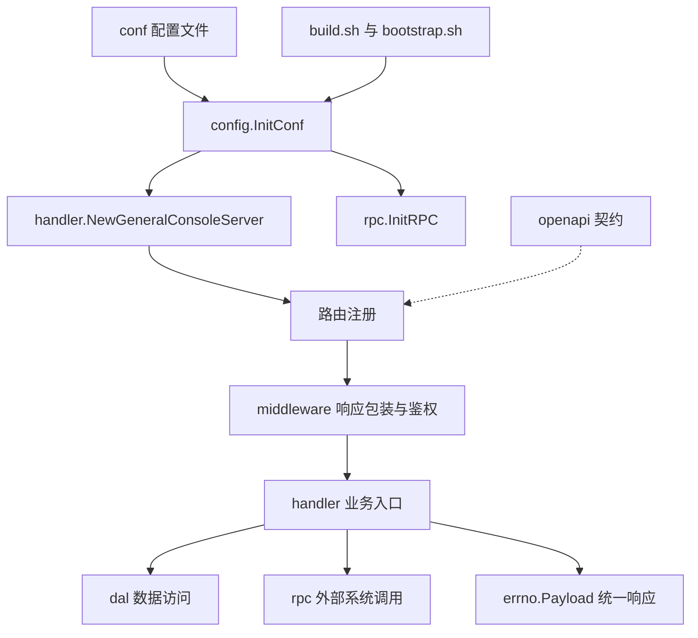

# Other

## 模块概览

`Other` 汇总了 General Console 的运行支撑层：配置、启动构建、路由与中间件、统一响应、外部 RPC、数据访问、OpenAPI 契约以及测试支撑。它们不属于单一业务域，但共同构成服务从“配置加载”到“请求处理”和“发布运行”的基础链路。

## 子模块协作关系

[conf](conf.md) 提供 YAML 配置文件，包含基础配置、环境覆盖、区域覆盖和 Hertz 启动配置。[config](config.md) 通过 `InitConf(path)` 加载这些配置，并尝试用 TCC 中的 `TQS` 动态配置覆盖本地值，最终向其他模块暴露全局 `Conf *Config`。

[handler](handler.md) 是主要业务入口，`GeneralConsoleServer` 在初始化时聚合数据库、账号、GFM、ODM、ByteTree、Cloud IAM、MDAP、Hive VID Reader 等依赖。它从 [config](config.md) 读取运行配置，并在 BPM、MDAP、脚本任务等流程中调用 [rpc](rpc.md) 和 [dal](dal.md)。

[middleware](middleware.md) 负责 Hertz 请求的统一出口。普通接口、BPM 接口和 MDAP 接口分别通过 `Response`、`BPMResponse`、`MDAPResponse` 包装 handler 返回值，并使用 [errno](errno.md) 中的 `Payload` 契约序列化响应。MDAP 请求的鉴权解析和 `TraceId` 补齐也在这里完成。

[errno](errno.md) 定义跨 handler 与 middleware 的响应协议，包括 `DevSREPayload`、`BPMPayload`、`MDAPPayload` 以及业务错误码。handler 不直接写 HTTP 响应，而是返回这些 payload，由 middleware 统一输出。

[rpc](rpc.md) 封装建桶相关的外部系统访问，包括 `bktmetaapi`、NonTT TOS OpenAPI 和 `bktmeta-sdk-go`。`InitRPC(config.Conf)` 通常在服务启动阶段完成，随后由 BPM 与脚本类 handler 调用 `BatchCreateBucket`、`CreateBucket`、`CheckBucketCreateStatus` 等能力。

[dal](dal.md) 提供账号授权和管理员用户相关的数据访问约束与测试覆盖，围绕 `v_account_user_rel`、`v_account_admin` 两类表验证 DAO 行为。handler 中涉及授权关系或管理员信息的流程依赖这些持久化能力。

## 关键跨模块流程

服务启动流程由 [build.sh](build.sh.md)、[script](script.md)、[conf](conf.md)、[config](config.md)、[handler](handler.md) 和 [rpc](rpc.md) 串联：构建脚本整理 `output/` 产物，启动脚本设置运行目录、端口和日志目录，服务进程加载配置，再初始化 `GeneralConsoleServer` 与 RPC 客户端。

请求处理流程由路由、middleware、handler 和 errno 串联：路由注册将路径绑定到 handler；middleware 校验 BPM 或 MDAP 鉴权信息；handler 执行业务逻辑并返回 `errno.Payload`；middleware 将 payload 转换为约定 JSON 响应。

MDAP 相关能力同时受 [openapi](openapi.md) 和 [router_test.go](router_test.go.md) 保护。`docs/openapi/mdap_v1.yaml` 描述 `/mdap/v1` 的接口契约、鉴权 Header 和 `MDAPPayload` 响应结构；`Test_register_routes_contains_mdap` 确认关键 MDAP 路径实际注册到 Hertz 路由表中。

[util](util.md) 提供 IAM 签名与指标初始化/上报相关测试支撑，和运行期的鉴权、观测能力相互补充。[go.mod](go.mod.md) 则定义整个仓库的 Go 模块边界、依赖版本和替换规则，是这些子模块能够统一编译、测试和发布的基础。