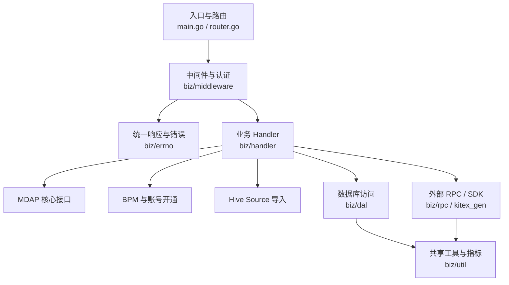
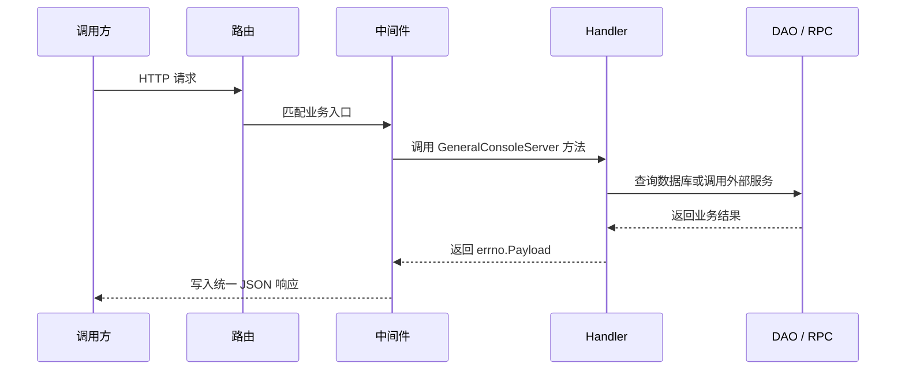

# general_console — Wiki

# general_console

`general_console` 是 VideoArch 通用控制台后端服务，提供账号管理、权限授权、MDAP 空间与资产管理、BPM 开通流程、TOS bucket 操作以及部分脚本化运维入口。项目使用 Go 1.18，模块路径为 `code.byted.org/videoarch/general_console`，HTTP 框架基于 Hertz，外部能力主要通过内部 SDK、Kitex/RPC、TQS、MySQL 和 IAM 签名接入。

新开发者可以先从 [Application Entry and Routing](application-entry-and-routing.md) 理解服务如何启动、如何注册路由，再进入 [General Console Handlers](general-console-handlers.md)、[MDAP Core APIs](mdap-core-apis.md) 和 [BPM and Account Provisioning](bpm-and-account-provisioning.md) 查看主要业务入口。

## 整体架构



请求从 `main.go` 启动的 Hertz 服务进入，由 `router.go` 注册到不同业务路径，再经过 [Middleware and Request Authentication](middleware-and-request-authentication.md) 完成响应包装、链路信息补齐和部分鉴权处理。业务 Handler 返回统一的 `errno.Payload`，由 [Error and Response Contracts](error-and-response-contracts.md) 定义不同业务域的响应格式。

## 启动与运行时配置

服务启动时会依次初始化基础环境、Hertz 实例、配置、鉴权、数据库、指标、RPC 客户端和 `GeneralConsoleServer`。配置加载集中在 [Runtime Configuration](runtime-configuration.md)：`biz/config.InitConf(path string)` 先读取本地 YAML，再尝试从 TCC 拉取运行时覆盖配置，并把最终结果写入全局 `config.Conf`。

本地开发前需要确认：

- 使用 Go 1.18。
- 具备访问 `code.byted.org` 内部 Go 依赖的环境。
- 准备可用的 `conf` 配置文件，尤其是 MySQL、TQS、RPC、Hertz 启动参数。
- 如需跑通完整链路，需要对应环境的 MySQL、TCC、IAM、Kitex/RPC 和内部服务权限。

常见检查命令：

```bash
go test ./...
go build ./...
```

如果测试或构建依赖内部网络、TCC 配置或 RPC 服务，失败时优先检查本地环境、凭证和配置文件，而不是只看业务代码。

## 请求处理模型

这个项目的核心约定是：业务 Handler 不直接写 HTTP 响应，而是返回 `errno.Payload`。中间件负责把 payload 序列化为 JSON、补充 `TraceId`，并写回 Hertz `RequestContext`。

典型链路如下：



普通控制台接口主要位于 [General Console Handlers](general-console-handlers.md)，负责账号、配置、域名、对象元数据、管理员和授权关系等能力。MDAP 相关接口进一步拆分为 [MDAP Core APIs](mdap-core-apis.md)、[MDAP Processing Tasks](mdap-processing-tasks.md) 和 [MDAP Hive Source Import](mdap-hive-source-import.md)，分别处理资源管理、处理任务创建和 Hive VID 批量导入。

## 核心业务流

账号和 BPM 开通链路由 [BPM and Account Provisioning](bpm-and-account-provisioning.md) 承接。BPM 入口方法通常只做动作绑定，实际逻辑落在 `handle...` 方法中，再调用账号 SDK、数据库访问层、TOS/bktmeta 能力或其他内部服务。涉及建桶、查状态和批量建桶的逻辑在 [Bucket and TOS Operations](bucket-and-tos-operations.md) 中收敛。

MDAP 链路以空间、资产组、素材源、产物和权限角色为核心资源层级。Handler 会把 HTTP 请求转换为内部 SDK 或 Kitex 调用，通过 `middleware.MDAPResponse` 和 `errno.MDAPOK` / `errno.MDAPErrorWithCode` 输出 MDAP 约定格式。Hive 导入场景会先通过 TQS 读取 Hive 表中的 `vid` 列，再异步批量创建 MDAP Source。

数据库访问集中在 [Database Access](database-access.md)。写操作使用 `DbHandler.w` 并显式开启事务，读操作使用 `DbHandler.r`；DAO 方法统一包裹重试逻辑，并通过 [Shared Utilities](shared-utilities.md) 上报吞吐、延迟和错误指标。

## 生成代码与外部边界

[Thrift IDL and Generated Clients](thrift-idl-and-generated-clients.md) 定义 Object Duplication Manager 等 RPC 通信所需的 Thrift 契约和 Kitex 生成代码。业务层一般不直接关心序列化细节，但这些生成结构是 Handler、RPC 客户端和远端服务之间的重要数据边界。

仓库里还有 [Other](other.md) 汇总运行支撑层，包括 `conf` 配置、OpenAPI 契约、构建脚本、路由测试和跨模块支撑文件。阅读业务前不必一次看完，但当你需要理解发布、启动参数或辅助脚本时，这一页是合适入口。

## 推荐阅读路径

第一次接触代码时，建议按请求生命周期阅读：先看 [Application Entry and Routing](application-entry-and-routing.md)，理解 `main.go` 和路由注册；再看 [Runtime Configuration](runtime-configuration.md) 与 [Middleware and Request Authentication](middleware-and-request-authentication.md)，掌握运行环境和响应约定；随后根据任务进入 [General Console Handlers](general-console-handlers.md)、[MDAP Core APIs](mdap-core-apis.md) 或 [BPM and Account Provisioning](bpm-and-account-provisioning.md)。

如果你要改数据读写，优先看 [Database Access](database-access.md)。如果你要接外部服务或排查 RPC 数据结构，优先看 [Thrift IDL and Generated Clients](thrift-idl-and-generated-clients.md) 和相关 `biz/rpc` 实现。