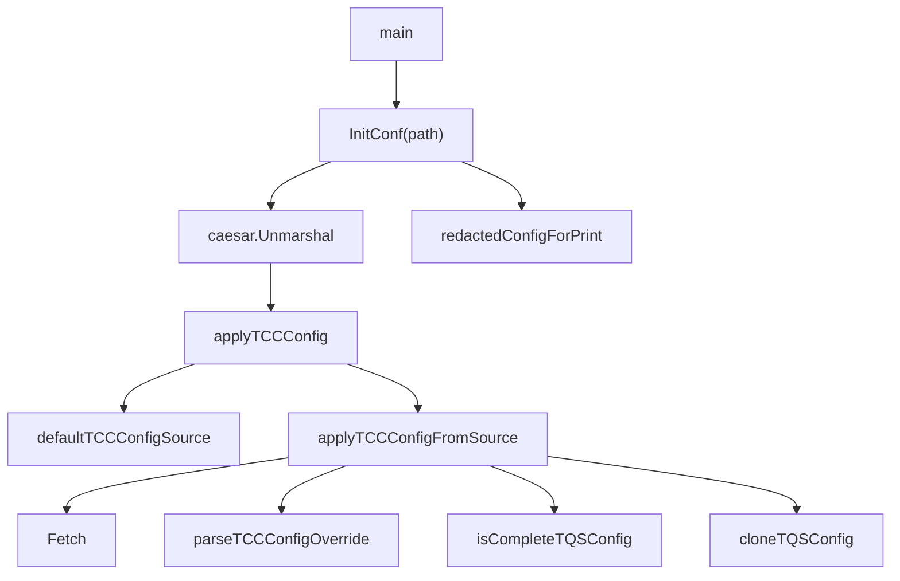

# Runtime Configuration

## 模块概览

`biz/config` 负责运行时配置的加载、覆盖和数据库连接配置构造。模块的核心入口是 `InitConf(path string)`，它从本地 YAML 配置加载 `Config`，再尝试从 TCC 拉取运行时覆盖配置，最后将结果写入全局变量 `Conf`。

该模块目前覆盖三类配置能力：

- 本地配置模型：`Config` 及其子配置结构体定义 YAML 映射。
- TCC 动态覆盖：只覆盖 `Config.TQS`，并要求覆盖值完整。
- MySQL 初始化：`Mysql.GetDSN()` 生成 DSN，`Mysql.NewDB()` 创建 `*gorm.DB`。

## 初始化流程



`InitConf` 的执行顺序固定：

1. 创建新的 `Config` 实例并赋值给全局变量 `Conf`。
2. 调用 `caesar.Unmarshal(Conf, path)` 从指定路径加载 YAML。
3. 如果本地配置加载失败，调用 `logs.Fatal` 并 `panic`。
4. 调用 `applyTCCConfig(context.Background(), Conf)` 尝试应用 TCC 覆盖。
5. 调用 `redactedConfigForPrint(Conf)` 打印脱敏后的配置。

`Conf` 是包级全局变量，业务代码通常通过 `config.Conf` 读取运行时配置。调用方应保证 `InitConf` 在依赖配置的组件初始化之前执行。

## 配置结构

主配置结构体是 `Config`：

```go
type Config struct {
    Meta                Meta
    WriteDB             *Mysql
    RetryTimes          int
    ReadDB              *Mysql
    GuardianAPI         *GuardianAPI
    JingleAPI           *JingleAPI
    VCloudControlConfig *VCloudControlConfig
    JumpUrl             *JumpUrl
    ByteTreeConfig      *ByteTreeConfig
    CloudIAM            *CloudIAMConfig
    MDAP                *MDAPConfig
    TQS                 *TQSConfig
    JwtRegion           string
    TOS                 NonTTTOS
}
```

这些字段通过 `yaml` 标签和 YAML 配置文件绑定。指针字段表示对应配置块可以缺省，使用前需要由调用方做空值判断。

### `Meta`

`Meta.PSM` 表示服务 PSM。TCC 配置源会优先使用 `Conf.Meta.PSM` 作为 TCC client 的 `servicePSM`；如果为空，则使用默认值 `toutiao.videoarch.general_console`。

### 数据库配置 `Mysql`

`WriteDB` 和 `ReadDB` 都使用 `*Mysql`：

```go
type Mysql struct {
    DSNTemplate  string
    Username     string
    Password     string
    DBName       string
    ConsulName   string
    Timeout      string
    ReadTimeout  string
    WriteTimeout string
    MaxIdle      int
    MaxOpen      int
}
```

`Mysql.GetDSN()` 使用 `fmt.Sprintf` 将 `Username`、`Password`、`ConsulName`、`DBName`、`Timeout`、`ReadTimeout`、`WriteTimeout` 填入 `DSNTemplate`。

`Mysql.NewDB()` 基于 `GetDSN()` 创建 GORM 连接：

```go
db, err := gorm.Open("mysql2", m.GetDSN())
db.LogMode(true)
db.DB().SetMaxIdleConns(m.MaxIdle)
db.DB().SetMaxOpenConns(m.MaxOpen)
db.SingularTable(true)
```

在 Codebase CI 环境中，`GetDSN()` 不使用 YAML 配置，而是返回固定的测试 DSN。判断逻辑由 `IsCodebaseCIEnvironment()` 完成：只要环境变量 `CI_REPO_NAME` 非空，就认为当前处于 CI 环境。

### 外部服务配置

模块中还定义了多组外部服务配置结构：

- `GuardianAPI`：包含 `PSM`、`AccessKey`、`SecretKey`。
- `JingleAPI`：包含 `Host`、`UserName`、`Password`。
- `VCloudControlConfig`：包含 `AccessKey`、`SecretKey`，用于调用 passport 等需要租户 AK/SK BasicAuth 的接口。
- `JumpUrl`：包含 IAM 申请、账号创建、域名修改相关跳转地址。
- `ByteTreeConfig`：包含 `Domain`、`Partition`、`SecretKey`。
- `CloudIAMConfig`：包含网关租户、网关地址和服务账号。
- `MDAPConfig` / `MDAPIAMConfig`：包含 MDAP、ByteTree 和 IAM 相关配置。
- `NonTTTOS`：包含 TOS 地址、集群、重试、IAM、S3 兼容访问等配置。

这些结构体只负责承载配置，不包含业务逻辑。

## TCC 覆盖机制

TCC 逻辑位于 `biz/config/tcc.go`。当前只支持覆盖 `Config.TQS`。

默认 TCC key 是：

```go
const generalConsoleTCCConfigKey = "general_console_cfg"
```

默认服务 PSM 是：

```go
const defaultTCCServicePSM = "toutiao.videoarch.general_console"
```

### 配置源构造

`defaultTCCConfigSource(conf *Config)` 构造 `tccConfigSource`：

```go
type tccConfigSource struct {
    Key        string
    ServicePSM string
    Confspace  string
    Fetch      tccConfigFetcher
}
```

字段来源如下：

- `Key`：默认 `general_console_cfg`。
- `ServicePSM`：优先使用 `conf.Meta.PSM`，为空时使用 `defaultTCCServicePSM`。
- `Confspace`：来自 `tccclient.GetClusterFromEnv()`。
- `Fetch`：默认是 `fetchTCCConfigFromClient`。

`applyTCCConfigFromSource` 接收 `tccConfigSource`，因此单测可以注入自定义 `Fetch`，避免真实访问 TCC。

### 拉取和超时

`fetchTCCConfigFromClient` 使用 `tccclient.NewConfigV2()` 创建配置：

```go
cfg.Confspace = confspace
cfg.SetFirstGetRetry(1)
cfg.SetFirstGetTimeout(defaultTCCFirstGetTimeout)
```

默认首次获取超时是 `200ms`。如果传入的 `context.Context` 没有 deadline，函数会额外包一层 `500ms` 超时：

```go
ctx, cancel = context.WithTimeout(ctx, defaultTCCGetTimeout)
```

然后调用：

```go
client.Get(ctx, key)
```

### 覆盖规则

`applyTCCConfigFromSource(ctx, conf, source)` 的覆盖规则是保守的：

1. `conf == nil` 时直接返回 `false, nil`。
2. `source.Fetch == nil` 时返回错误 `missing TCC fetcher`。
3. `source.Key`、`source.ServicePSM`、`source.Confspace` 为空时使用默认值。
4. 通过 `source.Fetch` 获取 TCC YAML 字符串。
5. 调用 `parseTCCConfigOverride` 解析 YAML。
6. 调用 `isCompleteTQSConfig` 校验 `TQS` 是否完整。
7. 校验通过后，调用 `cloneTQSConfig` 克隆并清理字符串字段，再赋值给 `conf.TQS`。

只有完整的 TCC `TQS` 配置会覆盖本地配置。空 YAML、非法 YAML、缺字段、拉取失败都会导致不覆盖。

`applyTCCConfig` 会吞掉 TCC 错误并保留本地配置：

- 如果错误是 `tccclient.ConfigNotFoundError`，记录 `TCC config ... not found, keep local config`。
- 其他错误记录 `load TCC config ... failed, keep local config: ...`。
- 成功覆盖后记录 TCC key、confspace 和 `conf.TQS.Cluster`。

## TQS 配置

`TQSConfig` 用于 Hive/TQS 相关能力：

```go
type TQSConfig struct {
    AppID                 string
    AppKey                string
    UserName              string
    Cluster               string
    Timeout               time.Duration
    PollInterval          time.Duration
    YarnClusterName       string
    MapReduceJobQueueName string
    AuthMode              string
}
```

`isCompleteTQSConfig` 认为以下字段必须存在：

- `AppID`
- `AppKey`
- `UserName`
- `Cluster`
- `Timeout > 0`

`PollInterval`、`YarnClusterName`、`MapReduceJobQueueName` 不参与完整性校验，但 `cloneTQSConfig` 会对字符串字段做 `strings.TrimSpace`。

`AuthMode` 已废弃，仅保留旧 YAML 兼容性。代码注释明确说明 Hive import 始终使用服务 PSM token。

## 脱敏打印

`redactedConfigForPrint(conf *Config)` 只处理 `conf.TQS.AppKey`：

```go
tqs.AppKey = "<redacted>"
```

实现方式是浅拷贝 `Config`，再浅拷贝 `TQSConfig`，替换 `AppKey` 后返回新的 `*Config`。这避免了打印时修改实际运行配置。

如果 `conf == nil`、`conf.TQS == nil` 或 `conf.TQS.AppKey == ""`，函数直接返回原对象。

需要注意的是，当前只脱敏 `TQS.AppKey`。其他字段如数据库密码、AK/SK、Jingle 密码不会在这个函数中脱敏；如果新增打印路径，需要单独评估敏感信息风险。

## 与代码库其他部分的关系

`InitConf` 是模块对外最重要的入口。测试中 `TestMain` 会调用它初始化全局配置，业务启动流程也通过它完成配置加载。

`TQSConfig` 被 Hive/TQS 数据读取逻辑使用。相关测试包括：

- `TestNewTQSHiveVIDReaderFromConfig_requiresCompleteConfig`
- `TestTQSHiveVIDReader_ReadVIDs_alwaysUsesPSMTokenEvenWithLegacyAuthModeConfig`

`VCloudControlConfig` 被服务初始化逻辑用于判断是否调用认证设置。相关测试包括：

- `TestNewGeneralConsoleServer_vcloud_control_config_present_should_call_setauth`

`MDAPConfig` 和 `MDAPIAMConfig` 被服务初始化逻辑读取，并允许 IAM 配置缺失时跳过相关初始化。相关测试包括：

- `TestNewGeneralConsoleServer_missing_mdap_iam_config_should_skip`

`NonTTTOS` 在 TOS 相关 RPC 测试中被直接构造，用于初始化非 TTTOS 访问配置。

## 贡献注意事项

新增配置字段时，应同时更新对应结构体的 `yaml` 标签，避免本地 YAML 无法映射。指针配置块的新增使用方应显式处理 `nil`，因为 `Config` 中大多数子配置都是可选指针。

调整 TCC 行为时，应优先修改 `applyTCCConfigFromSource`，并通过注入 `tccConfigSource.Fetch` 写单测。这个函数是 TCC 覆盖逻辑的核心边界，适合覆盖拉取失败、配置不存在、YAML 非法、字段不完整和成功覆盖等场景。

如果扩展 TCC 覆盖范围，建议保持当前“完整校验后一次性覆盖”的模式，避免部分字段覆盖导致本地配置和动态配置混用后状态不明确。

数据库相关修改需要注意 `IsCodebaseCIEnvironment()` 的分支。CI 环境下 `GetDSN()` 会返回固定 DSN，本地配置中的 `DSNTemplate`、用户名和密码不会生效。