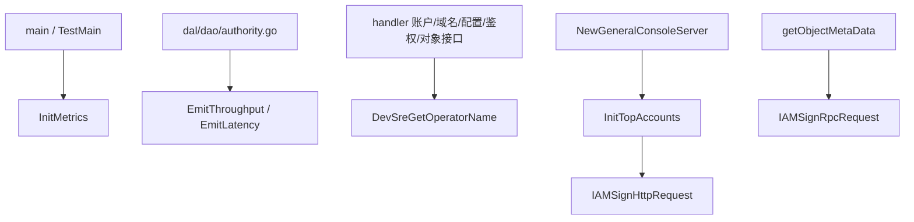

# Shared Utilities

## 共享工具模块

`biz/util` 提供跨 handler、DAO 和启动流程复用的轻量工具能力，当前包含三类职责：

- 从 Hertz 请求上下文读取 DevSRE 注入的操作者身份
- 使用 `iamsdk` 为 HTTP/RPC 请求生成 IAM 签名
- 初始化并发送吞吐、延迟和错误指标

这些工具函数彼此之间没有内部调用关系，都是面向业务层和数据访问层的独立入口。



## 请求上下文工具

文件：[biz/util/ctx.go](/Users/bytedance/videoarch/general_console/biz/util/ctx.go)

`ctx.go` 目前只暴露一个请求头读取工具：

```go
const VPaasOperator = "x-vpaas-operator-name"

func DevSreGetOperatorName(ctx *app.RequestContext) string
```

`DevSreGetOperatorName` 从 Hertz 的 `*app.RequestContext` 中读取 `x-vpaas-operator-name` 请求头，并以 `string` 返回。

该请求头由 DevSRE Web 请求注入，用于标识当前操作人。调用方主要位于 handler 层，例如：

- `getProviderAuthInfo`
- `checkUserAuthorized`
- `handlerGetAllDomain`
- `handlePageGetGeneralAccounts`
- `handleGetAccountDetail`
- `getConfigByModule`
- `handleGetObject`

使用模式很直接：

```go
operator := util.DevSreGetOperatorName(ctx)
```

注意：函数不会校验空值，也不会做 fallback。调用方如果依赖操作者身份做鉴权、审计或查询过滤，需要自行处理请求头缺失的情况。

## IAM 签名工具

文件：[biz/util/iam.go](/Users/bytedance/videoarch/general_console/biz/util/iam.go)

`iam.go` 封装了对 `code.byted.org/videoarch/iamsdk` 的调用，用于生成 HTTP 和 RPC 请求签名。

模块级常量：

```go
const PSM = "toutiao.videoarch.general_console"
```

`PSM` 同时被 metrics 初始化和 RPC IAM 签名复用，代表当前服务身份。

### `IAMSignHttpRequest`

```go
func IAMSignHttpRequest(req *http.Request, ak, sk string) error
```

该函数使用传入的 `ak`、`sk` 初始化 `iamsdk` 默认客户端，并设置 5 分钟过期时间：

```go
iamsdk.InitDefaultClient(
    &iamsdk.Credential{
        AccessKey: ak,
        SecretKey: sk,
    },
    iamsdk.WithExpire(time.Minute*5),
)
return iamsdk.SignHttpRequest(req)
```

当前调用链中，服务初始化会通过：

`NewGeneralConsoleServer` → `InitTopAccounts` → `IAMSignHttpRequest`

这说明 HTTP 签名主要用于初始化 Top Accounts 相关请求。函数会直接修改传入的 `*http.Request`，调用方应在发送请求前完成签名。

### `IAMSignRpcRequest`

```go
func IAMSignRpcRequest(method string, ak, sk string) (string, error)
```

该函数创建独立的 `iamsdk.Client`，并对指定 RPC `method` 生成认证字符串：

```go
iamClient := iamsdk.NewClient(&iamsdk.Credential{AccessKey: ak, SecretKey: sk})
auth, err := iamClient.SignRpcRequest(iamsdk.RpcRequest{
    Method: method,
    Caller: PSM,
    Extra:  nil,
})
```

当前主要由 `getObjectMetaData` 调用，用于对象元数据相关 RPC 请求签名。返回值中的 `auth` 通常由调用方放入 RPC 请求的认证字段或 header 中，具体传递方式由调用方决定。

## 指标工具

文件：[biz/util/metrics.go](/Users/bytedance/videoarch/general_console/biz/util/metrics.go)

`metrics.go` 基于 `code.byted.org/gopkg/metrics/v3` 封装指标客户端和指标对象缓存。

核心常量：

```go
const (
    CommandThroughput = "cmd.throughput"
    CommandLatency    = "cmd.latency"

    TagCommand = "cmd"
)
```

全局状态：

```go
var client m.Client
var throughputMetricMap = sync.Map{}
var latencyMetricMap = sync.Map{}
var errorMetricMap = sync.Map{}
```

三个 `sync.Map` 分别缓存吞吐、延迟和错误指标对象，key 是调用方传入的指标名。缓存的目的是避免每次发送指标时重复调用 `client.NewMetric`。

### 初始化：`InitMetrics`

```go
func InitMetrics()
```

`InitMetrics` 初始化全局 metrics client：

```go
client = m.NewClient(PSM, m.SetTceTags())
```

该函数由 `main` 调用，也在多个测试包的 `TestMain` 中调用，包括 `biz/util`、`biz/handler`、`biz/errno`、`dal/dao`。发送指标前必须先初始化 `client`，否则后续 `client.NewMetric` 会依赖未初始化的全局客户端。

### 吞吐指标：`EmitThroughput`

```go
func EmitThroughput(key string, tags ...m.T)
```

`EmitThroughput` 发送计数器指标，实际 suffix 为 `"throughput"`：

```go
throughputMetric.WithTags(tags...).Emit(
    m.WithSuffix("throughput").IncrCounter(1),
)
```

函数会根据 `tags` 提取 tag 名称创建 metric：

```go
tagNames := make([]string, len(tags))
for i, tag := range tags {
    tagNames[i] = tag.Name
}
throughputMetric = client.NewMetric(key, tagNames...)
```

当前 DAO 层大量使用该函数统计 authority 相关操作吞吐，例如：

- `CreateAdminUserInfo`
- `DeleteAdminUserInfo`
- `CheckAdminUserInfo`
- `CreateAuthorizeInfo`
- `DeleteAuthorizeInfo`
- `CheckAuthorizeInfo`
- `GetAuthorizedAccountIdsOfUser`
- `GetAuthorizedUsersOfAccountName`

### 延迟指标：`EmitLatency`

```go
func EmitLatency(key string, start time.Time, tags ...m.T)
```

`EmitLatency` 根据传入的 `start` 计算耗时，单位为微秒：

```go
cost := time.Since(start).Nanoseconds() / 1000
```

随后发送 observation 指标，suffix 为 `"latency"`：

```go
latencyMetric.WithTags(tags...).Emit(
    m.WithSuffix("latency").Observe(int(cost)),
)
```

典型调用方式是在函数开始处记录时间，并在结束前或 `defer` 中上报：

```go
start := time.Now()
defer util.EmitLatency(metricKey, start, tags...)
```

当前主要由 `dal/dao/authority.go` 中的 authority 查询、创建、删除、检查逻辑调用，用于观测 DAO 操作耗时。

### 错误指标：`EmitError`

```go
func EmitError(mkey string, tags ...m.T)
```

`EmitError` 发送错误计数器指标，suffix 为 `"error"`：

```go
errorMetric.WithTags(tags...).Emit(
    m.WithSuffix("error").IncrCounter(1),
)
```

实现上与吞吐指标类似，也会按 `mkey` 缓存 metric。和 `EmitThroughput`、`EmitLatency` 不同的是，`EmitError` 每次都会执行：

```go
errorMetricMap.Store(mkey, errorMetric)
```

这不会改变功能结果，但意味着即使缓存命中也会重复写回一次 `sync.Map`。

## 指标 tag 的约束

三个指标发送函数都在首次创建 metric 时，根据首次调用传入的 `tags` 生成 tag name 列表。后续同一个 `key` 会直接复用缓存中的 metric。

因此，同一个指标 `key` 应保持稳定的 tag 结构：

```go
util.EmitThroughput("authority.operation", m.T{Name: util.TagCommand, Value: "create"})
util.EmitLatency("authority.operation", start, m.T{Name: util.TagCommand, Value: "create"})
```

不要对同一个 `key` 混用不同 tag name 集合，否则缓存中的 metric 定义可能与后续 tags 不一致，导致指标上报行为难以预测。

## 与代码库的连接方式

`biz/util` 是一个低耦合共享模块：

- handler 层通过 `DevSreGetOperatorName` 获取 DevSRE 操作者身份
- handler 初始化和对象元数据逻辑通过 IAM 工具完成外部请求签名
- DAO 层通过 metrics 工具上报 authority 相关数据库操作的吞吐和延迟
- `main` 和测试入口通过 `InitMetrics` 建立全局指标客户端

新增工具函数时，应优先保持当前模块风格：函数小、无复杂状态、调用方显式传参。若新增全局状态，需像 metrics 缓存一样考虑初始化顺序和并发访问。