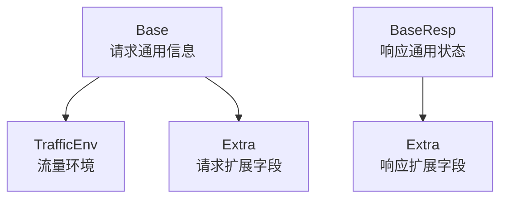

# Thrift IDL and Generated Clients — biz

## 模块概览

`biz/base.thrift` 定义了一组跨语言共享的 Thrift 基础数据结构，用于在业务请求和响应中承载通用元信息。该文件只包含 `struct` 定义，不包含 `service`、函数实现或执行逻辑，因此没有内部调用、外部调用或运行时调用链。

该 IDL 同时声明了两个命名空间：

```thrift
namespace py base
namespace go base
```

生成代码后，Python 和 Go 侧都会使用 `base` 作为对应语言的命名空间或包名。

## 核心结构

### `TrafficEnv`

`TrafficEnv` 描述流量环境相关信息，通常用于标识请求是否启用了特定环境路由。

```thrift
struct TrafficEnv {
    1: bool Open = false,
    2: string Env = "",
}
```

字段说明：

| 字段 | 类型 | 默认值 | 含义 |
| --- | --- | --- | --- |
| `Open` | `bool` | `false` | 是否开启流量环境标识 |
| `Env` | `string` | `""` | 环境名称或环境标识 |

`TrafficEnv` 本身不决定路由行为，只提供结构化数据。具体如何解释 `Open` 和 `Env`，由使用该结构的业务代码、RPC 框架或中间件决定。

### `Base`

`Base` 是请求侧通用元信息结构，用于携带日志、调用方、客户端、地址和扩展字段。

```thrift
struct Base {
    1: string LogID = "",
    2: string Caller = "",
    3: string Addr = "",
    4: string Client = "",
    5: optional TrafficEnv TrafficEnv,
    6: optional map<string, string> Extra,
}
```

字段说明：

| 字段 | 类型 | 默认值 | 含义 |
| --- | --- | --- | --- |
| `LogID` | `string` | `""` | 请求日志标识，常用于链路追踪或日志检索 |
| `Caller` | `string` | `""` | 调用方标识 |
| `Addr` | `string` | `""` | 调用方地址或来源地址 |
| `Client` | `string` | `""` | 客户端标识 |
| `TrafficEnv` | `optional TrafficEnv` | 未设置 | 可选的流量环境信息 |
| `Extra` | `optional map<string, string>` | 未设置 | 可选扩展字段 |

`Base` 的前四个字段都有空字符串默认值，因此生成代码在未显式赋值时也会有稳定的默认表现。`TrafficEnv` 和 `Extra` 是 `optional` 字段，调用方需要区分“未设置”和“设置为空值”的语义。

### `BaseResp`

`BaseResp` 是响应侧通用状态结构，用于承载接口返回状态和扩展信息。

```thrift
struct BaseResp {
    1: string StatusMessage = "",
    2: i32 StatusCode = 0,
    3: optional map<string, string> Extra,
}
```

字段说明：

| 字段 | 类型 | 默认值 | 含义 |
| --- | --- | --- | --- |
| `StatusMessage` | `string` | `""` | 状态描述信息 |
| `StatusCode` | `i32` | `0` | 状态码 |
| `Extra` | `optional map<string, string>` | 未设置 | 可选扩展字段 |

`StatusCode = 0` 通常可作为默认成功或未指定状态，但该语义并未在 IDL 中强制定义。业务代码应以具体接口约定为准。

## 数据模型关系

`Base` 依赖 `TrafficEnv` 作为可选字段；`BaseResp` 独立存在，和 `Base` 没有直接结构引用。



## 生成代码中的角色

该 Thrift 文件本身不会生成 RPC 客户端方法，因为它没有定义 `service`。生成产物主要是跨语言的数据类型：

- Python 命名空间：`base`
- Go 命名空间：`base`
- 生成类型：`TrafficEnv`、`Base`、`BaseResp`

这些类型通常被其他业务 IDL 引用，例如在请求结构中嵌入 `Base`，在响应结构中嵌入 `BaseResp`。本模块提供的是公共协议层的数据契约，而不是业务逻辑实现。

## 使用约定

### 请求元信息

业务请求如果需要携带通用上下文，可以引用 `Base`：

```thrift
struct ExampleRequest {
    1: base.Base Base,
    2: string Payload = "",
}
```

其中 `Base.LogID` 可用于日志串联，`Base.Caller` 可用于识别调用来源，`Base.Extra` 可用于传递不适合固化为字段的扩展键值。

### 响应状态

业务响应如果需要统一表达状态，可以引用 `BaseResp`：

```thrift
struct ExampleResponse {
    1: base.BaseResp BaseResp,
    2: string Result = "",
}
```

这种模式可以让不同接口复用相同的状态码、状态消息和扩展信息结构。

## 字段演进注意事项

由于这是跨语言 IDL，修改时需要保持 Thrift 兼容性：

- 不要复用已经使用过的字段编号。
- 新增字段优先使用 `optional`，降低对旧客户端和旧服务端的兼容风险。
- 不要随意修改已有字段类型，例如将 `StatusCode` 从 `i32` 改成 `string` 会破坏兼容性。
- 不要重命名字段后假设所有语言生成代码都能无感兼容；字段名会影响生成代码的访问方式。
- `Extra` 适合承载临时或弱约束扩展，但长期稳定语义应考虑新增明确字段。

## 模块边界

`biz/base.thrift` 只定义基础结构，不负责：

- 生成代码的构建流程
- RPC 服务定义
- 请求路由
- 状态码语义解释
- 日志写入或链路追踪实现
- `Extra` 中键值的业务约定

这些行为应由引用该 IDL 的业务接口、生成代码配置、RPC 框架或调用方代码负责。