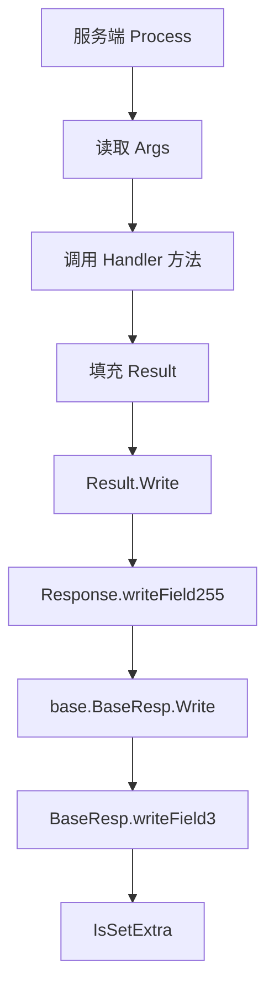

# Thrift IDL and Generated Clients — idl

## 模块概览

`biz/idl` 定义并承载 Object Duplication Manager 的 Thrift 契约和 Kitex 生成代码。该模块本身不实现业务逻辑，而是提供跨进程 RPC 的数据模型、序列化代码、服务接口、客户端封装和服务端处理器骨架。

核心契约来自 `biz/idl/object_duplication_manager.thrift`，生成代码位于：

- `biz/idl/kitex_gen/base`：通用 `Base`、`BaseResp`、`TrafficEnv`。
- `biz/idl/kitex_gen/bytedance/videoarch/object_duplication_manager`：对象元信息与副本管理的请求、响应、服务接口。
- `biz/idl/kitex_gen/bytedance/videoarch/object_duplication_manager/objectduplicationmanager`：Kitex 客户端包，提供 `NewClient`、`MustNewClient` 以及各 RPC 方法封装。

该模块被业务层通过生成类型直接引用。例如 `biz/handler/object.go` 使用 `QueryObjectRequest` 查询对象元信息，`biz/handler/server.go` 通过 `MustNewClient` 初始化 Object Duplication Manager 客户端。

## IDL 契约

`object_duplication_manager.thrift` 使用 `include "../base.thrift"` 引入通用上下文字段，并声明 Go/Python 命名空间：

```thrift
namespace go bytedance.videoarch.object_duplication_manager
namespace py bytedance.videoarch.object_duplication_manager
```

### 核心实体

`Object` 表示业务对象元信息：

```thrift
struct Object {
    1: string ObjectID
    2: string Name
    3: string UploadIDC
    4: i64 Size
    5: string UserID
    6: string BizID
    7: string BizType
    8: string Provider
    9: string AppID
    10: string Status
    11: i64 ObjectCreateTime
    12: UserActionLevel UserAction

    100: map<string, ObjectDuplication> Duplications
    101: map<string, string> Extras
}
```

`ObjectDuplication` 表示对象的一个副本，包含存储位置、生命周期和文件时间信息：

```thrift
struct ObjectDuplication {
    1: string URI
    2: string Bucket
    3: string Region
    4: string IDC
    5: i64 TTL
    6: map<string, string> Extras
    7: i64 FileCreateTime
    8: i64 FileModifiedTime
}
```

`Duplications` 使用 `map<string, ObjectDuplication>` 存储多个副本。生成到 Go 后，map value 会变成指针类型，例如 `map[string]*ObjectDuplication`。

### 操作枚举

`CreateType` 控制创建对象或副本时遇到重复数据的处理方式：

- `IgnoreDuplicate = 0`
- `RejectDuplicate = 1`

`DeleteType` 控制删除范围：

- `MarkDelete = 0`：标记删除。
- `OnlyMetaData = 1`：只删除元数据。
- `BothMetaAndFile = 2`：删除元数据和文件。

`QueryType` 控制查询是否包含标记删除的数据：

- `ExcludeMarkDelete = 0`
- `IncludeMarkDelete = 1`

`ReadPreference` 控制读偏好：

- `Default = 0`
- `Primary = 1`

`UserActionLevel` 表示用户行为等级，`NOACTION = 0` 用于表达空动作，其余等级从 `VL0 = 1000` 到 `VL4 = 1004`。

## 服务接口

`ObjectDuplicationManager` 提供对象和对象副本两组操作：

```thrift
service ObjectDuplicationManager {
    CreateObjectResponse CreateObject(1: CreateObjectRequest req)
    DeleteObjectResponse DeleteObject(1: DeleteObjectRequest req)
    UpdateObjectResponse UpdateObject(1: UpdateObjectRequest req)
    QueryObjectResponse QueryObject(1: QueryObjectRequest req)
    RecoverObjectResponse RecoverObject(1: RecoverObjectRequest req)
    MQueryObjectsResponse MQueryObjects(1: MQueryObjectsRequest req)

    CreateObjectDuplicationResponse CreateObjectDuplication(1: CreateObjectDuplicationRequest req)
    UpdateObjectDuplicationResponse UpdateObjectDuplication(1: UpdateObjectDuplicationRequest req)
    DeleteObjectDuplicationResponse DeleteObjectDuplication(1: DeleteObjectDuplicationRequest req)
    RecoverObjectDuplicationResponse RecoverObjectDuplication(1: RecoverObjectDuplicationRequest req)

    UpsertObjectDuplicationResponse UpsertObjectDuplication(1: UpsertObjectDuplicationRequest req)
}
```

对象操作处理 `Object` 本体。副本操作处理 `ObjectDuplication`。`UpsertObjectDuplication` 是组合语义：创建或更新副本，同时更新 `Object`，如果对象不存在则创建对象。

## 请求与响应约定

所有主要请求都保留字段 `255: base.Base Base`，所有响应都保留字段 `255: base.BaseResp BaseResp`。业务字段使用低位字段号，通用 RPC 元信息固定放在 `255`，这有利于后续兼容扩展。

典型响应结构只有 `BaseResp`：

```thrift
struct CreateObjectResponse {
    255: base.BaseResp BaseResp
}
```

查询响应会额外携带数据：

```thrift
struct QueryObjectResponse {
    1: Object object
    255: base.BaseResp BaseResp
}
```

批量查询通过 `MQueryObjectsResponse.ObjectInfos` 返回 `map<string, Object>`。

## 生成代码结构

生成的 Go 类型遵循 thriftgo 和 Kitex 的固定模式：

- `New<Type>()` 创建结构体并填充默认值。
- `InitDefault()` 将已有结构体重置为默认值。
- `Get<Field>()` 读取字段；可选字段未设置时返回对应默认变量。
- `Set<Field>(val)` 设置字段。
- `IsSet<Field>()` 判断可选字段是否非 nil。
- `Read(iprot thrift.TProtocol)` 和 `Write(oprot thrift.TProtocol)` 实现标准 Thrift 协议读写。
- `FastRead(buf []byte)`、`FastWriteNocopy(buf []byte, binaryWriter bthrift.BinaryWriter)` 和 `BLength()` 实现 Kitex 二进制快速路径。
- `DeepEqual()` 和 `Field<N>DeepEqual()` 用于结构体比较。

示例：`base.Base` 的可选字段 `TrafficEnv` 和 `Extra` 通过 nil 判断是否写出：

```go
func (p *Base) IsSetTrafficEnv() bool {
	return p.TrafficEnv != nil
}

func (p *Base) IsSetExtra() bool {
	return p.Extra != nil
}
```

写入时会先检查 `IsSetExtra()`，只有非 nil map 才会序列化：

```go
func (p *Base) writeField6(oprot thrift.TProtocol) (err error) {
	if p.IsSetExtra() {
		// 写入 Extra map
	}
	return nil
}
```

## 序列化执行流

标准 Thrift 路径通过 `Read` / `Write` 使用 `thrift.TProtocol`。Kitex 快速路径通过 `FastRead` / `FastWriteNocopy` 使用 `bthrift.Binary` 直接读写二进制 buffer。



这条路径说明响应写出时，业务层返回的 `BaseResp` 会参与最终序列化；`BaseResp.Extra` 只有在非 nil 时才进入响应包。

## 必填字段校验

IDL 中声明为 `required` 的字段会在生成代码的读取阶段强制校验。以 `CreateObjectRequest` 为例，字段 `object` 是必填字段。`FastRead` 会维护 `issetObject` 标记，读完结构体后如果未设置则返回 `thrift.INVALID_DATA`：

```go
if !issetObject {
	fieldId = 1
	goto RequiredFieldNotSetError
}
```

`DeleteObjectRequest` 同时要求 `ObjectID` 和 `DeleteOption`。调用方构造请求时必须显式设置这些字段，否则远端反序列化会失败，而不是进入业务 handler。

## 客户端调用方式

业务代码通常不直接操作底层 `ObjectDuplicationManagerClient`，而是通过 `objectduplicationmanager` 子包创建 Kitex client。调用链为：

```text
biz/handler/server.go
  -> objectduplicationmanager.MustNewClient(...)
  -> objectduplicationmanager.NewClient(...)
  -> 生成的 RPC 方法，如 QueryObject/CreateObject/DeleteObjectDuplication
```

请求结构来自 `kitex_gen/bytedance/videoarch/object_duplication_manager` 包，例如：

```go
req := object_duplication_manager.NewQueryObjectRequest()
req.ObjectID = objectID
req.Region = &region
req.Preference = &object_duplication_manager.ReadPreference_Default
```

可选字段在 Go 中通常生成为指针字段，设置时需要传地址；map 可选字段通过 nil 与空 map 区分是否写出。

## 与业务层的连接

`biz/handler/object.go` 使用生成类型查询对象元信息，典型入口是 `getObjectMetaData` 构造 `QueryObjectRequest`。`handleGetObject` 使用 `NewObject()` 创建返回对象结构。

`biz/handler/mdap_asset_group.go` 会构造 `base.Base` 作为 RPC 请求上下文。`biz/handler/mdap_processing_task_test.go` 中多个 mock 方法返回 `NewBaseResp()`，用于模拟下游服务响应。

这些依赖说明 `biz/idl` 是业务 handler 与对象副本服务之间的边界层：业务层只依赖稳定的请求/响应类型和客户端接口，不直接依赖远端服务实现。

## 维护注意事项

不要手工编辑 `kitex_gen` 下的文件。文件头已经标注：

```go
// Code generated by thriftgo (0.2.8). DO NOT EDIT.
// Code generated by Kitex v1.11.0. DO NOT EDIT.
```

需要变更接口、字段或枚举时，应修改 `biz/idl/object_duplication_manager.thrift` 或对应 base IDL，然后重新生成 Kitex 代码。

演进 IDL 时应遵守 Thrift 兼容性规则：

- 新增字段使用新的字段号，不复用已删除字段号。
- 废弃字段保留注释，例如已有的 `NameSpace [DEPRECATED]` 字段。
- 不随意改变已有字段类型、字段号和 required/optional 语义。
- 响应保持 `BaseResp`，便于业务层统一处理状态码和错误信息。
- 对 optional map，nil 表示未设置，空 map 表示显式设置为空，两者在写出行为上不同。