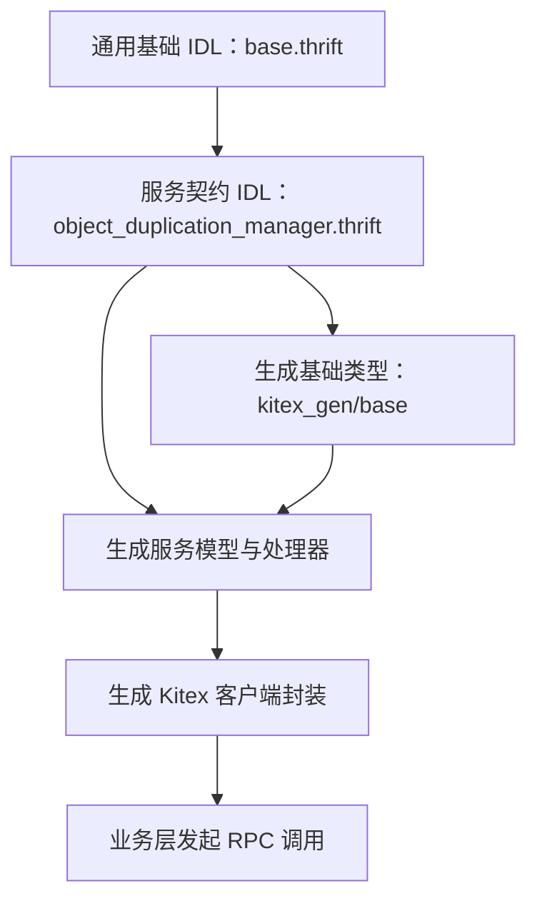

# Thrift IDL and Generated Clients

## 模块概览

该模块组提供 Object Duplication Manager RPC 通信所需的 Thrift 契约、通用基础结构和 Kitex 生成客户端。它不承载业务实现，而是定义业务层、RPC 框架和远端服务之间共享的数据边界。

两个子模块分工明确：

- [biz 基础结构](biz.md)：定义 `TrafficEnv`、`Base`、`BaseResp` 等跨语言通用元信息。
- [idl 契约与生成客户端](idl.md)：定义对象副本管理服务的 Thrift 契约，并承载 `kitex_gen` 下生成的数据模型、序列化逻辑、服务接口和客户端封装。

## 协作关系

`biz/base.thrift` 是底层公共依赖，提供请求和响应中的通用上下文，例如日志标识、调用方信息、地址、环境标识和扩展字段。`biz/idl/object_duplication_manager.thrift` 通过 `include "../base.thrift"` 复用这些结构，并在此基础上定义对象副本管理相关的请求、响应和服务方法。

生成代码后，`kitex_gen/base` 提供 `Base`、`BaseResp`、`TrafficEnv` 的读写与快速序列化能力；`kitex_gen/bytedance/videoarch/object_duplication_manager` 则提供 `Object`、`QueryObjectRequest`、`RecoverObjectResponse`、`ObjectDuplicationManagerProcessor` 等服务数据结构和处理器骨架；`objectduplicationmanager` 客户端包进一步封装 `NewClient`、`MustNewClient` 以及 `QueryObject`、`UpdateObject` 等 RPC 调用入口。

## 关键工作流

请求侧通常由业务代码构造生成类型，例如 `QueryObjectRequest`，并通过 `objectduplicationmanager.MustNewClient` 初始化客户端后调用远端 Object Duplication Manager。请求结构中可携带 `Base`，使日志、调用方、环境和扩展信息随 RPC 一起传递。

服务侧由生成的 `ObjectDuplicationManagerProcessor` 将 RPC 方法分发到对应处理逻辑。处理结果写回时，生成代码会沿着服务响应结构继续序列化 `BaseResp` 等公共字段，因此通用响应信息和业务响应数据保持同一套 Thrift 编码路径。

序列化层由普通 `Read`/`Write` 与快速 `FastRead`/`FastWriteNocopy` 共同支撑。跨模块调用中，服务结构的字段读写会进入 `kitex_gen/base`，例如写入响应公共字段时会调用 `BaseResp` 的字段写入逻辑，读取请求公共字段时也会创建或填充 `Base`。这使业务契约可以专注于对象副本管理语义，而公共元信息由基础 IDL 统一维护。