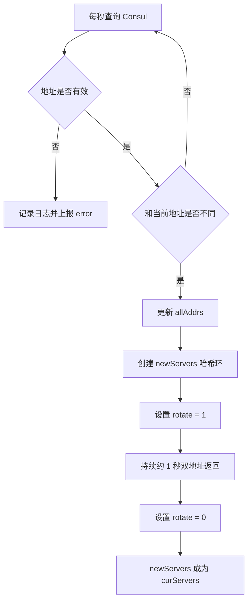
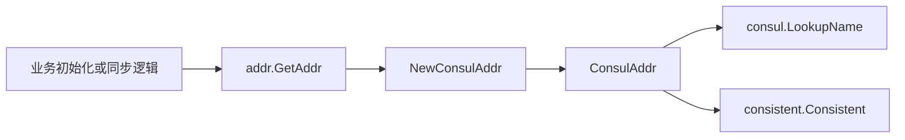

# Address Discovery

## 地址发现模块

`addr` 包负责把业务侧的 `idc` 或请求标识映射到 Harden 服务实例地址。它基于 Consul 做服务发现，并用 `consistent.Consistent` 做一致性哈希，保证同一个 `name` 在地址列表稳定时尽量落到同一台服务实例。

模块主要服务于同步链路和初始化链路。当前已知调用方包括 `syncer/pack.go`、`syncer/v2/pack.go` 中的 `syncing`，以及 `tokens/group.go` 中的 `InitAllInitInfos`。

## 对外接口

核心接口是 `ConsistentAddr`：

```go
type ConsistentAddr interface {
	GetAddr(name string) string
	GetAddrs(name string) []string
	GetAllAddrs() []string
}
```

`name` 是一致性哈希的 key，通常由调用方传入业务标识、请求标识或 token 相关标识。模块不会解释该字符串，只负责把它映射到服务地址。

### `GetAddr(name string) string`

返回当前一致性哈希环上的单个地址。

执行时会先通过 `sync.Once` 触发 `initAddrs`，因此 `ConsulAddr` 是懒加载的。初始化完成后调用：

```go
addr, _ := ca.curServers.Get(name)
```

这里会忽略 `Get` 返回的错误。如果当前哈希环为空或查找失败，返回值可能是空字符串。

### `GetAddrs(name string) []string`

返回一个或两个地址：

1. 始终尝试从 `curServers` 获取当前地址。
2. 当 `rotate == 1` 时，再从 `newServers` 获取新地址。
3. 如果新旧地址不同，则同时返回两个地址。

这个方法用于地址变更期间的平滑过渡。`updateAddrs` 检测到 Consul 地址列表变化后，会先构建新的哈希环并设置 `rotate = 1`，持续约 1 秒。在这段时间内，`GetAddrs` 可能返回新旧两个地址，调用方可以同时处理两个目标，降低实例列表切换造成的请求丢失或路由抖动。

### `GetAllAddrs() []string`

返回当前 Consul 地址列表 `allAddrs`。

该字段读写由 `mu` 保护，但返回的是内部 slice 本身，不会复制。调用方应把返回值视为只读数据，不要修改其中元素或对 slice 排序。

## 创建和缓存

入口函数是 `GetAddr(idc string)`：

```go
func GetAddr(idc string) ConsistentAddr {
	if v, ok := addrs.Load(idc); ok {
		return v.(ConsistentAddr)
	}
	v, _ := addrs.LoadOrStore(
		idc,
		NewConsulAddr("toutiao.videoarch.harden.service."+idc, env.Cluster()),
	)
	return v.(ConsistentAddr)
}
```

它按 `idc` 在包级 `sync.Map` 中缓存 `ConsistentAddr` 实例。相同 `idc` 会复用同一个 `ConsulAddr`，避免重复创建 Consul 查询和后台刷新协程。

服务名拼接规则固定为：

```go
"toutiao.videoarch.harden.service." + idc
```

Consul cluster 来自 `env.Cluster()`。

如果需要绕过默认服务名或 cluster，可以直接使用：

```go
ca := NewConsulAddr("toutiao.videoarch.video_data_access", "write")
addr := ca.GetAddr("token-1")
```

## 核心类型：`ConsulAddr`

`ConsulAddr` 保存 Consul 查询参数、当前地址列表和一致性哈希环：

```go
type ConsulAddr struct {
	mu         sync.RWMutex
	addr       string
	allAddrs   []string
	cluster    string
	curServers *consistent.Consistent
	newServers *consistent.Consistent
	rotate     int32
	once       sync.Once
}
```

字段含义：

- `addr`：Consul 服务名。
- `cluster`：Consul cluster。
- `allAddrs`：最近一次成功或初始化查询得到的地址列表。
- `curServers`：当前生效的一致性哈希环。
- `newServers`：地址变更期间的新哈希环。
- `rotate`：是否处于新旧地址切换窗口，`1` 表示 `GetAddrs` 会尝试返回双地址。
- `once`：保证首次调用时只初始化一次。
- `mu`：保护 `allAddrs` 的读写。

## 初始化流程

第一次调用 `GetAddr`、`GetAddrs` 或 `GetAllAddrs` 时会执行 `initAddrs`：

```go
func (ca *ConsulAddr) initAddrs() {
	ca.curServers = consistent.New()
	ee, err := consul.LookupName(ca.addr, consul.WithCluster(ca.cluster))
	ca.printAddr(ee)

	ca.mu.Lock()
	ca.allAddrs = ee.Addrs()
	ca.mu.Unlock()

	if err == nil {
		ca.curServers.Set(ee.Addrs())
	}
	go ca.updateAddrs()
}
```

初始化做了四件事：

1. 创建空的当前哈希环 `curServers`。
2. 通过 `consul.LookupName` 查询服务地址。
3. 记录地址日志，并更新 `allAddrs`。
4. 如果查询成功，则把地址写入当前哈希环。
5. 启动后台 `updateAddrs` 协程，每秒刷新一次 Consul。

即使首次 Consul 查询失败，后台刷新协程仍然会启动。后续查询恢复后，`updateAddrs` 会检测地址变化并更新哈希环。

## 后台刷新与平滑切换

`updateAddrs` 每秒执行一次 Consul 查询：

```go
ticker := time.NewTicker(time.Second)
for {
	<-ticker.C
	ee, err := consul.LookupName(ca.addr, consul.WithCluster(ca.cluster))
	// ...
}
```

当查询失败或返回空地址时，模块会：

- 写入 warning 日志。
- 通过 `metrics.EmitCounter("updateAddrs", 1, metrics.Status, "error")` 上报错误计数。
- 跳过本轮更新，继续使用现有哈希环。

当地址发生变化时，流程如下：



地址变化判断由 `addrsChanged` 完成：

```go
func addrsChanged(oldAddrs, newAddrs []string) bool {
	if len(oldAddrs) != len(newAddrs) {
		return true
	}
	sort.Sort(sort.StringSlice(oldAddrs))
	sort.Sort(sort.StringSlice(newAddrs))
	for i := 0; i < len(newAddrs); i++ {
		if oldAddrs[i] != newAddrs[i] {
			return true
		}
	}
	return false
}
```

该函数先比较长度，再排序后逐项比较，因此地址顺序变化不会被视为实际变更。

需要注意的是，`addrsChanged` 会原地排序传入的 slice。如果 `curServers.Members()` 或 `ee.Addrs()` 返回的是内部共享 slice，调用方需要意识到这里存在修改输入顺序的行为。

## 一致性哈希行为

地址发现模块不直接选择“第一个可用实例”，而是通过 `consistent.Consistent` 根据 `name` 选择实例：

```go
addr, err := ca.curServers.Get(name)
```

这种模式适合需要稳定分片的场景：

- 同一个 `name` 在实例列表不变时会稳定路由到同一地址。
- 实例扩缩容时，只会影响一部分 key 的映射。
- 地址变化期间，`GetAddrs` 可以同时返回旧地址和新地址，调用方可以做迁移期兼容处理。

`GetAddr` 只返回当前哈希环上的单地址；`GetAddrs` 才会感知 `rotate` 并返回双地址。

## 日志与指标

每次 Consul 查询后都会调用 `printAddr` 输出当前发现结果：

```go
logs.Info(
	"sd lookup cur_dc:%v, cur_ip:%v, cur_cluster:%v, target_consul_name:%v, addrs:%+v",
	env.IDC(),
	env.HostIP(),
	ca.cluster,
	ca.addr,
	printAddr,
)
```

日志中包含：

- 当前 IDC：`env.IDC()`
- 当前机器 IP：`env.HostIP()`
- 查询 cluster：`ca.cluster`
- Consul 服务名：`ca.addr`
- 查询到的地址列表

后台刷新还会上报两类指标：

```go
metrics.EmitCounter("updateAddrs", 1, metrics.Status, "error")
metrics.EmitCounter("updateAddrs", 1, metrics.Status, "changeAddrs")
```

`error` 表示 Consul 查询失败或返回空地址；`changeAddrs` 表示地址列表发生变化并触发哈希环切换。

## 与代码库其他模块的关系

`addr` 包是 Harden 内部服务地址解析的基础模块。调用链通常是：



已知入口包括：

- `tokens/group.go` 的 `InitAllInitInfos`：初始化 token 或分组信息时获取对应 IDC 的地址发现器。
- `syncer/pack.go` 的 `syncing`：同步逻辑中根据 IDC 获取目标 Harden 服务地址。
- `syncer/v2/pack.go` 的 `syncing`：新版同步逻辑同样依赖 `addr.GetAddr`。

这意味着 `addr.GetAddr(idc)` 的缓存粒度和服务名拼接规则会直接影响同步链路的路由目标。

## 并发模型

模块内部有三层并发控制：

- `sync.Map addrs`：保证不同 goroutine 按 `idc` 共享同一个地址发现器。
- `sync.Once once`：保证每个 `ConsulAddr` 只初始化一次。
- `sync.RWMutex mu`：保护 `allAddrs` 字段读写。
- `atomic.LoadInt32` / `atomic.StoreInt32`：控制 `rotate` 切换状态。

`curServers` 和 `newServers` 的切换没有显式锁保护。当前实现依赖“先构建新 ring，再通过字段替换发布”的模式。贡献代码时如果要扩展哈希环读写逻辑，应重点检查并发读写是否仍然安全。

## 开发注意事项

`GetAddr(name)` 会吞掉一致性哈希查找错误，调用方需要能处理空字符串。

`GetAddrs(name)` 在地址切换窗口可能返回两个地址。调用方如果只期望一个目标，应明确使用 `GetAddr`；如果要兼容扩缩容迁移，应使用 `GetAddrs`。

`GetAllAddrs()` 返回内部 slice，不要修改返回值。需要排序、过滤或缓存时，应先复制一份。

`addrsChanged` 会原地排序入参。修改该函数或调用来源时，要确认不会破坏 `consistent.Consistent` 内部成员顺序假设。

`initAddrs` 即使首次查询失败也会启动后台刷新，因此首次调用方可能短时间拿到空地址。依赖该模块的启动流程如果要求强一致的服务发现结果，需要在调用方增加重试或空地址处理。