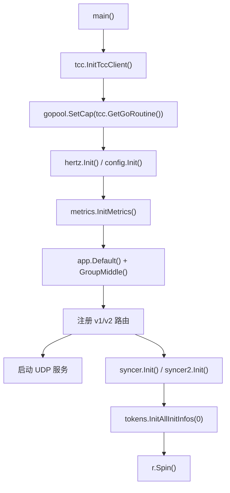

# Application Entry and Tooling

## 应用入口与工具链

该模块负责 `harden` 服务的进程启动、运行时初始化、HTTP/UDP 服务挂载，以及构建产物打包。核心入口是 [main.go](/Users/bytedance/videoarch/harden/main.go)，构建和运行脚本位于 [build.sh](/Users/bytedance/videoarch/harden/build.sh) 与 [script/bootstrap.sh](/Users/bytedance/videoarch/harden/script/bootstrap.sh)。

## 启动流程

`main()` 是服务唯一入口，没有内部调用方。它按固定顺序完成运行环境准备：

1. `tcc.InitTccClient()` 初始化 TCC 配置客户端。
2. `gopool.SetCap(tcc.GetGoRoutine())` 使用 TCC 配置限制 goroutine 池容量。
3. `hertz.Init()` 初始化 Hertz 框架。
4. `hertz.ResetFatestJSONMarshal()` 重置 Hertz JSON 序列化实现。
5. `config.Init(local.ConfDir())` 从本地配置目录加载服务配置。
6. `metrics.InitMetrics()` 初始化指标上报。
7. 如 `config.C.TargetJamesCluster` 非空，则覆盖 `james.Cluster`。
8. 创建 `app.Default()`，挂载 `middleware.GroupMiddle()`。
9. 注册 `v1` 与 `v2` HTTP 路由。
10. 后台启动 `udpserver.Serve("0.0.0.0:9555")`。
11. 初始化 `syncer.Init()` 与 `syncer2.Init()`。
12. 后台执行 `tokens.InitAllInitInfos(0)`，从同集群其他节点拉取初始 token bucket 信息。
13. 调用 `r.Spin()` 阻塞运行 HTTP 服务。



执行流数据中还标出了 `main -> tcc.InitTccClient -> Precision`。入口层不直接调用 `Precision`，而是通过 TCC 初始化链路触发相关配置逻辑。

## HTTP 接口挂载

入口使用 Hertz 的 `app.Default()` 创建服务实例，并通过 `r.Group()` 划分版本路由。

`v1` 路由：

| 方法 | 路径 | 处理函数 | 作用 |
|---|---|---|---|
| `GET` | `/v1/rate` | `remote.RateLimit` | v1 限流查询/处理入口 |
| `GET` | `/v1/isThrottled` | `remote.IsThrottled` | 判断请求是否被限流 |
| `POST` | `/v1/sync` | `remote.Sync` | v1 同步入口 |
| `GET` | `/v1/conEnter` | `conRemote.ConEnter` | 一致性相关进入逻辑 |
| `GET` | `/v1/conLeave` | `conRemote.ConLeave` | 一致性相关离开逻辑 |

`v2` 路由：

| 方法 | 路径 | 处理函数 | 作用 |
|---|---|---|---|
| `GET` | `/v2/rate` | `remote2.RateLimit` | v2 限流查询/处理入口 |
| `POST` | `/v2/sync` | `remote2.Sync` | v2 同步入口 |
| `GET` | `/v2/get_all_token_buckets` | `remote2.GetAllTokenBuckets` | 获取所有 token bucket 状态 |

所有 HTTP 路由都会经过 `middleware.GroupMiddle()`。如果新增接口，应优先放入对应版本分组，避免绕过统一中间件。

## UDP 服务

`main()` 通过 goroutine 启动：

```go
go udpserver.Serve("0.0.0.0:9555")
```

UDP 服务固定监听 `0.0.0.0:9555`。根目录 [README.md](/Users/bytedance/videoarch/harden/README.md) 明确说明：修改 UDP payload 时，应修改 `udpserver` 包内的 `payload.proto`，再执行 `gen_proto.sh` 生成 `payload.pb.go`，不要直接编辑生成文件。

这意味着 UDP 协议结构的源头是 `.proto` 文件，`payload.pb.go` 只应作为生成产物维护。

## 配置、指标与外部集群

入口依赖 `config.Init(local.ConfDir())` 加载本地配置。`local.ConfDir()` 来自 Hertz 本地配置能力，实际运行时配置目录由启动参数 `-conf-dir` 决定。

James SDK 集群选择逻辑在入口完成：

```go
if config.C.TargetJamesCluster != "" {
    james.Cluster = config.C.TargetJamesCluster
}
logs.Info("the james.Cluster is %s", james.Cluster)
```

因此，`config.C.TargetJamesCluster` 是覆盖 James 服务端集群的入口配置；为空时保留 `james-sdk` 默认集群。

`metrics.InitMetrics()` 在路由注册前执行，确保服务启动早期就具备指标上报能力。

## 同步与初始化

入口同时初始化两个同步模块：

```go
syncer.Init()
syncer2.Init()
```

二者分别对应旧版与 v2 同步链路。HTTP 层也按 `remote.Sync` 与 `remote2.Sync` 分别暴露 `/v1/sync`、`/v2/sync`。

`tokens.InitAllInitInfos(0)` 在 goroutine 中异步执行，注释说明其职责是“从其他所有同集群获取初始值”。这一步不会阻塞 `r.Spin()` 前的主流程，但会与服务运行并发发生。修改 token bucket 初始化逻辑时，需要考虑服务已经开始接收请求的并发窗口。

## 构建脚本

[build.sh](/Users/bytedance/videoarch/harden/build.sh) 是标准构建入口：

```bash
export GO111MODULE=on

RUN_NAME="toutiao.videoarch.harden"

mkdir -p output output/conf output/bin
cp script/bootstrap.sh script/settings.py output
chmod +x output/bootstrap.sh
cp conf/* output/conf 2>/dev/null
go build -v -o output/bin/${RUN_NAME}
```

构建产物结构：

| 路径 | 内容 |
|---|---|
| `output/bin/toutiao.videoarch.harden` | Go 编译后的服务二进制 |
| `output/bootstrap.sh` | 运行入口脚本 |
| `output/settings.py` | 产品、子系统、模块和端口元信息 |
| `output/conf/` | 从 `conf/` 拷贝的运行配置 |

`go.mod` 声明模块名为 `code.byted.org/videoarch/harden`，Go 版本为 `1.18`。主要直接依赖包括 Hertz、TCC、gopool、metrics、James SDK、protobuf、mockey 和测试相关库。

## 启动脚本

[script/bootstrap.sh](/Users/bytedance/videoarch/harden/script/bootstrap.sh) 负责运行时目录、日志目录、服务名和启动参数拼装。

关键行为：

- 第一个参数作为 `RUNTIME_ROOT`，为空时默认使用脚本所在目录。
- 第二个参数作为服务端口 `PORT`。
- `IS_HOST_NETWORK=1` 时，会根据 `PORT0`、`PORT1`、`PORT2` 和 `REQUIRE_NGINX` 设置运行端口环境变量。
- 创建 `$RUNTIME_ROOT/log/app` 与 `$RUNTIME_ROOT/log/rpc`。
- 从 `settings.py` 读取 `PRODUCT`、`SUBSYS`、`MODULE`。
- 拼出服务名 `SVC_NAME=${PRODUCT}.${SUBSYS}.${MODULE}`。
- 设置 `GIN_LOG_DIR` 与 `PSM`。
- 执行 `$CURDIR/bin/${BinaryName}`，并传入：
  - `-psm=$SVC_NAME`
  - `-conf-dir=$CONF_DIR`
  - `-log-dir=$GIN_LOG_DIR`
  - 可选 `-port=$PORT`

[script/settings.py](/Users/bytedance/videoarch/harden/script/settings.py) 当前定义：

```python
PRODUCT="toutiao"
SUBSYS="videoarch"
MODULE="harden"
APP_TYPE="binary"
PORT="9555"
```

这与构建脚本中的二进制名 `toutiao.videoarch.harden` 保持一致。修改产品名、模块名或运行名时，需要同步检查 `build.sh`、`settings.py` 和部署侧期望的 PSM。

## 开发注意事项

新增入口初始化逻辑时，应放在 `r.Spin()` 之前；如果该逻辑影响请求处理的正确性，不应使用后台 goroutine 异步初始化。

新增 HTTP 接口时，应挂载到 `g1 := r.Group("v1")` 或 `g2 := r.Group("v2")`，并复用已有的 `middleware.GroupMiddle()` 链路。

修改 UDP payload 时，只改 `udpserver/payload.proto` 并重新生成 `payload.pb.go`，不要直接改生成文件。

修改 goroutine 并发上限时，应通过 TCC 配置影响 `tcc.GetGoRoutine()`，入口只负责把配置值传给 `gopool.SetCap()`。