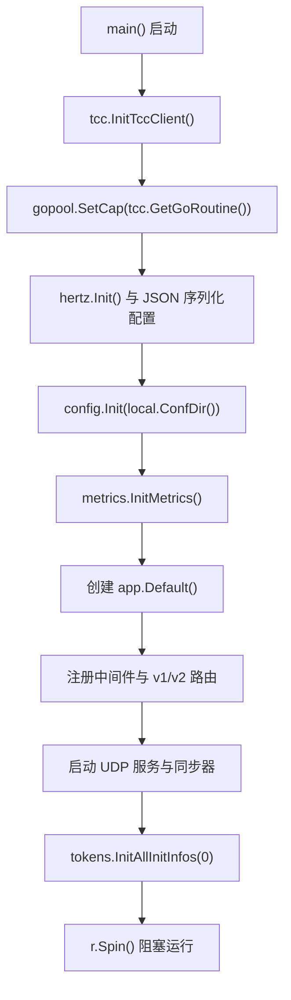

# Application Entry Point

## 模块职责

`main.go` 是服务进程的唯一启动入口，负责完成全局初始化、HTTP 路由注册、后台任务启动，并最终通过 `r.Spin()` 阻塞运行 Hertz 服务。

该模块本身不承载业务逻辑，核心职责是把配置、限流同步、指标、HTTP 中间件、UDP 服务和 token 初始化等组件按正确顺序装配起来。

## 启动流程



启动顺序有实际依赖关系：

1. `tcc.InitTccClient()` 最先执行，用于初始化 TCC 客户端。调用图显示该路径会进入 `Precision`，说明部分运行时参数可能依赖 TCC 精度或配置处理。
2. `gopool.SetCap(tcc.GetGoRoutine())` 使用 TCC 配置控制全局 goroutine 池容量。
3. `hertz.Init()` 初始化 Hertz 运行环境，随后 `hertz.ResetFatestJSONMarshal()` 调整 JSON 序列化实现。
4. `config.Init(local.ConfDir())` 从本地配置目录加载服务配置，并填充全局配置 `config.C`。
5. `metrics.InitMetrics()` 初始化监控指标。
6. 根据 `config.C.TargetJamesCluster` 可选覆盖 `james.Cluster`，用于指定 james-sdk 访问的服务端集群。
7. 创建 HTTP 应用、挂载中间件、注册路由。
8. 启动 UDP 服务、v1/v2 同步器，以及 token bucket 初始值拉取任务。
9. `r.Spin()` 启动并阻塞主进程。

## 全局初始化

### TCC 与 goroutine 池

```go
tcc.InitTccClient()
gopool.SetCap(tcc.GetGoRoutine())
```

`main()` 先初始化 TCC 客户端，再通过 `tcc.GetGoRoutine()` 读取 goroutine 池容量，并传给 `gopool.SetCap()`。

这意味着并发能力是配置驱动的。如果新增依赖 `gopool` 的后台任务，应保持在这两行之后启动，避免任务在池容量设置前开始运行。

### Hertz 初始化

```go
hertz.Init()
hertz.ResetFatestJSONMarshal()
```

`hertz.Init()` 初始化 HTTP 框架。`hertz.ResetFatestJSONMarshal()` 配置 Hertz 的 JSON 序列化逻辑。所有 HTTP 应用创建和路由注册都发生在这之后。

### 配置加载

```go
config.Init(local.ConfDir())
```

`config.Init()` 使用 `local.ConfDir()` 作为配置目录来源。后续逻辑直接读取 `config.C`，例如：

```go
if config.C.TargetJamesCluster != "" {
    james.Cluster = config.C.TargetJamesCluster
}
```

因此依赖 `config.C` 的逻辑必须放在 `config.Init()` 之后。

### 指标初始化

```go
metrics.InitMetrics()
```

`metrics.InitMetrics()` 在 HTTP 应用创建前执行，确保后续请求处理、同步任务或后台服务可以正常上报指标。

## james-sdk 集群选择

```go
if config.C.TargetJamesCluster != "" {
    james.Cluster = config.C.TargetJamesCluster
}
logs.Info("the james.Cluster is %s", james.Cluster)
```

默认情况下，`james-sdk` 使用自身的默认集群。若配置项 `config.C.TargetJamesCluster` 非空，启动入口会覆盖 `james.Cluster`。

这段逻辑是全局副作用：`james.Cluster` 是 SDK 级别变量，修改后会影响当前进程内所有通过 james-sdk 发起的访问。

## HTTP 应用与中间件

```go
r := app.Default()
r.Use(middleware.GroupMiddle())
```

`app.Default()` 创建默认 Hertz 应用实例。随后通过 `middleware.GroupMiddle()` 挂载全局中间件。

所有后续注册到 `r` 的路由都会经过该中间件链，包括 `v1` 和 `v2` 分组接口。

## 路由结构

### v1 接口

```go
g1 := r.Group("v1")

g1.GET("rate", remote.RateLimit)
g1.GET("isThrottled", remote.IsThrottled)
g1.POST("sync", remote.Sync)
g1.GET("conEnter", conRemote.ConEnter)
g1.GET("conLeave", conRemote.ConLeave)
```

`v1` 路由主要连接旧版远程限流与并发控制逻辑：

| 方法 | 路径 | 处理函数 | 作用 |
|---|---|---|---|
| `GET` | `/v1/rate` | `remote.RateLimit` | 查询或执行 v1 限流判断 |
| `GET` | `/v1/isThrottled` | `remote.IsThrottled` | 查询是否被限流 |
| `POST` | `/v1/sync` | `remote.Sync` | v1 同步入口 |
| `GET` | `/v1/conEnter` | `conRemote.ConEnter` | 并发进入控制 |
| `GET` | `/v1/conLeave` | `conRemote.ConLeave` | 并发离开控制 |

### v2 接口

```go
g2 := r.Group("v2")

g2.GET("rate", remote2.RateLimit)
g2.POST("sync", remote2.Sync)
g2.GET("get_all_token_buckets", remote2.GetAllTokenBuckets)
```

`v2` 路由连接新版远程限流与 token bucket 相关能力：

| 方法 | 路径 | 处理函数 | 作用 |
|---|---|---|---|
| `GET` | `/v2/rate` | `remote2.RateLimit` | v2 限流入口 |
| `POST` | `/v2/sync` | `remote2.Sync` | v2 同步入口 |
| `GET` | `/v2/get_all_token_buckets` | `remote2.GetAllTokenBuckets` | 获取所有 token bucket 状态 |

## 后台服务与同步器

### UDP 服务

```go
go udpserver.Serve("0.0.0.0:9555")
```

启动入口在独立 goroutine 中调用 `udpserver.Serve()`，监听 `0.0.0.0:9555`。

由于该调用异步执行，`main()` 不会等待 UDP 服务完成初始化。如果新增依赖 UDP 服务状态的逻辑，需要显式处理就绪条件，而不是假设该 goroutine 启动后服务立即可用。

### v1 与 v2 同步器

```go
syncer.Init()
syncer2.Init()
```

`syncer.Init()` 初始化旧版同步器，`syncer2.Init()` 初始化新版同步器。两者在路由注册前后没有强耦合，但都在 `r.Spin()` 前完成，保证服务开始接收 HTTP 请求前同步组件已经初始化。

### token bucket 初始值拉取

```go
go tokens.InitAllInitInfos(0)
```

`tokens.InitAllInitInfos(0)` 在后台 goroutine 中执行，注释说明其用途是“从其他所有同集群获取初始值”。

这个任务是异步的，因此服务可能在 token 初始值完全拉取完成前开始接收请求。处理限流逻辑时需要考虑初始化期间的状态。

## 副作用导入

`main.go` 中有两个空白标识符导入：

```go
_ "code.byted.org/lidar/agent/init"
_ "net/http/pprof"
```

`code.byted.org/lidar/agent/init` 通过包初始化副作用接入 Lidar agent。

`net/http/pprof` 注册 Go 标准库 pprof 相关 handler。该导入本身不在 `main()` 中显式调用函数，但会触发包级初始化逻辑。

## 修改建议

新增启动逻辑时，应优先判断它属于哪一类：

- 依赖 TCC 配置的逻辑应放在 `tcc.InitTccClient()` 之后。
- 依赖 `config.C` 的逻辑应放在 `config.Init(local.ConfDir())` 之后。
- HTTP handler 注册应集中放在对应的 `v1` 或 `v2` group 下。
- 长期运行或阻塞型任务必须使用 goroutine 启动，否则会阻止 `r.Spin()` 执行。
- 需要在请求到达前完成的初始化不应异步启动，或必须提供明确的就绪检查。

`main.go` 应继续保持装配层定位：只负责初始化顺序、路由挂载和后台任务启动，具体业务行为应留在 `remote`、`remote/v2`、`syncer`、`syncer/v2`、`tokens`、`udpserver` 等模块中实现。