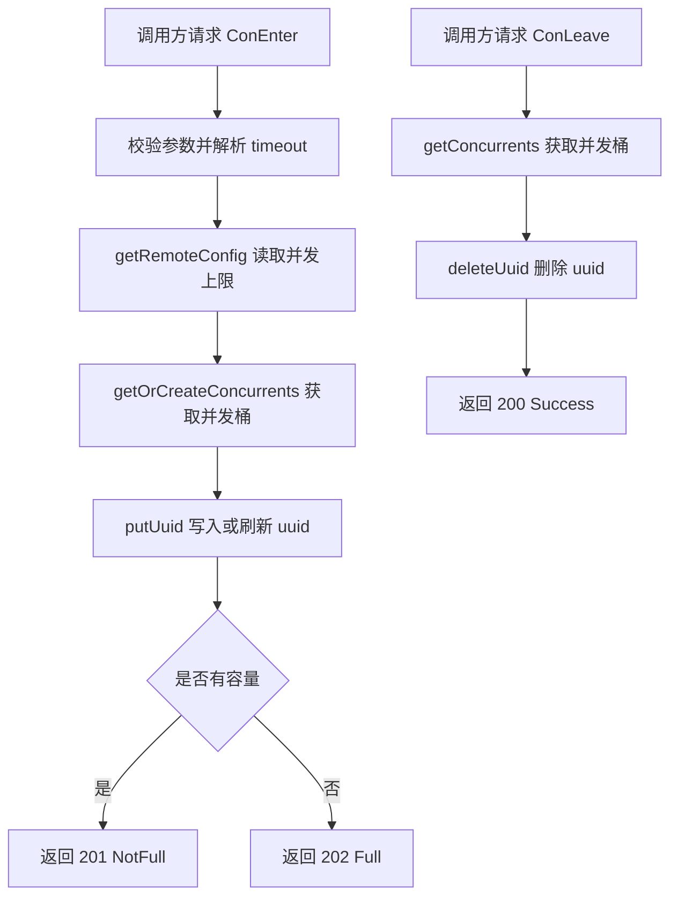

# Concurrency Remote Coordination

## 模块定位

`conRemote` 包实现“远端并发协调”：多个调用方通过 `ConEnter` 申请一个并发名额，通过 `ConLeave` 释放名额。模块用 `(group, name)` 作为限流维度，用 `uuid` 表示一次占用，并从 James 配置中心读取该维度允许的最大并发数。

它适合处理跨进程或跨实例的轻量并发协调场景：调用方进入临界区前先请求 `ConEnter`，如果返回 `201` 表示未满，可以继续执行；如果返回 `202` 表示已满，应放弃或重试。调用方完成后请求 `ConLeave` 释放自己的 `uuid`。即使调用方没有主动释放，`ConEnter` 传入的 `timeout` 也会让该 `uuid` 到期后被后台清理。

## 对外入口

模块暴露两个 Hertz handler：

```go
func ConEnter(c *hertz.RequestContext)
func ConLeave(c *hertz.RequestContext)
```

两个 handler 都通过 query 参数接收请求，并统一返回 `ReturnJson`：

```go
type ReturnJson struct {
	Code    string `json:"code"`
	Message string `json:"message"`
}
```

### `ConEnter`

`ConEnter` 用于申请并发名额。它读取以下 query 参数：

| 参数 | 说明 |
| --- | --- |
| `group` | 并发配置组，也是 James 配置读取维度 |
| `name` | 组内具体并发项 |
| `timeout` | 本次占用的有效期，使用 `time.ParseDuration` 解析，例如 `1s`、`500ms` |
| `uuid` | 本次占用的唯一标识 |

返回码语义：

| Code | 常量 | 含义 |
| --- | --- | --- |
| `201` | `NotFull` | 申请成功，当前未满 |
| `202` | `Full` | 当前已满，申请失败 |
| `40001` | `ErrorParam` | 缺少必要参数 |
| `40002` | `TimeoutParseError` | `timeout` 不能被 `time.ParseDuration` 解析 |
| `40003` | `GetRemoteConfigError` | 获取远端并发配置失败 |

核心执行逻辑：

1. 校验 `group`、`name`、`timeout`、`uuid` 是否为空。
2. 使用 `time.ParseDuration(timeout)` 解析超时时间。
3. 通过 `getRemoteConfig(group, name)` 获取 James 中配置的最大并发数。
4. 通过 `getOrCreateConcurrents(group, name)` 获取本地并发桶。
5. 先用 `GetUuidsLen()` 快速判断当前数量是否已经大于等于配置值。
6. 调用 `putUuid(uuid, expireAt, curCon, group, name)` 在桶内写入或刷新占用。
7. 返回 `201` 或 `202`。

`putUuid` 内部会再次在写锁下判断容量，因此 `ConEnter` 中的第一次长度判断只是快速拒绝路径，真正的并发安全判断发生在 `putUuid`。

### `ConLeave`

`ConLeave` 用于释放并发名额。它读取以下 query 参数：

| 参数 | 说明 |
| --- | --- |
| `group` | 并发配置组 |
| `name` | 组内具体并发项 |
| `uuid` | 要释放的占用标识 |

返回码语义：

| Code | 常量 | 含义 |
| --- | --- | --- |
| `200` | `Success` | 释放成功 |
| `40001` | `ErrorParam` | 缺少必要参数 |
| `40004` | `GetLimitersError` | 当前进程中不存在对应的并发桶 |

执行逻辑很直接：校验参数后调用 `getConcurrents(group, name)` 找到桶，再调用 `deleteUuid(uuid)` 删除该 `uuid`。`deleteUuid` 对不存在的 `uuid` 也是幂等的，不会返回错误。

## 核心数据结构

模块的全局状态定义在 `baseInfo.go`：

```go
var (
	remoteConcurrents = make(map[pair]*remoteConcurrent)
	remoteConfigs     = make(map[string]*model.LimiterConConfig)

	lockRemoteConfigs     sync.RWMutex
	lockRemoteConcurrents sync.RWMutex
)
```

### `pair`

```go
type pair struct {
	group string
	name  string
}
```

`pair` 是并发桶的索引键。每个 `(group, name)` 对应一个独立的 `remoteConcurrent`。

### `remoteConcurrent`

```go
type remoteConcurrent struct {
	sync.RWMutex
	uuids map[string]int64
}
```

`remoteConcurrent` 保存某个 `(group, name)` 当前被占用的 `uuid` 集合。`uuids` 的 key 是调用方传入的 `uuid`，value 是过期时间的 Unix 纳秒时间戳。

它的方法集中在 `uuidsBase.go`：

| 方法 | 作用 |
| --- | --- |
| `putUuid` | 写入或刷新 `uuid`，并在写锁下做容量判断 |
| `deleteUuid` | 删除 `uuid` |
| `getUuid` | 判断 `uuid` 是否存在 |
| `GetUuidsLen` | 获取当前占用数量 |
| `clearUuids` | 后台循环清理过期 `uuid` |

## 申请与释放流程



## 配置读取与刷新

并发上限由 `getRemoteConfig(group, name)` 读取。配置来源是 James SDK：

```go
func getConConfig(group string) (*model.LimiterConConfig, error) {
	return james.GetConGlobalConfig(group)
}
```

配置缓存维度是 `group`，不是 `(group, name)`：

```go
remoteConfigs map[string]*model.LimiterConConfig
```

`getRemoteConfig` 的行为：

1. 先从 `remoteConfigs[group]` 读取缓存。
2. 如果缓存不存在，用 `SingleFight.Do(group, ...)` 合并同一个 `group` 的并发加载请求。
3. 调用 `getConConfig(group)` 从 James 获取配置。
4. 将 `*model.LimiterConConfig` 写入 `remoteConfigs[group]`。
5. 首次成功写入某个 `group` 后，启动 `updateConfig(group, name)` 后台 goroutine。
6. 从 `groupconfig.Configs[name]` 读取具体并发项的 `Concurrent` 值。

`updateConfig` 每 30 秒调用一次 `getConConfig(group)`。如果获取失败或返回空配置，会记录日志和指标，但不会覆盖本地已有配置；只有成功获取到非空配置时才替换 `remoteConfigs[group]`。

需要注意：`updateConfig` 的入参包含 `name`，但配置刷新实际按 `group` 进行。`name` 主要用于指标 tag。

## 并发桶创建与后台任务

`getOrCreateConcurrents(group, name)` 负责懒加载并发桶。它采用双重检查锁模式：

1. 先用 `lockRemoteConcurrents.RLock()` 尝试读取。
2. 未命中后升级为 `lockRemoteConcurrents.Lock()`。
3. 再次检查，避免多个 goroutine 同时创建同一个桶。
4. 创建 `remoteConcurrent{uuids: make(map[string]int64)}` 并写入 `remoteConcurrents`。
5. 启动两个后台 goroutine：

```go
go info.conInfo(group, name)
go info.clearUuids(group, name)
```

`conInfo` 每 10 秒上报一次当前桶内 `uuid` 数量：

```go
metrics.EmitStore("conInfo", li.GetUuidsLen(), metrics.Group, group, metrics.Name, name)
```

`clearUuids` 每 10 毫秒扫描一次 `uuids`，删除已经过期的条目，并上报清理数量与耗时：

```go
metrics.EmitCounter("clearOutDate."+metrics.ConThroughput, count, metrics.Group, group, metrics.Name, name)
metrics.EmitTimer("clearOutDate."+metrics.ConLatency, now, metrics.Group, group, metrics.Name, name)
```

这意味着每个活跃的 `(group, name)` 都会常驻两个 goroutine。新增维度不会被回收，`remoteConcurrents` 中的桶也没有删除逻辑。

## `uuid` 语义

`uuid` 是一次占用的身份标识。`putUuid` 对重复 `uuid` 有特殊处理：

```go
_, ok := li.uuids[uuid]
if ok {
	li.uuids[uuid] = lastTime
	return true
}
```

如果同一个 `uuid` 再次调用 `ConEnter`，不会增加并发计数，只会刷新过期时间，并返回成功。这使客户端可以用同一个 `uuid` 做续租式调用。

对于新 `uuid`，`putUuid` 会在写锁中判断：

```go
if len(li.uuids) >= curCon {
	return false
}
li.uuids[uuid] = lastTime
return true
```

因此容量判断和写入是原子的，不会因为并发请求突破 `curCon` 限制。

## 锁与并发安全

模块有两层锁：

| 锁 | 保护对象 |
| --- | --- |
| `lockRemoteConfigs` | 全局配置缓存 `remoteConfigs` |
| `lockRemoteConcurrents` | 全局并发桶索引 `remoteConcurrents` |
| `remoteConcurrent.RWMutex` | 单个桶内的 `uuids` map |

这种设计把全局索引和具体桶状态分开。高频的 `uuid` 增删只锁单个 `remoteConcurrent`，不会阻塞其他 `(group, name)` 的桶。

`getRemoteConfig` 和 `getOrCreateConcurrents` 都使用“先读锁、未命中再写锁、写锁下再次检查”的模式，避免并发初始化时重复创建配置或桶。

## 指标与外部依赖

模块和代码库其他部分的主要连接点是 `metrics`、James SDK、Hertz 和日志库。

### Metrics

`ConEnter`、`ConLeave`、`getRemoteConfig`、`updateConfig`、`putUuid`、`conInfo`、`clearUuids` 都会上报指标。入口 handler 使用带请求上下文的版本：

```go
metrics.CtxEmitCounter(c, ...)
metrics.CtxEmitTimer(c, ...)
```

后台逻辑使用普通版本：

```go
metrics.EmitCounter(...)
metrics.EmitTimer(...)
metrics.EmitStore(...)
```

根据调用流，`CtxEmitCounter` 会继续进入 `metrics.GetMetrics`，并读取 `tcc.GetPrecisionConfig`、执行 `Precision`，同时通过 `FormTags` 组织 tag。这说明并发协调模块本身不直接依赖 TCC，但它的指标采样和 tag 处理会走 `metrics` 包里的 TCC 配置逻辑。

常见指标名模式：

| 位置 | 指标名模式 |
| --- | --- |
| `ConEnter` | `ConEnter.` + `metrics.ConThroughput` / `metrics.ConLatency` |
| `ConLeave` | `ConLeave.` + `metrics.ConThroughput` / `metrics.ConLatency` |
| `getRemoteConfig` / `updateConfig` | `updateConfig.` + `metrics.ConThroughput` |
| `putUuid` | `putUuid.` + `metrics.ConThroughput` |
| `clearUuids` | `clearOutDate.` + `metrics.ConThroughput` / `metrics.ConLatency` |
| `conInfo` | `conInfo` store 指标 |

### James 配置中心

`getConConfig` 通过：

```go
james.GetConGlobalConfig(group)
```

读取 `*model.LimiterConConfig`。`getRemoteConfig` 期待该配置中存在：

```go
groupconfig.Configs[name].Concurrent
```

如果 `name` 不存在或配置为空，`ConEnter` 会返回 `40003`，并在指标中记录 `noNameConfig`。

### Hertz

`ConEnter` 和 `ConLeave` 使用 `*hertz.RequestContext` 读取 query 参数并写 JSON 响应。当前代码只定义 handler，不包含路由注册逻辑。

## 特殊测试分支

`ConEnter` 中包含一个固定 `group` 的测试分支：

```go
if group == "bytedance.videoarch.unit_testing_concurrent_server_error" {
	time.Sleep(5 * time.Second)
	return
}
```

命中该分支时函数会睡眠 5 秒后直接返回，不写 JSON 响应，也不会继续获取配置或写入并发桶。这个分支看起来用于单测或模拟服务端异常/超时行为，生产调用方不应依赖它作为正常协议的一部分。

## 贡献时需要注意的点

新增或修改行为时，优先保持以下约束：

1. `putUuid` 中的容量判断和写入必须继续在同一个写锁临界区内完成，否则会破坏并发上限。
2. `remoteConfigs` 和 `remoteConcurrents` 是全局 map，任何读写都需要使用对应的全局锁。
3. `remoteConcurrent.uuids` 是普通 map，必须通过 `remoteConcurrent` 自身的锁访问。
4. `ConEnter` 的成功语义是 `201 NotFull`，不是 `200 Success`；`200 Success` 当前只用于 `ConLeave`。
5. `timeout` 使用 Go duration 字符串，不是裸数字秒数。
6. 每个新 `(group, name)` 会启动长期 goroutine；如果未来支持大量动态维度，需要考虑桶回收和 goroutine 生命周期管理。
7. `updateConfig` 失败时保留旧配置，这是当前容错策略；不要在网络抖动或配置短暂不可用时清空本地配置。
8. 指标 tag 使用 `metrics.Group` 和 `metrics.Name` 贯穿主要路径，新增错误分支时应保持同样的 tag 结构，方便按维度排查问题。