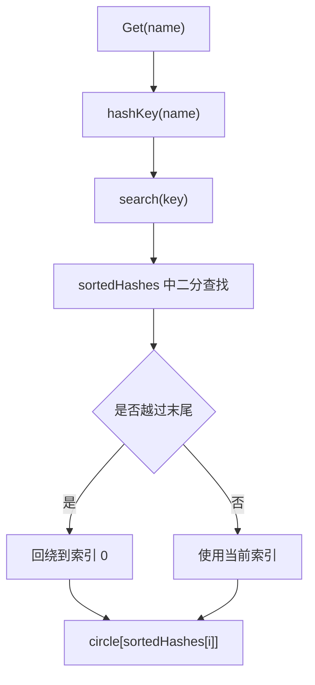

# Consistent Hashing

## 模块概览

`consistent` 包实现了基于一致性哈希环的字符串成员选择逻辑，典型用途是把请求键稳定地映射到一组后端节点，例如缓存节点、服务实例或地址池。相比普通取模哈希，成员增删时只有落在相邻区间内的键会迁移，能降低扩缩容带来的重映射范围。

本仓库中该模块对外暴露 `Consistent` 类型及其方法。调用关系显示，外部模块 `addr/addr.go` 通过 `New()` 初始化哈希环，并通过 `Set()` 刷新地址集合：

- `initAddrs` → `consistent.New`
- `updateAddrs` → `consistent.New`
- `updateAddrs` → `Consistent.Set`

## 核心数据结构

```go
type Consistent struct {
    circle           map[uint32]string
    members          map[string]bool
    sortedHashes     uints
    NumberOfReplicas int
    count            int64
    scratch          [64]byte
    sync.RWMutex
}
```

`Consistent` 维护两个层次的数据：

- `members` 保存逻辑成员集合，键是成员名，例如 `"cacheA"`。
- `circle` 保存虚拟节点到逻辑成员的映射，键是 `uint32` 哈希值，值是成员名。
- `sortedHashes` 是 `circle` 中所有哈希点的有序列表，用于二分查找。
- `NumberOfReplicas` 控制每个逻辑成员生成多少个虚拟节点，`New()` 默认设置为 `20`。
- `count` 记录逻辑成员数量，供 `GetTwo()` 和 `GetN()` 判断最多能返回多少个不同成员。
- 内嵌 `sync.RWMutex` 提供并发保护：写操作使用 `Lock()`，读操作使用 `RLock()`。

`uints` 是 `[]uint32` 的排序适配器，实现了 `sort.Interface`：

```go
type uints []uint32

func (x uints) Len() int
func (x uints) Less(i, j int) bool
func (x uints) Swap(i, j int)
```

## 哈希环构建

`New()` 创建空哈希环：

```go
func New() *Consistent
```

默认行为：

- `NumberOfReplicas = 20`
- 初始化 `circle`
- 初始化 `members`

如果需要调整副本数，必须在添加成员前设置：

```go
c := consistent.New()
c.NumberOfReplicas = 100
c.Add("cacheA")
```

成员通过 `Add()` 加入哈希环：

```go
func (c *Consistent) Add(elt string)
```

内部调用未导出的 `add()`：

```go
func (c *Consistent) add(elt string)
```

`add()` 会为同一个成员生成 `NumberOfReplicas` 个虚拟节点。每个虚拟节点的 key 由 `eltKey()` 构造：

```go
func (c *Consistent) eltKey(elt string, idx int) string {
    return strconv.Itoa(idx) + elt
}
```

随后通过 `hashKey()` 计算 CRC32：

```go
func (c *Consistent) hashKey(key string) uint32
```

每个虚拟节点最终写入：

```go
c.circle[c.hashKey(c.eltKey(elt, i))] = elt
```

添加完成后，`updateSortedHashes()` 会重新收集并排序所有哈希点：

```go
func (c *Consistent) updateSortedHashes()
```

## 查询流程

最常用的查询入口是 `Get()`：

```go
func (c *Consistent) Get(name string) (string, error)
```

它把输入键 `name` 映射到哈希环上的第一个顺时针虚拟节点，并返回该虚拟节点对应的逻辑成员。如果哈希环为空，返回 `ErrEmptyCircle`。

查询过程：



`search()` 使用 `sort.Search` 查找第一个大于输入哈希值的位置：

```go
func (c *Consistent) search(key uint32) (i int) {
    f := func(x int) bool {
        return c.sortedHashes[x] > key
    }
    i = sort.Search(len(c.sortedHashes), f)
    if i >= len(c.sortedHashes) {
        i = 0
    }
    return
}
```

这里使用的是严格大于 `>`，因此当输入 key 的哈希值刚好等于某个虚拟节点时，会选择它之后的下一个节点；如果已经到环尾，则回绕到第一个节点。

## 多副本选择

模块提供两个面向冗余或备份场景的查询方法。

### `GetTwo()`

```go
func (c *Consistent) GetTwo(name string) (string, string, error)
```

`GetTwo()` 返回离输入 key 最近的两个不同逻辑成员：

- 如果哈希环为空，返回 `ErrEmptyCircle`。
- 如果只有一个逻辑成员，返回 `(成员名, "", nil)`。
- 如果有多个成员，从 `search()` 找到的位置开始顺时针扫描，跳过与第一个成员相同的虚拟节点，直到找到第二个不同成员。

这适合主备节点选择，例如第一个返回值作为主节点，第二个返回值作为候选备节点。

### `GetN()`

```go
func (c *Consistent) GetN(name string, n int) ([]string, error)
```

`GetN()` 返回最多 `n` 个不同逻辑成员：

- 如果哈希环为空，返回 `ErrEmptyCircle`。
- 如果 `n` 大于当前逻辑成员数，会被截断为 `count`。
- 返回结果按哈希环顺时针顺序排列。
- 通过 `sliceContainsMember()` 避免返回重复逻辑成员。

```go
func sliceContainsMember(set []string, member string) bool
```

因为一个逻辑成员会有多个虚拟节点，`GetN()` 必须继续扫描 `sortedHashes`，直到收集到足够数量的不同成员或回到起点。

## 成员更新

### 单个移除：`Remove()`

```go
func (c *Consistent) Remove(elt string)
```

`Remove()` 删除某个成员对应的所有虚拟节点，并从 `members` 中移除该成员。内部调用未导出的 `remove()`：

```go
func (c *Consistent) remove(elt string)
```

删除逻辑会遍历 `NumberOfReplicas`，按同样的 `eltKey()` 和 `hashKey()` 重新计算虚拟节点位置，然后从 `circle` 删除。

需要注意：`remove()` 不检查成员是否存在，会无条件执行 `c.count--`。因此直接调用 `Remove()` 时应确保成员确实存在；如果目标是用一批成员同步整个哈希环，优先使用 `Set()`。

### 批量同步：`Set()`

```go
func (c *Consistent) Set(elts []string)
```

`Set()` 用传入列表替换当前成员集合：

1. 遍历现有 `members`，移除不在 `elts` 中的成员。
2. 遍历 `elts`，添加当前不存在的新成员。
3. 已存在成员不会重复添加。

这个方法适合服务发现或地址池刷新场景，也是 `addr/addr.go` 中更新地址集合的主要入口。

### 获取成员列表：`Members()`

```go
func (c *Consistent) Members() []string
```

`Members()` 返回当前逻辑成员名列表。返回顺序来自 Go map 遍历，不保证稳定排序；如果调用方需要稳定输出，应自行排序。

## 并发模型

`Consistent` 的公开方法都持有锁：

- `Add()`、`Remove()`、`Set()` 使用写锁。
- `Members()`、`Get()`、`GetTwo()`、`GetN()` 使用读锁。

内部方法 `add()` 和 `remove()` 的注释明确要求调用前已持有写锁：

```go
// need c.Lock() before calling
func (c *Consistent) add(elt string)

// need c.Lock() before calling
func (c *Consistent) remove(elt string)
```

测试 `TestConcurrentGetSet` 覆盖了并发 `Set()` 和 `Get()` 的场景，验证读写锁能保护 `circle`、`members` 和 `sortedHashes` 的一致性。

## 哈希与性能细节

`hashKey()` 使用 `crc32.ChecksumIEEE`：

```go
func (c *Consistent) hashKey(key string) uint32 {
    if len(key) < 64 {
        var scratch [64]byte
        copy(scratch[:], key)
        return crc32.ChecksumIEEE(scratch[:len(key)])
    }
    return crc32.ChecksumIEEE([]byte(key))
}
```

短字符串路径使用局部 `[64]byte` 缓冲，避免直接把短字符串转换为 `[]byte` 时产生额外分配。长字符串则直接转换。

`updateSortedHashes()` 会复用已有 `sortedHashes` 的底层数组：

```go
hashes := c.sortedHashes[:0]
```

如果旧数组容量相对当前哈希环过大，会释放引用并重新分配：

```go
if cap(c.sortedHashes)/(c.NumberOfReplicas*4) > len(c.circle) {
    hashes = nil
}
```

这减少频繁增删成员时的分配，同时避免长期持有过大的数组。

## 错误处理

空哈希环查询返回包级变量：

```go
var ErrEmptyCircle = errors.New("empty circle")
```

会返回该错误的方法：

- `Get()`
- `GetTwo()`
- `GetN()`

调用方应显式判断：

```go
server, err := c.Get(userID)
if err == consistent.ErrEmptyCircle {
    // 当前没有可用成员
}
if err != nil {
    return err
}
```

## 使用示例

```go
c := consistent.New()
c.Add("cacheA")
c.Add("cacheB")
c.Add("cacheC")

server, err := c.Get("user_mcnulty")
if err != nil {
    return err
}

// server 是 cacheA、cacheB、cacheC 中的一个
_ = server
```

批量刷新成员更适合动态地址列表：

```go
c := consistent.New()

// 第一次加载地址
c.Set([]string{"10.0.0.1:8080", "10.0.0.2:8080"})

// 服务发现结果变化后同步
c.Set([]string{"10.0.0.2:8080", "10.0.0.3:8080"})
```

选择多个不同成员：

```go
nodes, err := c.GetN("request-key", 3)
if err != nil {
    return err
}

// nodes 最多包含 3 个不同成员，可用于副本写入或降级候选
_ = nodes
```

## 贡献时需要注意

修改该模块时应保持以下不变量：

- `circle` 的 key 必须与 `sortedHashes` 完全一致。
- 每次成员增删后必须调用 `updateSortedHashes()`。
- `members` 和 `count` 应表示逻辑成员数量，而不是虚拟节点数量。
- `GetTwo()` 和 `GetN()` 必须返回不同逻辑成员，不能因为虚拟节点重复而返回重复值。
- 公开方法需要继续保持并发安全。
- `NumberOfReplicas` 应在添加成员前配置；已有成员不会因为修改该字段自动重建虚拟节点。

现有测试覆盖了基础增删、空环错误、单成员和多成员查询、`GetTwo()`、`GetN()`、`Set()`、CRC32 碰撞回归、并发 `Get()`/`Set()`，以及若干分配和查询性能基准。