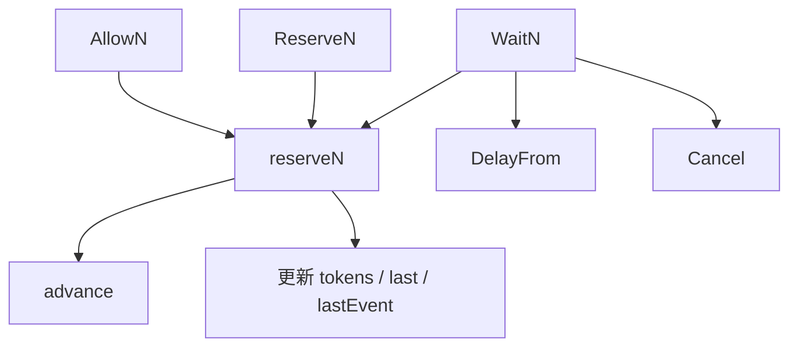
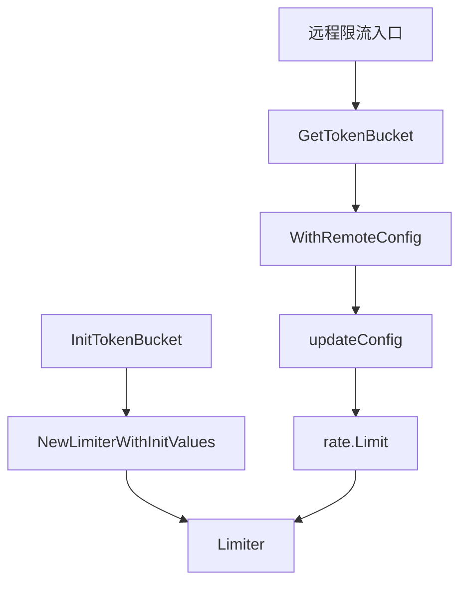

# Local Rate Limiting

## 模块概览

`rate` 包实现本地令牌桶限流器，核心类型是 `Limiter`。它控制事件发生频率：以 `limit` 指定的速率补充令牌，以 `burst` 限制瞬时可消费的最大令牌数。

该模块主要服务于本地限流逻辑，也被 `token/token_bucket.go` 封装成更高层的 token bucket。远程限流、同步和 UDP 预留等流程会通过 `GetTokenBucket`、`WithRemoteConfig`、`updateConfig` 最终更新或创建这里的 `Limiter`。

## 核心模型

`Limit` 表示每秒允许的事件数：

```go
type Limit float64
```

常用构造方式：

```go
lim := rate.NewLimiter(rate.Every(100*time.Millisecond), 10)
```

其中：

- `Every(interval)` 将“事件之间的最小间隔”转换为每秒速率。
- `Every(100*time.Millisecond)` 等价于每秒 10 个令牌。
- `Inf` 表示无限速率，所有请求都会被允许，`burst` 会被忽略。
- `Limit(0)` 不产生令牌，因此会拒绝所有需要令牌的请求。

`Limiter` 内部字段：

```go
type Limiter struct {
	limit Limit
	burst int64

	mu     sync.Mutex
	tokens float64
	last   time.Time

	lastEvent       time.Time
	lastMetricsTime int64
}
```

字段含义：

- `limit`：令牌补充速率，单位是 token/s。
- `burst`：桶容量，也是单次 `AllowN`、`ReserveN`、`WaitN` 可请求的最大令牌数。
- `tokens`：当前可用令牌数，可为负数，表示已经预支了未来令牌。
- `last`：上一次计算令牌补充的时间。
- `lastEvent`：最近一次已发生或已预留的限流事件时间，用于取消预留时回滚状态。
- `lastMetricsTime`：用于指标采样节流，`CheckMetricsTime` 每 10 秒返回一次 `true`。

## 令牌补充机制

令牌补充由 `advance(now)` 计算，但不会直接修改 `Limiter` 状态：

```go
func (lim *Limiter) advance(now time.Time) (newNow time.Time, newLast time.Time, newTokens float64)
```

执行逻辑：

1. 读取 `lim.last`。
2. 如果调用方传入的 `now` 早于 `last`，将 `last` 回退到 `now`，避免时间倒退导致负补充。
3. 计算经过时间 `elapsed := now.Sub(last)`。
4. 使用 `limit.tokensFromDuration(elapsed)` 计算新增令牌。
5. 将 `tokens` 截断到 `burst` 上限。
6. 返回计算后的状态，由调用方决定是否写回。

两个换算函数负责速率和时间之间的转换：

```go
func (limit Limit) tokensFromDuration(d time.Duration) float64
func (limit Limit) durationFromTokens(tokens float64) time.Duration
```

`tokensFromDuration` 用于“经过一段时间能补多少令牌”，`durationFromTokens` 用于“缺少若干令牌需要等待多久”。

## 三种主要消费方式

`Limiter` 提供三类消费接口，语义不同：

| 方法 | 无令牌时行为 | 适用场景 |
| --- | --- | --- |
| `Allow` / `AllowN` | 立即返回 `false` | 超限请求可直接丢弃 |
| `Reserve` / `ReserveN` | 返回未来可执行时间 | 调用方自己等待或调度 |
| `Wait` / `WaitN` | 阻塞直到可执行或 `context` 取消 | 请求必须执行，但可等待 |

它们都通过内部方法 `reserveN` 实现核心判断。



## `Allow` 与 `AllowN`

```go
func (lim *Limiter) Allow() bool
func (lim *Limiter) AllowN(now time.Time, n int64) bool
```

`Allow()` 是 `AllowN(time.Now(), 1)` 的简写。

`AllowN` 用于“能执行就执行，不能执行就放弃”的场景。它调用：

```go
lim.reserveN(now, n, 0).ok
```

这里 `maxFutureReserve` 为 `0`，所以只有无需等待的请求才会成功。若令牌不足，即使未来可以补齐，也会返回 `false`。

典型模式：

```go
if !lim.Allow() {
	return
}

doWork()
```

注意：`AllowN` 成功后会立即扣除令牌。如果后续只使用了一部分令牌，可以用 `RestoreN` 归还未使用部分。

## `Reserve`、`ReserveN` 与 `Reservation`

```go
func (lim *Limiter) Reserve() *Reservation
func (lim *Limiter) ReserveN(now time.Time, n int64) *Reservation
```

`ReserveN` 会尝试预留未来令牌，并返回 `Reservation`：

```go
type Reservation struct {
	ok        bool
	lim       *Limiter
	tokens    int64
	timeToAct time.Time
	limit     Limit
}
```

调用方通过以下方法检查和使用预留结果：

```go
func (r *Reservation) OK() bool
func (r *Reservation) Delay() time.Duration
func (r *Reservation) DelayFrom(now time.Time) time.Duration
func (r *Reservation) Cancel()
func (r *Reservation) CancelAt(now time.Time)
```

示例：

```go
r := lim.ReserveN(time.Now(), 1)
if !r.OK() {
	return
}

time.Sleep(r.Delay())
doWork()
```

`ReserveN` 的等待上限是 `InfDuration`，因此只要 `n <= burst`，通常可以预留成功。预留成功后，`tokens` 可能变成负数，表示已经占用了未来补充的令牌。

## `Wait` 与 `WaitN`

```go
func (lim *Limiter) Wait(ctx context.Context) error
func (lim *Limiter) WaitN(ctx context.Context, n int64) error
```

`Wait()` 是 `WaitN(ctx, 1)` 的简写。

`WaitN` 的执行流程：

1. 如果 `n > burst` 且 `limit != Inf`，直接返回错误。
2. 如果 `ctx` 已取消，返回 `ctx.Err()`。
3. 如果 `ctx` 有 deadline，将 deadline 转换为最大可等待时间。
4. 调用 `reserveN(now, n, waitLimit)`。
5. 如果预留失败，返回 `rate: Wait(n=%d) would exceed context deadline`。
6. 如果无需等待，立即返回 `nil`。
7. 如果需要等待，创建 `time.Timer`。
8. 等待期间如果 `ctx` 取消，调用 `Reservation.Cancel()` 回滚预留，然后返回 `ctx.Err()`。

`WaitN` 适合请求不能丢弃、但可以受 `context.Context` 控制等待时间的路径。

## `reserveN` 的状态更新

`reserveN` 是限流判断的核心：

```go
func (lim *Limiter) reserveN(now time.Time, n int64, maxFutureReserve time.Duration) Reservation
```

核心逻辑：

1. 加锁保护 `Limiter` 状态。
2. 如果 `limit == Inf`，直接返回成功预留，执行时间为 `now`。
3. 调用 `advance(now)` 计算当前可用令牌。
4. 扣除请求令牌：`tokens -= float64(n)`。
5. 如果扣除后 `tokens < 0`，用 `durationFromTokens(-tokens)` 计算等待时间。
6. 判断是否允许：
   - `n <= lim.burst`
   - `waitDuration <= maxFutureReserve`
7. 成功时写回：
   - `lim.last = now`
   - `lim.tokens = tokens`
   - `lim.lastEvent = r.timeToAct`
8. 失败时恢复 `lim.last = last`，不扣令牌。

`AllowN`、`ReserveN`、`WaitN` 的差异主要来自传入的 `maxFutureReserve`：

- `AllowN` 传 `0`，不允许等待。
- `ReserveN` 传 `InfDuration`，允许无限期预留。
- `WaitN` 根据 `context` deadline 传入最大等待时间。

## 取消预留

`Reservation.Cancel()` 调用 `CancelAt(time.Now())`。

```go
func (r *Reservation) CancelAt(now time.Time)
```

取消预留时会尽量恢复令牌，但不是简单地把 `r.tokens` 全部加回去，因为在该预留之后可能已经有其他预留发生。

关键计算：

```go
restoreTokens := float64(r.tokens) - r.limit.tokensFromDuration(r.lim.lastEvent.Sub(r.timeToAct))
```

含义是：从当前最新事件 `lastEvent` 到本次预留的 `timeToAct` 之间，可能存在后续预留占用的令牌，这部分不能恢复。

取消不会生效的情况：

- `r.ok == false`
- `lim.limit == Inf`
- `r.tokens == 0`
- `r.timeToAct.Before(now)`，也就是预留时间已经过去

如果本次取消的是最新事件，还会尝试回退 `lim.lastEvent`：

```go
prevEvent := r.timeToAct.Add(r.limit.durationFromTokens(float64(-r.tokens)))
```

这让后续预留可以更早执行。

## 归还令牌：`Restore` 与 `RestoreN`

```go
func (lim *Limiter) Restore()
func (lim *Limiter) RestoreN(n int64)
```

`Restore()` 是 `RestoreN(1)` 的简写。

内部实现：

```go
func (lim *Limiter) restoreN(n int64) {
	lim.mu.Lock()
	tokens := lim.tokens + float64(n)
	if burst := float64(lim.burst); tokens > burst {
		tokens = burst
	}
	lim.tokens = tokens
	lim.mu.Unlock()
}
```

该能力是本模块相对标准令牌桶实现的扩展，适用于 `AllowN` 成功后只消费了部分令牌的场景。

使用约束很重要：

- 只应在 `AllowN` 成功后调用。
- 应立即调用，避免时间推进后破坏限流精度。
- 归还后令牌数最多恢复到 `burst`。

## 尽力获取：`AllowAtMostN`

```go
func (lim *Limiter) AllowAtMostN(n int64) int64
```

`AllowAtMostN` 会尝试最多获取 `n` 个令牌，并返回实际获取数量。

行为：

- `limit == Inf` 时直接返回 `n`。
- 当前令牌小于 `0` 时返回 `0`。
- 当前令牌不足 `n` 时返回 `floor(tokens)`。
- 成功获取后写回：
  - `lim.last = now`
  - `lim.tokens = tokens - float64(got)`
  - `lim.lastEvent = now`

该方法适合批处理或降级场景：调用方愿意处理部分请求，而不是全量失败。

## 只检查是否限流：`IsThrottled`

```go
func (lim *Limiter) IsThrottled(n int64) bool
```

`IsThrottled` 用于判断当前请求是否会被限流，但不修改 `tokens`、`last` 或 `lastEvent`。

判断规则：

- `limit == Inf` 返回 `false`。
- `n > burst` 返回 `true`。
- 调用 `advance(time.Now())` 计算当前可用令牌。
- 如果 `tokens < float64(n)` 返回 `true`。

它适合观测、预判或指标路径，不应替代真正的消费方法。

## 动态配置

`Limiter` 支持运行时调整速率和桶容量：

```go
func (lim *Limiter) SetLimit(newLimit Limit)
func (lim *Limiter) SetLimitAt(now time.Time, newLimit Limit)
func (lim *Limiter) SetBurst(newBurst int64)
```

`SetLimitAt` 会先调用 `advance(now)`，把旧速率下已经产生的令牌结算到当前时间，再写入新的 `limit`。

```go
now, _, tokens := lim.advance(now)

lim.last = now
lim.tokens = tokens
lim.limit = newLimit
```

这避免了直接切换速率导致历史时间段被错误地按新速率结算。

`SetBurst` 只更新 `burst`，不会主动裁剪当前 `tokens`。下一次 `advance` 或消费路径会根据新的 `burst` 截断令牌。

## 状态读取方法

模块提供几个读取状态的方法：

```go
func (lim *Limiter) Limit() Limit
func (lim *Limiter) Last() time.Time
func (lim *Limiter) Tokens() float64
func (lim *Limiter) Burst() int64
func (lim *Limiter) CheckMetricsTime() bool
```

其中 `Limit`、`Last`、`Tokens` 使用互斥锁保护读取。

`Burst` 直接返回 `lim.burst`，没有加锁；如果与 `SetBurst` 并发使用，需要注意数据竞争风险。

`CheckMetricsTime` 也没有加锁，它每 10 秒更新一次 `lastMetricsTime` 并返回 `true`，适合低精度指标采样控制，但不适合作为严格并发安全状态。

## 初始化方式

常规初始化：

```go
lim := rate.NewLimiter(rate.Limit(100), 200)
```

`NewLimiter` 只设置 `limit` 和 `burst`：

```go
func NewLimiter(r Limit, b int64) *Limiter {
	return &Limiter{
		limit: r,
		burst: b,
	}
}
```

虽然 `tokens` 初始为 `0`，但 `last` 也是零值时间。首次调用 `advance(time.Now())` 时会计算从零值时间到当前时间的补充量，并被截断到 `burst`，因此新建限流器首次使用时表现为满桶。

带初始状态初始化：

```go
func NewLimiterWithInitValues(r Limit, b int64, last time.Time, tokens float64) *Limiter
```

该函数用于从外部状态恢复限流器，例如 `token/token_bucket.go` 的 `InitTokenBucket` 会调用它创建带 `last` 和 `tokens` 的本地桶。

## 与代码库其他模块的关系

`rate` 包本身不依赖业务模块；它只依赖 Go 标准库的 `context`、`fmt`、`math`、`sync` 和 `time`。

外部模块主要通过 `token/token_bucket.go` 使用它：

- `InitTokenBucket` 调用 `NewLimiterWithInitValues` 恢复本地桶状态。
- `getFallbackLimiter` 调用 `Limit` 和 `NewLimiter` 创建兜底限流器。
- `updateConfig` 使用 `Limit` 更新远程配置下发的限流速率。
- `RateLimit`、`Sync`、`handleReserveN` 等流程通过 `GetTokenBucket -> WithRemoteConfig -> updateConfig -> Limit` 间接影响本地限流器配置。

简化关系如下：



## 贡献时的注意事项

修改该模块时应重点关注状态一致性：

- `reserveN` 是 `AllowN`、`ReserveN`、`WaitN` 的共同核心，修改它会同时影响丢弃、预留和阻塞等待三种模式。
- `tokens` 可以为负数，这是预留未来令牌的正常状态，不应简单假设其非负。
- `lastEvent` 只在预留和取消逻辑中有意义，改动 `CancelAt` 时需要考虑后续预留已经占用的令牌。
- `SetLimitAt` 必须先按旧速率结算令牌，再更新 `limit`。
- `RestoreN` 会牺牲一定精度，只应服务于“刚刚成功获取令牌但未全部使用”的路径。
- 并发安全主要依赖 `lim.mu`，新增读写 `Limiter` 状态的方法应默认加锁，除非明确接受非严格一致性。