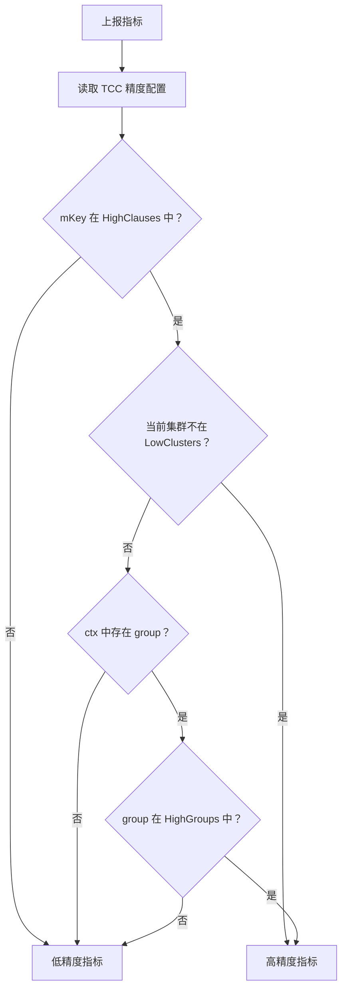

# Metrics

## Metrics 模块

`metrics` 模块集中封装 Harden 服务的指标初始化、打点上报和精度选择逻辑。调用方不直接操作 `code.byted.org/gopkg/metrics/v4` 的客户端，而是通过 `EmitCounter`、`EmitTimer`、`EmitStore`、`CtxEmitCounter`、`CtxEmitTimer`、`CtxEmitStore`、`CtxEmitRateCounter` 这些函数上报指标。

模块文件位于 `metrics/metrics.go`，核心职责包括：

- 初始化高精度和低精度两套指标客户端。
- 根据 TCC 精度配置、当前集群和请求上下文选择指标客户端。
- 统一指标前缀、后缀、tag 名称和 tag 格式。
- 将上报失败降级为 `logs.Warn`，避免指标系统影响主流程。

## 初始化流程

服务启动时，`main` 会调用 `InitMetrics()` 初始化全局指标对象：

```go
func InitMetrics() {
	globalTags := []metrics.T{{Name: ServerCluster, Value: env.Cluster()}}
	tags := []string{Group, Name, Preferred, Fallback, Mode, Status, TargetIp, Server, Flag, ReserveFlag, SyncDomains, Source, Function, Version, FromPSM}

	client, err := metrics.NewClient("", metrics.SetTenant(config.C.Tenant), metrics.SetGlobalTags(globalTags...), metrics.SetTimeInterval(30), metrics.SetDiscardInvalidTag())
	// ...
	lowPrecisionMetrics, err = client.NewMetricWithOps(serverPrefix, tags)

	client, err = metrics.NewClient("", metrics.SetTenant(config.C.Tenant), metrics.SetGlobalTags(globalTags...), metrics.SetTimeInterval(1), metrics.SetDiscardInvalidTag())
	// ...
	highPrecisionMetrics, err = client.NewMetricWithOps(serverPrefix, tags)
}
```

初始化时会创建两套 `metrics.Metric`：

| 变量 | 时间间隔 | 用途 |
| --- | --- | --- |
| `lowPrecisionMetrics` | `30` 秒 | 默认低精度上报，降低指标量和成本 |
| `highPrecisionMetrics` | `1` 秒 | 针对关键指标、关键集群或关键 group 的高精度上报 |

两套指标都使用相同的指标前缀：

```go
const serverPrefix = "toutiao.service.ratelimit.server"
```

并携带全局 tag：

```go
metrics.T{Name: ServerCluster, Value: env.Cluster()}
```

如果客户端或 metric 创建失败，`InitMetrics()` 会直接 `panic`。因此该函数应在服务启动早期调用，且应在业务打点发生前完成。

## 指标命名与 tag

模块定义了一组指标 key 和 tag 名称常量，供调用方复用，避免硬编码字符串分散在业务代码中。

常用指标 key 包括：

```go
Panic
Throughput
Latency
Concurrent
ConThroughput
ConLatency
Bill
```

其中：

```go
ConThroughput = Concurrent + "." + Throughput
ConLatency    = Concurrent + "." + Latency
```

常用 tag 名称包括：

```go
Group
Name
Preferred
Fallback
Mode
Status
TargetIp
Server
Flag
ReserveFlag
SyncDomains
Source
Function
Version
ServerCluster
FromPSM
```

`InitMetrics()` 中注册的可用 tag 列表是：

```go
[]string{
	Group, Name, Preferred, Fallback, Mode, Status,
	TargetIp, Server, Flag, ReserveFlag, SyncDomains,
	Source, Function, Version, FromPSM,
}
```

`ServerCluster` 不是普通业务 tag，而是通过 `SetGlobalTags` 自动挂到所有指标上。

## tag 构造规则

调用方通过变长字符串参数传入 tag：

```go
metrics.EmitCounter(metrics.Throughput, 1,
	metrics.Group, group,
	metrics.Name, name,
	metrics.Status, status,
)
```

内部由 `FormTags(tagPairs ...string)` 转换为 `[]metrics.T`：

```go
func FormTags(tagPairs ...string) []metrics.T {
	tagsLen := len(tagPairs) / 2
	tags := make([]metrics.T, 0, tagsLen)
	if tagsLen > 0 {
		for i := 0; i < tagsLen; i++ {
			keyIndex := i * 2
			if tagName := tagPairs[keyIndex]; len(tagName) > 0 {
				if len(tagPairs[keyIndex+1]) == 0 {
					tagPairs[keyIndex+1] = "nil"
				}
				tags = append(tags, metrics.T{Name: tagName, Value: tagPairs[keyIndex+1]})
			}
		}
	}
	return tags
}
```

需要注意以下行为：

- `tagPairs` 按 `key, value, key, value` 成对解析。
- 如果传入奇数个字符串，最后一个字符串会被忽略。
- tag 名为空字符串时，该 tag 会被跳过。
- tag 值为空字符串时，会被改写为 `"nil"`。
- `FormTags` 会修改 `tagPairs[keyIndex+1]` 的值；在普通变长参数调用中影响很小，但调用方不应依赖原始切片内容不变。

## 上报 API

模块提供两类 API：不带上下文的快捷函数，以及带上下文的精度感知函数。

### 快捷函数

```go
func EmitCounter(mKey string, cnt int64, tagPairs ...string)
func EmitTimer(mKey string, t0 time.Time, tagPairs ...string)
func EmitStore(mKey string, cnt int, tagPairs ...string)
```

这些函数内部使用 `context.TODO()` 调用对应的 `Ctx*` 函数：

```go
func EmitCounter(mKey string, cnt int64, tagPairs ...string) {
	CtxEmitCounter(context.TODO(), mKey, cnt, tagPairs...)
}
```

适合没有请求上下文、或者不需要按 group 做高精度选择的后台任务。例如 syncer、token bucket、addr 更新等路径中会使用这些函数。

### 上下文感知函数

```go
func CtxEmitCounter(ctx context.Context, mKey string, cnt int64, tagPairs ...string)
func CtxEmitTimer(ctx context.Context, mKey string, t0 time.Time, tagPairs ...string)
func CtxEmitStore(ctx context.Context, mKey string, cnt int, tagPairs ...string)
func CtxEmitRateCounter(ctx context.Context, mKey string, cnt int64, tagPairs ...string)
```

这些函数都会执行同样的基本流程：

1. 调用 `FormTags` 构造 tag。
2. 调用 `GetMetrics(ctx, mKey)` 选择高精度或低精度 metric。
3. 使用 `metrics.WithSuffix(mKey)` 指定指标后缀。
4. 调用底层 metrics SDK 上报。
5. 上报失败时写 `logs.Warn`，不向调用方返回错误。

不同函数对应不同的底层上报类型：

| 函数 | 底层调用 | 语义 |
| --- | --- | --- |
| `CtxEmitCounter` | `IncrCounter(int(cnt))` | 计数器累加 |
| `CtxEmitTimer` | `Observe(int(costs))` | 记录耗时分布 |
| `CtxEmitStore` | `Store(cnt)` | 存储当前值 |
| `CtxEmitRateCounter` | `Incr(int(cnt))` | rate 类型累加 |

`CtxEmitTimer` 接收起始时间 `t0`，内部计算从 `t0` 到当前时间的耗时：

```go
costs := time.Since(t0).Nanoseconds() / 1000
```

因此 timer 指标单位是微秒。

## 精度选择逻辑

`GetMetrics(ctx, mKey)` 是模块最关键的函数。它根据 TCC 配置、当前集群和上下文中的 group 决定使用高精度还是低精度 metric。

```go
func GetMetrics(ctx context.Context, mKey string) metrics.Metric {
	precisionConfig := tcc.GetPrecisionConfig(ctx)
	if precisionConfig.HighClauses == nil || !precisionConfig.HighClauses[mKey] {
		return lowPrecisionMetrics
	}

	if precisionConfig.LowClusters == nil || !precisionConfig.LowClusters[env.Cluster()] {
		return highPrecisionMetrics
	}
	group := ctx.Value("group")
	if group == nil {
		return lowPrecisionMetrics
	}
	if precisionConfig.HighGroups != nil && precisionConfig.HighGroups[group.(string)] {
		return highPrecisionMetrics
	}
	return lowPrecisionMetrics
}
```

判断顺序如下：



可以理解为：

- 默认全部使用低精度。
- 只有 `HighClauses[mKey] == true` 的指标才有机会进入高精度。
- 如果当前集群不在 `LowClusters` 中，这类指标直接使用高精度。
- 如果当前集群在 `LowClusters` 中，则还需要上下文里有 `"group"`，并且该 group 在 `HighGroups` 中，才使用高精度。
- 其他情况全部回退到低精度。

这里的 `"group"` 是通过 `ctx.Value("group")` 读取的字符串键。代码中使用了 `group.(string)` 强制类型断言，因此如果调用方放入了非字符串值，会触发 panic。需要按现有约定写入字符串类型 group。

## 与 TCC 的关系

`GetMetrics` 依赖 `tcc.GetPrecisionConfig(ctx)` 获取精度配置。调用链通常是：

```text
业务入口 -> CtxEmit* / Emit* -> GetMetrics -> tcc.GetPrecisionConfig -> Precision
```

从执行流可以看到，UDP 服务、远程限流、并发控制、同步器、token 初始化等路径都会通过该模块进入 TCC 精度配置：

- `Serve` 通过 `EmitCounter` 进入 `GetMetrics`。
- `handleReserveN` 通过 `EmitTimer` 进入 `GetMetrics`。
- `InitAllInitInfos` 通过 `EmitCounter` 进入 `GetMetrics`。
- `batchedSync` 通过 `EmitCounter` 进入 `GetMetrics`。
- `ConEnter` 通过 `CtxEmitCounter` 进入 `GetMetrics`。

这意味着精度配置不是单点业务逻辑，而是影响服务内大部分指标上报路径的全局策略。

## 与业务模块的连接

`metrics` 模块被多个核心路径调用：

- `udpserver/server.go`：`Serve`、`handleRequest`、`handleReserveN` 上报服务请求量、耗时和存储值。
- `remote/rateLimit.go`、`remote/v2/rate_limit.go`：限流请求通过 `CtxEmitCounter` 和 `CtxEmitRateCounter` 上报吞吐、状态等指标。
- `remote/isThrottled.go`：通过 `CtxEmitTimer` 上报判断耗时。
- `conRemote/enter.go`、`conRemote/leave.go`、`conRemote/concurrentBase.go`：并发控制路径上报进入、离开、当前并发值和耗时。
- `syncer/*`：同步器通过 `EmitCounter`、`EmitStore` 上报同步状态和统计值。
- `token/token_bucket.go`、`tokens/group.go`：token bucket 和 group 初始化路径上报初始化、更新和存储类指标。
- `addr/addr.go`、`conRemote/config.go`：配置和地址更新路径上报更新结果。

这种设计让业务模块只关心“上报什么指标”和“带什么 tag”，不需要关心指标客户端、tenant、时间粒度或高低精度切换。

## 典型使用方式

上报计数器：

```go
metrics.EmitCounter(metrics.Throughput, 1,
	metrics.Group, group,
	metrics.Name, name,
	metrics.Status, status,
)
```

在有请求上下文时上报计数器：

```go
metrics.CtxEmitCounter(ctx, metrics.Throughput, 1,
	metrics.Group, group,
	metrics.Name, name,
)
```

上报耗时：

```go
start := time.Now()

// 执行业务逻辑

metrics.CtxEmitTimer(ctx, metrics.Latency, start,
	metrics.Group, group,
	metrics.Name, name,
	metrics.Status, status,
)
```

上报当前值：

```go
metrics.EmitStore(metrics.Concurrent, current,
	metrics.Group, group,
	metrics.Name, name,
)
```

上报 rate counter：

```go
metrics.CtxEmitRateCounter(ctx, metrics.Throughput, 1,
	metrics.Group, group,
	metrics.Source, source,
)
```

## 贡献注意事项

新增指标时优先复用已有 key 和 tag 常量。如果确实需要新增 tag，需要同时考虑 `InitMetrics()` 中传给 `NewMetricWithOps` 的 tag 白名单，否则新 tag 可能被 SDK 视为无效并丢弃。

新增上报点时应优先选择 `CtxEmit*` 版本，尤其是请求链路、限流链路和并发控制链路。这样 `GetMetrics` 可以基于 `ctx` 中的 group 做高精度选择。没有上下文的后台任务再使用 `Emit*` 快捷函数。

计时指标应传入操作开始前记录的 `time.Time`，不要传入已经计算好的耗时；`CtxEmitTimer` 会统一转换为微秒并用 `Observe` 上报。

指标上报错误不会中断业务流程，只会写 warn 日志。调用方不需要处理返回值，但排查指标缺失时需要关注日志中的这些前缀：

```text
[harden]: CtxEmitCounter
[harden]: GroupEmitTimer
[harden]: CtxEmitRateCounter
```

`GetMetrics` 对 `ctx.Value("group")` 使用字符串断言。需要传递 group 时，应保证 context 中 `"group"` 对应的是 `string`，并和 tag 中的 `metrics.Group` 保持语义一致。