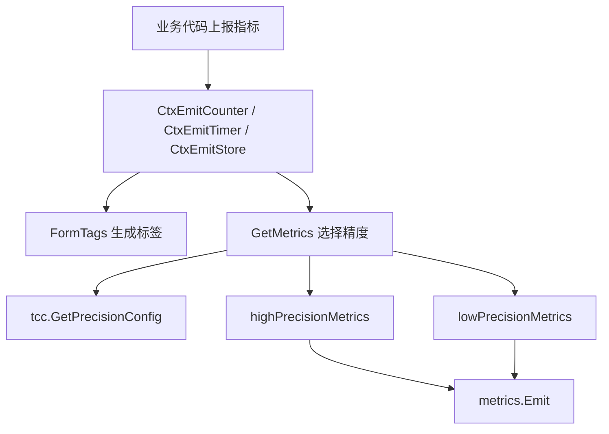

# Observability

## 可观测性模块

该模块负责 Harden 服务的指标初始化、指标上报和按配置选择采样精度。代码集中在 `metrics` 包，另有 `middleware.GroupMiddle` 用于把 HTTP 请求中的 `group` 查询参数写入 Hertz 请求上下文。

## 核心职责

`metrics/metrics.go` 提供统一的指标上报入口：

- 初始化高精度和低精度两个 `metrics.Metric` 实例：`InitMetrics`
- 根据 TCC 精度配置选择上报通道：`GetMetrics`
- 规范化标签参数：`FormTags`
- 上报计数、耗时、瞬时值和 rate counter：
  - `EmitCounter` / `CtxEmitCounter`
  - `EmitTimer` / `CtxEmitTimer`
  - `EmitStore` / `CtxEmitStore`
  - `CtxEmitRateCounter`

所有指标使用统一前缀：

```go
const serverPrefix = "toutiao.service.ratelimit.server"
```

最终指标名通过 `metrics.WithSuffix(mKey)` 追加具体指标 key，例如 `throughput`、`latency`、`concurrent.throughput`。

## 初始化流程

`main` 调用 `InitMetrics()` 完成指标客户端初始化。该函数创建两个指标客户端：

- 低精度客户端：`metrics.SetTimeInterval(30)`
- 高精度客户端：`metrics.SetTimeInterval(1)`

二者都使用相同的 tenant、全局标签和可选标签集合：

```go
globalTags := []metrics.T{{Name: ServerCluster, Value: env.Cluster()}}
tags := []string{
    Group, Name, Preferred, Fallback, Mode, Status, TargetIp,
    Server, Flag, ReserveFlag, SyncDomains, Source, Function,
    Version, FromPSM,
}
```

`ServerCluster` 是全局标签，值来自 `env.Cluster()`。其余标签通过 `WithTags` 在每次上报时附加。

初始化失败会直接 `panic(err)`，因此 `InitMetrics` 应在服务启动早期执行，避免运行期才发现指标客户端不可用。

## 精度选择逻辑

`GetMetrics(ctx, mKey)` 是模块中最关键的分流函数。每次上下文版上报函数都会调用它，根据 TCC 配置决定使用 `highPrecisionMetrics` 还是 `lowPrecisionMetrics`。

决策顺序如下：

1. 调用 `tcc.GetPrecisionConfig(ctx)` 获取精度配置。
2. 如果 `HighClauses` 为空，或当前指标 `mKey` 不在 `HighClauses` 中，使用低精度。
3. 如果 `LowClusters` 为空，或当前 `env.Cluster()` 不在 `LowClusters` 中，使用高精度。
4. 从 `ctx.Value("group")` 读取 group。
5. 如果上下文中没有 group，使用低精度。
6. 如果 `HighGroups[group]` 为 true，使用高精度。
7. 其他情况使用低精度。



这个逻辑意味着：高精度不是单纯由指标名决定，还受到集群和 group 的共同控制。调用方如果希望 `GetMetrics` 能按 group 做精度分流，需要确保传入的 `context.Context` 中包含 `"group"` 值。

## 指标上报 API

### `EmitCounter` 和 `CtxEmitCounter`

`EmitCounter(mKey string, cnt int64, tagPairs ...string)` 是无上下文便捷方法，内部使用 `context.TODO()` 调用 `CtxEmitCounter`。

`CtxEmitCounter` 用于普通计数器累加：

```go
metrics.GetMetrics(ctx, mKey).
    WithTags(tags...).
    Emit(metrics.WithSuffix(mKey).IncrCounter(int(cnt)))
```

典型调用方包括：

- `udpserver.Serve`
- `remote.RateLimit`
- `remote/v2.RateLimit`
- `syncer` 同步流程
- `token.GetLimiter`
- `conRemote.ConEnter`
- `addr.updateAddrs`

### `EmitTimer` 和 `CtxEmitTimer`

`EmitTimer(mKey string, t0 time.Time, tagPairs ...string)` 使用 `context.TODO()` 调用 `CtxEmitTimer`。

`CtxEmitTimer` 计算从 `t0` 到当前时间的耗时，并以微秒为单位上报：

```go
costs := time.Since(t0).Nanoseconds() / 1000
metrics.WithSuffix(mKey).Observe(int(costs))
```

它适合包裹请求处理、远程调用、并发控制等路径，例如：

- `udpserver.handleRequest`
- `remote.IsThrottled`
- `remote.RateLimit`
- `conRemote.ConEnter`
- `conRemote.ConLeave`
- `conRemote.clearUuids`

### `EmitStore` 和 `CtxEmitStore`

`EmitStore(mKey string, cnt int, tagPairs ...string)` 使用 `context.TODO()` 调用 `CtxEmitStore`。

`CtxEmitStore` 使用 `Store(cnt)` 上报当前值，适合表示某个瞬时状态或容量类指标，例如：

- `syncer.stats`
- `token.GetLimiter`
- `conRemote.conInfo`

### `CtxEmitRateCounter`

`CtxEmitRateCounter` 使用 `Incr(int(cnt))`，区别于 `CtxEmitCounter` 的 `IncrCounter(int(cnt))`。当前调用方包括 `remote.RateLimit`，用于 rate 类型计数指标。

## 标签构造规则

所有 `CtxEmit*` 函数都会先调用 `FormTags(tagPairs...)`。

`FormTags` 接收扁平的字符串参数，按 key/value 两两配对：

```go
metrics.CtxEmitCounter(
    ctx,
    metrics.Throughput,
    1,
    metrics.Group, group,
    metrics.Name, name,
    metrics.Status, status,
)
```

处理规则：

- 参数长度按 `len(tagPairs) / 2` 截断，落单的最后一个字符串会被忽略。
- 空 tag name 会被跳过。
- 空 tag value 会被替换为字符串 `"nil"`。
- 返回值类型是 `[]metrics.T`。

因为 `FormTags` 会原地修改空 value 对应的 `tagPairs[keyIndex+1]`，调用方不要依赖传入切片在调用后的原始内容。

## 指标名和标签常量

模块定义了一组指标 key 常量，调用方应优先复用这些常量，避免手写字符串：

```go
const (
    Panic         = "panic"
    Throughput    = "throughput"
    Latency       = "latency"
    Concurrent    = "concurrent"
    ConThroughput = Concurrent + "." + Throughput
    ConLatency    = Concurrent + "." + Latency
    Bill          = "bill"
)
```

标签常量包括：

```go
const (
    Group       = "group"
    Name        = "name"
    Preferred   = "preferred"
    Fallback    = "fallback"
    Mode        = "mode"
    Status      = "status"
    TargetIp    = "targetIp"
    Server      = "server"
    Flag        = "flag"
    ReserveFlag = "reserveFlag"
    SyncDomains = "syncDomains"
    Source      = "source"
    Function    = "function"
    Version     = "version"
    FromPSM     = "fromPSM"
)
```

`ServerCluster` 不需要调用方手动传入，它在 `InitMetrics` 中作为全局标签自动添加。

## 请求 group 中间件

`middleware/group_middleware.go` 提供 `GroupMiddle()`：

```go
func GroupMiddle() hertz.HandlerFunc {
    return func(c *hertz.RequestContext) {
        c.Set("group", c.Query("group"))
    }
}
```

`main` 会接入该中间件。它从请求 query 参数读取 `group`，并写入 Hertz 的 `RequestContext`。

需要注意的是，`GetMetrics` 读取的是标准 `context.Context`：

```go
group := ctx.Value("group")
```

因此，只有当业务代码把 Hertz 上下文中的 `"group"` 转移到传入 `CtxEmit*` 的 `context.Context` 时，精度分流才会按 group 生效。直接调用 `EmitCounter`、`EmitTimer`、`EmitStore` 会使用 `context.TODO()`，不会携带 group。

## 与业务模块的连接

可观测性模块被多个核心路径调用：

- UDP 服务入口：`udpserver.Serve`、`udpserver.handleRequest`
- 限流接口：`remote.RateLimit`、`remote/v2.RateLimit`、`remote.IsThrottled`
- 并发控制：`conRemote.ConEnter`、`conRemote.ConLeave`、`conRemote.conInfo`
- 同步流程：`syncer`、`syncer/v2`
- token bucket：`token.GetLimiter`、`token.asyncUpdate`
- 配置和地址更新：`conRemote.updateConfig`、`conRemote.getRemoteConfig`、`addr.updateAddrs`

典型执行路径是：

```text
业务函数
→ EmitCounter / CtxEmitCounter
→ FormTags
→ GetMetrics
→ tcc.GetPrecisionConfig
→ highPrecisionMetrics 或 lowPrecisionMetrics
→ metrics.Emit
```

跨模块调用中，`GetMetrics` 是指标模块与 TCC 配置模块的连接点。TCC 的 `Precision` 配置决定哪些指标、哪些集群、哪些 group 走高精度上报。

## 贡献注意事项

新增指标时，应优先复用已有常量；如果需要新指标 key 或 tag name，应在 `metrics/metrics.go` 中补充常量，并确认 `InitMetrics` 的 `tags` 列表包含该 tag。

新增业务埋点时，根据是否已有 `context.Context` 选择 API：

- 有上下文并且需要 group 精度分流：使用 `CtxEmitCounter`、`CtxEmitTimer`、`CtxEmitStore` 或 `CtxEmitRateCounter`
- 无上下文或不需要 group 分流：使用 `EmitCounter`、`EmitTimer`、`EmitStore`

耗时指标应在操作开始处保存 `time.Now()`，结束时传给 `CtxEmitTimer` 或 `EmitTimer`。该模块统一以微秒上报耗时，调用方不需要自行换算。