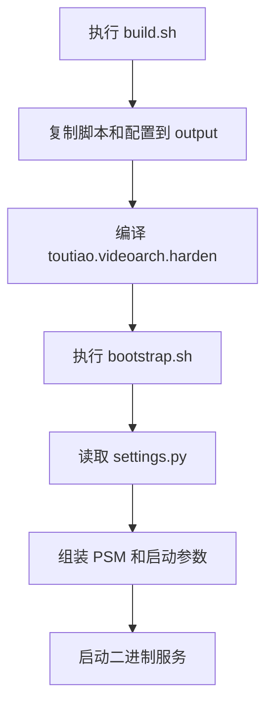

# Other

## Other 模块

`Other` 收纳了项目的工程脚本、运行配置、协议生成说明，以及若干基础能力包的测试用例。它不是单一业务链路模块，而是为主服务 `toutiao.videoarch.harden` 提供构建、启动、环境配置、限流、地址解析和一致性哈希等周边支撑。

## 主要内容

| 路径 | 作用 |
|---|---|
| `build.sh` | 构建二进制并组织 `output/` 产物目录 |
| `script/bootstrap.sh` | 运行时启动脚本，拼接 PSM、配置目录、日志目录和端口参数 |
| `script/settings.py` | 定义 `PRODUCT`、`SUBSYS`、`MODULE` 等启动元信息 |
| `conf/*.yml` | 不同机房、环境、业务后缀的运行配置 |
| `README.md` | UDP 协议生成约束说明 |
| `udpserver/protocol/gen_proto.sh` | 从 `payload.proto` 生成 Go protobuf 文件 |
| `consistent/*_test.go` | 一致性哈希包的行为测试和示例 |
| `rate/rate_test.go` | 令牌桶限流器的行为测试 |
| `token/token_bucket_test.go` | 业务级限流桶封装测试 |
| `addr/addr_test.go` | Consul 地址发现封装测试 |
| `tokens/group_test.go` | 全局 token bucket 初始化信息测试 |

## 构建与启动流程

`build.sh` 是本模块的构建入口。它固定构建目标名为 `toutiao.videoarch.harden`，并将运行所需文件复制到 `output/`：

```bash
export GO111MODULE=on

RUN_NAME="toutiao.videoarch.harden"

mkdir -p output output/conf output/bin
cp script/bootstrap.sh script/settings.py output
chmod +x output/bootstrap.sh
cp conf/* output/conf 2>/dev/null
go build -v -o output/bin/${RUN_NAME}
```

构建产物结构如下：

```text
output/
  bootstrap.sh
  settings.py
  conf/
  bin/
    toutiao.videoarch.harden
```

`script/bootstrap.sh` 负责运行时启动。它从 `settings.py` 读取：

```python
PRODUCT="toutiao"
SUBSYS="videoarch"
MODULE="harden"
APP_TYPE="binary"
PORT="9555"
```

然后组装服务名和二进制名：

```bash
SVC_NAME=${PRODUCT}.${SUBSYS}.${MODULE}
BinaryName=${PRODUCT}.${SUBSYS}.${MODULE}
```

最终执行：

```bash
exec $CURDIR/bin/${BinaryName} -psm=$SVC_NAME -conf-dir=$CONF_DIR -log-dir=$GIN_LOG_DIR
```

如果传入第二个参数，脚本会追加 `-port=$PORT`。在 `IS_HOST_NETWORK=1` 时，端口会从 `PORT0`、`PORT1`、`PORT2` 环境变量中派生，并根据 `REQUIRE_NGINX` 决定服务端口和调试端口。



## 配置文件组织

`conf/base.yml` 提供通用默认值：

```yaml
Worker: 30
Buffer: 10000
Tenant: videoarch.harden
```

其他配置文件按环境和业务后缀拆分，常见字段包括：

| 字段 | 含义 |
|---|---|
| `SyncTo` | 当前区域需要同步到的目标区域列表 |
| `TargetJamesCluster` | James SDK 目标集群 |
| `Tenant` | 租户名 |

例如生产环境区域同步配置：

```yaml
# conf/lf.prod.yml
SyncTo:
    - "hl"
    - "alinc2"
    - "lq"
```

单元测试或指定业务集群配置：

```yaml
# conf/lf.prod.unit_test.yml
TargetJamesCluster: "staging"
```

```yaml
# conf/lf.prod.default_tob.yml
TargetJamesCluster: "default_tob"
```

部分海外或特定区域配置中 `SyncTo` 为空，例如 `conf/maliva.prod.yml`、`conf/sg1.prod.yml`、`conf/useast2a.prod.yml`。这表示该环境不声明跨区域同步目标，调用方需要按空配置处理，而不是假设存在默认同步链路。

## UDP 协议生成约束

根目录 `README.md` 明确要求：

修改 UDP 协议时，应修改 `udpserver` 包下的 `payload.proto`，然后执行 `udpserver/protocol/gen_proto.sh` 生成 `payload.pb.go`，不要直接修改生成后的 `payload.pb.go`。

生成脚本实际执行：

```bash
protoc -I=$SRC_DIR --go_out=$DST_DIR $SRC_DIR/payload.proto
```

开发者需要保证本地或构建环境中可用 `protoc` 和 Go protobuf 插件。

## 一致性哈希测试覆盖

`consistent/consistent_test.go` 和 `consistent/example_test.go` 描述了 `consistent` 包对外暴露的核心 API：

| API | 测试中体现的行为 |
|---|---|
| `New()` | 创建一致性哈希环，默认 `NumberOfReplicas` 为 `20` |
| `Add(member)` | 添加节点，并为每个节点创建副本哈希 |
| `Remove(member)` | 移除节点及其副本 |
| `Get(key)` | 返回 key 命中的节点；空环返回 `ErrEmptyCircle` |
| `GetTwo(key)` | 返回两个不同节点；只有一个节点时第二个返回空字符串 |
| `GetN(key, n)` | 返回最多 `n` 个不重复节点 |
| `Set([]string)` | 用给定节点集合重建哈希环 |

测试中的关键内部状态包括 `circle`、`sortedHashes` 和 `count`。`TestAdd` 验证 `Add` 会让 `circle` 和 `sortedHashes` 按副本数增长，并保持 `sortedHashes` 有序。`TestRemove` 和 `TestRemoveNonExisting` 分别覆盖删除已有节点和删除不存在节点的情况。

`TestAddCollision` 专门覆盖 CRC32 哈希碰撞场景。它使用 `"abear"` 和 `"solidiform"` 两个会在副本 key 上产生碰撞的字符串，并验证不同添加顺序下 `Get` 结果一致。这说明实现需要保证碰撞处理具有确定性，不能依赖 map 遍历顺序。

`TestConcurrentGetSet` 同时运行多个 `Set` 和 `Get` goroutine，验证一致性哈希实现需要支持并发读写。维护该包时应特别关注锁粒度、内部切片替换和 map 更新的一致性。

示例用法：

```go
c := New()
c.Add("cacheA")
c.Add("cacheB")
c.Add("cacheC")

server, err := c.Get("user_mcnulty")
if err != nil {
    log.Fatal(err)
}
fmt.Println(server)
```

## 低层限流器测试覆盖

`rate/rate_test.go` 面向 `rate` 包中的令牌桶限流器。测试中使用的主要 API 包括：

| API | 作用 |
|---|---|
| `Limit` | 表示每秒令牌生成速率 |
| `Inf` | 无限速率 |
| `Every(interval)` | 将时间间隔转换为 `Limit` |
| `NewLimiter(limit, burst)` | 创建限流器 |
| `Allow()` | 尝试获取 1 个令牌 |
| `AllowN(t, n)` | 在指定时间尝试获取 `n` 个令牌 |
| `AllowAtMostN(n)` | 最多获取 `n` 个令牌，返回实际允许数量 |
| `WaitN(ctx, n)` | 阻塞等待令牌，受 `context.Context` 取消和超时控制 |
| `SetLimitAt(t, limit)` | 在指定时间调整速率 |
| `Restore()` | 归还最近消耗的令牌 |
| `reserveN(t, n, maxReserve)` | 内部预约令牌方法 |
| `Reservation.CancelAt(t)` | 取消预约并归还可恢复令牌 |

测试辅助函数体现了主要执行流：

```go
func run(t *testing.T, lim *Limiter, allows []allow) {
    for i, allow := range allows {
        ok := lim.AllowN(allow.t, allow.n)
        // 校验指定时间点是否允许获取令牌
    }
}
```

```go
func runReserve(t *testing.T, lim *Limiter, req request) *Reservation {
    return runReserveMax(t, lim, req, InfDuration)
}
```

```go
func runWait(t *testing.T, lim *Limiter, w wait) {
    start := time.Now()
    err := lim.WaitN(w.ctx, w.n)
    delay := time.Now().Sub(start)
    // 校验等待耗时和错误结果
}
```

这些测试重点覆盖以下行为：

| 场景 | 代表测试 |
|---|---|
| burst 上限 | `TestLimiterBurst1`、`TestLimiterBurst3` |
| 时间回退 | `TestLimiterJumpBack`、`TestReserveJumpBack` |
| 并发请求 | `TestSimultaneousRequests` |
| 长时间 QPS 近似 | `TestLongRunningQPS` |
| 预约与取消 | `TestSimpleReserve`、`TestCancelLast`、`TestCancelMulti` |
| 动态调整速率 | `TestReserveSetLimit`、`TestReserveSetLimitCancel` |
| 等待、取消、超时 | `TestWaitSimple`、`TestWaitCancel`、`TestWaitTimeout` |
| 无限速率 | `TestWaitInf` |
| 令牌恢复 | `TestRestore` |

维护 `Limiter` 时，最容易引入回归的点是 `tokens`、`last`、`lastEvent` 三者之间的关系。取消预约时并不总是完整归还请求的令牌数，测试中的 `TestCancel0Tokens`、`TestCancel1Token`、`TestCancelMulti` 覆盖了这种细节。

## 业务级 TokenBuckets

`token/token_bucket_test.go` 测试 `token` 包中的业务限流封装。它基于 `code.byted.org/videoarch/james-sdk/model` 中的 `model.LimiterConfig` 和 `model.Config` 配置限流规则。

核心入口包括：

| API | 作用 |
|---|---|
| `NewTokenBuckets(psm, options...)` | 创建业务限流桶集合 |
| `WithLocalConfig(config)` | 使用本地静态配置 |
| `WithRemoteConfig(fetch, interval)` | 周期性拉取远端配置 |
| `Allow(key)` | 判断指定 key 是否允许通过 |
| `IsThrottled(key, extra1, extra2, n)` | 判断指定 key 和请求量是否会被限流 |

测试中的配置构造：

```go
func testConfig() (*model.LimiterConfig, error) {
    return &model.LimiterConfig{Configs: map[string]*model.Config{
        "a":         {Qps: 1000, Burst: 20000},
        "b":         {Qps: 2, Burst: 2},
        "throttle":  {Qps: 10, Burst: 10},
        "throttle1": {Qps: 10},
    }}, nil
}
```

`TestAllow` 验证 `Qps: 2, Burst: 2` 的 key `"b"` 连续两次允许，第三次拒绝。`TestDefaultBurst` 验证当 `Burst` 缺省时会使用默认 burst；当 `Qps` 为 `0` 或负数时，`Allow` 返回 `false`。

`TestIsThrottled` 同时验证直接按请求量判断和实际消费令牌后的限流状态。测试里所有 metrics 相关函数都会通过 `mockey.Mock` 置空：

```go
mockey.Mock(metrics.EmitCounter).Return().Build()
mockey.Mock(metrics.EmitStore).Return().Build()
mockey.Mock(metrics.EmitTimer).Return().Build()
mockey.Mock(metrics.CtxEmitCounter).Return().Build()
mockey.Mock(metrics.CtxEmitStore).Return().Build()
mockey.Mock(metrics.CtxEmitTimer).Return().Build()
```

这说明 `TokenBuckets` 的正常路径会打点；写单测时如果不关心指标，应 mock 掉 `metrics` 包，避免测试依赖外部监控环境。

远端配置测试通过 `WithRemoteConfig(getFromEtcd, time.Minute)` 接入 etcd：

```go
func getFromEtcd() (*model.LimiterConfig, error) {
    defaultValue := "default"
    str, err := etcdutil.Get(etcdKey, defaultValue)
    if err != nil || str == defaultValue {
        return nil, nil
    }

    m := &model.LimiterConfig{}
    json.Unmarshal([]byte(str), &m)
    return m, nil
}
```

当 etcd 不存在配置或读取失败时，`getFromEtcd` 返回 `nil, nil`。调用方需要支持空配置结果。

## 地址发现与 Token 分组

`addr/addr_test.go` 使用：

```go
c := NewConsulAddr("toutiao.videoarch.video_data_access", "write")
fmt.Println(c.GetAddrs("1"))
```

这表明 `addr` 包封装了基于 Consul 的服务地址发现，并按参数 key 获取地址列表。测试多次调用 `GetAddrs`，覆盖相同 key 和不同 key 的重复查询行为。实现上通常需要关注缓存、一致性哈希或负载分配结果是否稳定。

`tokens/group_test.go` 调用：

```go
ans := GetAllInitInfos()
logs.Info("get all token buckets:/n%+v", ans)
```

`GetAllInitInfos` 用于获取所有已初始化 token bucket 的信息，适合排查启动后的限流配置加载状态。该测试只做日志输出，不做断言，因此更接近冒烟测试或调试入口。

## 与主工程的连接方式

`Other` 模块中的内容主要通过以下方式连接主工程：

1. 构建链路通过 `build.sh` 产出 `toutiao.videoarch.harden`，再由 `bootstrap.sh` 以 `-psm`、`-conf-dir`、`-log-dir` 参数启动。
2. 配置链路通过 `conf/*.yml` 为不同环境提供 `SyncTo`、`TargetJamesCluster`、`Tenant` 等运行参数。
3. 协议链路通过 `udpserver/protocol/gen_proto.sh` 维护 protobuf 生成文件，确保 UDP payload 的 Go 代码来自 `payload.proto`。
4. 基础能力链路通过 `consistent`、`rate`、`token`、`addr` 等包提供地址分配、限流和服务发现能力。
5. 测试链路通过 `mockey`、`goconvey`、`ensure`、`testing/quick` 等工具覆盖边界行为、并发安全和性能特征。

## 贡献注意事项

修改 UDP payload 时，只改 `payload.proto` 并重新执行 `udpserver/protocol/gen_proto.sh`，不要手写 `payload.pb.go`。

调整启动参数时，同步检查 `script/settings.py`、`script/bootstrap.sh` 和 `build.sh` 中的服务名规则。当前二进制名和 PSM 都依赖 `PRODUCT.SUBSYS.MODULE`。

新增环境配置时，优先复用现有命名模式，例如：

```text
{region}.{env}.yml
{region}.{env}.{biz}.yml
```

修改 `consistent` 包时，至少运行一致性哈希相关测试，重点关注 `TestAddCollision` 和 `TestConcurrentGetSet`。

修改 `rate` 包时，重点运行预约、取消、等待和并发相关测试，因为这些测试覆盖内部时间状态和令牌回补逻辑。

修改 `token` 包时，注意同时验证本地配置和远端配置路径，并在单测中 mock `metrics` 打点函数。