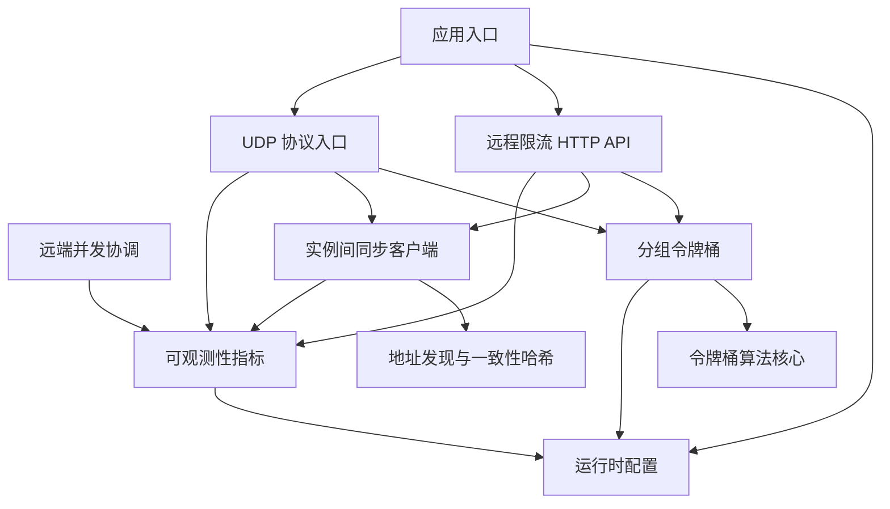

# harden — Wiki

# harden

`harden` 是一个 Go 1.18 实现的分布式限流服务，模块路径为 `code.byted.org/videoarch/harden`。它面向远程 HTTP 调用和 UDP 协议调用，按业务 `group` 和请求 key 管理令牌桶，在本机完成限流判断，并通过实例间同步把配额消耗传播到其他 Harden 节点。

新开发者可以先把它理解成三层：

1. 接入层接收请求：HTTP 远程限流接口、远端并发协调接口、UDP 预留协议。
2. 核心层执行决策：按 `group/key` 找到 token bucket，再用令牌桶算法判断允许、预留或限流。
3. 运行层维持服务状态：配置、地址发现、实例间同步和指标上报。

服务从 [Application Entry and Tooling](application-entry-and-tooling.md) 启动。`main.go` 会初始化 TCC、Hertz、本地 YAML 配置、指标系统、token bucket 全局状态、同步 worker，并挂载 HTTP 与 UDP 服务入口。静态配置由 [Runtime Configuration](runtime-configuration.md) 中的 `config.Init(dir)` 加载，动态配置通过 TCC 读取，例如 goroutine 池容量、同步发送间隔和指标精度策略。

限流主路径在 [Remote Rate Limit API](remote-rate-limit-api.md)。HTTP handler 负责解析请求参数、校验调用来源、读取 `group`，然后调用 [Token Buckets](token-buckets.md) 中按分组管理的 bucket。真正的令牌补充、消费、预留和等待逻辑由 [Rate Limiting Core](rate-limiting-core.md) 提供；它基于令牌桶模型，支持立即判断、未来预订、阻塞等待、归还令牌和限流状态检查。

当一次 HTTP 限流请求消耗了本地配额后，接口层会调用 [Synchronization Clients](synchronization-clients.md) 把这次消耗异步同步给其他 Harden 实例。同步客户端会先在内存中聚合配额，再周期性打包、按目标地址分组、进入发送队列，最后由 worker 批量发送 HTTP 请求。目标地址来自 [Address Discovery](address-discovery.md)，该模块通过 Consul 获取服务实例，并使用 [Consistent Hashing](consistent-hashing.md) 保证同一个 key 在地址集合稳定时尽量落到同一台实例。

UDP 调用路径由 [UDP Server Protocol](udp-server-protocol.md) 承担。客户端发送 protobuf 编码的 `ReserveNRequest`，服务端解码后按 `group`、`preferred`、`fallback`、`mode` 和 `quota` 调用本地 token bucket，返回 `ReserveNResponse.permit`。如果需要修改 UDP 协议，应修改 `udpserver/protocol/payload.proto`，再执行 `gen_proto.sh` 生成 `payload.pb.go`，不要直接编辑生成文件。

除了限流，仓库还提供 [Remote Coordination](remote-coordination.md)，用于按 `group/name` 做远端并发占用控制。客户端通过 `ConEnter` 申请并发名额，通过 `ConLeave` 释放名额；服务端在内存中维护当前 `uuid` 占用集合，并按配置中心中的并发上限判断是否允许进入。

[Observability](observability.md) 贯穿所有关键路径。HTTP 限流、UDP 预留、同步发送、并发协调和初始化流程都会上报吞吐、耗时、异常、当前并发或 token 消耗指标。指标通道会根据 TCC 中的精度配置选择高精度或低精度上报，因此常见执行流会从业务入口进入 `metrics.GetMetrics`，再读取 `tcc.GetPrecisionConfig` 决定实际上报方式。

端到端看，一个典型 HTTP 限流请求会经历：客户端请求远程限流 API，API 获取对应 `group` 的 token bucket，核心限流器计算可放行额度，结果写回客户端，同时本次消费进入同步客户端并异步传播到其他实例，整个过程持续打点。一个典型 UDP 预留请求则更轻量：UDP server 收包、解码、调用 token bucket、回包，并按配置精度上报指标。

本地开发时需要 Go 1.18，并确保内部依赖、Consul、TCC、配置目录和运行环境变量可用。常见入口是查看 `build.sh` 和 `script/bootstrap.sh` 了解构建与启动方式；服务启动后，本地 YAML 配置会先加载到 `config.C`，运行期动态参数再由 TCC 覆盖或补充。