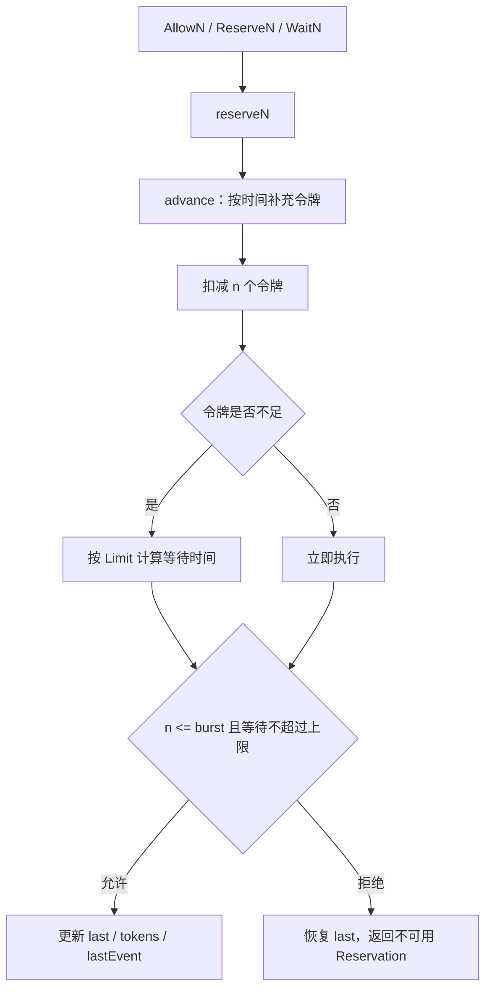

# Rate Limiting Core

## 模块概览

`rate` 包实现了基于令牌桶的限流核心。`Limiter` 按 `Limit` 指定的速率补充令牌，按 `burst` 限制桶容量和单次可消费的最大令牌数。调用方可以选择三种消费模式：

- `Allow` / `AllowN`：立即尝试获取令牌，失败时直接返回 `false`。
- `Reserve` / `ReserveN`：预订未来令牌，返回需要等待到 `Reservation.timeToAct` 的时间。
- `Wait` / `WaitN`：阻塞等待令牌，受 `context.Context` 取消和 deadline 约束。

该包来源接近 Go 官方 `x/time/rate` 的实现，并扩展了 `RestoreN`、`AllowAtMostN`、`IsThrottled`、`NewLimiterWithInitValues`、`CheckMetricsTime` 等项目内能力。

## 核心类型

### `Limit`

`Limit` 表示每秒允许发生的事件数：

```go
type Limit float64
```

常用构造方式是 `Every(interval time.Duration)`，它把“事件之间的最小间隔”转换成每秒速率：

```go
lim := rate.NewLimiter(rate.Every(100*time.Millisecond), 10) // 每秒 10 个，突发 10 个
```

特殊值 `Inf` 表示无限速率。`limit == Inf` 时忽略 `burst`，所有请求都会被允许。

### `Limiter`

`Limiter` 是令牌桶本体：

```go
type Limiter struct {
    limit Limit
    burst int64

    mu     sync.Mutex
    tokens float64
    last   time.Time

    lastEvent       time.Time
    lastMetricsTime int64
}
```

字段含义：

- `limit`：令牌补充速率，单位是 token/second。
- `burst`：桶容量，也是 `AllowN`、`ReserveN`、`WaitN` 单次请求的上限。
- `tokens`：当前可用令牌数，允许为负数。负数表示已经预订了未来的令牌。
- `last`：上一次计算并更新 `tokens` 的时间。
- `lastEvent`：最近一次限流事件发生的时间，可以是未来时间，用于取消预订时计算可返还令牌。
- `lastMetricsTime`：`CheckMetricsTime` 使用的秒级时间戳，用于控制指标更新频率。

所有会读写核心状态的方法都通过 `mu` 加锁，`Limiter` 可以被多个 goroutine 并发使用。

## 令牌桶执行流程

核心逻辑集中在 `reserveN(now, n, maxFutureReserve)`。`AllowN`、`ReserveN`、`WaitN` 都最终走这条路径，只是传入的最大等待时间不同。



`advance(now)` 只计算新状态，不直接修改 `Limiter`。它根据 `now.Sub(last)` 计算补充的令牌数：

```go
delta := lim.limit.tokensFromDuration(elapsed)
tokens := lim.tokens + delta
if tokens > float64(lim.burst) {
    tokens = float64(lim.burst)
}
```

这样可以保证桶内令牌不会超过 `burst`。

## 消费模式

### 立即丢弃：`Allow` 和 `AllowN`

`Allow()` 等价于 `AllowN(time.Now(), 1)`。`AllowN(now, n)` 用于“超限就丢弃”的场景：

```go
if !lim.AllowN(time.Now(), 1) {
    return // 当前没有足够令牌，直接跳过
}
```

内部调用：

```go
func (lim *Limiter) AllowN(now time.Time, n int64) bool {
    return lim.reserveN(now, n, 0).ok
}
```

因为 `maxFutureReserve` 为 `0`，只有无需等待的请求才会成功。

### 预订未来令牌：`Reserve` 和 `ReserveN`

`ReserveN(now, n)` 适合调用方自己控制等待的场景。返回的 `Reservation` 记录了是否成功、应该何时执行、预订时的速率和令牌数量。

```go
r := lim.ReserveN(time.Now(), 1)
if !r.OK() {
    return
}
time.Sleep(r.Delay())
```

当令牌不足但可在未来获得时，`ReserveN` 会让 `tokens` 变成负数，并把 `lastEvent` 推到未来。这意味着后续请求会看到已经被预订出去的令牌。

### 阻塞等待：`Wait` 和 `WaitN`

`WaitN(ctx, n)` 是多数业务调用最直接的入口。它先校验 `n` 是否超过 `burst`，再根据 `ctx.Deadline()` 计算最大可等待时间，最后通过 `reserveN` 预订令牌。

如果等待期间 `ctx` 被取消，`WaitN` 会调用 `Reservation.Cancel()` 尽量返还预订令牌：

```go
case <-ctx.Done():
    r.Cancel()
    return ctx.Err()
```

`limit == Inf` 时，`WaitN` 不受 `burst` 限制，立即成功。

## 预订取消与令牌返还

`Reservation.CancelAt(now)` 用于取消还没有执行的预订。它只在以下条件满足时尝试返还令牌：

- `Reservation.ok == true`
- `lim.limit != Inf`
- `r.tokens != 0`
- `r.timeToAct` 不早于 `now`

返还量不是简单的 `r.tokens`，因为在该预订之后可能已经有其他预订。代码通过 `lim.lastEvent.Sub(r.timeToAct)` 计算后续预订消耗的令牌，只返还仍然可安全恢复的部分：

```go
restoreTokens := float64(r.tokens) -
    r.limit.tokensFromDuration(r.lim.lastEvent.Sub(r.timeToAct))
```

如果取消的是最后一个事件，`CancelAt` 还会尝试回退 `lim.lastEvent`，避免未来等待时间被无效预订继续占用。

## 项目扩展方法

### `Restore` 和 `RestoreN`

`RestoreN(n)` 直接把令牌放回桶中，并把结果限制在 `burst` 以内。注释明确说明它会破坏限流精度，应只在 `AllowN` 成功后、部分令牌未使用时立即调用。

```go
got := lim.AllowAtMostN(10)
// 实际只使用了 7 个
lim.RestoreN(got - 7)
```

### `AllowAtMostN`

`AllowAtMostN(n)` 尽力获取最多 `n` 个令牌。令牌不足时返回当前可用的整数令牌数，而不是完全失败：

- `limit == Inf`：直接返回 `n`。
- `tokens < 0`：返回 `0`。
- `0 <= tokens < n`：返回 `floor(tokens)`。
- `tokens >= n`：返回 `n`。

该方法适合批量配额场景：调用方可以根据实际拿到的 token 数处理部分请求。

### `IsThrottled`

`IsThrottled(n)` 只判断当前是否会被限流，不消耗令牌。它会先处理两个快速路径：

- `limit == Inf` 返回 `false`。
- `n > burst` 返回 `true`。

随后调用 `advance(time.Now())` 计算当前理论令牌数，并判断是否小于 `n`。

### 动态配置

`SetLimitAt(now, newLimit)` 会先调用 `advance(now)` 把旧速率下已经积累的令牌结算完，再更新 `limit`。`SetBurst(newBurst)` 只更新 `burst`，不会重新裁剪当前 `tokens`。

`NewLimiterWithInitValues(r, b, last, tokens)` 允许调用方用外部持久化状态恢复限流器，项目中的 `InitTokenBucket` 会使用它初始化令牌桶。

## 与其他模块的连接

`rate` 包是底层限流算法，不直接依赖业务模块。业务侧通过 token bucket 层创建和管理 `Limiter`：

- `token/token_bucket.go` 中的 `getLimiter`、`getFallbackLimiter` 使用 `NewLimiter`。
- `InitTokenBucket` 使用 `NewLimiterWithInitValues` 恢复已有状态。
- `updateConfig`、`getLimiter`、`getFallbackLimiter` 会构造 `Limit` 来更新或创建限流器。
- `remote/v2/rate_limit.go`、`remote/sync.go`、`remote/v2/sync.go`、`udpserver/server.go` 会通过 `GetTokenBucket` 进入 token bucket 层，再间接使用本包。

`types/reserve.go` 定义了远程预留接口的数据结构：

```go
type ReserveRequest struct {
    Group       string
    Preferred   string
    Fallback    string
    Mode        string
    Quota       int64
    Flag        bool
    ReserveFlag bool
}

type ReserveResponse struct {
    Group     string
    Preferred string
    Fallback  string
    Permit    int64
}
```

这些类型本身不执行限流逻辑，但会在 `syncer/sdk.go`、`remote/sync.go` 等模块中承载配额请求和返回结果，最终由 token bucket 和 `Limiter` 计算实际可用配额。

## 贡献注意事项

修改 `reserveN`、`advance`、`CancelAt` 时要同时考虑 `tokens`、`last`、`lastEvent` 三者的一致性。`tokens` 可以为负数，这是预订未来令牌的核心机制，不应被简单裁剪为 `0`。

涉及等待行为时需要覆盖三类路径：立即成功、未来成功、超过 deadline 或取消失败。现有测试中的 `TestWaitSimple`、`TestWaitCancel`、`TestWaitTimeout` 是主要参考。

涉及取消行为时要重点验证后续预订是否影响返还量。`TestCancel0Tokens`、`TestCancel1Token`、`TestCancelMulti` 覆盖了这类边界。

如果新增批量消费能力，应明确它是“全有全无”还是“尽力获取”。当前代码中 `AllowN` 是全有全无，`AllowAtMostN` 是尽力获取，语义不要混用。