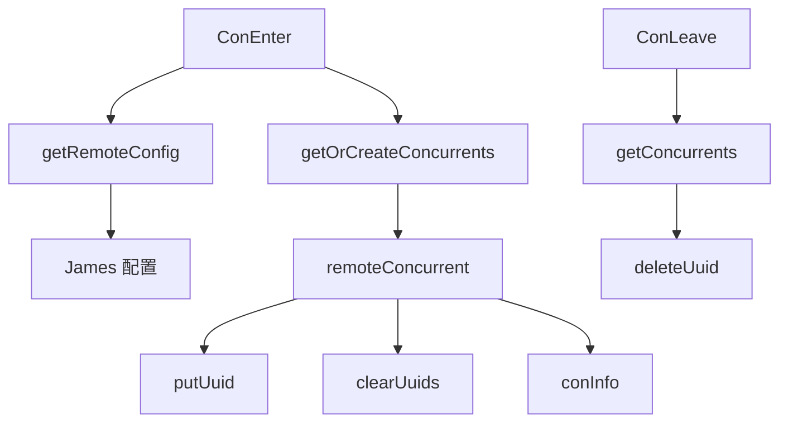

# Remote Coordination

## 模块概览

`conRemote` 模块实现远端并发协调服务，用于按 `group` 和 `name` 维度控制并发占用。客户端通过 `ConEnter` 申请一个并发名额，通过 `ConLeave` 释放名额；服务端在内存中维护当前占用的 `uuid` 集合，并从 James 配置中心获取每个 `group/name` 的并发上限。

这个模块的核心设计是：

- 配置按 `group` 缓存到 `remoteConfigs`，定时从 James 刷新。
- 当前占用按 `(group, name)` 缓存到 `remoteConcurrents`。
- 每个占用通过 `uuid` 标识，并带有过期时间，避免客户端未调用 `ConLeave` 时永久占用。
- 所有入口都会上报 `metrics`，用于吞吐、延迟、异常和当前并发观测。

## 对外入口

### `ConEnter(c *hertz.RequestContext)`

`ConEnter` 是申请并发名额的 HTTP handler。它读取请求 query 参数：

- `group`：配置组名。
- `name`：组内具体限流器名称。
- `timeout`：本次占用的有效期，使用 `time.ParseDuration` 解析，例如 `1s`、`500ms`。
- `uuid`：本次请求或业务任务的唯一标识。

执行流程：

1. 校验 `group`、`name`、`timeout`、`uuid` 是否为空。
2. 解析 `timeout` 为 `time.Duration`。
3. 调用 `getRemoteConfig(group, name)` 获取当前并发上限。
4. 调用 `getOrCreateConcurrents(group, name)` 获取或创建本地并发桶。
5. 先用 `GetUuidsLen()` 做一次快速满载判断。
6. 调用 `putUuid(uuid, expireTime, curCon, group, name)` 原子写入。
7. 返回 `ReturnJson`。

返回状态码含义：

- `201`，即 `NotFull`：成功占用，当前未满。
- `202`，即 `Full`：当前并发已满，未占用。
- `40001`，即 `ErrorParam`：缺少必需参数。
- `40002`，即 `TimeoutParseError`：`timeout` 无法解析。
- `40003`，即 `GetRemoteConfigError`：无法获取远端配置。

`ConEnter` 中有两层满载检查。第一次通过 `GetUuidsLen()` 快速判断，第二次在 `putUuid` 持锁后再次检查 `len(li.uuids) >= curCon`，用于避免并发请求同时通过第一次检查后超额写入。

### `ConLeave(c *hertz.RequestContext)`

`ConLeave` 是释放并发名额的 HTTP handler。它读取请求 query 参数：

- `group`
- `name`
- `uuid`

执行流程：

1. 校验参数。
2. 通过 `getConcurrents(group, name)` 查找已有并发桶。
3. 如果并发桶不存在，返回 `GetLimitersError`。
4. 调用 `deleteUuid(uuid)` 删除占用。
5. 返回 `Success`。

`deleteUuid` 对不存在的 `uuid` 是幂等的：直接调用 Go 的 `delete`，不会报错。因此重复释放同一个 `uuid` 不会破坏状态。

## 核心数据结构

### 全局状态

`baseInfo.go` 定义了两个主要全局缓存：

```go
var (
    remoteConcurrents = make(map[pair]*remoteConcurrent)
    remoteConfigs     = make(map[string]*model.LimiterConConfig)
)
```

`remoteConcurrents` 使用 `pair{group, name}` 作为 key，存储每个并发桶。  
`remoteConfigs` 使用 `group` 作为 key，缓存 James 返回的 `*model.LimiterConConfig`。

两个 map 分别由 `lockRemoteConcurrents` 和 `lockRemoteConfigs` 保护。读路径使用 `RLock`，写路径使用 `Lock`。

### `pair`

```go
type pair struct {
    group string
    name  string
}
```

`pair` 用于把 `group` 和 `name` 组合成当前并发桶的唯一 key。

### `remoteConcurrent`

```go
type remoteConcurrent struct {
    sync.RWMutex
    uuids map[string]int64
}
```

`remoteConcurrent` 表示一个 `(group, name)` 下的当前占用集合。`uuids` 的 key 是客户端传入的 `uuid`，value 是过期时间的 UnixNano。

它提供以下方法：

- `putUuid(uuid, lastTime, curCon, group, name) bool`
- `deleteUuid(uuid string)`
- `getUuid(uuid string) bool`
- `GetUuidsLen() int`
- `clearUuids(group, name string)`

## 并发桶生命周期

`getOrCreateConcurrents(group, name)` 使用双重检查模式创建并发桶：

1. 先持读锁查询 `remoteConcurrents`。
2. 未命中时获取写锁。
3. 写锁内再次查询，防止多个 goroutine 重复创建。
4. 创建 `remoteConcurrent{uuids: make(map[string]int64)}`。
5. 启动两个后台 goroutine：
   - `conInfo(group, name)`
   - `clearUuids(group, name)`



`conInfo` 每 10 秒上报一次当前 `uuid` 数量：

```go
metrics.EmitStore("conInfo", li.GetUuidsLen(), metrics.Group, group, metrics.Name, name)
```

`clearUuids` 每 10 毫秒扫描一次 `uuids`，删除已经过期的占用，并上报清理数量和扫描耗时。

## 配置获取与刷新

### `getRemoteConfig(group, name string) (int, error)`

`getRemoteConfig` 返回指定 `group/name` 的并发上限。它先从 `remoteConfigs` 读缓存，如果没有对应 `group`，则通过 `SingleFight.Do(group, ...)` 合并并发配置加载请求。

首次加载流程：

1. 调用 `getConConfig(group)`。
2. 校验返回值类型是否为 `*model.LimiterConConfig`。
3. 写入 `remoteConfigs[group]`。
4. 首次成功写入后启动 `updateConfig(group, name)` goroutine。
5. 从 `groupconfig.Configs[name]` 中读取 `Concurrent`。

如果 `Configs[name]` 不存在或为 `nil`，返回错误并上报 `noNameConfig`。

### `updateConfig(group, name string)`

`updateConfig` 每 30 秒调用一次 `getConConfig(group)`，刷新 `remoteConfigs[group]`。

如果刷新失败或返回空配置，模块不会覆盖旧配置。这一点很重要：配置中心临时不可用时，已有并发上限仍然生效，避免因为短暂网络或配置问题导致限流能力失效。

### `getConConfig(group string)`

`getConConfig` 是 James SDK 的薄封装：

```go
james.GetConGlobalConfig(group)
```

它把 James 返回的 `*model.LimiterConConfig` 交给本模块缓存和解析。

## `uuid` 占用语义

`putUuid` 是实际占用并发名额的关键方法。

行为规则：

- 如果 `uuid` 已存在，更新过期时间并返回 `true`。
- 如果 `uuid` 不存在且当前数量已达到 `curCon`，返回 `false`。
- 如果 `uuid` 不存在且未满，写入 `uuid -> lastTime` 并返回 `true`。

这意味着同一个 `uuid` 重复调用 `ConEnter` 不会重复占用多个并发名额，而是刷新该 `uuid` 的过期时间。

典型调用模式：

```go
flag := groupBucket.putUuid(
    uuid,
    time.Now().Add(timeouts).UnixNano(),
    curCon,
    group,
    name,
)
```

`clearUuids` 依赖该过期时间兜底释放占用。客户端正常情况下应调用 `ConLeave` 主动释放；如果客户端异常退出或网络中断，占用会在 `timeout` 到达后被清理。

## 指标与可观测性

模块通过 `metrics` 包上报请求结果、延迟、当前并发和后台任务状态。

主要指标路径：

- `ConEnter.<ConThroughput>`：进入请求结果，例如 `errorParam`、`getConfigError`、`FirstFull`、`NotFull`、`SecondFull`。
- `ConEnter.<ConLatency>`：进入请求延迟。
- `ConLeave.<ConThroughput>`：释放请求结果，例如 `errParam`、`getLimitersError`、`success`。
- `ConLeave.<ConLatency>`：释放请求延迟。
- `putUuid.<ConThroughput>`：写入结果，例如 `repeatUuid`、`full`、`success`。
- `clearOutDate.<ConThroughput>`：每轮过期清理数量。
- `clearOutDate.<ConLatency>`：每轮清理耗时。
- `conInfo`：周期性记录当前占用数量。
- `updateConfig.<ConThroughput>`：配置初始化、刷新和错误状态。

调用链中，`CtxEmitCounter` 会继续进入 `metrics.GetMetrics`、`tcc.GetPrecisionConfig` 和 `Precision`，因此本模块的请求指标会受到 TCC 精度配置影响。标签格式由 `metrics.FormTags` 统一处理。

## 错误处理与特殊逻辑

`ConEnter` 和 `ConLeave` 都使用 HTTP 200 返回业务状态，实际结果通过 JSON 中的 `Code` 表示。

`conInfo` 和 `updateConfig` 都有 `recover` 保护，panic 会被捕获、记录日志，并上报 `metrics.Panic`。`clearUuids` 没有显式 `recover`，但逻辑只操作受锁保护的本地 map 和指标上报。

`ConEnter` 中存在一个测试专用分支：

```go
if group == "bytedance.videoarch.unit_testing_concurrent_server_error" {
    time.Sleep(5 * time.Second)
    return
}
```

该分支用于模拟服务端超时或异常响应场景。新增逻辑时应避免把业务行为绑定到这个测试 group。

## 与代码库其他部分的连接

`conRemote` 本身没有被调用方展示在当前模块内，通常由路由层把 `ConEnter` 和 `ConLeave` 注册为 Hertz HTTP handler。

它依赖的外部模块包括：

- `code.byted.org/middleware/hertz`：提供请求上下文和 JSON 响应。
- `code.byted.org/videoarch/james-sdk/client`：通过 `GetConGlobalConfig` 获取远端并发配置。
- `code.byted.org/videoarch/james-sdk/model`：定义 `LimiterConConfig`。
- `code.byted.org/videoarch/harden/metrics`：上报吞吐、延迟、状态和当前并发。
- `code.byted.org/gopkg/singleflight`：合并同一个 `group` 的并发配置初始化请求。
- `code.byted.org/gopkg/logs`：记录参数错误、配置错误和 panic。

## 修改建议

修改这个模块时，需要特别注意以下约束：

- 访问 `remoteConfigs` 必须使用 `lockRemoteConfigs`。
- 访问 `remoteConcurrents` 必须使用 `lockRemoteConcurrents`。
- 访问 `remoteConcurrent.uuids` 必须使用实例自身的 `Lock` 或 `RLock`。
- `putUuid` 中的满载判断必须保留在持锁区间内，否则会出现并发超卖。
- 新增返回码时应同步更新 `ReturnJson` 的调用点和指标状态。
- 调整配置刷新策略时，应保留“刷新失败不覆盖旧配置”的行为，除非明确接受配置缺失导致限流不可用的风险。
- 调整 `clearUuids` 频率时，需要权衡释放及时性和每个并发桶一个 goroutine 带来的扫描成本。