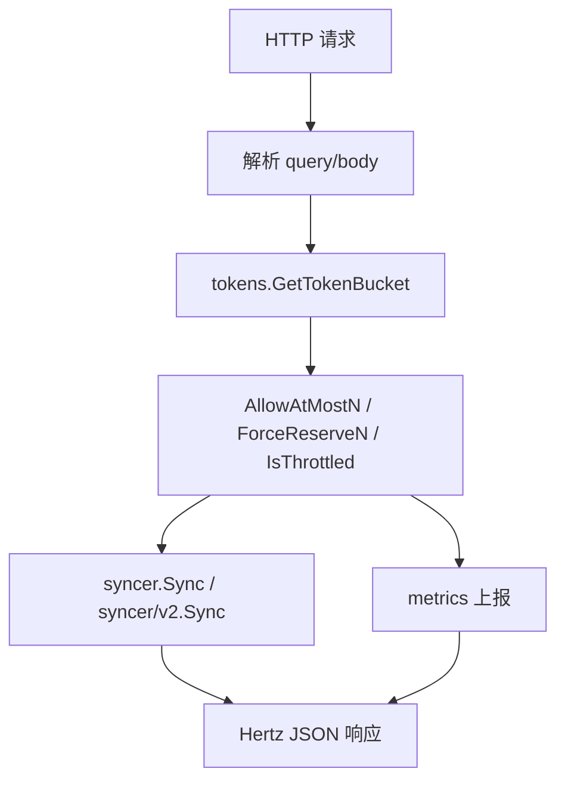

# Remote Rate Limit API

## 模块概览

Remote Rate Limit API 是 `harden` 的远程限流 HTTP 接口层。模块基于 Hertz 的 `*hertz.RequestContext` 处理请求参数、校验调用来源、调用本地令牌桶，并把消费结果同步给其他实例。

它本身不实现限流算法。核心限流逻辑委托给：

- `tokens.GetTokenBucket(group)`：按 `group` 获取令牌桶。
- `(*TokenBucket).AllowAtMostN(...)`：尝试消费最多 `quota` 个令牌。
- `(*TokenBucket).ForceReserveN(...)`：强制预留指定数量令牌。
- `(*TokenBucket).IsThrottled(...)`：判断当前请求是否会被限流。
- `syncer.Sync(...)` / `syncer/v2.Sync(...)`：把本次令牌消费同步到其他节点。
- `metrics.CtxEmitCounter(...)`、`metrics.CtxEmitTimer(...)`、`metrics.CtxEmitRateCounter(...)`：记录吞吐、延迟、计费和令牌消耗指标。



## 目录结构

该模块包含两组接口实现：

- `remote/*.go`：v1 远程限流 API。
- `remote/v2/*.go`：v2 远程限流 API，文件路径在 `remote/v2` 下，但 Go package 仍声明为 `remote`。

公共错误和调用标识定义在 `remote/baseInfo.go`：

```go
var (
    ErrInvalidGroup = errors.New("invalid param: group")
    ErrInvalidName  = errors.New("invalid param: name")
    ErrInvalidUA    = errors.New("invalid User-Agent")
    userAgent       = "harden_gosdk"
)
```

`userAgent` 用于避免接口被误调用。代码注释明确说明它不是鉴权机制。

## v1 `RateLimit`

`remote.RateLimit(c *hertz.RequestContext)` 是 v1 的核心限流接口。

### 请求参数

通过 query string 读取参数：

- `group`：必填，限流分组。
- `preferred`：优先使用的限流 key。
- `name`：兼容字段；当 `preferred` 为空时使用 `name`。
- `fallback`：备用限流 key。
- `mode`：转换为 `token.FallbackMode(mode)` 后传入令牌桶。
- `quota`：本次请求希望消耗的令牌数；解析失败或小于 `1` 时按 `1` 处理。
- `reserveFlag`：默认 `"false"`；为 `"true"` 时走强制预留逻辑。
- `forceQuota`：额外强制预留的令牌数；非 `0` 时先调用 `ForceReserveN`。
- `from_psm`：客户端 PSM，仅用于计费指标；为空时记为 `"-"`。

请求头必须满足：

```http
User-Agent: harden_gosdk
```

### 执行流程

`RateLimit` 的主要路径如下：

1. 解析 `group`、`preferred/name`、`fallback`、`mode`、`quota`、`reserveFlag` 等参数。
2. 上报 `RateLimit.Bill` 计费指标，标签包含 `group`、`from_psm`、`version=v1`。
3. 注册延迟指标 `RateLimit.Latency`。
4. 对特殊测试 group `bytedance.videoarch.unit_testing_server_error` 睡眠 5 秒并直接返回。
5. 校验 `group`、`preferred` 和 `User-Agent`。
6. 通过 `tokens.GetTokenBucket(group)` 获取令牌桶。
7. 如 `forceQuota != 0`，先执行 `t.ForceReserveN(...)`。
8. 根据 `reserveFlag` 选择消费方式：
   - `reserveFlag == "true"`：调用 `t.ForceReserveN(...)`，响应中的 `n` 等于请求的 `quota`。
   - 其他情况：调用 `t.AllowAtMostN(...)`，响应中的 `n` 是实际通过的令牌数。
9. 当 `n > 0` 时调用 `syncer.Sync(group, preferred, fallback, token.FallbackMode(mode), n, flag, reserve)`。
10. 上报令牌通过、不通过、总量和接口吞吐指标。
11. 返回 HTTP 200，JSON body 为整数 `n`。

### 响应语义

成功时返回：

```json
3
```

这里的数字表示本次实际允许通过的令牌数量。对于普通限流请求，它可能小于请求的 `quota`；对于 `reserveFlag=true` 的强制预留请求，代码会把 `n` 保持为请求的 `quota`。

错误时返回 HTTP 400：

- `group` 为空：`"invalid param: group"`
- `preferred/name` 为空：`"invalid param: name"`
- `User-Agent` 不匹配：`"invalid User-Agent"`

## v1 `IsThrottled`

`remote.IsThrottled(c *hertz.RequestContext)` 提供只读式限流探测。

它和 `RateLimit` 使用相同的 `group`、`preferred/name`、`fallback`、`mode`、`quota` 参数解析规则，也要求：

```http
User-Agent: harden_gosdk
```

核心区别是它调用：

```go
t.IsThrottled(preferred, fallback, token.FallbackMode(mode), quota)
```

而不是消费令牌。

返回值是整数：

- `1`：会被限流。
- `0`：不会被限流。

该接口同样会上报 `IsThrottled.Latency` 和 `IsThrottled.Throughput`。调用图显示，`IsThrottled` 的指标链路会经过 `metrics.GetMetrics`、`tcc.GetPrecisionConfig`，最终关联到 TCC 精度配置读取。

## v1 `Sync`

`remote.Sync(c *hertz.RequestContext)` 用于批量同步令牌消费请求。请求体是 JSON 数组，元素类型为 `types.ReserveRequest`。

反序列化失败时：

- 记录 warn 日志。
- 返回 HTTP 400。
- 上报 `Sync.Throughput`，状态为 `UnmarshalError`。

成功时逐条处理请求：

1. 调用 `tokens.GetTokenBucket(req.Group)` 获取令牌桶。
2. 默认 `permit = req.Quota`。
3. 如果 `req.ReserveFlag` 为真，调用 `ForceReserveN(...)`。
4. 否则调用 `AllowAtMostN(...)`，并用返回值更新 `permit`。
5. 上报 `harden.server.total.tokens`，标签包含 `group`、`preferred`、`fallback`、`mode`、`version=v1`。
6. 构造 `types.ReserveResponse`，字段包括 `Group`、`Preferred`、`Fallback`、`Permit`。

成功响应是 `[]types.ReserveResponse`。

## v2 `RateLimit`

`remote/v2/rate_limit.go` 中的 `RateLimit(c *hertz.RequestContext)` 是 v2 限流接口实现。

它和 v1 的整体流程一致，但有几个重要差异：

- 不校验 `group` 是否为空。
- 不支持 `name` 作为 `preferred` 的兼容字段。
- 不校验 `User-Agent`。
- 指标标签使用 `version=v2`。
- 同步调用为 `syncer/v2.Sync(group, preferred, fallback, token.FallbackMode(mode), n)`。
- `ForceReserveN` 返回的 `flag` 不再用于同步参数。
- `reserveFlag == "true"` 时仍调用 `ForceReserveN(...)`，但不接收返回值。

v2 更像内部节点间或新版 SDK 使用的轻量接口，入口层校验更少，依赖调用方保证参数正确。

## v2 `Sync`

`remote/v2/sync.go` 中的 `Sync(c *hertz.RequestContext)` 用于 v2 跨实例同步。请求体是 `[]types/v2.SyncRequest`：

```go
type SyncKey struct {
    Group     string
    Preferred string
    Fallback  string
    Mode      string
}

type SyncRequest struct {
    SyncKey
    Quota int64
}
```

处理逻辑：

1. 反序列化请求体。
2. 读取 query 参数 `pod_name`。
3. 如果 `env.PodName() != podName`，说明同步请求来自其他 Pod，才执行本地强制预留。
4. 对每个请求调用：

```go
tokens.GetTokenBucket(req.Group).ForceReserveN(
    req.Preferred,
    req.Fallback,
    token.FallbackMode(req.Mode),
    time.Now(),
    req.Quota,
)
```

5. 上报 `harden.server.total.tokens`，版本标签为 `v2`。
6. 返回 HTTP 200，body 为 `nil`。

这个 `pod_name` 判断避免当前 Pod 消费令牌后又通过同步请求重复扣减自身令牌。

## v2 `GetAllTokenBuckets`

`remote/v2/get_all_token_buckets.go` 提供：

```go
func GetAllTokenBuckets(c *hertz.RequestContext)
```

它直接返回：

```go
tokens.GetAllInitInfos()
```

该接口用于查看当前进程中已初始化的 token bucket 信息。它不做参数解析、权限校验或额外指标上报。

## 限流与同步的关系

`RateLimit` 是入口，令牌桶是状态持有者，同步器负责把本地消费传播出去。

v1 同步调用携带更多上下文：

```go
syncer.Sync(group, preferred, fallback, mode, n, flag, reserve)
```

其中 `flag` 来自 `AllowAtMostN` 或 `ForceReserveN`，`reserve` 表示本次是否为强制预留。

v2 同步调用更简单：

```go
v2.Sync(group, preferred, fallback, mode, n)
```

接收端 `remote/v2.Sync` 总是使用 `ForceReserveN` 应用同步过来的消耗。

## 指标设计

模块在接口层统一记录三类指标：

- 延迟：`RateLimit.Latency`、`IsThrottled.Latency`、`Sync.Latency`。
- 吞吐：`RateLimit.Throughput`、`IsThrottled.Throughput`、`Sync.Throughput`。
- 令牌：`harden.server.tokens`、`harden.server.reserve.tokens`、`harden.server.total.tokens`。
- 计费：`RateLimit.Bill`，标签包含 `from_psm`。

常用标签包括：

- `metrics.Group`
- `metrics.Preferred`
- `metrics.Fallback`
- `metrics.Mode`
- `metrics.ReserveFlag`
- `metrics.FromPSM`
- `metrics.Status`
- `metrics.Version`

v1 和 v2 通过 `metrics.Version` 区分。

## 特殊测试入口

`RateLimit`、`IsThrottled` 和 v2 `RateLimit` 都包含相同的测试分支：

```go
if group == "bytedance.videoarch.unit_testing_server_error" {
    time.Sleep(5 * time.Second)
    return
}
```

该分支用于模拟服务端超时或异常延迟。它不会写 JSON 响应，也不会继续执行限流逻辑。

## 贡献注意事项

修改该模块时需要特别注意以下约束：

- v1 `preferred` 兼容 `name`，v2 不兼容；不要无意改变 SDK 兼容行为。
- v1 有 `User-Agent` 防误调校验，v2 没有；新增接口时需要明确选择哪种模式。
- `quota` 解析失败会静默降级为 `1`，当前代码不会返回参数错误。
- `forceQuota` 会额外计入 `harden.server.reserve.tokens` 和 `harden.server.tokens`。
- `Sync` 接口处理的是批量请求，单条失败没有独立错误响应。
- v2 同步依赖 `pod_name` 避免本 Pod 重复扣减，调用方必须正确传入源 Pod 名称。
- `remote/v2` 目录下仍使用 `package remote`，注册路由时需要结合目录和导入路径确认具体函数来源。