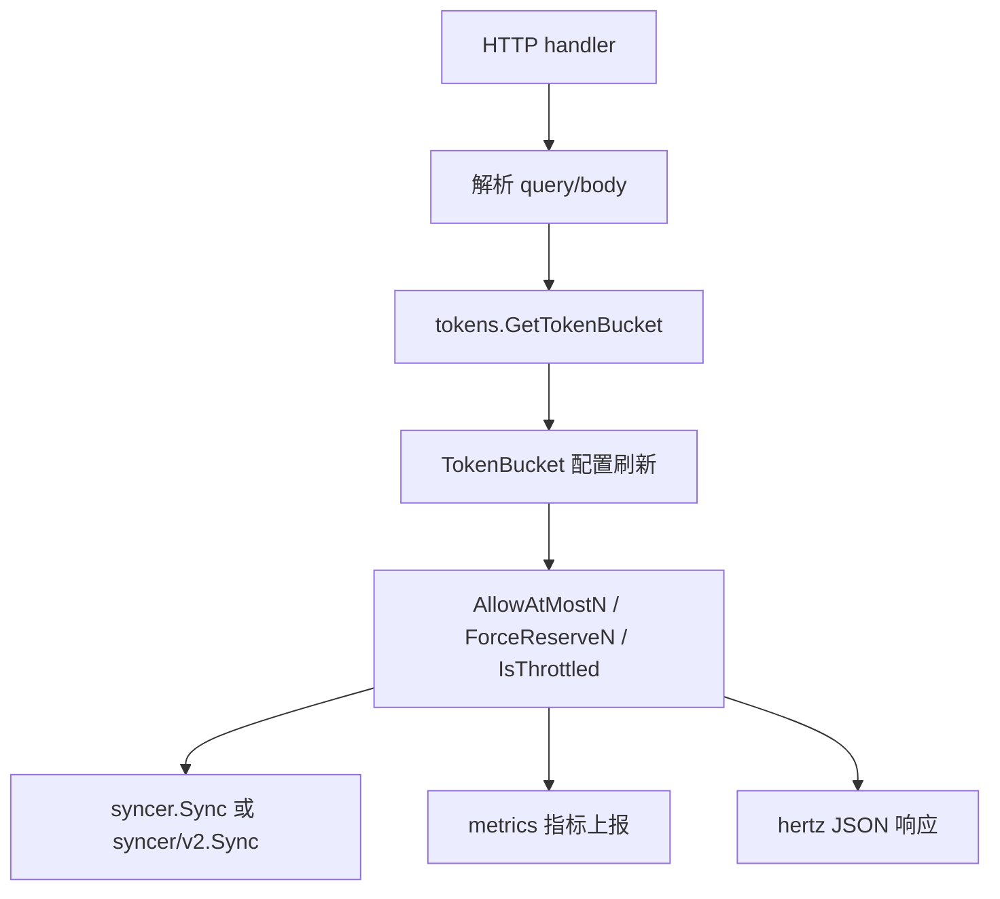
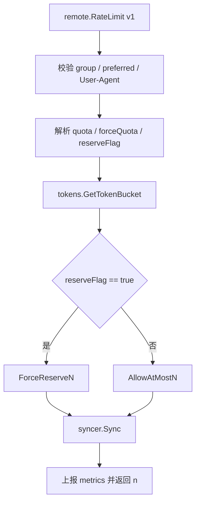

# Remote Rate Limiting

## 模块概览

Remote Rate Limiting 模块提供 Harden 服务端的远程限流 HTTP handler。它把请求参数解析为 token bucket 操作，并通过 `tokens.GetTokenBucket(group)` 取得对应分组的桶，再调用 `token.TokenBucket` 上的限流方法完成判定、扣减或同步。

模块覆盖两代协议：

- `remote`：v1 handler，包括 `RateLimit`、`IsThrottled`、`Sync`。
- `remote/v2`：v2 handler，包括 `RateLimit`、`Sync`、`GetAllTokenBuckets`。
- `types/v2`：v2 同步请求结构体 `SyncKey` 和 `SyncRequest`。

核心依赖关系如下：



## 核心概念

### group

`group` 是 token bucket 的分组键。所有主要操作都会通过：

```go
t := tokens.GetTokenBucket(group)
```

拿到该分组对应的桶。执行流显示，`GetTokenBucket` 会进入 `token.TokenBucket` 的远程配置流程：

```text
GetTokenBucket -> WithRemoteConfig -> updateConfig -> Limit
```

因此 remote 层本身不维护限流配置，它只负责把 HTTP 请求转换为 bucket 操作。

### preferred、fallback 和 mode

`preferred` 是主限流维度，`fallback` 是备用维度，`mode` 会被转换为：

```go
token.FallbackMode(mode)
```

之后传给 token bucket 方法：

```go
t.AllowAtMostN(preferred, fallback, token.FallbackMode(mode), quota)
t.ForceReserveN(preferred, fallback, token.FallbackMode(mode), time.Now(), quota)
t.IsThrottled(preferred, fallback, token.FallbackMode(mode), quota)
```

v1 的 `RateLimit` 和 `IsThrottled` 支持兼容参数 `name`：

```go
preferred := c.Query("preferred")
if preferred == "" {
    preferred = c.Query("name")
}
```

v2 的 `RateLimit` 不再读取 `name`，只读取 `preferred`。

### quota

`quota` 表示本次最多申请的 token 数。`RateLimit` 和 `IsThrottled` 都会把非法或缺省值归一到 `1`：

```go
quota, _ := strconv.ParseInt(c.Query("quota"), 10, 64)
if quota < 1 {
    quota = 1
}
```

返回值语义：

- `RateLimit` 返回实际放行的 token 数 `n`。
- `IsThrottled` 返回 `0` 或 `1`，其中 `1` 表示被限流。
- `Sync` 的返回取决于版本：v1 返回每个请求的 `Permit`，v2 返回 `nil`。

## v1 handler

### `remote.RateLimit`

`RateLimit(c *hertz.RequestContext)` 是 v1 的主要远程扣减接口。它读取 query 参数，执行限流扣减，并把实际通过数量返回给调用方。

主要参数：

| 参数 | 说明 |
| --- | --- |
| `group` | token bucket 分组，必填 |
| `preferred` | 主限流维度，优先读取 |
| `name` | v1 兼容参数，当 `preferred` 为空时使用 |
| `fallback` | 备用限流维度 |
| `mode` | fallback 模式，转换为 `token.FallbackMode` |
| `quota` | 申请 token 数，小于 `1` 时按 `1` 处理 |
| `reserveFlag` | 为 `"true"` 时强制预留，否则按正常限流申请 |
| `forceQuota` | 非零时额外执行一次强制预留 |
| `from_psm` | 客户端 PSM，只用于账单指标标签 |

执行流程：



关键行为：

1. 先上报账单指标 `RateLimit.Bill`，标签包含 `group`、`from_psm`、`version=v1`。
2. 使用 `defer metrics.CtxEmitTimer` 记录 `RateLimit.Latency`。
3. 当 `group == "bytedance.videoarch.unit_testing_server_error"` 时 sleep 5 秒后直接返回，用于单测模拟服务端超时。
4. 校验 `group` 和 `preferred`，失败时返回 `400`。
5. 校验 `User-Agent` 必须等于包内变量 `userAgent`，即 `"harden_gosdk"`。
6. 根据 `reserveFlag` 选择调用：
   - `"true"`：`ForceReserveN(...)`
   - 其他值：`AllowAtMostN(...)`
7. 当实际放行数 `n > 0` 时调用 `syncer.Sync(group, preferred, fallback, mode, n, flag, reserve)` 同步到其他节点。
8. 返回 HTTP `200`，body 为实际放行 token 数 `n`。

`forceQuota` 是额外的强制预留通道：

```go
forceQuota, _ := strconv.ParseInt(c.Query("forceQuota"), 10, 64)
if forceQuota != 0 {
    t.ForceReserveN(preferred, fallback, token.FallbackMode(mode), time.Now(), forceQuota)
}
```

它不改变 `quota` 的申请流程，但会被计入部分指标：

```go
metrics.CtxEmitCounter(c, "harden.server.tokens", n+forceQuota, ...)
metrics.CtxEmitCounter(c, "harden.server.total.tokens", n+forceQuota, ...)
```

### `remote.IsThrottled`

`IsThrottled(c *hertz.RequestContext)` 只判断是否被限流，不执行 `syncer.Sync`。

主要参数：

| 参数 | 说明 |
| --- | --- |
| `group` | token bucket 分组，必填 |
| `preferred` | 主限流维度 |
| `name` | v1 兼容参数，当 `preferred` 为空时使用 |
| `fallback` | 备用限流维度 |
| `mode` | fallback 模式 |
| `quota` | 判断所需 token 数，小于 `1` 时按 `1` 处理 |

核心调用：

```go
throttled := t.IsThrottled(preferred, fallback, token.FallbackMode(mode), quota)
```

响应 body 是整数：

- `0`：未被限流
- `1`：被限流

它和 v1 `RateLimit` 使用相同的 `group`、`preferred`、`User-Agent` 校验逻辑，也会上报 `IsThrottled.Latency` 和 `IsThrottled.Throughput`。

### `remote.Sync`

`Sync(c *hertz.RequestContext)` 是 v1 节点间同步入口。它从 request body 读取 `[]types.ReserveRequest`，逐条在本地 token bucket 上执行同样的 token 操作。

执行逻辑：

```go
var requests []types.ReserveRequest
err := json.Unmarshal(data, &requests)
```

反序列化失败时：

- 记录 warn 日志
- 返回 HTTP `400`
- 上报 `Sync.Throughput`，状态为 `UnmarshalError`

每个请求会按 `ReserveFlag` 分支：

```go
if req.ReserveFlag {
    t.ForceReserveN(req.Preferred, req.Fallback, token.FallbackMode(req.Mode), time.Now(), req.Quota)
} else {
    permit, _ = t.AllowAtMostN(req.Preferred, req.Fallback, token.FallbackMode(req.Mode), req.Quota)
}
```

响应类型是 `[]types.ReserveResponse`，每条包含：

```go
types.ReserveResponse{
    Group:     req.Group,
    Preferred: req.Preferred,
    Fallback:  req.Fallback,
    Permit:    permit,
}
```

这里的 `Permit` 是实际应用到本地 bucket 的 token 数。`ReserveFlag == true` 时，代码保留初始值 `permit := req.Quota`。

## v2 handler

### `remote/v2.RateLimit`

`remote/v2/rate_limit.go` 中的 `RateLimit(c *hertz.RequestContext)` 是 v2 限流入口。它和 v1 的职责相同，但协议行为更轻：

- 不校验 `group` 为空。
- 不校验 `preferred` 为空。
- 不检查 `User-Agent`。
- 不支持 `name` 兼容参数。
- 同步调用改为 `syncer/v2.Sync(group, preferred, fallback, mode, n)`。
- 指标标签中的 `version` 为 `"v2"`。

核心流程仍然是：

```go
t := tokens.GetTokenBucket(group)

if forceQuota != 0 {
    t.ForceReserveN(preferred, fallback, token.FallbackMode(mode), time.Now(), forceQuota)
}

if reserveFlag == "true" {
    t.ForceReserveN(preferred, fallback, token.FallbackMode(mode), time.Now(), quota)
} else {
    n, _ = t.AllowAtMostN(preferred, fallback, token.FallbackMode(mode), quota)
}

if n > 0 {
    v2.Sync(group, preferred, fallback, token.FallbackMode(mode), n)
}
```

需要注意一个实现细节：当 `reserveFlag == "true"` 时，`n` 保持初始值 `quota`，因为 `ForceReserveN` 的返回值没有赋给 `n`。因此响应会返回请求的 `quota`。

### `remote/v2.Sync`

`remote/v2/sync.go` 中的 `Sync(c *hertz.RequestContext)` 是 v2 节点同步入口。它读取 body 中的 `[]types/v2.SyncRequest`。

v2 同步请求结构定义在 `types/v2/sync_struct.go`：

```go
type SyncKey struct {
    Group     string
    Preferred string
    Fallback  string
    Mode      string
}

type SyncRequest struct {
    SyncKey
    Quota int64
}
```

v2 同步和 v1 的主要区别是通过 `pod_name` 避免本 Pod 重放自己的同步请求：

```go
podName := c.Query("pod_name")
if env.PodName() != podName {
    for _, req := range requests {
        tokens.GetTokenBucket(req.Group).ForceReserveN(...)
    }
}
```

也就是说：

- 如果 `pod_name` 等于当前 `env.PodName()`，handler 不执行本地 token 预留，只返回成功。
- 如果 `pod_name` 不是当前 Pod，handler 对每条请求执行 `ForceReserveN`。
- v2 同步不调用 `AllowAtMostN`，同步请求都以强制预留方式落地。
- 响应固定为 HTTP `200`，body 为 `nil`。

### `remote/v2.GetAllTokenBuckets`

`GetAllTokenBuckets(c *hertz.RequestContext)` 是一个只读 handler：

```go
func GetAllTokenBuckets(c *hertz.RequestContext) {
    c.JSON(hertz.StatusOK, tokens.GetAllInitInfos())
}
```

它直接返回 `tokens.GetAllInitInfos()`，用于暴露当前 token bucket 初始化信息。代码中没有额外鉴权、过滤或指标上报。

## 错误和校验

通用错误定义在 `remote/baseInfo.go`：

```go
var (
    ErrInvalidGroup = errors.New("invalid param: group")
    ErrInvalidName  = errors.New("invalid param: name")
    ErrInvalidUA    = errors.New("invalid User-Agent")
    userAgent       = "harden_gosdk"
)
```

v1 `RateLimit` 和 `IsThrottled` 会使用这些错误：

| 场景 | HTTP 状态码 | 响应 |
| --- | --- | --- |
| `group == ""` | `400` | `"invalid param: group"` |
| `preferred == ""` 且 `name == ""` | `400` | `"invalid param: name"` |
| `User-Agent != "harden_gosdk"` | `400` | `"invalid User-Agent"` |

`Sync` 的 JSON 解析失败返回 `400` 和 `nil`。

v2 `RateLimit`、`Sync`、`GetAllTokenBuckets` 当前没有复用这些参数校验逻辑。

## 指标上报

Remote 层大量使用 `metrics` 包记录延迟、吞吐和 token 消耗。执行流显示，指标上报会进入：

```text
CtxEmitCounter / CtxEmitRateCounter / CtxEmitTimer
-> GetMetrics
-> GetPrecisionConfig
-> Precision
```

因此指标精度由 TCC 配置影响。

常见指标包括：

| 指标 | 使用位置 | 说明 |
| --- | --- | --- |
| `RateLimit.Latency` | v1/v2 `RateLimit` | 限流请求延迟 |
| `RateLimit.Throughput` | v1/v2 `RateLimit` | 限流请求吞吐 |
| `RateLimit.Bill` | v1/v2 `RateLimit` | 账单计数，包含 `from_psm` |
| `IsThrottled.Latency` | v1 `IsThrottled` | 判断请求延迟 |
| `IsThrottled.Throughput` | v1 `IsThrottled` | 判断请求吞吐 |
| `Sync.Latency` | v1/v2 `Sync` | 同步请求延迟 |
| `Sync.Throughput` | v1/v2 `Sync` | 同步请求吞吐 |
| `harden.server.reserve.tokens` | v1/v2 `RateLimit` | `forceQuota` 预留 token 数 |
| `harden.server.tokens` | v1/v2 `RateLimit` | 通过或未通过的 token 数 |
| `harden.server.total.tokens` | v1/v2 `RateLimit`、`Sync` | 总 token 消耗 |

主要标签包括：

- `metrics.Group`
- `metrics.Preferred`
- `metrics.Fallback`
- `metrics.Mode`
- `metrics.ReserveFlag`
- `metrics.FromPSM`
- `metrics.Status`
- `metrics.Version`

v1 使用 `version=v1`，v2 使用 `version=v2`。

## 与其他模块的连接

Remote Rate Limiting 位于 HTTP 边界层，连接以下模块：

| 模块 | 调用点 | 作用 |
| --- | --- | --- |
| `tokens` | `tokens.GetTokenBucket`、`tokens.GetAllInitInfos` | 获取分组 token bucket 或初始化信息 |
| `token` | `AllowAtMostN`、`ForceReserveN`、`IsThrottled`、`FallbackMode` | 执行限流、强制预留和模式转换 |
| `syncer` | v1 `syncer.Sync` | 将 v1 成功扣减同步给其他节点 |
| `syncer/v2` | v2 `syncer/v2.Sync` | 将 v2 成功扣减同步给其他节点 |
| `metrics` | `CtxEmitCounter`、`CtxEmitRateCounter`、`CtxEmitTimer` | 上报延迟、吞吐、账单和 token 指标 |
| `types` | `types.ReserveRequest`、`types.ReserveResponse` | v1 同步请求与响应结构 |
| `types/v2` | `SyncKey`、`SyncRequest` | v2 同步请求结构 |
| `hertz` | `*hertz.RequestContext`、`c.Query`、`c.JSON` | HTTP 请求读取和响应写入 |

## 贡献注意事项

修改 v1 handler 时需要保持兼容行为，尤其是：

- `preferred` 为空时回退到 `name`。
- `User-Agent` 必须等于 `"harden_gosdk"`。
- `group` 和 `preferred` 参数缺失时返回 `400`。
- `reserveFlag` 默认值为 `"false"`。
- `quota < 1` 时按 `1` 处理。

修改 v2 handler 时要注意它不是 v1 的简单复制。v2 当前省略了 v1 的参数校验和 UA 检查，并且同步协议使用 `pod_name` 去重。为 v2 增加校验会改变现有调用方的兼容性，需要确认路由层和客户端 SDK 的约定。

修改 token 同步逻辑时，需要同时检查：

- 本地是否正确调用 `AllowAtMostN` 或 `ForceReserveN`。
- 只有 `n > 0` 时才触发对外同步。
- v1 同步是否仍需要 `flag` 和 `reserve`。
- v2 同步是否仍通过 `pod_name` 跳过当前 Pod。
- `harden.server.tokens`、`harden.server.total.tokens` 等指标是否仍能反映实际 token 消耗。