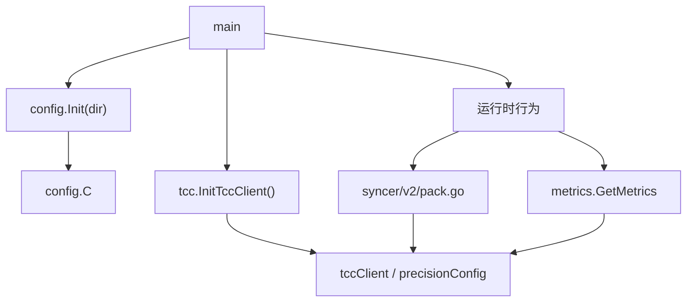

# Runtime Configuration

## 模块概览

Runtime Configuration 模块负责两类运行时配置：

1. 静态 YAML 配置：由 `config.Init(dir)` 通过 `caesar.Unmarshal` 加载到全局变量 `config.C`。
2. 动态 TCC 配置：由 `tcc.InitTccClient()` 初始化 TCC 客户端，并通过 `GetGoRoutine`、`GetSendIntervalTime`、`GetPrecisionConfig` 在运行期读取。

该模块没有复杂的内部调用链，但它位于服务启动和运行时路径上：`main` 初始化配置后，限流、同步、指标等模块会持续读取这些配置。



## 静态配置：`config` 包

`config/config.go` 定义了进程级静态配置结构：

```go
var (
    C = &Config{}
)

type Config struct {
    SyncTo             []string `yaml:"SyncTo"`
    Worker             int      `yaml:"Worker"`
    Buffer             int      `yaml:"Buffer"`
    TargetJamesCluster string   `yaml:"TargetJamesCluster"`
    Tenant             string   `yaml:"Tenant"`
}
```

`config.C` 是全局配置实例。服务代码通过这个变量读取 YAML 配置结果，测试代码中也直接构造或引用 `Config`。

### `Init(dir string)`

`Init` 是静态配置入口：

```go
func Init(dir string) {
    if err := caesar.Unmarshal(C, dir); err != nil {
        panic(err)
    }
    logs.Info("config: %+v", C)
}
```

它将 `dir` 指向的配置目录交给 `code.byted.org/videoarch/caesar_config` 解析，并把结果写入全局 `config.C`。加载失败会直接 `panic`，因此它应该在服务启动早期调用，避免进程进入半初始化状态。

当前调用关系中，`main.go` 会调用 `config.Init`。测试里的 `token/token_bucket_test.go` 也会使用 `Config` 类型。

## 静态配置文件

`conf/` 目录包含基础配置、机房/集群覆盖配置，以及服务框架配置。

### `base.yml`

基础配置定义默认工作参数：

```yaml
Worker: 30
Buffer: 10000
Tenant: videoarch.harden
```

这些字段对应 `Config.Worker`、`Config.Buffer` 和 `Config.Tenant`。

### 同步目标：`SyncTo`

多个环境文件定义 `SyncTo`，例如：

```yaml
SyncTo:
  - "lf"
  - "alinc2"
  - "lq"
```

`SyncTo` 表示当前部署环境需要同步到的目标集群列表。部分文件中写成：

```yaml
SyncTo:
```

这种配置会被解析为没有具体目标的值，使用方需要能区分“没有同步目标”和“配置了多个同步目标”的情况。

### James 目标集群：`TargetJamesCluster`

部分环境文件定义：

```yaml
TargetJamesCluster: "default_tob"
```

或：

```yaml
TargetJamesCluster: "staging"
```

该字段用于指定目标 James 集群。按现有配置，常见值包括 `default_tob`、`default_tob_bp` 和 `staging`。

### 租户：`Tenant`

基础配置中默认是：

```yaml
Tenant: videoarch.harden
```

部分环境覆盖为：

```yaml
Tenant: default
```

例如 `boei18n.yml`、`sinfonline.yml`、`sinfonlinea.yml`、`sinfonlinec.yml`。

### 服务框架配置

`conf/toutiao_videoarch_harden.yaml` 定义 `Develop` 和 `Product` 两套运行模式配置，包括端口、日志、指标、pprof 和 tracing 开关。这部分不映射到 `config.Config`，而是供服务框架按自身规则读取。

## 动态配置：`tcc` 包

`tcc/tcc.go` 负责连接 TCC 并读取运行时可变配置。

包级变量：

```go
var (
    tccClient       *tccclient.ClientV2
    precisionConfig tccclient.Getter
)
```

调用 `tcc.InitTccClient()` 前，这两个变量不会被初始化。依赖 TCC 的函数都假设初始化已经完成，因此服务启动流程必须先执行 `InitTccClient`。

## `InitTccClient`

```go
func InitTccClient() {
    conf := tccclient.NewConfigV2()
    conf.SetFirstGetTimeout(5 * time.Second).SetFirstGetRetry(3)

    var err error
    tccClient, err = tccclient.NewClientV2("toutiao.videoarch.harden", conf)
    if err != nil {
        logs.Info("tcc Client init error:%+v", err)
        panic(fmt.Sprintf("tcc Client init error:%v", err))
    }

    precisionConfig = tccClient.NewGetter("precision", json.Unmarshal, &Precision{})
}
```

初始化行为：

- 创建 `tccclient.ConfigV2`。
- 首次拉取超时设置为 `5s`。
- 首次拉取重试次数设置为 `3`。
- 使用命名空间 `toutiao.videoarch.harden` 创建 `ClientV2`。
- 初始化名为 `precision` 的 getter，并用 `json.Unmarshal` 解析到 `Precision`。

如果 TCC 客户端创建失败，函数会记录日志并 `panic`。

## `Precision`

```go
type Precision struct {
    HighClauses map[string]bool `json:"high_clauses"`
    LowClusters map[string]bool `json:"low_clusters"`
    HighGroups  map[string]bool `json:"high_groups"`
}
```

`Precision` 是指标精度相关的动态配置结构。它由 TCC key `precision` 提供，JSON 字段名分别是：

- `high_clauses`
- `low_clusters`
- `high_groups`

调用链显示，`Precision` 主要通过指标路径被使用：

```text
业务路径 -> metrics.EmitCounter / EmitTimer -> metrics.GetMetrics -> tcc.GetPrecisionConfig -> Precision
```

典型入口包括：

- `udpserver.Serve`
- `udpserver.handleReserveN`
- `tokens.InitAllInitInfos`
- `syncer.batchedSync`
- `conRemote.ConEnter`

这说明 `Precision` 不直接控制主业务逻辑，而是影响指标聚合、上报或分类时的精度策略。

## `GetPrecisionConfig(ctx context.Context)`

```go
func GetPrecisionConfig(ctx context.Context) *Precision {
    if getter, err := precisionConfig(ctx); err != nil {
        logs.CtxWarn(ctx, "fail to get config from tcc err:%+v", err)
        return &Precision{
            HighClauses: map[string]bool{},
            LowClusters: map[string]bool{},
            HighGroups:  map[string]bool{},
        }
    } else {
        return getter.(*Precision)
    }
}
```

该函数从 TCC getter 读取 `precision` 配置。读取失败时不会中断业务，而是返回一个字段均为空 map 的 `Precision`，并记录 `CtxWarn`。

这个降级策略很重要：指标路径通常不应该阻塞核心请求处理。调用方可以直接访问返回值中的 map，不需要额外处理 `nil` 的 `Precision` 指针。

注意：函数内部会执行 `getter.(*Precision)` 类型断言。如果 `precisionConfig` 的解析目标或 TCC getter 行为被修改，需要保持返回值类型仍然是 `*Precision`。

## `GetGoRoutine`

```go
func GetGoRoutine() int32
```

该函数读取 TCC key `goRoutine`，期望值是一个 JSON map：

```json
{
  "cluster:idc": 1000,
  "cluster": 2000
}
```

解析后按以下优先级选择配置：

1. `env.Cluster() + ":" + env.IDC()`
2. `env.Cluster()`
3. 默认值 `10000`

错误处理：

- `tccClient.Get` 失败时记录错误日志，返回 `10000`。
- JSON 反序列化失败时记录错误日志，返回 `10000`。
- 当前集群没有匹配项时返回 `10000`。

`main.go` 会调用 `GetGoRoutine`，因此这个值属于启动后运行时并发规模控制的一部分。

## `GetSendIntervalTime`

```go
func GetSendIntervalTime() int
```

该函数读取 TCC key `sendIntervalTime`，期望值也是 JSON map：

```json
{
  "cluster:idc": 25,
  "cluster": 30
}
```

选择优先级与 `GetGoRoutine` 一致：

1. `env.Cluster() + ":" + env.IDC()`
2. `env.Cluster()`
3. 默认值 `25`

错误处理更安静：读取失败或 JSON 解析失败时直接返回 `25`，不记录错误日志。

调用关系中，`syncer/v2/pack.go` 的 `syncing` 会调用 `GetSendIntervalTime`，因此它影响同步逻辑的发送间隔。

## 初始化顺序

服务启动时应先完成静态配置和 TCC 初始化，再进入依赖配置的业务逻辑：

```go
config.Init(confDir)
tcc.InitTccClient()

goRoutine := tcc.GetGoRoutine()
```

如果在 `InitTccClient` 前调用 `GetGoRoutine`、`GetSendIntervalTime` 或 `GetPrecisionConfig`，代码中没有保护逻辑，可能因为 `tccClient` 或 `precisionConfig` 未初始化而触发运行时错误。

## 运行时依赖关系

Runtime Configuration 模块连接了多个业务区域：

- `main.go`：启动时加载静态 YAML，并初始化 TCC 客户端。
- `syncer/v2/pack.go`：通过 `GetSendIntervalTime` 获取同步发送间隔。
- `metrics/metrics.go`：通过 `GetPrecisionConfig` 获取指标精度配置。
- `token/token_bucket_test.go`：测试中直接使用 `Config` 类型。
- `main.go`：通过 `GetGoRoutine` 获取运行时 goroutine 配额。

整体设计是“启动时加载基础配置，运行时从 TCC 拉取可变配置”。静态配置适合部署环境差异，TCC 配置适合无需重新发布即可调整的运行参数。