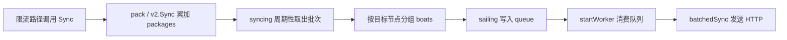

# Sync Client

## 模块概览

`syncer` 是 Harden 的跨机房同步客户端，负责把本地限流路径产生的配额占用聚合成批量请求，并异步发送到其他 Harden 节点。模块包含两个版本：

- `syncer`：v1 同步客户端，发送到 `/v1/sync`，并根据服务端返回的 `Permit` 结果在本地执行补偿预留。
- `syncer/v2`：v2 同步客户端，发送到 `/v2/sync?pod_name=...`，只负责广播同步请求，不读取响应体做本地补偿。

调用入口来自业务限流路径：

- `udpserver/server.go` 的 `handleReserveN` 调用 `syncer.Sync`
- `remote/rateLimit.go` 的 `RateLimit` 调用 `syncer.Sync`
- `remote/v2/rate_limit.go` 的 `RateLimit` 调用 `syncer/v2.Sync`
- `main.go` 分别调用 `syncer.Init` 和 `syncer/v2.Init` 启动后台同步循环

## 核心执行模型

同步客户端采用“调用方只入包、后台批量发送”的模型。限流路径调用 `Sync` 时不会直接发 HTTP 请求，而是把请求累加到内存中的 `packages` map。后台 `syncing` goroutine 周期性取出当前批次，按目标节点分组后写入 `queue`。多个 worker 从 `queue` 中消费并调用 `batchedSync` 发送 HTTP 批量请求。



这个设计把同步发送从限流主路径中剥离出来，主路径只做内存聚合和指标上报。实际网络发送由后台 worker 完成，并受 `config.C.Buffer` 和 `config.C.Worker` 控制。

## 全局状态

v1 和 v2 各自维护独立的全局状态，结构相同但请求类型不同。

v1 位于 `syncer/base.go`：

```go
var (
    packageRW sync.RWMutex
    packages  = map[string]*types.ReserveRequest{}

    queue   chan *batchedReq
    httpcli *http.Client
)
```

v2 位于 `syncer/v2/base.go`：

```go
var (
    packageRW sync.RWMutex
    packages  = map[v2.SyncKey]*v2.SyncRequest{}

    queue   chan *batchedReq
    httpcli *http.Client
)
```

关键字段含义：

- `packages`：当前等待打包发送的请求集合。v1 使用字符串 key，格式为 `group:preferred:fallback`；v2 使用结构化的 `v2.SyncKey`，包含 `Group`、`Preferred`、`Fallback`、`Mode`。
- `packageRW`：保护 `packages` 的读写锁。
- `queue`：后台发送队列，元素是 `batchedReq`。
- `httpcli`：共享 HTTP 客户端，超时时间为 `Timeout`，当前值是 `200ms`。
- `batchedReq`：一次发往单个目标节点的批量请求，包含 `server`、`reqs` 和入队时间 `t`。

`startWorker` 会丢弃入队超过 1 秒的请求，并上报 `syncOutOfTime`，避免过旧同步继续影响当前状态。

## 初始化与后台任务

`Init` 是同步客户端的启动入口。v1 和 v2 的初始化逻辑基本一致：

```go
func Init() {
    httpcli = &http.Client{Timeout: Timeout}
    queue = make(chan *batchedReq, config.C.Buffer)
    for i := 0; i < config.C.Worker; i++ {
        go startWorker()
    }
    go syncing()
    go stats()
}
```

初始化会启动三类 goroutine：

- `startWorker`：启动 `config.C.Worker` 个 worker，从 `queue` 消费 `batchedReq` 并调用 `batchedSync`。
- `syncing`：周期性把 `packages` 中的请求切成批次，并按目标服务地址分组。
- `stats`：每 5 秒记录当前同步队列长度。

v1 的 `stats` 会同时调用 `metrics.EmitStore("InSyncQueue", len(queue))` 并打印日志；v2 当前只打印日志。

## v1 同步流程

### `Sync`

v1 对外入口是：

```go
func Sync(group, preferred, fallback string, mode token.FallbackMode, n int64, flag bool, reserveFlag bool)
```

参数含义来自限流路径：

- `group`：限流组。
- `preferred`：优先资源标识。
- `fallback`：兜底资源标识。
- `mode`：fallback 模式，常见值在后续逻辑中按 `"shared"` 和 `"isolated"` 判断。
- `n`：本次需要同步的 quota 数量。
- `flag`：影响目标地址选择。`true` 时使用 preferred；`false` 时根据 mode 选择 fallback 或 preferred:fallback。
- `reserveFlag`：写入 `types.ReserveRequest.ReserveFlag`，随请求发送给服务端。

`Sync` 首先调用 `tokens.GetSyncDomains(group)` 判断该 group 是否需要跨域同步。没有同步域时只上报 `whetherSync` 和 `whetherSyncTokens` 的 `noSync` 状态，然后返回。存在同步域时调用 `pack` 聚合请求，并上报 `sync` 状态。

### `pack`

`pack` 把同一个 `group/preferred/fallback` 的请求合并为一个 `types.ReserveRequest`：

```go
key := group + ":" + preferred + ":" + fallback
atomic.AddInt64(&p.Quota, n)
```

实现上使用双重检查：

1. 先用 `packageRW.RLock` 读取 `packages[key]`。
2. 不存在时再加写锁创建 `types.ReserveRequest`。
3. 最后通过 `atomic.AddInt64` 累加 `Quota`。

需要注意，v1 的 key 不包含 `mode`、`flag` 或 `reserveFlag`。如果同一个 `group/preferred/fallback` 在同一打包周期内以不同模式进入，后进入的请求只会累加 `Quota`，不会更新已经创建的 `Mode`、`Flag` 或 `ReserveFlag`。

### `syncing`

v1 的打包周期由常量控制：

```go
const sailInterval = time.Millisecond * 5
```

`syncing` 每 5ms 执行一次：

1. 加写锁检查 `packages`。
2. 如果为空，释放锁并等待下一轮。
3. 如果非空，将当前 `packages` 整体赋给局部变量 `packed`。
4. 把全局 `packages` 替换为新 map。
5. 遍历 `packed`，按同步域和目标地址组织 `boats`。
6. 异步调用 `sailing(boats)` 入队发送。

这种“整体交换 map”的方式让新进入的 `Sync` 调用能立即写入新批次，减少后台打包对限流路径的阻塞时间。

### 目标地址选择

v1 按 `tokens.GetSyncDomains(p.Group)` 返回的同步域逐个发送。每个同步域通过 `addr.GetAddr(d)` 获取地址管理器，再根据请求状态选择具体地址：

```go
boat := addr.GetAddr(d).GetAddr(p.Preferred)
source := "preferred"

if !p.Flag {
    if p.Mode == "shared" {
        source = "fallback"
        boat = addr.GetAddr(d).GetAddr(p.Fallback)
    } else if p.Mode == "isolated" {
        source = "preferred:fallback"
        boat = addr.GetAddr(d).GetAddr(p.Preferred + ":" + p.Fallback)
    } else {
        logs.Warn("[harden]: errorType ...")
    }
}
```

选择规则：

- `Flag == true`：使用 `Preferred` 查找目标地址，`source` 为 `"preferred"`。
- `Flag == false && Mode == "shared"`：使用 `Fallback` 查找目标地址，`source` 为 `"fallback"`。
- `Flag == false && Mode == "isolated"`：使用 `Preferred + ":" + Fallback` 查找目标地址，`source` 为 `"preferred:fallback"`。
- 其他 mode：打印 `errorType` 警告，沿用前面默认的 preferred 地址。

地址为空时会打印 `no addr found`，并上报 `syncAddr`。当前代码没有跳过空地址，`continue` 被注释掉了，因此空字符串也会作为 `boats` 的 key 进入后续发送流程。

### `sailing`

`sailing` 把每个目标节点的一组请求写入 `queue`：

```go
select {
case queue <- &batchedReq{server, reqs, time.Now()}:
default:
    metrics.EmitCounter("bufferFull", 1)
    logs.Warn("buffer is full")
}
```

写队列是非阻塞的。队列满时不会阻塞限流路径或后台打包循环，而是丢弃该目标节点的本批请求，并上报 `bufferFull`。

### `batchedSync`

v1 的 `batchedSync` 负责向目标节点发送 HTTP POST：

```go
url := fmt.Sprintf("http://%s/v1/sync", r.server)
data, err := json.Marshal(r.reqs)
req, err := http.NewRequest(http.MethodPost, url, bytes.NewReader(data))
resp, err := httpcli.Do(req)
```

处理流程：

1. 空请求直接返回。
2. 上报 `syncTotal`。
3. 将 `[]types.ReserveRequest` 序列化为 JSON。
4. POST 到 `http://{server}/v1/sync`。
5. 要求 HTTP 状态码为 `200 OK`。
6. 读取响应体并反序列化为 `[]*types.ReserveResponse`。
7. 按 `group:preferred:fallback` 建立响应索引。
8. 对每个请求查找对应响应。
9. 如果 `req.Quota - resp.Permit > 0`，调用本地 token bucket 做强制预留。
10. 成功完成后上报 `syncSuccess`。

补偿逻辑如下：

```go
if overbooked := req.Quota - resp.Permit; overbooked > 0 {
    tokens.GetTokenBucket(req.Group).ForceReserveN(
        req.Preferred,
        req.Fallback,
        token.FallbackMode(req.Mode),
        time.Now(),
        overbooked,
    )
    metrics.EmitCounter("harden.server.total.tokens", overbooked, tagPairs...)
}
```

这里的语义是：远端返回的 `Permit` 小于本地请求的 `Quota` 时，差值被视为 overbooked，需要在本地 token bucket 中通过 `ForceReserveN` 补偿预留。

错误路径都会上报 `syncError`，并使用不同 `Status` 区分：

- `marshalError`
- `newRequestError`
- `sendError`
- `statusCodeError`
- `readBodyError`
- `unmarshalError`
- `getRespError`

## v2 同步流程

v2 位于 `syncer/v2`，包名为 `v2`。它保留了 v1 的后台队列模型，但请求结构、目标选择和响应处理都有变化。

### `Sync`

v2 对外入口是：

```go
func Sync(group, preferred, fallback string, mode token.FallbackMode, n int64)
```

v2 没有 `flag` 和 `reserveFlag` 参数，也不会先检查 `tokens.GetSyncDomains(group)` 是否为空。每次调用都会按结构化 key 聚合请求：

```go
key := v2.SyncKey{
    Group:     group,
    Preferred: preferred,
    Fallback:  fallback,
    Mode:      string(mode),
}
```

聚合对象是 `v2.SyncRequest`，`Quota` 同样通过 `atomic.AddInt64(&p.Quota, n)` 累加。

和 v1 不同，v2 的 key 包含 `Mode`，因此同一个 `group/preferred/fallback` 在不同 fallback mode 下会形成不同的同步请求。

### `syncing`

v2 的发送间隔不是固定常量，而是每轮读取 TCC 配置：

```go
time.Sleep(time.Duration(tcc.GetSendIntervalTime()) * time.Millisecond)
```

每轮同样会整体交换 `packages` map，然后按目标地址生成 `boats`。v2 的目标选择策略更偏广播：

```go
for _, boat := range addr.GetAddr(env.IDC()).GetAllAddrs() {
    boats[boat] = append(boats[boat], *p)
}
for _, syncIdc := range tokens.GetSyncDomains(p.Group) {
    for _, boat := range addr.GetAddr(syncIdc).GetAllAddrs() {
        boats[boat] = append(boats[boat], *p)
    }
}
```

也就是说，每个 `v2.SyncRequest` 会发送到：

- 当前 IDC，即 `env.IDC()` 下的所有地址。
- 该 group 配置的所有同步 IDC 下的所有地址。

v2 不再根据 `preferred`、`fallback` 或 `mode` 选择单个地址，而是对 IDC 下的全部地址广播。

### `batchedSync`

v2 发送到 `/v2/sync`，并附带当前 pod 名称：

```go
url := fmt.Sprintf("http://%s/v2/sync?pod_name=%v", r.server, env.PodName())
```

发送流程包括 JSON 序列化、创建 POST 请求、执行 HTTP 请求和检查 `200 OK`。与 v1 相比，v2 不读取响应体，也不会调用 `tokens.GetTokenBucket(...).ForceReserveN(...)` 做本地补偿。只要目标返回 200，就上报 `syncSuccess`。

## v1 与 v2 的主要差异

| 维度 | v1 `syncer` | v2 `syncer/v2` |
| --- | --- | --- |
| 对外入口 | `Sync(group, preferred, fallback, mode, n, flag, reserveFlag)` | `Sync(group, preferred, fallback, mode, n)` |
| 聚合 key | `group:preferred:fallback` 字符串 | `v2.SyncKey{Group, Preferred, Fallback, Mode}` |
| 发送间隔 | 固定 `5ms` | `tcc.GetSendIntervalTime()` 毫秒 |
| 目标选择 | 按同步域和 `preferred/fallback/mode/flag` 选择地址 | 当前 IDC + 同步 IDC 的全部地址 |
| HTTP 路径 | `/v1/sync` | `/v2/sync?pod_name=...` |
| 响应处理 | 解析 `ReserveResponse` 并执行本地补偿预留 | 不读取响应体 |
| 队列指标 | `stats` 上报 `InSyncQueue` | `stats` 只打印日志 |

## 并发与一致性

`packages` 是同步客户端的核心共享状态。调用方 goroutine 会通过 `Sync` 写入，后台 `syncing` goroutine 会周期性取走。代码使用 `packageRW` 保护 map 本身，并使用 `atomic.AddInt64` 累加请求中的 `Quota`。

需要关注的并发特性：

- map 的创建和替换由写锁保护。
- 已经存在的请求对象在释放锁后通过 atomic 累加 `Quota`。
- `syncing` 会把旧 map 赋给局部变量，然后立即创建新 map；后续新请求进入新批次。
- `batchedSync` 发送的是 `syncing` 取出的请求副本切片，v1/v2 在构造 `boats` 时都使用 `*p` 解引用，把当前请求值复制进切片。

这种模型适合高频小请求聚合，但贡献代码时要避免在无锁状态下修改 `packages` map 或请求对象中非原子字段。

## 指标与日志

该模块大量使用 `metrics.EmitCounter` 和 `metrics.EmitStore`，同步路径中的主要指标包括：

- `whetherSync`：v1 记录某次 `Sync` 是否需要同步。
- `whetherSyncTokens`：v1 按 token 数量记录是否需要同步。
- `syncAddr`：v1 记录地址选择结果，标签包含 `Group`、`Preferred`、`Fallback`、`Mode`、`Source`、`Flag`、`SyncDomains`。
- `bufferFull`：发送队列满，当前批次被丢弃。
- `syncOutOfTime`：请求在队列中停留超过 1 秒，被 worker 丢弃。
- `syncTotal`：开始向某个目标发送批量同步请求。
- `syncError`：同步发送或响应处理失败。
- `syncSuccess`：批量同步成功。
- `InSyncQueue`：v1 每 5 秒记录队列长度。
- `harden.server.total.tokens`：v1 发生 overbooked 补偿时记录差值 token 数。

`metrics.EmitCounter` 的调用会进入 metrics 模块的 `CtxEmitCounter`，再经过 `GetMetrics`、`GetPrecisionConfig`、`Precision` 和 `FormTags` 等逻辑处理精度和标签格式。因此新增指标时应复用已有标签常量，例如 `metrics.Group`、`metrics.Preferred`、`metrics.Fallback`、`metrics.Mode`、`metrics.TargetIp` 和 `metrics.Status`。

## 与其他模块的关系

`syncer` 不是独立的数据源，它连接了限流、地址发现、配置、指标和 token bucket：

- `tokens.GetSyncDomains(group)`：决定 group 需要同步到哪些 IDC 或 domain。
- `addr.GetAddr(idcOrDomain)`：获取目标地址集合或按 key 查找目标地址。
- `tokens.GetTokenBucket(group)`：v1 在远端许可不足时获取本地 token bucket 并调用 `ForceReserveN`。
- `token.FallbackMode`：在入口参数和补偿预留中表示 fallback 模式。
- `types.ReserveRequest` / `types.ReserveResponse`：v1 HTTP 协议结构。
- `types/v2.SyncKey` / `types/v2.SyncRequest`：v2 HTTP 协议结构。
- `config.C.Buffer` / `config.C.Worker`：控制后台队列容量和并发发送 worker 数。
- `tcc.GetSendIntervalTime()`：v2 控制打包发送间隔。
- `env.IDC()` / `env.PodName()`：v2 用于目标 IDC 选择和请求 URL 标识。
- `metrics`：记录同步决策、队列状态、发送结果和错误原因。

## 修改建议与注意事项

修改同步客户端时，优先保持以下约束：

- 不要在 `Sync` 中直接发 HTTP 请求；当前设计依赖异步聚合来降低限流路径延迟。
- 修改 `packages` 的 key 规则时，需要同步检查响应匹配逻辑。v1 的请求和响应都用 `group:preferred:fallback` 匹配。
- 新增请求字段时，要确认同一聚合 key 下字段是否可能不同；如果字段会影响发送语义，应考虑纳入 key。
- 调整发送间隔或 worker 数时，要同时观察 `bufferFull`、`syncOutOfTime` 和队列长度。
- v1 地址为空仍会入队发送，这是当前行为；如果要改为跳过，需要评估对 `syncAddr` 指标和异常发现能力的影响。
- v2 是广播模型，不做响应补偿；不要把 v1 的 `ReserveResponse` 处理直接搬到 v2，除非服务端协议也同步变更。