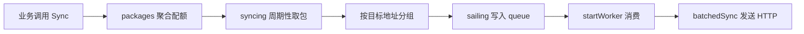

# Synchronization Clients

## 模块概览

`Synchronization Clients` 模块负责把本地消耗的配额异步同步到其他 Harden 实例。代码分为两个客户端实现：

- `syncer`：v1 同步客户端，向目标实例发送 `POST /v1/sync`，并根据返回的 `ReserveResponse` 对本地 token bucket 做补偿预留。
- `syncer/v2`：v2 同步客户端，向目标实例发送 `POST /v2/sync?pod_name=...`，只负责发送同步请求，不处理响应体中的补偿逻辑。

两个版本都采用相同的基本模式：调用方通过 `Sync` 写入内存聚合区，后台 goroutine 周期性打包请求，按目标地址分组后写入队列，再由 worker 批量 HTTP 发送。



## 初始化与后台任务

入口函数是两个包各自的 `Init`：

- `syncer.Init()` 在 `syncer/init.go`
- `v2.Init()` 在 `syncer/v2/init.go`

`main.go` 会调用这两个初始化函数。初始化时会创建全局 HTTP client 和队列：

```go
httpcli = &http.Client{Timeout: Timeout}
queue = make(chan *batchedReq, config.C.Buffer)
```

随后根据 `config.C.Worker` 启动多个 `startWorker` goroutine，并额外启动：

- `syncing()`：周期性从 `packages` 中取出聚合请求并分发。
- `stats()`：定期记录队列长度。

v1 的 `stats()` 会通过 `metrics.EmitStore("InSyncQueue", len(queue))` 上报队列长度，并写日志。v2 的 `stats()` 只写日志，不上报 `InSyncQueue`。

`startWorker()` 从 `queue` 中读取 `batchedReq`。如果请求在队列中停留超过 1 秒，会丢弃并上报 `syncOutOfTime`；否则调用 `batchedSync(r)` 发送。

## 核心数据结构

### v1 全局状态

`syncer/base.go` 定义了 v1 客户端的共享状态：

```go
var (
    packageRW sync.RWMutex
    packages  = map[string]*types.ReserveRequest{}

    queue   chan *batchedReq
    httpcli *http.Client
)
```

`packages` 是内存聚合区，key 由 `group + ":" + preferred + ":" + fallback` 拼接而成，value 是 `*types.ReserveRequest`。同一个 key 的多次同步请求会合并，配额通过 `atomic.AddInt64(&p.Quota, n)` 累加。

`batchedReq` 是 worker 队列中的发送单元：

```go
type batchedReq struct {
    server string
    reqs   []types.ReserveRequest
    t      time.Time
}
```

### v2 全局状态

`syncer/v2/base.go` 使用类型化 key：

```go
packages = map[v2.SyncKey]*v2.SyncRequest{}
```

`v2.SyncKey` 包含 `Group`、`Preferred`、`Fallback`、`Mode`。相比 v1，v2 的聚合 key 把 `Mode` 也纳入了 key，避免不同 fallback mode 的请求被合并到同一个包内。

## SDK 入口

### `syncer.Sync`

v1 入口位于 `syncer/sdk.go`：

```go
func Sync(group, preferred, fallback string, mode token.FallbackMode, n int64, flag bool, reserveFlag bool)
```

调用方包括：

- `udpserver/server.go` 的 `handleReserveN`
- `remote/rateLimit.go` 的 `RateLimit`

执行逻辑：

1. 构造 metrics tags，包括 `group`、`preferred`、`fallback`、`mode` 和 `version=v1`。
2. 调用 `tokens.GetSyncDomains(group)` 判断该 group 是否配置了同步域。
3. 如果没有同步域，直接上报 `whetherSync` 和 `whetherSyncTokens`，状态为 `noSync`，不进入聚合。
4. 如果有同步域，调用内部 `pack(...)` 聚合请求，并上报状态为 `sync` 的指标。

`pack(...)` 使用读写锁保护 `packages`，采用双重检查模式避免重复创建 `types.ReserveRequest`。新建请求时会保存：

- `Group`
- `Preferred`
- `Fallback`
- `Mode`
- `Flag`
- `ReserveFlag`

最后通过 `atomic.AddInt64(&p.Quota, n)` 累加 quota。

### `v2.Sync`

v2 入口位于 `syncer/v2/sdk.go`：

```go
func Sync(group, preferred, fallback string, mode token.FallbackMode, n int64)
```

调用方是 `remote/v2/rate_limit.go` 的 `RateLimit`。

v2 不在 `Sync` 阶段判断 `tokens.GetSyncDomains(group)`，而是直接写入 `packages`。目标地址选择在后续 `syncing()` 中完成。聚合 key 是 `v2.SyncKey`，包含 `Mode`，value 是 `*v2.SyncRequest`。

## 打包与目标地址选择

### v1 `syncing`

v1 打包逻辑在 `syncer/pack.go`。`syncing()` 每 `sailInterval` 执行一次：

```go
const sailInterval = time.Millisecond * 5
```

每轮会先加写锁，把当前 `packages` 整体取出，并把全局 `packages` 替换为空 map：

```go
packed := packages
packages = make(map[string]*types.ReserveRequest)
```

这意味着同步是分批异步发送的：新的 `Sync` 调用会进入新 map，不会阻塞当前批次的地址分组和发送。

v1 对每个 `ReserveRequest`，遍历 `tokens.GetSyncDomains(p.Group)` 返回的同步域，再根据请求状态选择目标地址：

- 默认使用 `p.Preferred`：
  ```go
  boat := addr.GetAddr(d).GetAddr(p.Preferred)
  source := "preferred"
  ```
- 当 `p.Flag == false` 且 `p.Mode == "shared"` 时，使用 `p.Fallback`：
  ```go
  source = "fallback"
  boat = addr.GetAddr(d).GetAddr(p.Fallback)
  ```
- 当 `p.Flag == false` 且 `p.Mode == "isolated"` 时，使用 `p.Preferred + ":" + p.Fallback`：
  ```go
  source = "preferred:fallback"
  boat = addr.GetAddr(d).GetAddr(p.Preferred + ":" + p.Fallback)
  ```
- 其他 mode 会记录 warning。

地址为空时会记录 warning 并上报 `syncAddr`，但当前代码没有 `continue`，仍然会把请求加入 `boats[boat]`。因此空地址会形成 `server == ""` 的批次，后续 `batchedSync` 会尝试访问 `http:///v1/sync` 并在创建或发送请求阶段失败。

分组完成后，`syncing()` 会用 goroutine 调用 `sailing(boats)`，将每个目标地址对应的请求列表写入发送队列。

### v2 `syncing`

v2 打包逻辑在 `syncer/v2/pack.go`。它不使用固定 5ms 间隔，而是每轮读取 TCC 配置：

```go
time.Sleep(time.Duration(tcc.GetSendIntervalTime()) * time.Millisecond)
```

v2 的目标地址策略与 v1 不同：

1. 先把请求发送到当前 IDC 的所有地址：
   ```go
   for _, boat := range addr.GetAddr(env.IDC()).GetAllAddrs()
   ```
2. 再遍历 `tokens.GetSyncDomains(p.Group)`，把请求发送到每个同步 IDC 的所有地址：
   ```go
   for _, boat := range addr.GetAddr(syncIdc).GetAllAddrs()
   ```

因此 v2 是按 IDC 广播到多个实例，而 v1 是根据 `preferred/fallback/mode/flag` 选择特定目标地址。

## 队列写入与背压

两个版本都通过 `sailing` 把按地址分组后的请求写入 `queue`：

```go
select {
case queue <- &batchedReq{server, reqs, time.Now()}:
default:
    metrics.EmitCounter("bufferFull", 1)
    logs.Warn("buffer is full")
}
```

这里使用非阻塞发送。队列满时不会阻塞业务路径或打包 goroutine，而是直接丢弃该批次，并上报 `bufferFull`。这说明该模块的同步语义是 best-effort：吞吐和低延迟优先于强一致送达。

worker 消费时还会检查请求年龄：

```go
if time.Since(r.t) > time.Second {
    metrics.EmitCounter("syncOutOfTime", 1)
    continue
}
```

超过 1 秒的批次会被丢弃，避免发送过期同步数据。

## HTTP 发送逻辑

### v1 `batchedSync`

v1 发送逻辑在 `syncer/send.go`：

```go
func batchedSync(r *batchedReq)
```

当 `r.reqs` 为空时直接返回。否则：

1. 上报 `syncTotal`。
2. 构造 URL：
   ```go
   url := fmt.Sprintf("http://%s/v1/sync", r.server)
   ```
3. 将 `[]types.ReserveRequest` 序列化为 JSON。
4. 创建 `POST` 请求。
5. 使用全局 `httpcli` 发送，超时时间为 `Timeout = 200ms`。
6. 要求响应状态码为 `http.StatusOK`。
7. 读取响应体并反序列化为 `[]*types.ReserveResponse`。
8. 按 `group:preferred:fallback` 建立响应索引。
9. 对每个原始请求检查响应中的 `Permit`。

关键补偿逻辑：

```go
if overbooked := req.Quota - resp.Permit; overbooked > 0 {
    tokens.GetTokenBucket(req.Group).ForceReserveN(
        req.Preferred,
        req.Fallback,
        token.FallbackMode(req.Mode),
        time.Now(),
        overbooked,
    )
    metrics.EmitCounter("harden.server.total.tokens", overbooked, tagPairs...)
}
```

当请求的 `Quota` 大于远端允许的 `Permit` 时，差值被认为是 overbooked token。客户端会调用 `ForceReserveN` 在本地 token bucket 中强制预留这部分 token，避免本地继续超发。

错误路径会按阶段上报 `syncError`：

- `marshalError`
- `newRequestError`
- `sendError`
- `statusCodeError`
- `readBodyError`
- `unmarshalError`
- `getRespError`

成功完成后上报 `syncSuccess`。

### v2 `batchedSync`

v2 发送逻辑在 `syncer/v2/send.go`，整体更轻：

```go
url := fmt.Sprintf("http://%s/v2/sync?pod_name=%v", r.server, env.PodName())
```

它发送 `[]v2.SyncRequest`，但不读取响应体、不反序列化响应，也不调用 `ForceReserveN`。只要 HTTP 状态码是 200，就上报 `syncSuccess`。

错误阶段包括：

- `marshalError`
- `newRequestError`
- `sendError`
- `statusCodeError`

## 指标与观测

该模块大量使用 `metrics.EmitCounter` 和少量 `metrics.EmitStore`。这些调用会进入 metrics 模块的标签格式化和精度配置流程，例如 `batchedSync -> EmitCounter -> CtxEmitCounter -> GetMetrics -> GetPrecisionConfig -> Precision`，以及 `batchedSync -> EmitCounter -> CtxEmitCounter -> FormTags`。

重要指标包括：

- `whetherSync`：v1 判断某次调用是否需要同步。
- `whetherSyncTokens`：v1 按 token 数量统计是否同步。
- `syncAddr`：v1 地址选择结果统计。
- `bufferFull`：队列满导致批次丢弃。
- `syncOutOfTime`：批次在队列中超过 1 秒被丢弃。
- `syncTotal`：尝试发送同步请求。
- `syncError`：发送或响应处理失败。
- `syncSuccess`：同步请求成功完成。
- `InSyncQueue`：v1 队列长度 store 指标。
- `harden.server.total.tokens`：v1 远端 permit 不足时，本地强制 reserve 的 token 数量。

日志主要用于记录队列长度、地址缺失、HTTP 发送失败、非 200 响应、响应解析失败等异常。

## 并发模型

`packages` 是同步入口和后台打包协程之间的共享内存，因此两个版本都使用 `packageRW` 保护 map 本身。

`Sync` / `pack` 的并发模式是：

1. 读锁查找已有请求。
2. 未命中时加写锁再次检查。
3. 必要时创建请求对象并写入 map。
4. 释放锁后使用 `atomic.AddInt64` 累加 quota。

`syncing` 的并发模式是：

1. 加写锁。
2. 如果 `packages` 为空则释放锁并进入下一轮。
3. 把当前 map 整体移动到局部变量 `packed`。
4. 用新的空 map 替换全局 `packages`。
5. 释放锁。
6. 在锁外执行地址分组和队列发送。

这种设计减少了锁持有时间，让业务调用 `Sync` 时只需要和 map 查找/创建竞争，不会等待 HTTP 发送。

需要注意的是，`syncing` 取走 map 后，`Sync` 仍可能持有旧请求指针并执行 `atomic.AddInt64`。当前代码通过指针和原子加法保证单个 `Quota` 字段的并发累加是安全的，但被取走批次的 quota 与新批次之间的边界取决于具体交错时序。贡献代码时应避免把 `Quota` 改成非原子更新。

## v1 与 v2 的主要差异

| 维度 | v1 `syncer` | v2 `syncer/v2` |
| --- | --- | --- |
| SDK 函数 | `Sync(group, preferred, fallback, mode, n, flag, reserveFlag)` | `Sync(group, preferred, fallback, mode, n)` |
| 聚合 key | `group:preferred:fallback` 字符串 | `v2.SyncKey`，包含 `Mode` |
| 是否在入口判断同步域 | 是，`tokens.GetSyncDomains(group)` 为空则不聚合 | 否，始终聚合 |
| 发送间隔 | 固定 `5ms` | `tcc.GetSendIntervalTime()` |
| 地址选择 | 按 sync domain 和 `preferred/fallback/mode/flag` 选单地址 | 当前 IDC 全地址 + sync domains 全地址 |
| HTTP 路径 | `/v1/sync` | `/v2/sync?pod_name=...` |
| 响应处理 | 读取 `ReserveResponse` 并执行补偿 reserve | 不读取响应体 |
| 队列长度指标 | 上报 `InSyncQueue` | 只写日志 |

## 与其他模块的关系

`Synchronization Clients` 位于限流和 token 管理链路之间：

- 上游调用方在处理请求或限流结果时调用 `syncer.Sync` 或 `v2.Sync`。
- `tokens.GetSyncDomains` 决定 group 需要同步到哪些 IDC。
- `addr.GetAddr` 提供目标实例地址。
- `tcc.GetSendIntervalTime` 控制 v2 发送间隔。
- `metrics` 负责同步链路观测。
- v1 的 `batchedSync` 会在远端 permit 不足时调用 `tokens.GetTokenBucket(...).ForceReserveN(...)`，直接影响本地 token bucket 状态。

因此，修改本模块时需要同时考虑地址发现、同步域配置、队列容量、worker 数量、HTTP 超时和 token bucket 补偿行为。

## 贡献注意事项

新增或修改同步字段时，需要同时检查请求结构体、聚合 key 和响应匹配 key。v1 当前用 `group:preferred:fallback` 匹配响应，如果新增字段会影响唯一性，需要同步调整 key 构造逻辑。v2 已经使用 `v2.SyncKey`，更适合扩展。

调整发送频率或 worker 数量时，需要关注 `bufferFull`、`syncOutOfTime`、`syncError` 和队列长度。该模块不会重试失败批次，也不会阻塞等待队列空间，因此容量不足会直接转化为同步丢失。

修改 v1 地址选择逻辑时，要特别注意 `Flag`、`Mode`、`Preferred`、`Fallback` 的组合语义。`shared` 和 `isolated` 在 `Flag == false` 时走不同地址 key，这会影响同步目标以及后续远端 permit 计算。

修改 v1 响应处理时，应保留 `ForceReserveN` 的补偿语义，除非同时调整上游限流一致性模型。这里是 v1 客户端在远端发现超额后回写本地 token bucket 的关键路径。