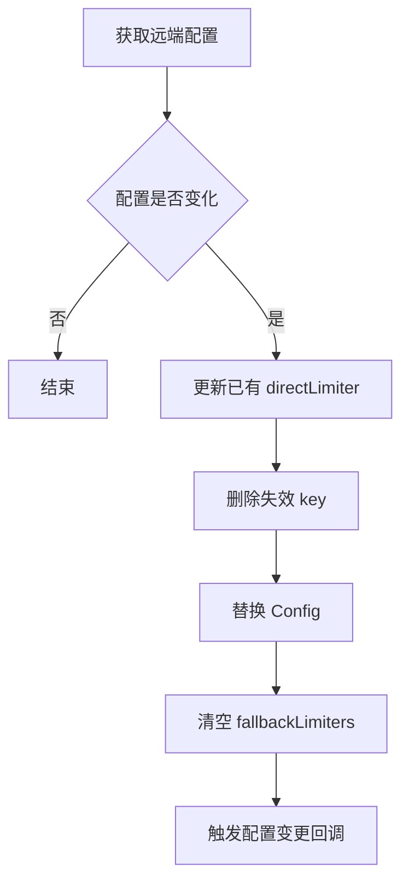
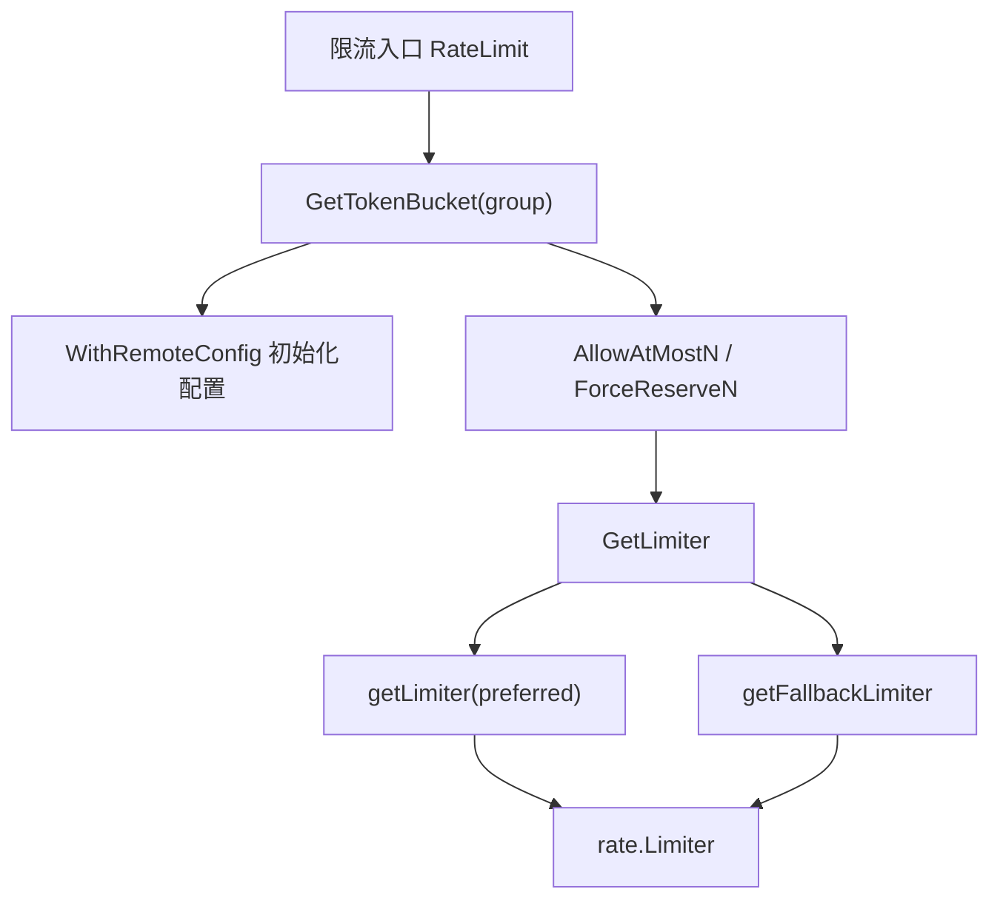

# Token Buckets

## 模块概览

`Token Buckets` 模块为每个限流分组和限流 key 管理本地令牌桶。它主要由三个包组成：

- `token`：核心令牌桶实现，负责 limiter 创建、配置更新、fallback 策略、指标上报和状态导出。
- `tokens`：按 `group` 管理全局 `TokenBuckets` 实例，并对接远端配置、跨 IDC 同步域和启动状态初始化。
- `types`：定义同步/预留令牌时使用的请求与响应结构体。

该模块连接在远端限流入口、UDP 预留入口和同步逻辑之间。典型调用路径是 `remote/v2/rate_limit.go` 或 `udpserver/server.go` 先通过 `tokens.GetTokenBucket(group)` 获取分组桶，再调用 `AllowAtMostN`、`ForceReserveN` 或 `IsThrottled` 执行限流判断。

## 核心数据结构

### `TokenBuckets`

`token.TokenBuckets` 是模块的核心类型：

```go
type TokenBuckets struct {
	sync.RWMutex
	directLimiters   map[string]*directLimiter
	fallbackLimiters map[string]*fallbackLimiter

	getConfig      func() (*model.LimiterConfig, error)
	onConfigChange []ConfigChangeCB
	Config         *model.LimiterConfig

	group string
	stop  int32
}
```

它维护两类 limiter：

- `directLimiters`：显式配置 key 对应的令牌桶。
- `fallbackLimiters`：当 `preferred` key 未配置时，基于 `fallback` key 临时创建的令牌桶。

`TokenBuckets` 内部使用 `sync.RWMutex` 保护 map 和配置访问。远端配置轮询停止状态通过 `stop int32` 和 `atomic` 控制。

### `Limiter` 接口

`Limiter` 抽象了底层 `rate.Limiter` 的能力：

```go
type Limiter interface {
	Allow() bool
	AllowN(time.Time, int64) bool
	IsThrottled(n int64) bool
	Wait(context.Context) error
	AllowAtMostN(int64) int64
	ReserveN(now time.Time, n int64) Reservation
	Restore()
	RestoreN(int64)
	Limit() Limit
	Last() time.Time
	Tokens() float64
}
```

业务入口通常不直接使用底层 `rate.Limiter`，而是通过 `TokenBuckets.GetLimiter` 间接获取 `Limiter`。

### `directLimiter` 与 `fallbackLimiter`

`directLimiter` 只是对 `rate.Limiter` 的轻量包装，主要用于把 `rate.Limit` 转换成模块内的 `token.Limit`：

```go
type directLimiter struct {
	*rate.Limiter
}
```

`fallbackLimiter` 复用 `directLimiter`，并记录 fallback 模式：

```go
type fallbackLimiter struct {
	*directLimiter
	fallbackInfo
}
```

`fallbackInfo.FallbackMode` 用于区分当前 fallback limiter 是共享模式还是隔离模式。

## Fallback 模式

模块支持两种 fallback 模式：

```go
const (
	FallbackModeShared   FallbackMode = "shared"
	FallbackModeIsolated FallbackMode = "isolated"
)
```

当 `preferred` key 没有配置，但 `fallback` key 有配置时，`getFallbackLimiter` 会根据模式创建 limiter。

### `FallbackModeIsolated`

隔离模式下，`preferred:fallback` 会获得一个独立 limiter：

```go
key := preferred + ":" + fallback
fl = &fallbackLimiter{
	directLimiter: &directLimiter{
		rate.NewLimiter(rate.Limit(c.GetQps()), c.GetBurst()),
	},
	fallbackInfo: fallbackInfo{FallbackMode: mode},
}
```

这意味着多个不同的 `preferred` key 即使使用同一个 `fallback`，也不会共享令牌。

### `FallbackModeShared`

共享模式下，fallback limiter 会复用 `fallback` key 对应的 `directLimiter`：

```go
dl := t.directLimiters[fallback]
if dl == nil {
	dl = &directLimiter{rate.NewLimiter(rate.Limit(c.GetQps()), c.GetBurst())}
	t.directLimiters[fallback] = dl
}
fl = &fallbackLimiter{
	directLimiter: dl,
	fallbackInfo: fallbackInfo{FallbackMode: mode},
}
```

这意味着所有使用同一个 `fallback` key 的请求会竞争同一个令牌桶。

## 创建与配置加载

### 本地创建

`NewTokenBuckets(group string, opts ...Option)` 创建一个空的分组桶：

```go
tb := token.NewTokenBuckets("video_arch")
```

默认状态下，`Config.Configs` 是空 map，`Meta` 是空对象。没有任何 limiter 会被预先创建，limiter 都是按需懒加载。

### 本地配置

`WithLocalConfig` 直接替换当前配置：

```go
tb := token.NewTokenBuckets(
	"video_arch",
	token.WithLocalConfig(cfg),
)
```

这个选项常用于测试场景，例如 `token_bucket_test.go` 中的 `TestDefaultBurst` 和 `TestTokenBucket`。

### 远端配置

`WithRemoteConfig` 会设置远端配置获取函数，立即执行一次 `updateConfig()`，然后启动后台轮询：

```go
token.WithRemoteConfig(getConfigFn(group), updateInterval)
```

在 `tokens.GetTokenBucket` 中，远端配置来源是：

```go
func getConfigFn(group string) func() (*model.LimiterConfig, error) {
	return func() (*model.LimiterConfig, error) {
		return james.GetGlobalConfig(group)
	}
}
```

默认轮询间隔是 `30 * time.Second`。

## 配置更新流程

`updateConfig` 是配置热更新的核心函数：

1. 调用 `t.getConfig()` 获取新的 `model.LimiterConfig`。
2. 如果 `t.Config.Equals(c)` 返回 true，直接结束。
3. 遍历已有 `directLimiters`：
   - 新配置中不存在的 key 会从 `directLimiters` 删除。
   - QPS 变化时调用 `SetLimit`。
   - Burst 变化时调用 `SetBurst`。
4. 将 `t.Config` 替换为新配置。
5. 清空所有 `fallbackLimiters`。
6. 解锁后依次执行 `onConfigChange` 回调。

清空 `fallbackLimiters` 是有意设计：fallback limiter 由 fallback 配置派生而来，配置变化后不逐个判断，直接丢弃并在下一次请求时按新配置重建。



## 获取 limiter 的执行路径

业务方法最终都会走到 `GetLimiter(preferred, fallback, mode)`。

优先级如下：

1. 先调用 `getLimiter(preferred)`。
2. 如果 `preferred` 有显式配置，返回 direct limiter，第二个返回值为 `true`。
3. 如果没有 direct limiter，再调用 `getFallbackLimiter(preferred, fallback, mode)`。
4. 如果 fallback 可用，返回 fallback limiter，第二个返回值为 `false`。
5. 如果两者都不可用，返回 `nil, false`。

这个布尔值会被上层用于区分命中的是 preferred 还是 fallback。例如 `AllowAtMostN` 返回 `(permit, flag)`，其中 `flag` 表示是否命中了 preferred direct limiter。

## 限流 API

### `Allow`

```go
func (t *TokenBuckets) Allow(name string) bool
```

只检查单个 key，相当于：

```go
return t.AllowOptional(name, "", "")
```

如果 key 没有配置 limiter，默认放行。

### `AllowOptional`

```go
func (t *TokenBuckets) AllowOptional(preferred, fallback string, mode FallbackMode) bool
```

获取 preferred 或 fallback limiter 后调用 `Limiter.Allow()`。没有 limiter 时返回 `true`。

### `AllowN`

```go
func (t *TokenBuckets) AllowN(preferred, fallback string, mode FallbackMode, n int64) bool
```

使用当前时间调用 `Limiter.AllowN(time.Now(), n)`。没有 limiter 时返回 `true`。

### `AllowAtMostN`

```go
func (t *TokenBuckets) AllowAtMostN(preferred, fallback string, mode FallbackMode, n int64) (int64, bool)
```

最多消耗 `n` 个令牌，返回实际允许数量和是否命中 preferred limiter。

没有 limiter 时返回：

```go
return n, false
```

这表示未配置限流时默认允许全部额度。

### `ForceReserveN`

```go
func (t *TokenBuckets) ForceReserveN(preferred, fallback string, mode FallbackMode, now time.Time, n int64) bool
```

强制调用 `ReserveN(now, n)`，不关心令牌是否足够，常用于同步远端已经发生的消耗。返回值同样表示是否命中 preferred limiter。

### `Restore`

```go
func (t *TokenBuckets) Restore(preferred, fallback string, mode FallbackMode)
```

获取 limiter 后调用 `Limiter.Restore()`，用于归还一次令牌消耗。

### `IsThrottled`

```go
func (t *TokenBuckets) IsThrottled(preferred, fallback string, mode FallbackMode, n int64) bool
```

判断请求 `n` 个令牌是否会被限流。没有 limiter 时返回 `false`。

## 指标上报

`GetLimiter` 在成功获取 direct 或 fallback limiter 后，会异步上报指标：

- `rate_limit_config.token`：当前 token 数。
- `rate_limit_config.limit`：当前限流速率。
- `rate_limit_config.burst`：当前 burst。
- `BaseInfo`：基础信息标记。

指标标签包括：

- `metrics.Group`
- `metrics.Preferred`
- `metrics.Fallback`
- `metrics.Mode`

direct limiter 的 mode 固定为 `"preferred"`；fallback limiter 的 mode 使用实际的 `FallbackMode` 字符串。

指标上报 goroutine 内部有 `recover`，panic 会通过 `metrics.EmitCounter(metrics.Panic, 1, metrics.Function, "getLimiter")` 记录。

## 分组级全局管理

`tokens/group.go` 维护进程内的全局分组桶：

```go
var (
	tbs = make(map[string]*token.TokenBuckets)
	mu  sync.RWMutex
)
```

`GetTokenBucket(group string)` 是获取分组桶的统一入口。

它的行为是：

1. 先读锁检查 `tbs[group]` 是否存在。
2. 不存在时创建新的 `TokenBuckets`。
3. 新实例会安装 `updateSyncDomain(group)` 回调，并启用远端配置轮询。
4. 加写锁后再次检查，避免并发重复注册。
5. 如果别的 goroutine 已经注册成功，则停止当前新实例的后台配置更新。

这里的 `newOne.StopUpdatingConfig()` 是并发保护的一部分，避免重复创建的临时实例继续轮询远端配置。

## 同步域管理

配置变更回调 `updateSyncDomain(group)` 会读取 `model.LimiterConfig.Meta.SyncDomains`，并写入 `syncDomains`：

```go
func updateSyncDomain(group string) token.ConfigChangeCB {
	return func(c *model.LimiterConfig) {
		setSyncDomains(group, c.Meta.SyncDomains)
	}
}
```

`GetSyncDomains(group string)` 根据当前 IDC 返回需要同步到的其他 IDC：

- 如果没有 group 专属配置，返回全局 `config.C.SyncTo`。
- 如果当前 IDC 出现在某个 sync domain 中，返回同一 domain 内除当前 IDC 外的其他 IDC。
- 如果没有匹配 domain，返回 `nil`。

该函数被 `syncer/pack.go`、`syncer/v2/pack.go` 和 `syncer/sdk.go` 使用，用于决定令牌消耗同步目标。

## 状态导出与启动初始化

### `GetAllInitInfos`

`token.TokenBuckets.GetAllInitInfos()` 会导出当前分组内所有 direct 和 fallback limiter 的运行状态：

```go
type InitInfo struct {
	Last         time.Time
	Limiter      float64
	Burst        int64
	Tokens       float64
	FallbackMode FallbackMode
}
```

direct limiter 的 `FallbackMode` 为空字符串；fallback limiter 会记录实际 fallback 模式。

`tokens.GetAllInitInfos()` 会遍历全局 `tbs`，返回所有 group 的状态快照。远端接口 `remote/v2/get_all_token_buckets.go` 会调用它。

### `InitAllInitInfos`

`tokens.InitAllInitInfos(cnt int)` 用于进程启动时从同 IDC 的其他节点拉取令牌桶状态：

1. 通过 `addr.GetAddr(env.IDC()).GetAddr(strconv.Itoa(cnt))` 选取一个节点。
2. 请求 `http://{server}/v2/get_all_token_buckets`。
3. 解析返回的 `map[string]map[string]*token.InitInfo`。
4. 对每个 group 调用 `GetTokenBucket(group).InitTokenBucket(initInfos)`。
5. 失败时最多递归重试 3 次。

失败和成功都会通过 `metrics.EmitCounter("InitAllInitInfos", ...)` 上报状态。

### `InitTokenBucket`

`InitTokenBucket` 根据 `InitInfo.FallbackMode` 判断恢复 direct 还是 fallback limiter：

- `FallbackMode == ""`：写入 `directLimiters`。
- 否则：写入 `fallbackLimiters`，并恢复 fallback 模式。

底层使用 `rate.NewLimiterWithInitValues`，保留 `Last`、`Limiter`、`Burst` 和 `Tokens`，避免重启后令牌桶完全重置。

## 与请求链路的关系

常见执行流如下：



关键入口包括：

- `remote/v2/rate_limit.go`：调用 `GetTokenBucket`、`AllowAtMostN`、`ForceReserveN`。
- `remote/rateLimit.go`：调用 `GetTokenBucket`、`AllowAtMostN`、`ForceReserveN`。
- `udpserver/server.go`：在 `handleReserveN` 中调用 `GetTokenBucket` 和 `AllowAtMostN`。
- `remote/isThrottled.go`：调用 `GetTokenBucket` 和 `IsThrottled`。
- `remote/sync.go`、`remote/v2/sync.go`：调用 `GetTokenBucket` 和 `ForceReserveN`。
- `syncer` 包：通过 `GetSyncDomains` 决定跨 IDC 同步目标。

## 同步请求结构

`types/reserve.go` 定义了同步和预留令牌时使用的数据结构：

```go
type ReserveRequest struct {
	Group       string
	Preferred   string
	Fallback    string
	Mode        string
	Quota       int64
	Flag        bool
	ReserveFlag bool
}

type ReserveResponse struct {
	Group     string
	Preferred string
	Fallback  string
	Permit    int64
}
```

`ReserveRequest` 被 `syncer/sdk.go` 的 `pack` 使用。`ReserveResponse` 被 `remote/sync.go` 使用，用于返回实际允许的额度。

## 并发与容错要点

`TokenBuckets` 的 limiter map 和配置由读写锁保护。读取路径先用读锁快速检查，创建路径再切换到写锁并重新检查，避免重复创建 limiter。

`asyncUpdate` 和 `GetLimiter` 的异步指标上报都带有 `recover`。配置轮询 panic 会上报 `metrics.Panic`，并记录函数名 `"asyncUpdate"`；指标上报 panic 会记录函数名 `"getLimiter"`。

未配置 limiter 时，模块默认放行：

- `AllowOptional`、`AllowN` 返回 `true`。
- `AllowAtMostN` 返回请求的完整 `n`。
- `IsThrottled` 返回 `false`。

因此，该模块的语义是“配置驱动限流”：只有配置中存在 preferred 或 fallback key 时才实际限制请求。