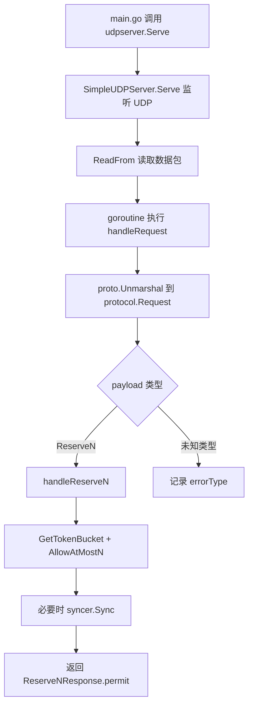

# UDP Server Protocol

## 模块概览

`udpserver` 模块提供 Harden 的 UDP 协议入口，用于接收客户端的令牌预留请求。当前协议只支持一种请求类型：`ReserveNRequest`，服务端根据 `group`、`preferred`、`fallback`、`mode` 和 `quota` 调用本地 token bucket 判断可放行数量，并通过 UDP 返回 `ReserveNResponse.permit`。

核心文件：

- `udpserver/server.go`：UDP 服务启动、收包、解包、业务处理和响应。
- `udpserver/protocol/payload.proto`：UDP 请求/响应的 protobuf 协议定义。
- `udpserver/protocol/payload.pb.go`：由 `protoc-gen-go` 生成的 Go 类型。
- `udpserver/protocol/gen_proto.sh`：重新生成 protobuf Go 代码的脚本。
- `udpserver/stackprinter.go`：格式化调用栈的辅助函数，目前不在 `server.go` 主流程中使用。

## 协议模型

UDP 包体使用 `github.com/golang/protobuf/proto` 编码。顶层消息通过 `oneof payload` 承载具体请求或响应。

```proto
message ReserveNRequest {
    string from = 1;
    string group = 2;
    string preferred = 3;
    int32 quota = 4;
    string fallback = 5;
    string mode = 6;
}

message ReserveNResponse {
    int32 permit = 1;
}

message Request {
    oneof payload {
        ReserveNRequest reserveN = 1;
    }
}

message Response {
    oneof payload {
        ReserveNResponse reserveN = 1;
    }
}
```

字段语义：

- `from`：调用方来源标识。当前服务端没有读取该字段。
- `group`：令牌桶分组，传给 `tokens.GetTokenBucket(req.Group)`。
- `preferred`：优先尝试消耗的资源标识。
- `fallback`：降级资源标识。
- `quota`：客户端请求的令牌数量。服务端会将负数修正为 `0`。
- `mode`：降级模式字符串，会转换为 `token.FallbackMode(req.Mode)`。
- `permit`：最终允许通过的令牌数量，由 `AllowAtMostN` 返回。

当前 `Request` 和 `Response` 的 `oneof` 中都只有 `reserveN` 一种类型。如果新增协议动作，需要同时修改 `payload.proto`、重新生成 `payload.pb.go`，并扩展 `handleRequest` 的类型分发逻辑。

## 启动入口

外部通过包级函数 `udpserver.Serve(address string) error` 启动服务。调用链中 `main.go` 会调用该函数。

`Serve(address)` 的职责很薄：

1. 安装 `recover`，避免启动流程 panic 直接打崩进程。
2. 上报 `udphandleRequest.throughput`，状态为 `startUdpServer`。
3. 创建 `SimpleUDPServer`。
4. 调用实例方法 `(*SimpleUDPServer).Serve(address)`。

实例方法 `(*SimpleUDPServer).Serve(address)` 才是真正的 UDP 循环：

1. 调用 `net.ListenPacket("udp", address)` 监听 UDP 地址。
2. 成功后把连接保存到 `s.conn`。
3. 循环分配 `maxBufferSize` 大小的缓冲区。
4. 调用 `s.conn.ReadFrom(buffer)` 读取单个 UDP 包。
5. 对每个成功读取的包启动 goroutine：`go s.handleRequest(buffer[:n], addr)`。

服务当前没有主动退出机制，也没有关闭 `s.conn` 的路径。`Serve` 方法中的 `return nil` 在无限循环后不可达，只是满足函数签名。

## 请求处理流程



`handleRequest(data []byte, addr net.Addr)` 负责协议层解析和分发：

- 使用 `proto.Unmarshal(data, &req)` 解码为 `protocol.Request`。
- 解码失败时上报 `UnmarshalError` 并返回，不会响应客户端。
- 通过 type switch 判断 `req.Payload`：
  - `*protocol.Request_ReserveN`：上报 `successReceieve`，调用 `s.handleReserveN(r.ReserveN, addr)`。
  - 其他类型：上报 `errorType` 并记录错误日志。

`handleRequest` 内部也有 `recover`，panic 会被记录为 `udpHandleRequest`，并上报 `metrics.Panic`。该函数还通过 `defer metrics.EmitTimer("udphandleRequest."+metrics.Latency, time.Now())` 统计请求处理延迟。

## ReserveN 处理逻辑

`handleReserveN(req *protocol.ReserveNRequest, addr net.Addr)` 是业务核心。它完成以下步骤：

1. 组装指标标签：

   ```go
   tagPairs := []string{
       metrics.Group, req.Group,
       metrics.Preferred, req.Preferred,
       metrics.Fallback, req.Fallback,
       metrics.Mode, req.Mode,
       metrics.Version, "v1",
   }
   ```

2. 统计 `handleReserveN.latency`。
3. 对测试分组 `bytedance.videoarch.unit_testing_server_error` 特殊处理：睡眠 5 秒后直接返回，不发送响应。
4. 将负数 `req.Quota` 修正为 `0`。
5. 上报 `BaseInfo` store 指标。
6. 通过 `tokens.GetTokenBucket(req.Group)` 获取分组对应的 token bucket。
7. 调用：

   ```go
   n, flag := t.AllowAtMostN(
       req.Preferred,
       req.Fallback,
       token.FallbackMode(req.Mode),
       int64(req.Quota),
   )
   ```

8. 如果 `n > 0`，调用 `syncer.Sync(req.Group, req.Preferred, req.Fallback, token.FallbackMode(req.Mode), n, flag, false)` 同步消耗结果。
9. 上报通过和未通过的令牌数量：
   - `harden.server.tokens`，`status=pass`，值为 `n`。
   - `harden.server.tokens`，`status=notPass`，值为 `int64(req.Quota)-n`。
10. 构造并编码 `protocol.Response_ReserveN`，通过 `s.conn.WriteTo(data, addr)` 发回客户端。

当前代码会计算 `outputPreferred` 和 `outputFallback`，将空字符串替换成 `"nil"`，但这两个变量没有参与后续逻辑。指标标签仍然使用 `req.Preferred` 和 `req.Fallback` 的原始值。

## 与其他模块的连接

`udpserver` 自身只负责网络协议和请求编排，真正的限流与配置逻辑在其他模块中完成：

- `tokens.GetTokenBucket(req.Group)`：按 `group` 获取 token bucket。调用链会进入 `token.WithRemoteConfig` 和 `updateConfig`，并读取远程配置中的限流参数。
- `t.AllowAtMostN(...)`：根据 `preferred`、`fallback`、`mode` 和 `quota` 计算允许数量。执行流最终会进入 `token/token_bucket.go` 或 `rate/rate.go` 中的 `Limit`。
- `syncer.Sync(...)`：当实际放行数量 `n > 0` 时同步令牌消耗结果。
- `metrics.EmitCounter`、`metrics.EmitTimer`、`metrics.EmitStore`：记录吞吐、延迟、令牌结果和基础标签。指标内部会经过 `GetMetrics`、`GetPrecisionConfig` 和 `Precision`，因此采样精度受 TCC 配置影响。
- `logs`：记录监听错误、解码错误、未知请求类型和 panic。

## 并发和网络行为

每个 UDP 包都会启动一个 goroutine 调用 `handleRequest`。这意味着服务端可以并发处理多个请求，但也要求下游组件具备并发安全性，尤其是 `tokens.GetTokenBucket` 返回的 bucket、`AllowAtMostN` 和 `syncer.Sync`。

关键常量：

```go
const (
    maxBufferSize = 1024
    writeTimeout  = time.Millisecond * 10
)
```

`maxBufferSize` 限制单个 UDP 包最多读取 1024 字节。超过该大小的 UDP 数据会被截断，随后 `proto.Unmarshal` 可能失败。

`writeTimeout` 当前未被使用。`handleReserveN` 直接调用 `s.conn.WriteTo(data, addr)`，没有设置写超时，也没有检查 `WriteTo` 的返回错误。客户端侧需要自行处理 UDP 丢包、无响应和超时重试。

## 错误处理和可观测性

启动阶段：

- `net.ListenPacket` 失败时记录 `[harden]: ListenPacket error`，上报 `ServeError`，并返回错误。
- 启动成功后上报 `listernSuccess`。注意指标状态字符串和日志里都使用了 `listern` 拼写。

收包阶段：

- `ReadFrom` 失败时记录 warn，状态为 `readFromBufferError`，继续循环。
- 成功读取时状态为 `readFromBufferSuccess`。

协议解析阶段：

- protobuf 解码失败：`UnmarshalError`。
- 成功接收 `ReserveN`：`successReceieve`。
- 未知 payload：`errorType`。

业务处理阶段：

- `handleReserveN.latency`：按 `group`、`preferred`、`fallback`、`mode`、`version=v1` 打标签。
- `harden.server.tokens`：分别记录 `pass` 和 `notPass`。
- `handleReserveN.throughput`：成功完成处理时状态为 `success`。

panic 保护：

- 包级 `Serve` 的 panic 上报函数名为 `udpServeStart`。
- `handleRequest` 的 panic 上报函数名为 `udpHandleRequest`。

## 生成协议代码

协议源文件是 `udpserver/protocol/payload.proto`。生成脚本是：

```bash
udpserver/protocol/gen_proto.sh
```

脚本会以 `payload.proto` 所在目录作为 `SRC_DIR` 和 `DST_DIR`，执行：

```bash
protoc -I=$SRC_DIR --go_out=$DST_DIR $SRC_DIR/payload.proto
```

修改 protobuf 时，需要确保生成后的 `payload.pb.go` 与当前项目使用的 `github.com/golang/protobuf/proto` 版本兼容。生成文件中包含 `proto.ProtoPackageIsVersion3` 编译期检查。

## 扩展新请求类型

新增 UDP 协议动作时，建议按现有模式扩展：

1. 在 `payload.proto` 中新增请求和响应 message。
2. 将新 message 加入 `Request.payload` 和 `Response.payload` 的 `oneof`。
3. 运行 `udpserver/protocol/gen_proto.sh` 重新生成 `payload.pb.go`。
4. 在 `handleRequest` 的 type switch 中新增 `case *protocol.Request_...`。
5. 将业务逻辑放入独立的 `handle...` 方法，保持 `handleRequest` 只负责解包和分发。
6. 补齐对应的指标状态，避免新路径只在日志中可见。

新增处理函数需要注意 UDP 的语义：请求可能重复、响应可能丢失、服务端不维护连接状态。因此业务处理最好具备幂等或可重试设计。