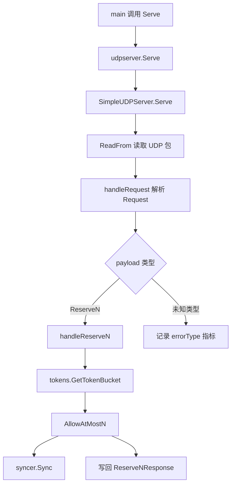

# UDP Server

## UDP 服务模块

`udpserver` 模块提供基于 UDP 的令牌预占服务。它监听指定地址，接收 protobuf 编码的 `protocol.Request`，当前只支持 `ReserveNRequest` 请求类型，并返回 `ReserveNResponse`，表示本次实际放行的令牌数量。

该模块主要入口是包级函数 `Serve(address string)`，由 `main.go` 调用。实际监听和请求处理由 `SimpleUDPServer` 完成。

## 核心执行流程



服务启动后，`(*SimpleUDPServer).Serve` 会进入无限循环。每次从 `net.PacketConn.ReadFrom` 读取一个 UDP 包后，都会启动一个 goroutine 调用 `s.handleRequest(buffer[:n], addr)`，因此请求处理是并发的。

## 对外入口

### `Serve(address string) error`

包级 `Serve` 是模块的启动入口：

```go
func Serve(address string) error
```

它负责：

- 捕获启动过程中的 panic。
- 上报 `metrics.Panic`，函数标签为 `udpServeStart`。
- 创建 `SimpleUDPServer`。
- 上报启动指标 `udphandleRequest.throughput`，状态为 `startUdpServer`。
- 调用 `(*SimpleUDPServer).Serve(address)` 开始监听。

该函数本身不直接持有网络连接，连接保存在 `SimpleUDPServer.conn` 中。

### `SimpleUDPServer`

```go
type SimpleUDPServer struct {
    conn net.PacketConn
}
```

`SimpleUDPServer` 是实际的 UDP 服务实例。它只保存一个 `net.PacketConn`，用于读取请求和向请求来源地址写回响应。

## 监听与收包

### `(*SimpleUDPServer).Serve(address string) error`

该方法使用：

```go
net.ListenPacket("udp", address)
```

创建 UDP 监听 socket。监听成功后会保存到 `s.conn`，然后持续执行：

1. 创建 `maxBufferSize` 大小的缓冲区。
2. 调用 `s.conn.ReadFrom(buffer)` 读取 UDP 数据包。
3. 读取失败时记录 warn 日志并上报 `readFromBufferError`。
4. 读取成功时上报 `readFromBufferSuccess`。
5. 启动 goroutine 调用 `handleRequest`。

关键常量：

```go
const (
    maxBufferSize = 1024
    writeTimeout  = time.Millisecond * 10
)
```

当前实现只使用了 `maxBufferSize`。`writeTimeout` 已定义但未用于 `WriteTo` 超时控制。

需要注意：UDP 包超过 1024 字节时，`ReadFrom` 只能读取缓冲区大小内的数据，后续 protobuf 解析可能失败。当前协议只包含少量字段，正常 `ReserveNRequest` 通常不会触发这个限制。

## 请求协议

协议定义在 `udpserver/protocol/payload.proto`，生成代码在 `payload.pb.go`。

### 请求类型

```proto
message Request {
    oneof payload {
        ReserveNRequest reserveN = 1;
    }
}
```

当前只支持 `reserveN` 一种 payload。`handleRequest` 会通过 Go 的 oneof wrapper 判断具体类型：

```go
switch r := req.Payload.(type) {
case *protocol.Request_ReserveN:
    s.handleReserveN(r.ReserveN, addr)
default:
    logs.Error("unknown request type: %T", r)
}
```

如果未来扩展新的 UDP 请求类型，需要同时修改：

- `payload.proto` 中的 `Request.oneof payload`
- 重新生成 `payload.pb.go`
- `handleRequest` 的 `switch` 分支
- 必要的响应结构与处理函数

### `ReserveNRequest`

```proto
message ReserveNRequest {
    string from = 1;
    string group = 2;
    string preferred = 3;
    int32 quota = 4;
    string fallback = 5;
    string mode = 6;
}
```

字段含义：

- `from`：请求来源标识，当前服务端逻辑未使用。
- `group`：令牌桶分组，用于 `tokens.GetTokenBucket(req.Group)`。
- `preferred`：首选资源或路径，传给 `AllowAtMostN`。
- `quota`：请求预占的令牌数。负数会被修正为 `0`。
- `fallback`：兜底资源或路径，传给 `AllowAtMostN`。
- `mode`：fallback 模式，转换为 `token.FallbackMode(req.Mode)`。

### `ReserveNResponse`

```proto
message ReserveNResponse {
    int32 permit = 1;
}
```

`permit` 表示本次实际允许通过的令牌数量，对应 `AllowAtMostN` 返回的 `n`。

## 请求处理

### `handleRequest(data []byte, addr net.Addr)`

`handleRequest` 是 UDP 包到业务请求之间的解码层。它负责：

- 捕获单个请求处理中的 panic。
- 上报 `udphandleRequest.latency`。
- 使用 `proto.Unmarshal(data, &req)` 解析 `protocol.Request`。
- 按 `req.Payload` 类型分发到具体处理函数。

解析失败时会：

- 上报 `UnmarshalError`。
- 记录原始 `data` 和错误。
- 直接返回，不写响应。

未知 payload 类型时会：

- 上报 `errorType`。
- 记录 `unknown request type` 错误。
- 不写响应。

成功接收 `ReserveN` 请求时会上报状态 `successReceieve`，然后调用：

```go
s.handleReserveN(r.ReserveN, addr)
```

这里的状态字符串存在拼写问题：`successReceieve` 是代码中的实际指标值，依赖指标查询时需要使用这个拼写。

## 令牌预占逻辑

### `handleReserveN(req *protocol.ReserveNRequest, addr net.Addr)`

`handleReserveN` 是模块的核心业务函数。它根据请求参数从对应令牌桶中预占最多 `quota` 个令牌，并把实际放行数量写回客户端。

执行步骤：

1. 构造指标标签：

   ```go
   tagPairs := []string{
       metrics.Group, req.Group,
       metrics.Preferred, req.Preferred,
       metrics.Fallback, req.Fallback,
       metrics.Mode, req.Mode,
       metrics.Version, "v1",
   }
   ```

2. 延迟上报 `handleReserveN.latency`。

3. 对特殊测试分组做服务端超时模拟：

   ```go
   if req.Group == "bytedance.videoarch.unit_testing_server_error" {
       time.Sleep(5 * time.Second)
       return
   }
   ```

   该分支不会返回响应，通常用于单测或客户端超时行为验证。

4. 将负数 `quota` 修正为 `0`：

   ```go
   if req.Quota < 0 {
       req.Quota = 0
   }
   ```

5. 上报 `BaseInfo` store 指标。

6. 获取分组令牌桶：

   ```go
   t := tokens.GetTokenBucket(req.Group)
   ```

   根据调用链，`GetTokenBucket` 会进一步走到 `token.WithRemoteConfig`、`updateConfig`，并读取限流配置中的 `Limit`。

7. 调用令牌桶预占：

   ```go
   n, flag := t.AllowAtMostN(
       req.Preferred,
       req.Fallback,
       token.FallbackMode(req.Mode),
       int64(req.Quota),
   )
   ```

   `n` 是实际放行数量，`flag` 会传给同步逻辑。

8. 当 `n > 0` 时同步消耗：

   ```go
   syncer.Sync(req.Group, req.Preferred, req.Fallback, token.FallbackMode(req.Mode), n, flag, false)
   ```

9. 上报通过和未通过的 token 数：

   ```go
   metrics.EmitCounter("harden.server.tokens", n, ..., metrics.Status, "pass")
   metrics.EmitCounter("harden.server.tokens", int64(req.Quota)-n, ..., metrics.Status, "notPass")
   ```

10. 构造并写回 protobuf 响应：

    ```go
    resp := protocol.Response{
        Payload: &protocol.Response_ReserveN{
            &protocol.ReserveNResponse{
                Permit: int32(n),
            },
        },
    }
    data, _ := proto.Marshal(&resp)
    s.conn.WriteTo(data, addr)
    ```

当前实现忽略了 `proto.Marshal` 和 `WriteTo` 的错误，也没有使用 `writeTimeout` 设置写超时。贡献代码时如果要增强可靠性，可以优先补齐这两处错误处理。

## 指标与配置链路

该模块大量依赖 `metrics` 包上报吞吐、延迟、异常和业务 token 统计。根据执行流，指标上报会进入：

```text
EmitCounter / EmitTimer
→ CtxEmitCounter / CtxEmitTimer
→ GetMetrics
→ tcc.GetPrecisionConfig
→ Precision
```

这意味着 UDP 服务的指标采样或精度行为受 TCC 配置影响。排查“指标没有上报”或“指标数量不符合预期”时，不应只看 `udpserver`，还需要检查 `metrics` 和 `tcc` 配置。

主要指标名称包括：

- `udphandleRequest.throughput`
- `udphandleRequest.latency`
- `handleReserveN.throughput`
- `handleReserveN.latency`
- `harden.server.tokens`
- `BaseInfo`
- `metrics.Panic`

常见状态标签包括：

- `startUdpServer`
- `ServeError`
- `listernSuccess`
- `readFromBufferError`
- `readFromBufferSuccess`
- `UnmarshalError`
- `successReceieve`
- `errorType`
- `success`
- `pass`
- `notPass`

其中 `listernSuccess`、`successReceieve` 是代码中的实际拼写。

## 与其他模块的关系

`udpserver` 本身只负责 UDP 收包、protobuf 编解码、请求分发和响应写回。令牌计算和配置读取由其他模块完成：

- `tokens.GetTokenBucket(req.Group)`：按 `group` 获取令牌桶。
- `token.TokenBucket.AllowAtMostN(...)`：执行最多 N 个令牌的放行判断。
- `token.FallbackMode(req.Mode)`：把请求中的字符串模式转换为 fallback 模式。
- `syncer.Sync(...)`：当有令牌通过时同步消耗结果。
- `metrics.EmitCounter`、`metrics.EmitTimer`、`metrics.EmitStore`：上报服务状态、延迟和业务结果。
- `logs`：记录监听、解析、未知请求和 panic 信息。

因此，修改 `handleReserveN` 时要特别关注跨模块契约：`group`、`preferred`、`fallback`、`mode` 和 `quota` 会同时影响令牌桶选择、fallback 策略、同步行为和指标维度。

## 并发模型

`SimpleUDPServer.Serve` 对每个 UDP 包启动一个 goroutine：

```go
go s.handleRequest(buffer[:n], addr)
```

这带来几个实现约束：

- `s.conn` 会被多个 goroutine 并发调用 `WriteTo`。`net.PacketConn` 的并发读写通常由 Go 网络库支持。
- 共享状态不在 `udpserver` 内部维护，而是在 `tokens`、`token`、`syncer` 等模块中处理。
- 单个请求 panic 会被 `handleRequest` 的 defer recover 捕获，不会直接退出整个服务。
- 启动阶段 panic 会被包级 `Serve` 捕获。

因为处理逻辑异步执行，调用方不能依赖 UDP 请求的严格处理顺序。客户端也应按 UDP 的语义处理丢包、乱序和超时。

## `stackprinter.go`

`stackprinter.go` 提供三个栈格式化辅助函数：

- `stack(skip int) []byte`
- `source(lines [][]byte, n int) []byte`
- `function(pc uintptr) []byte`

`stack` 使用 `runtime.Caller` 遍历调用栈，读取源码文件并输出函数名与源码行。`source` 根据行号返回去除空白后的源码行，`function` 将 `runtime.FuncForPC` 返回的完整函数名简化为包内更易读的形式。

从当前调用图看，`stack` 没有被 `server.go` 使用；当前 panic 记录使用的是标准库 `runtime/debug.Stack()`。如果要移除或替换该文件，需要先确认仓库其他位置是否依赖这些非导出函数。

## 扩展建议

新增请求类型时，优先保持现有分层：

1. 在 `payload.proto` 中新增 request 和 response message。
2. 扩展 `Request.oneof payload` 和 `Response.oneof payload`。
3. 重新生成 `payload.pb.go`。
4. 在 `handleRequest` 中新增类型分支。
5. 新增独立的 `handleXxx` 函数处理业务逻辑。
6. 为新分支补齐吞吐、延迟、错误和业务结果指标。

不要把新业务逻辑直接塞进 `handleRequest`。`handleRequest` 应继续只承担解析、分发和通用异常保护，具体业务应放在独立处理函数中，类似当前的 `handleReserveN`。