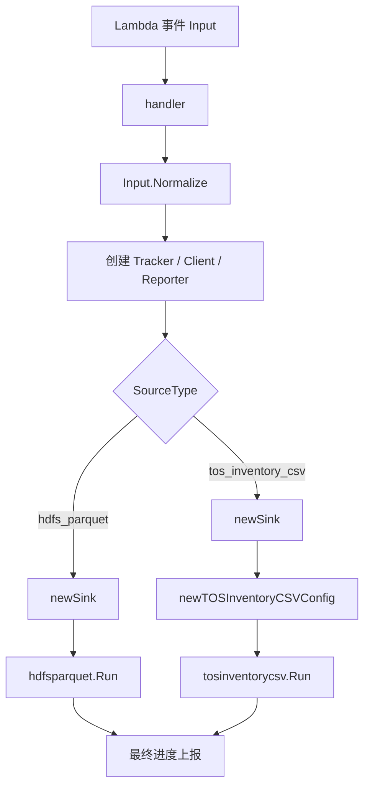

# Application Entry Point

## 模块概览

`main.go` 是 Lambda 应用入口，负责把外部事件 `Input` 转成一次可执行的读取任务。它本身不解析 Parquet 或 CSV，也不直接写入最终存储；它的职责是参数校验、默认值填充、控制面上报初始化、数据源路由和 sink 构造。

模块支持两类数据源：

- `SourceTypeHDFSParquet`：读取 HDFS Parquet 文件，入口为 `hdfsparquet.Run`
- `SourceTypeTOSInventoryCSV`：读取 TOS Inventory CSV 文件，入口为 `tosinventorycsv.Run`

处理结果统一返回 `Output{JobID: cfg.JobID}`。



## 启动入口

`main()` 只做一件事：

```go
func main() {
	lambda.Start(handler)
}
```

`lambda.Start` 将 `handler(ctx context.Context, in Input)` 注册为 Lambda 事件处理函数。所有运行时行为都从 `handler` 开始。

## 输入模型

`Input` 是 Lambda 事件 payload。它包含任务级信息、数据源配置、分桶配置、并发限制、sink 配置和控制面配置。

关键字段：

- `JobID`：任务标识，用于追踪、幂等和输出命名；`Normalize()` 要求必填。
- `SourceType`：决定执行 `hdfsparquet.Run` 还是 `tosinventorycsv.Run`。
- `HDFSParquet`：当 `source_type == "hdfs_parquet"` 时必填。
- `TOSInventoryCSV`：当 `source_type == "tos_inventory_csv"` 时必填。
- `Bucketing`：控制 `store_uri` 到 bucket id 的映射。
- `Limits`：控制 reader、sink 和批处理并发。
- `Sink`：选择 `bucket_file` 或 `writer_rpc`。
- `ControlPlane`：控制心跳和进度上报。

`BucketingInput.Config()` 将入口层配置转换为 `internal/bucketing.Config`，供 reader 模块使用：

```go
func (in BucketingInput) Config() sharedbucketing.Config
```

## 参数归一化与校验

`Input.Normalize()` 是入口层最重要的防线。它会校验必填字段、拒绝不支持的枚举值，并填充默认值。注意它会修改接收者；`handler` 先复制输入：

```go
cfg := in
if err = cfg.Normalize(); err != nil {
	return Output{}, err
}
```

分桶规则：

- `bucketing.num_buckets` 必须大于 0。
- `bucketing.hash_alg` 为空时默认 `HashAlgHive`。
- `HashAlgSpark` 未设置 `spark_seed` 时默认 `42`。
- 其他 hash 算法会返回错误。

限制参数：

- `ReaderWorkers`
- `SinkWorkers`
- `ParquetParallelism`
- `BatchRows`

以上字段不能小于 0。值为 0 通常表示交给下游模块使用默认行为。

HDFS Parquet 校验：

- `HDFSParquet` 必须存在。
- `store_uri_field` 必填。
- `file_paths` 和 `root_path` 至少提供一个。
- `format_field` 为空时默认 `"format"`。
- `create_timestamp_field` 为空时默认 `"created_at"`。
- 当 `sink.type == "writer_rpc"` 时，`sink.redis.cluster` 必填。

TOS Inventory CSV 校验：

- `TOSInventoryCSV` 必须存在。
- `csv_uris` 必须非空。
- 如果没有 `store_uri_column`，则必须提供 `key_column` 和 `bucket`，用于构造 `store_uri`。
- `csv_format.compression` 为空时默认 `"none"`。
- `create_timestamp_column` 和 `create_time_str_column` 不能同时设置。
- `task_type` 只支持空字符串或 `tosinventorycsv.TaskTypeManifestExpand`。
- 当 `task_type == "manifest_expand"` 时，`content_type_column` 必填。

控制面默认值：

- `ControlPlane` 为空时会创建空配置。
- `PSM` 默认 `"bytedance.videoarch.uri_task_control_panel"`。
- `Cluster` 默认 `"default"`。
- `HeartbeatIntervalSec` 默认 `30`。
- `ProgressReportIntervalSec` 默认 `30`。

## handler 执行流程

`handler` 是一次任务的编排器，流程如下：

1. 复制并归一化 `Input`。
2. 基于 Lambda `ctx` 创建 `runCtx`，用于向 reader 和 reporter 传播取消信号。
3. 调用 `resolveReaderID(ctx, cfg)` 生成 reader 标识。
4. 创建 `controlplane.Tracker`，记录 job、reader、source type 和本机 IP。
5. 通过 `controlplane.NewClient` 创建控制面客户端。
6. 创建并启动 `controlplane.Reporter`。
7. 根据 `SourceType` 构造 sink，并调用对应 reader。
8. 任务结束时设置 worker 状态并刷新最终进度。

最终状态由 deferred closure 统一处理：

```go
defer func() {
	if err != nil {
		tracker.SetWorkerStatus(controlplane.WorkerStateFailed, err.Error())
	} else {
		tracker.SetWorkerStatus(controlplane.WorkerStateDone, "")
	}
	flushCtx, flushCancel := context.WithTimeout(context.Background(), 3*time.Second)
	defer flushCancel()
	_ = reporter.FlushFinalProgress(flushCtx)
}()
```

这意味着 reader 或 sink 返回错误时，`handler` 会把状态标为 `WorkerStateFailed`；正常完成时标为 `WorkerStateDone`。最终进度刷新最多等待 3 秒。

## 控制面与进度上报

入口层把 `controlplane.Tracker` 同时作为内部进度观察者使用：

```go
var progress progressObserver
progress = tracker
```

`progressObserver` 是本模块定义的小接口：

```go
type progressObserver interface {
	OnFilesResolved(total int)
	OnFileDone(filePath string, bytesRead int64)
	OnRowsRead(rows int)
	OnBucketsSeen(bucketIDs []int)
}
```

reader 模块只需要依赖这个接口，而不需要知道控制面实现细节。`handler` 负责把 `Tracker` 注入到 `hdfsparquet.Run` 或 `tosinventorycsv.Run` 的配置中。

## 数据源路由

### HDFS Parquet

当 `cfg.SourceType == SourceTypeHDFSParquet` 时，`handler` 调用：

```go
sinkImpl, err := newSink(cfg, readerID)
_, err = hdfsparquet.Run(runCtx, hdfsparquet.HDFSParquetConfig{...})
```

入口层负责把 `HDFSParquetInput` 映射为 `hdfsparquet.HDFSParquetConfig`，包括：

- 文件来源：`RootPath`、`FilePaths`
- 字段映射：`StoreURIField`、`FormatField`、`CreateTimestampField`、`VIDField`、`OIDField`、`ExtraField`
- manifest 扩展开关：`ExpandTS`
- 并发限制：`hdfsparquet.Limits`
- 分桶配置：`cfg.Bucketing.Config()`
- sink 回调：`Sink`
- 进度观察者：`Progress`

### TOS Inventory CSV

当 `cfg.SourceType == SourceTypeTOSInventoryCSV` 时，`handler` 调用：

```go
sinkImpl, err := newSink(cfg, readerID)
_, err = tosinventorycsv.Run(runCtx, newTOSInventoryCSVConfig(cfg, sinkImpl, progress))
```

`newTOSInventoryCSVConfig` 专门负责把入口层 `Input` 转成 `tosinventorycsv.Config`。CSV 字段既支持列名，也支持字符串形式的数字索引，具体解析由 `tosinventorycsv` 模块处理。

## Sink 构造

`newSink(in Input, readerID string)` 根据 `SinkInput.Type` 创建下游消费回调。

支持的 sink 类型：

- 空字符串或 `"bucket_file"`：调用 `sink.NewBucketFileCallback(defaultBucketFileSinkOutputDir)`，输出目录固定为 `"hdfs_parquet_output"`。
- `"writer_rpc"`：调用 `sink.NewRedisWriterCallback`，通过 Redis 获取 bucket 到 writer endpoint 的映射，再通过 RPC 写入。
- 其他值：返回 `unsupported sink type` 错误。

`writer_rpc` 使用 `SinkRedisInput` 中的嵌套 Redis 配置：

```go
func (in *SinkInput) redisCluster() string
func (in *SinkInput) redisKeyPrefix() string
func (in *SinkInput) readRedisTimeoutSeconds() int
func (in *SinkInput) readRedisMaxRetries() int
```

如果 `redis.key_prefix` 为空，`newSink` 使用 `JobID` 作为默认 key prefix。

`writer_rpc` 相关默认超时：

- `ConnectTimeoutSeconds` 默认 1 秒。
- `RPCTimeoutSeconds` 默认 10 秒。
- `Redis.ReadTimeoutSeconds` 默认 1 秒。
- `EndpointBatchMaxWaitMS` 小于等于 0 时表示不显式设置，返回 `0`。

`newSink` 创建 `NewRedisWriterCallback` 后，下游会继续执行 Redis 预热、endpoint 规范化和 bucket endpoint 缓存等逻辑，包括 `prewarmBucketEndpoints`、`bucketRedisKey`、`normalizeWriterEndpoint`、`splitEndpoint`、`redisValueToString` 等函数。

## Reader ID

`resolveReaderID(ctx, in)` 优先使用 Lambda 上下文里的 `TaskID`：

```go
if lambdaCtx, ok := lambdacontext.FromContext(ctx); ok && lambdaCtx != nil && lambdaCtx.TaskID != "" {
	return lambdaCtx.TaskID
}
```

如果当前不是 Lambda 运行环境，或上下文中没有 `TaskID`，则生成一个由 `time.Now().UnixNano()` 和 `rand.Int63()` 组成的临时 ID。这个行为让 `handler` 可以在测试或本地直接调用。

## 扩展新数据源

新增数据源时，应优先沿用当前入口模式：

1. 添加新的 `SourceType` 常量。
2. 在 `Input` 中添加对应配置结构体指针。
3. 在 `Normalize()` 中做必填字段校验、默认值填充和枚举检查。
4. 在 `handler` 的 `switch cfg.SourceType` 中添加分支。
5. 将入口层配置转换成目标 reader 模块的配置。
6. 注入 `cfg.Bucketing.Config()`、`Sink` 和 `Progress`，保持与现有 reader 的行为一致。

## 扩展新 Sink

新增 sink 时，主要修改 `newSink`：

1. 在 `SinkInput.Type` 的注释中补充新枚举。
2. 在 `newSink` 的 `switch sinkCfg.Type` 中新增 case。
3. 尽量使用 `SinkInput` 中已有字段；如果需要新配置，添加到 `SinkInput` 或嵌套结构体中。
4. 在 `Normalize()` 中补充与该 sink 强相关的必填校验。

入口层目前假设 sink 可以作为批处理回调传入 HDFS 和 CSV reader。新增 sink 时需要确认它满足对应 reader 期望的 callback 接口。