# Bucket Assignment

## 模块概览

`internal/bucketing` 负责把一个 `uri` 稳定映射到 `[0, numBuckets)` 范围内的桶编号。它是一个纯计算模块，不访问外部系统，也没有跨包调用；调用方只需要提供桶数量、哈希算法和 Spark seed，即可得到可复现的 bucket id。

该模块目前支持两种哈希策略：

- `""` 或 `"hive"`：使用 `javaStringHash`，再通过 `positiveMod` 转为非负桶编号。
- `"spark"`：使用 `murmur3String(uri, sparkSeed)`，再通过 `positiveMod` 转为非负桶编号。

## 对外入口

### `Config`

```go
type Config struct {
	NumBuckets int
	HashAlg    string
	SparkSeed  uint32
}
```

`Config` 是调用方保存分桶配置的轻量结构体：

- `NumBuckets`：桶数量，必须大于 `0`。
- `HashAlg`：哈希算法，支持 `""`、`"hive"`、`"spark"`。
- `SparkSeed`：仅在 `HashAlg == "spark"` 时参与 Murmur3 哈希计算。

### `Config.ComputeBucket`

```go
func (c Config) ComputeBucket(uri string) (int, error) {
	return ComputeBucket(uri, c.NumBuckets, c.HashAlg, c.SparkSeed)
}
```

这是面向持有配置对象的调用方式。它不包含额外逻辑，只是把结构体字段转发给包级函数 `ComputeBucket`。

### `ComputeBucket`

```go
func ComputeBucket(uri string, numBuckets int, hashAlg string, sparkSeed uint32) (int, error)
```

这是模块的核心入口。执行顺序为：

1. 校验 `numBuckets > 0`，否则返回错误 `num_buckets must be > 0`。
2. 根据 `hashAlg` 选择哈希实现。
3. 使用 `positiveMod` 将有符号或无符号哈希结果折算到合法桶范围。
4. 返回桶编号。

返回值保证在成功时满足：

```go
0 <= bucket && bucket < numBuckets
```

## 执行流程

```mermaid
flowchart TD
    A["调用方"] --> B["Config.ComputeBucket"]
    B --> C["ComputeBucket"]
    C --> D{"hashAlg"}
    D -->|空字符串或 hive| E["javaStringHash"]
    D -->|spark| F["murmur3String"]
    F --> G["bitsRotateLeft32"]
    F --> H["fmix32"]
    E --> I["positiveMod"]
    F --> I
    I --> J["桶编号"]
```



## Hive 分桶路径

当 `hashAlg` 为 `""` 或 `"hive"` 时，`ComputeBucket` 使用：

```go
positiveMod(javaStringHash(uri), numBuckets)
```

`javaStringHash` 的实现模式与 Java 字符串哈希公式一致：

```go
h = 31*h + 当前字符值
```

代码实现为：

```go
func javaStringHash(s string) int32 {
	var h int32
	for _, r := range s {
		h = 31*h + int32(r)
	}
	return h
}
```

需要注意：这里通过 Go 的 `range` 遍历字符串，单位是 Unicode code point。对于常见 ASCII URI，这与 Java `String.hashCode()` 的结果一致；如果 URI 中包含非 BMP 字符，Java 的 UTF-16 code unit 语义和 Go 的 rune 语义可能不完全相同。

## Spark 分桶路径

当 `hashAlg == "spark"` 时，`ComputeBucket` 使用：

```go
positiveMod(int32(murmur3String(uri, sparkSeed)), numBuckets)
```

`sparkSeed` 会作为 Murmur3 初始种子传入：

```go
func murmur3String(s string, seed uint32) uint32
```

`murmur3String` 的处理流程是：

1. 将字符串转为 UTF-8 字节切片：`data := []byte(s)`。
2. 每 4 字节组成一个 little-endian `uint32` block。
3. 对每个 block 执行 Murmur3 混合，包括乘法、`bitsRotateLeft32` 左旋和异或。
4. 处理不足 4 字节的 tail。
5. 将长度混入哈希值。
6. 调用 `fmix32` 做最终 avalanche 混合。

`bitsRotateLeft32` 和 `fmix32` 都是 Murmur3 实现细节，不应该被外部调用方直接依赖。

## 取模语义

`positiveMod` 用于避免 Go `%` 对负数取模时返回负值的问题：

```go
func positiveMod(v int32, n int) int {
	return int((int64(v)%int64(n) + int64(n)) % int64(n))
}
```

这使得即使 `javaStringHash` 或转换后的 Murmur3 值为负数，最终桶编号仍然落在 `[0, n)`。

## 错误处理

`ComputeBucket` 只会在配置非法时返回错误：

- `numBuckets <= 0`：返回 `num_buckets must be > 0`
- `hashAlg` 不是 `""`、`"hive"`、`"spark"`：返回 `unsupported hash_alg: <value>`

调用方应在批处理或 reader 初始化阶段尽早发现这些配置错误，避免在处理大量 URI 时重复失败。

## 与代码库的连接

该模块目前主要由 TOS inventory CSV reader 相关测试通过 `bucketing.Config` 间接使用，例如：

- `TestRunWithClientParsesHeaderColumnsAndMetadata`
- `TestRunWithClientParsesIndexColumnsWithoutHeader`
- `TestRunWithClientUsesConfiguredBatchRows`
- `TestRunWithClientUsesConfiguredSinkWorkers`
- `TestRunWithClientSerializesSinkDeliveryAcrossWorkers`
- manifest expand 相关测试

这些调用说明 `bucketing.Config` 是 reader 配置的一部分，用于在读取 URI 数据时进行稳定分桶。模块自身没有依赖 reader，也没有外部副作用，因此适合作为可复用的基础计算组件。

## 修改建议

新增分桶算法时，应优先在 `ComputeBucket` 的 `switch hashAlg` 中增加分支，并保持以下约束：

- 成功结果必须通过 `positiveMod` 归一化。
- 不应改变 `""` 默认到 `"hive"` 的现有行为。
- 新算法应增加独立测试，覆盖固定输入、固定桶数和边界桶数量。
- 如果算法需要额外参数，优先扩展 `Config`，再由 `Config.ComputeBucket` 转发给包级入口。