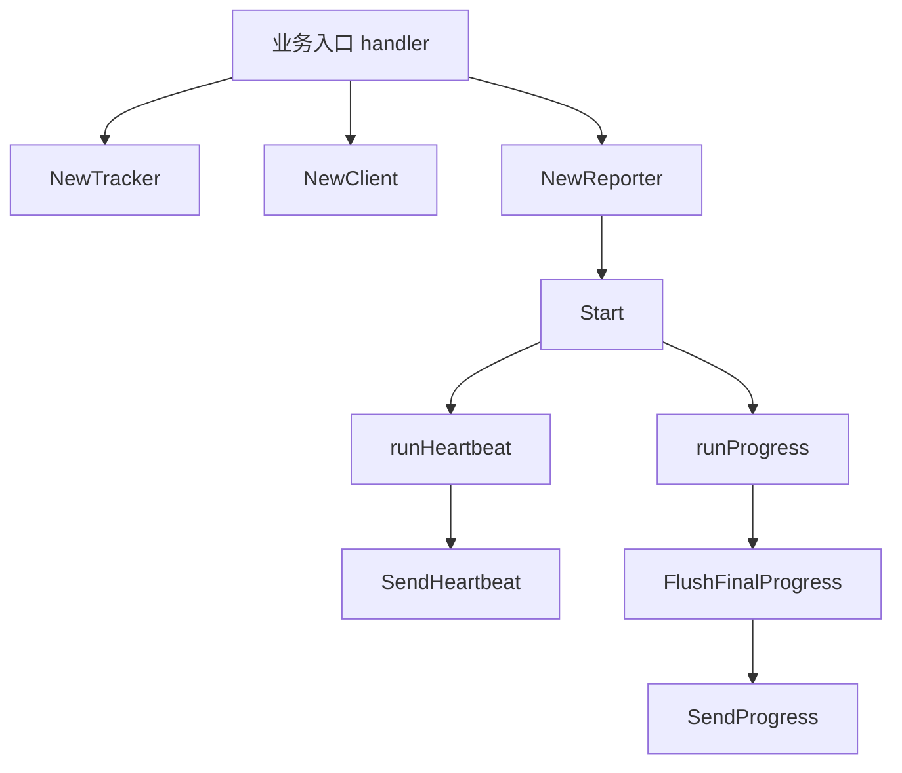

# Control Plane Reporting

## 模块概览

`controlplane` 模块负责把 reader worker 的存活状态和读取进度上报到控制面。它由三层组成：

- `Client`：封装控制面 HTTP 调用，负责请求构造、服务发现、超时、响应 envelope 解析。
- `Tracker`：线程安全地维护当前 reader 的运行状态和累计进度。
- `Reporter`：周期性读取 `Tracker.Snapshot()`，并通过 `Client` 发送心跳和进度。



## 主要职责

该模块面向 reader 类型 worker，上报内容固定使用 `Kind: "reader"`。

心跳上报用于告诉控制面当前 worker 仍然在线：

- 接口路径：`/api/v1/heartbeat`
- 请求类型：`HeartbeatRequest`
- 响应类型：`HeartbeatResponse`

进度上报用于同步文件读取进度、行数、字节数、bucket 覆盖数量和 worker 状态：

- 接口路径：`/api/v1/report_progress`
- 请求类型：`ProgressRequest`
- 响应类型：`ProgressResponse`

## Client：控制面 HTTP 客户端

`NewClient(cfg Config)` 创建底层 `byted.Client`，并补齐默认配置：

- `Config.PSM` 为空时使用 `bytedance.videoarch.uri_task_control_panel`
- `Config.Cluster` 为空时使用 `default`
- Dial timeout 为 `1s`
- Read timeout 和请求 timeout 为 `3s`

`Client` 支持两种目标地址模式：

- 显式 `Config.Endpoint`：`requestURL()` 使用 `strings.TrimRight(endpoint, "/") + path`
- 空 `Config.Endpoint`：使用 `http://<PSM><path>`，并在请求上开启 Hertz discovery：
  - `discovery.WithSD(true)`
  - `discovery.WithDestinationCluster(c.cfg.Cluster)`
  - `hconfig.WithRequestTimeout(defaultRequestTimeout)`

所有实际请求都经过 `doJSON(ctx, method, path, payload, out)`：

1. 使用 `json.Marshal(payload)` 序列化请求体。
2. 通过 `protocol.NewRequest()` 构造 Hertz 请求。
3. 设置 `Content-Type: application/json`。
4. 调用 `c.cli.Do(ctx, req, resp)`。
5. 要求 HTTP 状态码为 `200 OK`。
6. 将响应解析为 `envelope[json.RawMessage]`。
7. 要求 `env.Code == 0`。
8. 如果 `env.Data` 非空，再反序列化到 `out`。

控制面响应必须符合以下 envelope 结构：

```go
type envelope[T any] struct {
	Code    int    `json:"code"`
	Message string `json:"message"`
	Data    T      `json:"data"`
}
```

如果 HTTP 状态码不是 `200`，或 envelope `code` 非 0，`doJSON()` 会返回错误，并带上状态码、响应体或控制面错误信息。

## Reporter：周期性上报调度器

`NewReporter(client, tracker, heartbeatEvery, progressEvery)` 创建上报器。两个周期参数小于等于 0 时都会回退到 `30s`。

`Start(ctx)` 启动两个 goroutine：

- `runHeartbeat(ctx)`：立即发送一次心跳，然后按 `heartbeatEvery` 周期发送。
- `runProgress(ctx)`：立即发送一次进度，然后按 `progressEvery` 周期发送。

`Stop()` 会调用内部 `cancel()`，然后等待两个 goroutine 退出。`Start()` 对 `nil` receiver、`nil client`、`nil tracker` 都是安全的，会直接返回。

周期性心跳和进度发送会忽略错误：

```go
_, _ = r.client.SendHeartbeat(ctx, HeartbeatRequest{...})
_ = r.FlushFinalProgress(ctx)
```

这意味着后台上报失败不会打断 reader 主流程。需要确认最终进度是否成功写入时，应显式调用 `FlushFinalProgress(ctx)` 并检查返回的 `error`。

## FlushFinalProgress：最终进度上报

`FlushFinalProgress(ctx)` 从 `Tracker` 读取快照，并组装 `ProgressRequest`：

```go
ProgressRequest{
	JobID:        snapshot.JobID,
	Kind:         "reader",
	ReaderID:     snapshot.ReaderID,
	WorkerStatus: snapshot.WorkerStatus,
	ErrorMessage: snapshot.ErrorMessage,
	Files: &ReaderFilesProgress{
		FilesTotal: snapshot.FilesTotal,
		FilesDone:  snapshot.FilesDone,
		RowsRead:   snapshot.RowsRead,
		BytesRead:  snapshot.BytesRead,
	},
	BucketsSeen:    snapshot.BucketsSeen,
	LastUpdateTime: snapshot.LastUpdateTime,
}
```

该函数既被 `runProgress()` 周期性复用，也适合作为 reader 退出前的最后一次同步点。

## Tracker：线程安全状态聚合

`Tracker` 保存 reader 运行期间的累计状态，内部用 `sync.Mutex` 保护所有读写。构造函数是 `NewTracker(jobID, readerID, sourceType, ip string, port int)`，初始状态为：

- `workerStatus = WorkerStateRunning`
- `bucketsSeen = make(map[int]struct{})`
- `lastUpdateTime = time.Now().UTC()`

可写入的进度事件包括：

- `OnFilesResolved(total int)`：设置 `filesTotal`
- `OnFileDone(_ string, bytesRead int64)`：递增 `filesDone`，并在 `bytesRead > 0` 时累计 `bytesRead`
- `OnRowsRead(rows int)`：在 `rows > 0` 时累计 `rowsRead`
- `OnBucketsSeen(bucketIDs []int)`：把 bucket id 写入去重集合
- `SetWorkerStatus(status, errorMessage string)`：设置 worker 状态和错误信息，空 `status` 会被忽略

`Snapshot()` 返回不可变值对象 `Snapshot`，供 `Reporter` 组装请求。`BucketsSeen` 在快照里不是 bucket 列表，而是去重后的数量：`len(t.bucketsSeen)`。

## 状态模型

模块内定义了三个 worker 状态常量：

```go
const (
	WorkerStateRunning = "RUNNING"
	WorkerStateDone    = "DONE"
	WorkerStateFailed  = "FAILED"
)
```

调用方通常在任务开始后保持默认 `RUNNING`，任务结束前根据结果调用：

- `tracker.SetWorkerStatus(WorkerStateDone, "")`
- `tracker.SetWorkerStatus(WorkerStateFailed, err.Error())`

随后调用 `reporter.FlushFinalProgress(ctx)`，确保最终状态、错误信息和累计进度被发送到控制面。

## 与代码库其他部分的连接

从调用关系看，`main.go` 的 `handler` 是该模块的主要入口调用方：

- 使用 `NewClient()` 创建控制面客户端
- 使用 `NewTracker()` 初始化 reader 状态
- 使用 `NewReporter()` 创建周期上报器
- 在任务生命周期中调用 `SetWorkerStatus()` 写入最终状态

测试侧通过 `controlplane/reporter_test.go` 覆盖 `NewClient()`、`NewTracker()`、`NewReporter()`、心跳和最终进度上报行为。

## 贡献注意事项

新增上报字段时，应同时修改 `types.go` 中的请求结构、`Tracker` 的状态字段、对应事件方法以及 `FlushFinalProgress()` 的请求组装逻辑。

`Tracker` 的所有状态访问都应继续经过互斥锁；不要从 `Reporter` 或业务代码直接访问内部字段。

后台周期上报当前是“尽力而为”语义，错误被吞掉。只有最终同步需要强一致反馈时，才依赖 `FlushFinalProgress(ctx)` 的返回值。

`ProgressRequest.LastUpdateTime` 的 JSON 标签是 `lastUpdateTime`，不是 snake_case。修改该字段名会影响控制面协议兼容性。