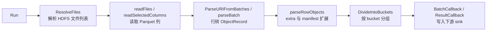

# HDFS Parquet Source

## 模块概览

`internal/source/hdfsparquet` 负责从 HDFS 上的 Parquet 文件读取 URI 数据，解析主 `store_uri`、可选 `extra` 字段和可选 TS manifest 内容，然后按 `Bucketing` 规则分桶并交给 `sink.BatchCallback`。

模块入口是 `Run(ctx, cfg HDFSParquetConfig)`。它把处理过程拆成三个并发阶段：

## 输入与配置

`HDFSParquetConfig` 是模块的总配置：

- `RootPath`：HDFS 目录 URI，例如 `hdfs://namenode/path/to/table`。当 `FilePaths` 为空时会递归扫描该目录。
- `FilePaths`：显式指定的 HDFS 文件 URI。非空时不会扫描 `RootPath`。
- `StoreURIField`：必填列，表示主 URI 列。
- `FormatField`：可选列，用于判断是否需要展开 manifest。
- `CreateTimestampField`：可选列，支持 `int64`、`int32`、`int`。
- `VIDField`、`OIDField`：可选列，会透传到 `sink.ObjectRecord`。
- `ExtraField`：可选列，非空时会初始化 `video_extra_query` 客户端并解析 `extra` JSON。
- `ExpandTS`：是否展开 TS manifest。
- `Limits`：控制读取、解析、sink 写入并发和批大小。
- `Bucketing`：`internal/bucketing.Config` 的别名，用于 `ComputeBucket`。
- `Sink`：接收分桶后的 `sink.Batch`。
- `Progress`：可选进度回调。

`Limits` 中的默认行为：

- `ReaderWorkers <= 0` 时按 1 个读取 worker。
- `SinkWorkers <= 0` 时按 1 个 sink worker。
- `ParquetParallelism <= 0` 时 Parquet reader 并发为 4。
- `BatchRows <= 0` 时每批读取 1000 行。
- `parseWorkerCount` 复用 `ReaderWorkers`，未配置时为 1。
- `parseBatchParallelism` 在单读取 worker 下为 4，否则为 2。

## 文件解析与扫描

`parseHDFSURI(raw)` 只接受 `hdfs://` URI，并拆出：

- `NameNode`：`hdfs://` 加 host。
- `Path`：URI path。

`resolveNameNode(rootPath, filePaths)` 优先从 `FilePaths[0]` 提取 NameNode，否则从 `RootPath` 提取。`Run` 用它创建 `hdfs.FileSystem`。

`ResolveFiles(fs, rootPath, filePaths)` 有两种模式：

- `FilePaths` 非空：逐个调用 `parseHDFSURI`，返回每个 URI 的 HDFS path。
- `FilePaths` 为空：解析 `RootPath` 后调用 `FindPartFiles` 递归查找文件。

`FindPartFiles` 只收集 basename 以 `part-` 开头的文件，并跳过 `_SUCCESS`、`.`、`..` 以及隐藏文件。递归目录读取失败时，子目录错误会被忽略并继续扫描其他路径。

## Parquet 读取

`readFiles` 按 `Limits.ReaderWorkers` 启动多个 worker，每个 worker 调用 `readFile`。`readFile` 会：

1. `fs.Stat(filePath)` 获取文件大小。
2. `fs.Open(filePath)` 打开 HDFS 文件。
3. 构造 `HDFSFileWrapper` 适配 `parquet-go/source.ParquetFile`。
4. 调用 `readSelectedColumns` 读取需要的列。
5. 关闭 wrapper，并把行数、批次数和文件大小交给 `collectReadStats`。

`readSelectedColumns` 使用 `pqreader.NewParquetColumnReader(wrapper, np)` 按列读取。它先解析列路径：

- `StoreURIField` 必须存在，通过 `resolveColumnPath` 查找。
- `FormatField`、`CreateTimestampField` 是可选列，通过 `resolveOptionalColumnPath` 查找；列不存在时返回空路径。
- `ExtraField`、`VIDField`、`OIDField` 只要配置非空就必须存在。

列匹配逻辑在 `matchColumnPath`：

1. 先尝试精确匹配 `parquet_go_root.<field>`。
2. 再按字段路径后缀匹配，例如配置 `a.b` 可以匹配 schema 中以 `a.b` 结尾的列。
3. 后缀比较大小写不敏感，依赖 `equalPathParts` 和 `normalizePathPart`。
4. 无匹配返回 `column not found`，多个匹配返回 `column is ambiguous`。

读取后每批生成 `ReadBatch`，其中每一行是 `RowData`。字符串字段通过 `coerceString` 清理空白；时间戳通过 `coerceInt64` 转为 `int64`，缺失值为 0，不支持的类型会中断读取。

## URI 解析

`ParseURIFromBatches` 从 `ReadBatch` 输入通道消费数据，输出 `URIBatch`。它按 `workerCount` 启动解析 worker，每个 worker 调用 `parseBatch`。输入结束或上下文取消后，它会关闭输出通道并汇总 `parseStats`。

`parseBatch` 的处理策略：

- 空批次直接返回空 `URIBatch`。
- 行数少于 100 或 `parallelism <= 1` 时顺序处理。
- 否则按 `parallelism` 切片并发处理，最后按分片顺序合并结果。

单行解析由 `parseRowObjects` 完成。它会按顺序产生三类对象：

1. 主 `storeURI`：非空时直接生成 `sink.ObjectRecord`。
2. `extra` 扩展 URI：`extra` 非空且 `extraQueryClient` 可用时调用 `parseExtraObjects`。
3. manifest 扩展 URI：`storeURI` 非空、`ExpandTS` 为 true、`shouldExpandManifest(storeURI, format)` 为 true 且 storagegw client 非空时调用 `parseManifestObjects`。

最后 `parseRowObjects` 调用 `dedupeObjectsByStoreURI`，按清理后的 `StoreURI` 去重，并跳过空 URI。`VID`、`OID` 和 `CreateTimestamp` 会传递到主对象、extra 对象和 manifest 对象。

## extra 字段解析

`parseExtraObjects` 期望 `extra` 是 JSON object。JSON 解析失败、空 object、无 `extraQueryClient` 或没有可查询字段时都会静默返回空结果。

`buildExtraQueryInput` 会把 JSON object 的每个 value 转成查询字符串：

- `string` 和 `[]byte`：去空白后使用，空字符串跳过。
- 其他类型：`json.Marshal` 后使用，空字符串或 `"null"` 跳过。

随后分别调用：

- `extraQueryClient.QueryExtraURI(ctx, queryInput, true)`
- `extraQueryClient.QueryExtraURI(ctx, queryInput, false)`

`collectQueriedExtraURIs` 会合并 file extra 和 video extra 的结果，去掉空 URI，并按 URI 去重。若两个结果都没有可用 URI，`chooseExtraQueryError` 会检查错误；`xquery.ErrNotFound` 和 `xquery.ErrNotAnnotated` 被视为可忽略错误，其他错误会包装为 `extract extra key=...` 返回。

`getVideoExtraQueryClient` 用 `sync.Once` 创建单例 `video_extra_query` client。测试可通过 `resetVideoExtraQueryClientForTest` 重置状态。

## manifest 展开

manifest 判断与解析委托给 `internal/source/manifest`：

- `shouldExpandManifest` 调用 `manifest.ShouldExpand`。
- `parseManifestObjects` 调用 `manifest.Expand`。
- `newManifestParser` 调用 `manifest.NewParser`。
- `parseManifestObjectPath`、`toParserURI`、`normalizeParsedStoreURI` 是对 manifest 包能力的薄封装。

`parseManifestObjects` 从 `manifest.Expand` 得到 URI 列表后，为每个非空 URI 生成 `sink.ObjectRecord`。如果展开失败，`parseRowObjects` 会返回带 `expand manifest store_uri=...` 上下文的错误。

storagegw client 由 `newStorageGWClient` 创建。它从环境变量 `STORAGEGW_ACCESS_KEY`、`STORAGEGW_SECRET_KEY` 读取凭证；两者都非空时使用 `storagegw.WithCredential`。客户端总是附加 `storagegw.WithCluster("default")`，PSM 来自 `env.PSM()`。创建失败时返回 `nil`，这会使 manifest 展开条件中的 `client != nil` 不成立。

## 分桶与 sink

`DivideIntoBuckets` 消费 `URIBatch`，通过 `sourcecommon.DrainBatchesWithWorkers` 并发写入 sink。每个输入批次被转换为 `sink.Batch`：

- `FilePath` 和 `ScannedRows` 继承自 `URIBatch`。
- `ProcessedURIs` 是 `len(batch.Objects)`。
- `Buckets` 是 `map[int][]ObjectRecord`，key 来自 `Bucketing.ComputeBucket(object.StoreURI)`。

当批次中没有对象时，转换函数返回 skip，不会调用 sink。`ComputeBucket` 返回错误会终止分桶阶段并向上返回。

如果 `cfg.Sink` 实现了 `io.Closer`，`Run` 会在退出前关闭它。如果实现了 `ResultCallback`，`Run` 会在所有阶段结束后调用 `OnComplete(ctx, *result)`。

## 错误与取消传播

`Run` 为整个流水线创建可取消 context。读取、解析、分桶三个 goroutine 共用同一个 context，并通过容量为 3 的 `errCh` 上报首批错误。任一阶段出错都会调用 `cancel()`，推动其他阶段停止。

错误包装通常保留文件、列、批大小或 URI 上下文，例如：

- `read parquet file path=... size=...`
- `resolve store_uri column file=... column=...`
- `parse batch file=... store_uri=...`
- `expand manifest store_uri=...`
- `read file failed path=... size=...`

`context.Canceled` 在 `Run` 的最终错误检查中会被忽略；其他错误会作为 `Run` 的返回错误。

## 贡献注意事项

修改读取列逻辑时，优先保持 `matchColumnPath` 的“精确匹配优先、大小写不敏感后缀匹配兜底”语义，否则可能破坏现有 Parquet schema 兼容性。

修改 `parseRowObjects` 时要注意对象来源顺序和去重行为：主 `storeURI`、`extra`、manifest 都可能产生相同 URI，最终以首次出现的记录为准。

增加新的可选字段时，需要同时扩展 `HDFSParquetConfig`、`RowData`、`readSelectedColumns` 的列读取和 `parseRowObjects` 的对象构造路径。

调整并发时要保持通道关闭责任清晰：读取阶段关闭 `readBatchCh`，解析阶段关闭 `uriBatchCh`，分桶阶段只消费 `uriBatchCh` 并写 sink。