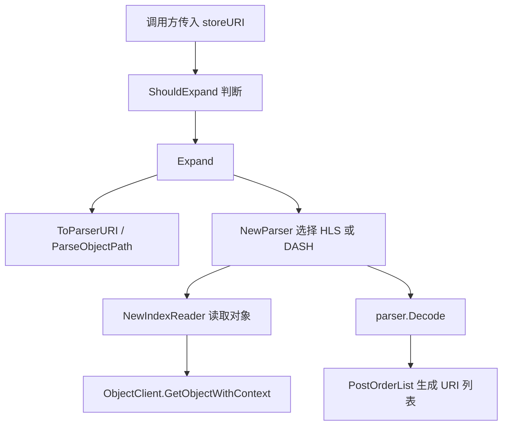

# Manifest Expansion

## 模块概览

`internal/source/manifest` 负责把 HLS/DASH manifest 对象展开为其中引用的分片 URI 列表。它面向上游数据源中的对象记录工作：当记录本身是 `.m3u8` 或 `.mpd`，或显式标注为 `hls` / `dash` 格式时，模块会读取 manifest 内容，调用 `media-parser-go` 解析，并返回解析出的子对象 URI。

该模块不直接依赖具体存储客户端实现，只要求调用方提供 `ObjectClient`：

```go
type ObjectClient interface {
	GetObjectWithContext(ctx context.Context, bucketName, objectName string, opts *storagegw.GetObjectOptions) (*storagegw.ObjectInfo, error)
}
```

这让 manifest 展开逻辑可以被 `hdfsparquet`、`tosinventorycsv` 等不同来源复用。

## 入口判断

调用方通常先判断对象是否需要展开。

`FormatFromContentType(raw string) (string, bool)` 从 HTTP `Content-Type` 中识别 manifest 格式。它会去掉 `;` 后面的参数并忽略大小写，目前只识别：

| Content-Type | 返回格式 |
| --- | --- |
| `application/x-mpegurl` | `hls` |
| `application/dash+xml` | `dash` |

`ShouldExpand(storeURI, format string) bool` 是核心判断函数：

```go
func ShouldExpand(storeURI string, format string) bool {
	return IsFormat(format) || HasSuffix(storeURI)
}
```

判断来源有两类：

1. `IsFormat(format)`：`format` 清理空白并转小写后等于 `hls` 或 `dash`。
2. `HasSuffix(storeURI)`：`storeURI` 去掉 query string 后，以 `.m3u8` 或 `.mpd` 结尾。

因此，下面这些 URI 都会触发展开：

```text
bucket/path/index.m3u8
bucket/path/manifest.mpd
bucket/path/index.m3u8?version=1
```

## 展开流程

核心入口是 `Expand(ctx, client, storeURI, format) ([]string, error)`。它读取 manifest 文件，解析出依赖的媒体分片或子 manifest URI，并返回字符串列表。



`Expand` 的执行逻辑：

1. 如果 `client == nil`，直接返回 `nil, nil`。
2. 最多尝试 3 次解析。
3. 每次先调用 `ToParserURI(storeURI)`，将存储 URI 规范化为 parser 使用的 `bucket/key` 形式。
4. 调用 `NewParser(storeURI, format, client)` 创建 HLS 或 DASH parser。
5. 调用 `parser.Decode(ctx, parserURI)` 解析 manifest。
6. 解析成功后遍历 `segments.PostOrderList()`，取每个 segment 的 `URI()`。
7. 调用 `NormalizeParsedStoreURI` 清理 URI，目前只做 `strings.TrimSpace`。
8. 跳过空 URI，返回非空 URI 列表。

如果 3 次都失败，`Expand` 会记录 warning 日志，然后返回 `nil, nil`。这个行为表示“展开失败时回退到原始索引对象”，而不是把错误继续抛给调用方。

日志中会包含失败阶段：

- `to_parser_uri`：`storeURI` 无法解析为 `bucket/key`
- `decode`：manifest 解码失败，包括读取对象失败、parser 解析失败等

## Parser 选择

`NewParser(storeURI, format, client) mparser.MediaParser` 根据格式参数和 URI 后缀选择 parser：

```go
if strings.EqualFold(strings.TrimSpace(format), FormatDASH) ||
	strings.HasSuffix(strings.ToLower(strings.SplitN(strings.TrimSpace(storeURI), "?", 2)[0]), ".mpd") {
	return mparser.NewDashParser(reader)
}
return mparser.NewM3U8Parser(reader)
```

选择规则：

| 条件 | Parser |
| --- | --- |
| `format == "dash"`，忽略大小写和空白 | `mparser.NewDashParser` |
| `storeURI` 去掉 query 后以 `.mpd` 结尾 | `mparser.NewDashParser` |
| 其他情况 | `mparser.NewM3U8Parser` |

注意：即使 `format` 是空字符串，只要文件后缀是 `.mpd`，也会使用 DASH parser。否则默认使用 M3U8 parser。

## 对象路径解析

manifest 模块统一使用 `bucket/key` 格式表示对象位置。

`ParseObjectPath(raw string) (ObjectPath, error)` 负责把字符串解析成：

```go
type ObjectPath struct {
	Bucket string
	Key    string
}
```

解析规则：

- 前后空白会被去掉。
- 前后的 `/` 会被去掉。
- 第一个 `/` 之前是 bucket。
- 第一个 `/` 之后是 key。
- bucket 或 key 为空时返回错误。

示例：

```go
ParseObjectPath("video-bucket/path/to/index.m3u8")
// ObjectPath{Bucket: "video-bucket", Key: "path/to/index.m3u8"}
```

无效示例：

```text
""
"bucket-only"
"/bucket/"
```

`ToParserURI(storeURI)` 只是复用 `ParseObjectPath`，再拼回 `bucket/key`。它的作用是确保传给 `media-parser-go` 的 URI 已经过相同规则校验。

## Manifest 读取适配

`NewIndexReader(client)` 把项目内的对象客户端适配成 `media-parser-go` 需要的 `mparser.IndexReader`：

```go
func(ctx context.Context, uri string) (io.ReadCloser, mparsererrs.Err)
```

读取过程：

1. 调用 `ParseObjectPath(uri)` 解析 bucket 和 key。
2. 调用 `client.GetObjectWithContext(ctx, parsed.Bucket, parsed.Key, nil)` 获取对象。
3. 校验返回对象和 `obj.R` 不为空。
4. 返回 `obj.R` 作为 manifest/parser 的读取流。

这里不会关闭 `obj.R`，读取流的生命周期交给 `media-parser-go` parser 处理。

## 错误适配

`mediaParserErr` 用来把普通 `error` 包装成 `mparsererrs.Err`。它实现了：

```go
func (e mediaParserErr) Error() string
func (e mediaParserErr) IsNotFound() bool
```

`IsNotFound` 的判断比较宽松：

- 原始错误是 `io.EOF`
- 错误信息包含 `not found`
- 错误信息包含 `404`
- 错误信息包含 `nosuchkey`

这些错误语义会被传递给 `media-parser-go`，供 parser 在解析多级 manifest 或缺失引用时做内部判断。

## 与其他模块的连接

`manifest` 是一个被数据源解析器复用的底层模块，主要调用方包括：

- `source/hdfsparquet/extractor.go`
  - `shouldExpandManifest` 调用 `ShouldExpand`
  - `parseManifestObjects` 调用 `Expand`
  - `parseManifestObjectPath` 调用 `ParseObjectPath`
  - `newManifestParser` 调用 `NewParser`
  - `hasManifestSuffix`、`toParserURI`、`normalizeParsedStoreURI` 分别复用本模块对应函数

- `source/tosinventorycsv/reader.go`
  - `objectsFromCSVRecord` 调用 `FormatFromContentType`
  - `objectsFromCSVRecord` 调用 `Expand`

典型链路是：

```text
ParseURIFromBatches
-> parseBatch
-> parseRowObjects
-> parseManifestObjects
-> manifest.Expand
-> manifest.NewParser
-> manifest.NewIndexReader
-> ObjectClient.GetObjectWithContext
```

这说明 manifest 展开发生在“从源数据提取对象列表”的阶段。展开成功时，下游拿到的是 manifest 内部引用的对象；展开失败时，`Expand` 返回 `nil, nil`，调用方可以保留原始索引对象作为回退结果。

## 贡献注意事项

修改这个模块时需要保持几个行为稳定：

- `Expand` 当前是容错设计，失败后记录 warning 并返回 `nil, nil`，不要轻易改成向上返回错误，否则会影响批量解析链路。
- `ParseObjectPath` 是跨模块复用的路径校验逻辑，改变解析规则会影响 `hdfsparquet` 相关包装函数。
- `NormalizeParsedStoreURI` 目前只做去空白，调用方已经依赖这个轻量行为；如果要增加 URI 重写、协议补全或 query 清理，应先确认所有来源的 URI 约定。
- `NewParser` 的默认分支是 HLS parser；新增格式时需要同步更新 `FormatFromContentType`、`IsFormat`、`ShouldExpand` 和 parser 选择逻辑。