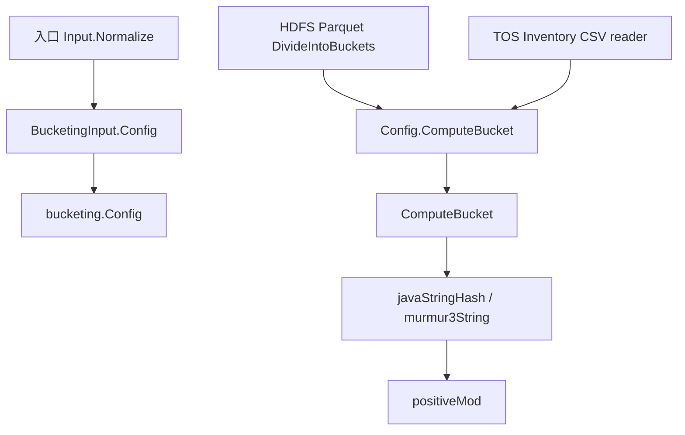

# Other — bucketing

## 模块概览

`internal/bucketing` 提供统一的 URI 分桶计算逻辑。上层模块只需要传入对象的 `store_uri`、桶数量和哈希算法配置，即可得到稳定的 bucket id。

该模块当前支持两种分桶对齐方式：

- `hive`：使用 Java `String.hashCode` 风格的哈希，适合与 Hive 分桶逻辑对齐。
- `spark`：使用 MurmurHash3 32-bit 哈希，并支持 `sparkSeed`，适合与 Spark SQL 风格分桶对齐。

分桶结果始终通过 `positiveMod` 归一化到 `[0, numBuckets)` 范围内，避免 Go 对负数取模导致负 bucket id。

## 核心 API

### `Config`

```go
type Config struct {
	NumBuckets int
	HashAlg    string
	SparkSeed  uint32
}
```

`Config` 是上层 source 模块使用的分桶配置对象。

字段含义：

- `NumBuckets`：总桶数，必须大于 0。
- `HashAlg`：哈希算法，支持 `""`、`"hive"`、`"spark"`。
- `SparkSeed`：Spark MurmurHash3 的 seed，仅在 `HashAlg == "spark"` 时使用。

`HashAlg` 为空字符串时，`ComputeBucket` 会按 `"hive"` 处理。入口层 `Input.Normalize` 也会把空算法归一化为 `HashAlgHive`。

### `Config.ComputeBucket`

```go
func (c Config) ComputeBucket(uri string) (int, error) {
	return ComputeBucket(uri, c.NumBuckets, c.HashAlg, c.SparkSeed)
}
```

这是 source 模块最常用的调用方式。它把结构化配置转发给包级函数 `ComputeBucket`。

示例：

```go
bucketID, err := cfg.Bucketing.ComputeBucket(object.StoreURI)
if err != nil {
	return err
}
buckets[bucketID] = append(buckets[bucketID], object)
```

### `ComputeBucket`

```go
func ComputeBucket(uri string, numBuckets int, hashAlg string, sparkSeed uint32) (int, error)
```

`ComputeBucket` 是实际的分桶入口。

执行规则：

1. 如果 `numBuckets <= 0`，返回错误：`num_buckets must be > 0`。
2. 如果 `hashAlg == ""` 或 `"hive"`，使用 `javaStringHash(uri)`。
3. 如果 `hashAlg == "spark"`，使用 `murmur3String(uri, sparkSeed)`。
4. 如果算法不支持，返回错误：`unsupported hash_alg: <value>`。
5. 对哈希值执行 `positiveMod`，得到合法 bucket id。

## 哈希实现

### Hive 路径：`javaStringHash`

```go
func javaStringHash(s string) int32 {
	var h int32
	for _, r := range s {
		h = 31*h + int32(r)
	}
	return h
}
```

该函数实现 Java `String.hashCode` 风格的滚动哈希：

```text
h = 31*h + char
```

注意这里遍历的是 Go 字符串的 rune，而不是原始 byte。对于普通 ASCII URI，这与按字节处理效果一致；如果 URI 中包含非 ASCII 字符，需要注意它按 Unicode code point 参与计算。

### Spark 路径：`murmur3String`

```go
func murmur3String(s string, seed uint32) uint32
```

该函数实现 MurmurHash3 32-bit 版本，流程包括：

- 将字符串转成 `[]byte`。
- 按 4 字节 little-endian block 处理主体数据。
- 处理不足 4 字节的 tail。
- 混入输入长度。
- 通过 `fmix32` 做最终 avalanche 混合。

相关辅助函数：

```go
func bitsRotateLeft32(x uint32, k int) uint32
func fmix32(h uint32) uint32
```

`SparkSeed` 会作为 MurmurHash3 初始 seed。入口层 `Input.Normalize` 在 `hash_alg == "spark"` 且 `spark_seed == 0` 时会默认设置为 `42`。

## 取模归一化

```go
func positiveMod(v int32, n int) int {
	return int((int64(v)%int64(n) + int64(n)) % int64(n))
}
```

Go 的 `%` 对负数会保留负号，例如 `-1 % 16 == -1`。哈希值是 `int32`，可能为负，因此模块使用 `positiveMod` 保证结果始终落在：

```text
0 <= bucketID < numBuckets
```

这也是 `bucketing_test.go` 中两个测试关注的核心行为。

## 调用关系

`internal/bucketing` 不依赖业务模块，只提供纯计算能力。它被入口配置和 source 处理链路复用。



主要连接点：

- `main.go`
  - `BucketingInput.Config()` 将 API 输入转换为 `internal/bucketing.Config`。
  - `Input.Normalize()` 校验 `bucketing.num_buckets`，归一化默认算法，并处理 Spark 默认 seed。
- `internal/source/hdfsparquet`
  - `types.go` 中 `type Bucketing = sharedbucketing.Config`。
  - `DivideIntoBuckets` 对每个 `object.StoreURI` 调用 `bucketing.ComputeBucket`。
- `internal/source/tosinventorycsv`
  - reader 在解析 CSV 对象后调用 `cfg.Bucketing.ComputeBucket(object.StoreURI)`，并按 bucket id 聚合对象。

## 错误边界

`ComputeBucket` 会直接返回配置错误，因此调用方必须处理 error。

当前错误包括：

- `num_buckets must be > 0`
- `unsupported hash_alg: <hashAlg>`

在正常入口链路中，`Input.Normalize()` 会提前校验这些配置：

```go
if in.Bucketing.NumBuckets <= 0 {
	return fmt.Errorf("bucketing.num_buckets must be > 0")
}
```

但 `internal/bucketing` 仍保留自己的防御性校验，保证直接调用 `ComputeBucket` 或 `Config.ComputeBucket` 时不会产生非法 bucket id。

## 测试覆盖

`internal/bucketing/bucketing_test.go` 当前包含两个基础测试：

```go
func TestComputeBucketHive(t *testing.T)
func TestComputeBucketSpark(t *testing.T)
```

它们分别验证：

- `"hive"` 算法可以成功计算 bucket。
- `"spark"` 算法可以成功计算 bucket。
- 结果都位于 `[0, numBuckets)` 范围内。

如果后续修改哈希实现，建议补充固定输入的 golden case，明确某个 URI 在给定桶数、算法和 seed 下的期望 bucket id，避免兼容性回归。