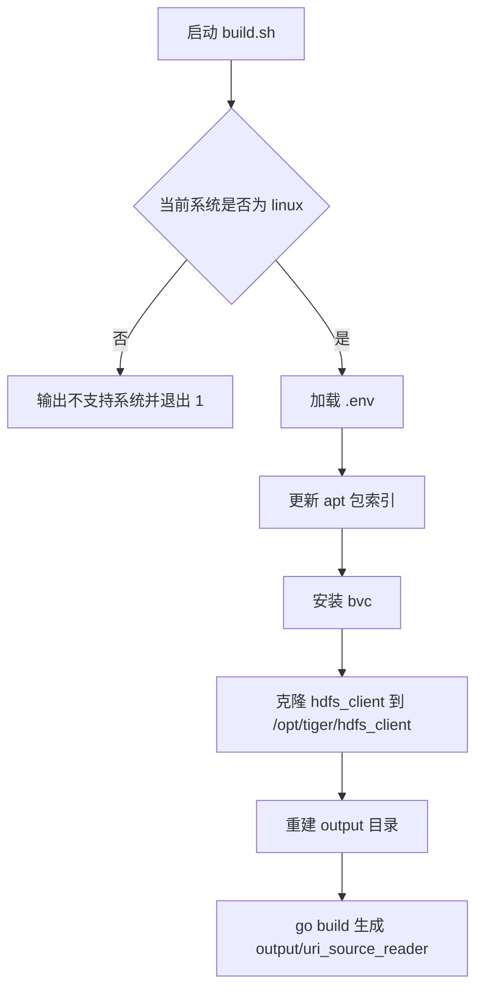

# Other — build.sh

## build.sh

`build.sh` 是项目的 Linux 构建脚本，用于准备构建依赖并生成 Go 可执行文件 `output/uri_source_reader`。脚本没有定义函数或类，也没有被代码内调用；它是一个顺序执行的外部构建入口。

## 执行流程



## 运行环境要求

该脚本只支持 Linux：

```bash
if [ $(uname -s | tr A-Z a-z) != "linux" ]; then
    echo "Unsupported OS, only running this script on Linux"
    exit 1
fi
```

系统名称通过 `uname -s` 获取，并用 `tr A-Z a-z` 转成小写后与 `linux` 比较。非 Linux 环境会直接退出，退出码为 `1`。

脚本还隐含依赖以下环境：

- 当前目录存在 `.env`，因为脚本使用 `. .env` 直接加载。
- 系统使用 `apt` 包管理器。
- 当前执行用户有权限运行 `apt update -y`、`apt install -y bvc`，以及写入 `/opt/tiger/hdfs_client`。
- Go 工具链已可用，因为最后执行 `go build`。
- 当前工作目录是 Go 模块或可构建的 Go 包根目录。

## 关键步骤

### 加载环境变量

```bash
. .env
```

脚本使用 POSIX shell 的 `.` 命令加载当前目录下的 `.env`。这会把 `.env` 中的变量注入当前 shell 进程，后续的 `apt`、`bvc`、`go build` 都会继承这些环境变量。

脚本没有检查 `.env` 是否存在。如果文件缺失，shell 会报错，后续行为取决于 shell 的默认错误处理；由于脚本没有设置 `set -e`，单条命令失败后不一定立即终止。

### 安装 `bvc`

```bash
apt update -y
apt install -y bvc
```

构建前会刷新 apt 包索引并安装 `bvc`。这一步会修改系统级包状态，因此通常应在 CI 镜像、构建容器或受控 Linux 环境中执行。

### 准备 HDFS 客户端

```bash
bvc clone -f data/inf/hdfs_client /opt/tiger/hdfs_client
```

脚本通过 `bvc clone -f` 将 `data/inf/hdfs_client` 克隆到固定路径 `/opt/tiger/hdfs_client`。`-f` 表示强制操作，可能覆盖目标路径中的既有内容。

该步骤说明项目构建或运行时依赖 `/opt/tiger/hdfs_client` 下的 HDFS 客户端文件。这个依赖不是通过 Go 模块声明的，而是由构建脚本在系统路径中准备。

### 重建输出目录

```bash
rm -rf output && mkdir -p output
```

构建前会删除整个 `output` 目录并重新创建。任何此前保存在 `output` 下的文件都会被清除。

### 构建可执行文件

```bash
go build -o output/uri_source_reader
```

最后使用 `go build` 构建当前目录对应的 Go 包，并将产物写入：

```text
output/uri_source_reader
```

这里没有指定包路径，因此 `go build` 的构建目标是脚本运行时所在目录。

## 与代码库的关系

`build.sh` 是代码库的构建编排层，不参与 Go 程序运行时逻辑。它负责把外部系统依赖和最终二进制产物连接起来：

- 外部依赖：`apt`、`bvc`、`/opt/tiger/hdfs_client`
- 项目源码：当前目录下的 Go 包
- 构建产物：`output/uri_source_reader`

开发者修改 Go 代码后，可以通过该脚本在 Linux 环境中生成标准输出产物。若只需要本地快速编译且环境中已经准备好依赖，也可以直接运行：

```bash
go build -o output/uri_source_reader
```

但这会跳过 `.env` 加载、`bvc` 安装和 HDFS 客户端准备，因此不等价于完整构建流程。

## 维护注意事项

该脚本当前没有启用严格错误处理。由于没有 `set -e`，例如 `.env` 加载失败、`apt install` 失败或 `bvc clone` 失败时，脚本可能继续执行到 `go build`。如果后续需要提高 CI 可诊断性，可以考虑在脚本顶部加入严格模式：

```bash
set -euo pipefail
```

另外，`/opt/tiger/hdfs_client` 是硬编码路径。如果不同环境需要不同安装位置，应优先通过 `.env` 中的变量配置，并在脚本中显式校验变量是否存在。