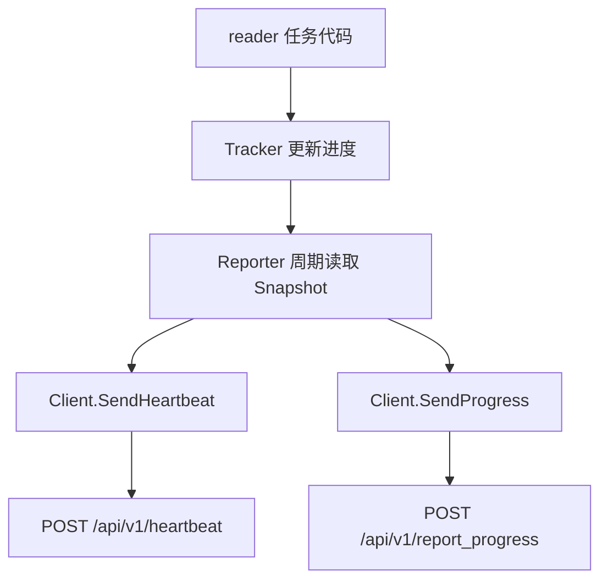

# Other — controlplane

## controlplane 模块

`controlplane` 包负责把 reader 运行状态上报到控制面。它提供三层能力：

- `Client`：封装控制面 HTTP/Hertz 请求。
- `Tracker`：线程安全地累计 reader 运行进度。
- `Reporter`：周期性发送心跳和进度，并在结束时 flush 最终进度。

该模块面向 reader 侧使用，当前所有上报请求的 `Kind` 都固定为 `"reader"`。

## 核心流程



典型调用顺序是：

```go
client, err := controlplane.NewClient(controlplane.Config{
    Endpoint: "http://control-plane.example.com",
})
if err != nil {
    return err
}

tracker := controlplane.NewTracker(
    "job-1",
    "reader-1",
    "hdfs_parquet",
    "127.0.0.1",
    0,
)

reporter := controlplane.NewReporter(client, tracker, 30*time.Second, 30*time.Second)
reporter.Start(ctx)
defer reporter.Stop()

tracker.OnFilesResolved(10)
tracker.OnRowsRead(1000)
tracker.OnFileDone("/path/part-00000.parquet", 1024)
tracker.OnBucketsSeen([]int{1, 2, 2})

tracker.SetWorkerStatus(controlplane.WorkerStateDone, "")
return reporter.FlushFinalProgress(context.Background())
```

## Client：控制面请求封装

`NewClient(cfg Config)` 创建控制面客户端。`Config` 包含：

- `Endpoint`：显式控制面地址。非空时直接拼接 API path，例如 `Endpoint + "/api/v1/heartbeat"`。
- `PSM`：未配置 `Endpoint` 时使用的服务名；默认值为 `bytedance.videoarch.uri_task_control_panel`。
- `Cluster`：服务发现目标集群；默认值为 `"default"`。

`Client` 使用 `byted.NewClient` 创建 Hertz byted 客户端，默认请求超时时间为 `3s`。当 `Endpoint` 为空时，`doJSON` 会启用服务发现选项：

- `discovery.WithSD(true)`
- `discovery.WithDestinationCluster(c.cfg.Cluster)`
- `hconfig.WithRequestTimeout(defaultRequestTimeout)`

对外方法只有两个：

- `SendHeartbeat(ctx, req HeartbeatRequest) (*HeartbeatResponse, error)`
- `SendProgress(ctx, req ProgressRequest) (*ProgressResponse, error)`

它们分别调用：

- `POST /api/v1/heartbeat`
- `POST /api/v1/report_progress`

响应统一按 `envelope[T]` 解析：

```go
type envelope[T any] struct {
    Code    int    `json:"code"`
    Message string `json:"message"`
    Data    T      `json:"data"`
}
```

`doJSON` 只接受 HTTP 200；如果 envelope 的 `code != 0`，会返回包含控制面错误码和消息的 error。`data` 为空时不会继续反序列化业务响应体。

## Tracker：reader 进度聚合

`Tracker` 是 reader 状态的内存聚合器，内部用 `sync.Mutex` 保护所有字段，适合被读取线程和处理线程并发访问。

`NewTracker(jobID, readerID, sourceType, ip string, port int)` 初始化：

- `workerStatus` 为 `WorkerStateRunning`
- `bucketsSeen` 为空 map
- `lastUpdateTime` 为当前 UTC 时间

进度更新方法：

- `OnFilesResolved(total int)`：设置文件总数。
- `OnFileDone(_ string, bytesRead int64)`：完成文件数加一；`bytesRead > 0` 时累计读取字节数。
- `OnRowsRead(rows int)`：`rows > 0` 时累计读取行数。
- `OnBucketsSeen(bucketIDs []int)`：按 bucket ID 去重统计，重复 ID 只算一次。
- `SetWorkerStatus(status, errorMessage string)`：设置 worker 状态和错误信息；空 `status` 会被忽略。
- `ReaderID() string`：读取 reader ID。
- `Snapshot() Snapshot`：复制当前状态，用于上报。

`Snapshot` 是上报前的稳定视图，包含 `JobID`、`ReaderID`、`SourceType`、`IP`、`Port`、`WorkerStatus`、`ErrorMessage`、文件计数、行数、字节数、去重后的 `BucketsSeen` 和 `LastUpdateTime`。

## Reporter：周期上报与最终 flush

`NewReporter(client, tracker, heartbeatEvery, progressEvery)` 创建 reporter。两个间隔参数小于等于 0 时都会回退到 `30s`。

`Start(ctx)` 会启动两个 goroutine：

- `runHeartbeat`：启动后立即调用一次 `sendHeartbeat`，之后按 `heartbeatEvery` 周期发送。
- `runProgress`：启动后立即调用一次 `sendProgress`，之后按 `progressEvery` 周期发送。

`Stop()` 会取消内部 context，并等待两个 goroutine 退出。

`sendHeartbeat` 从 `Tracker.Snapshot()` 读取当前状态，然后调用 `Client.SendHeartbeat`。心跳请求字段包括：

- `JobID`
- `Kind: "reader"`
- `ReaderID`
- `IP`
- `Port`
- `Timestamp: time.Now().UTC()`

周期性进度上报通过 `sendProgress` 调用 `FlushFinalProgress(ctx)` 实现。`FlushFinalProgress` 会读取 snapshot 并构造 `ProgressRequest`：

- `JobID`
- `Kind: "reader"`
- `ReaderID`
- `WorkerStatus`
- `ErrorMessage`
- `Files`
  - `FilesTotal`
  - `FilesDone`
  - `RowsRead`
  - `BytesRead`
- `BucketsSeen`
- `LastUpdateTime`

需要注意：周期上报中的错误会被忽略，`FlushFinalProgress` 直接调用时会返回 `Client.SendProgress` 的 error。因此任务结束路径应显式调用 `FlushFinalProgress`，确保最终状态可以被调用方感知。

## 状态与请求类型

worker 状态使用字符串常量：

```go
const (
    WorkerStateRunning = "RUNNING"
    WorkerStateDone    = "DONE"
    WorkerStateFailed  = "FAILED"
)
```

心跳请求类型是 `HeartbeatRequest`，响应类型是 `HeartbeatResponse`，控制面可通过 `next_interval_sec` 返回建议间隔；当前 `Reporter` 不会动态调整本地 ticker。

进度请求类型是 `ProgressRequest`，文件维度进度放在 `ReaderFilesProgress` 中。`ProgressResponse` 只有 `Ack bool` 字段。

## 测试覆盖

`TestReporterFlushFinalProgressAndHeartbeat` 使用 `httptest.NewServer` 模拟控制面，验证：

- `NewClient(Config{Endpoint: server.URL})` 能走显式 endpoint。
- `Reporter.Start` 会触发至少一次 heartbeat 和 progress。
- `Reporter.Stop` 能停止后台 goroutine。
- `FlushFinalProgress` 会发送最终进度。
- heartbeat payload 中 `JobID` 和 `Kind` 正确。
- progress payload 中 `ReaderID`、`WorkerStatus`、文件总数、完成文件数、行数、字节数和去重后的 `BucketsSeen` 正确。

该测试体现了模块的主要契约：reader 业务代码只需要持续更新 `Tracker`，`Reporter` 负责把 snapshot 转换为控制面请求。