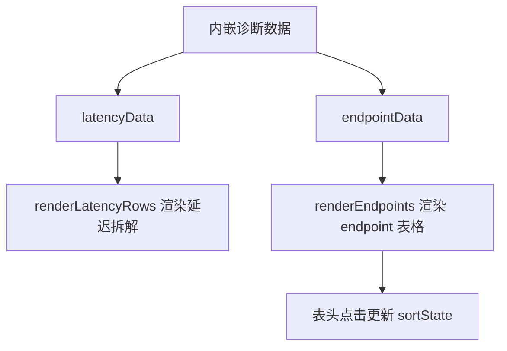

# Other — diagnostics

## Other — diagnostics 模块

`diagnostics/writer_rpc_diagnosis.html` 是一个独立的静态诊断看板，用于展示一次 `writer_rpc` 性能排查结果。它不依赖后端接口、打包流程或框架，所有数据都直接内嵌在 HTML、CSS 和 JavaScript 中，浏览器打开文件即可渲染。

该页面面向排障场景：把 Lambda raw stdout 中聚合出的关键指标整理成可读的诊断结论，包括 `writer_rpc` 总耗时、本地构建成本、endpoint 扇出、worker 排队、RPC 长尾、高频慢 endpoint，以及后续排查建议。

## 运行方式与代码边界

这个模块只有一个文件：

- `diagnostics/writer_rpc_diagnosis.html`

它没有检测到内部调用、外部调用或来自其他模块的调用。页面中的两个日志入口是普通 `<a>` 链接：

- `查看日志页`
- `打开 raw stdout`

JavaScript 代码不会发起 `fetch`、XHR、RPC 或动态资源加载请求。页面数据来自本文件内的常量数组和静态文案，因此它更像一次排障产物，而不是通用诊断系统。

## 页面结构

页面主体位于：

```html
<main class="shell">
  ...
</main>
```

主要区域按诊断阅读顺序排列：

1. 顶部标题与日志链接：`.topbar`
2. 核心结论与运行概况：`.hero`、`.diagnosis`、`.scoreboard`
3. 延迟拆解：`#latencyRows`
4. `buildEndpointBatches` profile 摘要
5. `writer_rpc` 调用路径说明
6. 高频慢 endpoint 表格：`#endpointBody`
7. 排查建议
8. 证据摘录

页面首屏重点给出结论：主瓶颈仍在 `writer_rpc`，但日志显示不是重试或 backpressure，而是固定 256 endpoint 扇出、endpoint worker 排队长尾、少数 endpoint RPC 长尾，以及本地 `buildEndpointBatches` 成本叠加。

## 前端实现

样式全部写在 `<style>` 中，没有外部 CSS 依赖。页面使用 CSS 变量定义视觉语义：

```css
:root {
  --bg: #f6f7f9;
  --panel: #ffffff;
  --ink: #17202a;
  --muted: #667085;
  --teal: #008c89;
  --blue: #3b6ea8;
  --amber: #c77d18;
  --rose: #c94b5f;
}
```

颜色在页面中承担诊断语义：

- `good` / `teal`：正常信号，例如 prewarm 正常、无重试压力
- `warn` / `amber`：需要关注，例如 build 成本、长尾影响
- `hot` / `rose`：主要风险，例如固定扇出和慢 endpoint
- `violet`：用于排队等待类指标

响应式布局通过两个断点控制：

- `max-width: 1080px`：双栏布局收缩为单栏，信号卡片改为两列
- `max-width: 720px`：移动端基本改为单列，表格保留横向滚动

## 数据模型

页面有两个核心数据数组。

`latencyData` 描述延迟指标：

```js
const latencyData = [
  {
    key: "build_elapsed",
    label: "buildEndpointBatches",
    desc: "本地 records/object metas 构建成本",
    avg: 358.385,
    p50: 147.341,
    p95: 1369,
    p99: 1779,
    max: 2382,
    color: "amber"
  }
];
```

字段含义：

- `key`：指标唯一标识，也用于特殊归一化逻辑
- `label`：页面展示名称
- `desc`：指标解释
- `avg`、`p50`、`p95`、`p99`、`max`：毫秒单位的统计值
- `color`：对应 `.bar-fill.<color>` 的 CSS 类

`endpointData` 描述 slow endpoint 聚合结果：

```js
const endpointData = [
  {
    rank: 1,
    endpoint: "[fdbd:dc53:27:21c::55]:42257",
    count: 58,
    avgRpc: 485.755,
    maxRpc: 1931,
    avgQueue: 731.806,
    maxQueue: 1914,
    signal: "RPC + queue 双高",
    heat: "hot"
  }
];
```

字段含义：

- `rank`：默认排序中的排名
- `endpoint`：writer endpoint 地址
- `count`：出现在 slow endpoint 明细中的次数
- `avgRpc` / `maxRpc`：RPC 耗时统计
- `avgQueue` / `maxQueue`：endpoint worker 排队耗时统计
- `signal`：人工归纳的诊断标签
- `heat`：徽标样式，对应 `.badge.ok`、`.badge.warn`、`.badge.hot`

## 渲染流程

页面初始化时执行两个渲染函数：

```js
renderLatencyRows();
renderEndpoints();
```

整体关系如下：



`renderLatencyRows()` 会读取 `latencyData`，生成 `.latency-row` HTML，并写入 `#latencyRows`。条形图宽度基于 `max` 值归一化：

```js
const base = item.key === "total_rpc_elapsed" ? maxTotalRpc : maxWall;
const width = Math.max(3, Math.round((item.max / base) * 100));
```

这里有一个重要设计：`total_rpc_elapsed` 是 256 个 RPC 的累加值，不等于壁钟时间，所以它使用 `maxTotalRpc` 单独归一化；其他壁钟相关指标使用 `maxWall` 归一化，避免 `total_rpc_elapsed` 把其他条形压得过短。

`renderEndpoints()` 会复制 `endpointData` 后按 `sortState` 排序，再写入 `#endpointBody`。表头点击事件绑定在所有 `th[data-key]` 上：

```js
document.querySelectorAll("th[data-key]").forEach((th) => {
  th.addEventListener("click", () => {
    const key = th.dataset.key;
    sortState = {
      key,
      dir: sortState.key === key && sortState.dir === "desc" ? "asc" : "desc"
    };
    renderEndpoints();
  });
});
```

当前排序状态由全局变量保存：

```js
let sortState = { key: "count", dir: "desc" };
```

## 工具函数

`ms(value)` 负责把毫秒数格式化为页面展示字符串：

```js
function ms(value) {
  if (value >= 1000) {
    return `${(value / 1000).toFixed(value >= 10000 ? 1 : 3).replace(/\.?0+$/, "")}s`;
  }
  return `${value.toFixed(value >= 100 ? 0 : 1).replace(/\.?0+$/, "")}ms`;
}
```

行为规则：

- 小于 `1000` 的值显示为 `ms`
- 大于等于 `1000` 的值转换为 `s`
- 较大的秒数使用 1 位小数
- 通过 `replace(/\.?0+$/, "")` 去掉多余的小数零

`endpointCell(item)` 负责生成 endpoint 表格行。它依赖 `ms()` 格式化 RPC 和 queue 指标，并使用 `item.heat` 选择 badge 样式。

## 诊断含义

这个页面表达的核心判断是：

- prewarm 正常：`bucket_count=32768`、`cached_buckets=32768`、`unique_endpoints=256`
- 没有明显重试压力：`timeout_retries=0`、`retryable_retries=0`、`backpressure_retries=0`
- 所有 batch 都固定提交到 256 个 endpoint
- `submit_elapsed`、`max_queue_wait`、`max_rpc_elapsed` 的 p95/p99 长尾共同影响总耗时
- `buildEndpointBatches` 的 p95 已经到秒级，需要纳入优化范围

因此，页面没有把问题简单归因为 writer 服务端 RPC 慢，而是把瓶颈拆成四段：

1. 本地构建 RPC records
2. bucket 到 endpoint 映射
3. 256 endpoint 并发扇出
4. endpoint worker 排队与实际 RPC 长尾

其中第 2 段 `state_lookup_elapsed` 被标记为非主要瓶颈；第 1、3、4 段是后续排查重点。

## 修改数据时的注意事项

如果要用新的日志结果更新页面，通常需要同步修改这些位置：

- 顶部 invocation、日期和日志链接
- `.scoreboard` 中的运行概况数字
- `.signals` 中的摘要判断
- `latencyData`
- `endpointData`
- `buildEndpointBatches Profile` 区域的 benchmark 和 allocation 文案
- “证据摘录”中的 raw stdout 片段

修改 `latencyData` 时要保持单位为毫秒，因为 `ms()` 默认按毫秒格式化。修改 `endpointData` 时，`heat` 必须匹配现有 badge 类：`ok`、`warn` 或 `hot`。

如果新增可排序列，需要同时满足两点：

- 表头添加 `data-key`
- `endpointData` 中每条记录都有同名字段

`renderEndpoints()` 会自动根据字段类型选择数值排序或字符串排序。