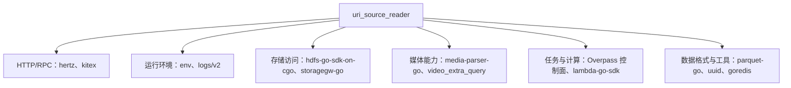

# Other — go.mod

## go.mod 模块说明

`go.mod` 定义了仓库的 Go 模块边界、语言版本和依赖集合。当前模块路径是：

```go
module code.byted.org/videoarch/uri_source_reader
```

这意味着仓库内包在其他代码中应以 `code.byted.org/videoarch/uri_source_reader/...` 的形式被导入。`go 1.25` 指定了该模块面向的 Go 语言版本和模块解析语义。

本文件本身没有函数、类或运行时调用链；它通过 Go Modules 机制影响整个代码库的编译、依赖解析、测试和部署。

## 直接依赖

第一组 `require` 是业务代码直接依赖的模块，通常对应源码中的显式 `import`。

```go
require (
    code.byted.org/gopkg/env v1.7.16
    code.byted.org/gopkg/logs/v2 v2.1.60
    code.byted.org/inf/hdfs-go-sdk-on-cgo v1.1.5
    code.byted.org/kite/kitex v1.22.1
    code.byted.org/kv/goredis v5.7.7+incompatible
    code.byted.org/middleware/hertz v1.14.3
    code.byted.org/overpass/bytedance_videoarch_uri_task_control_panel ...
    code.byted.org/v_lambda/lambda-go-sdk v0.0.35
    code.byted.org/videoarch/media-parser-go v0.0.8
    code.byted.org/videoarch/storagegw-go v1.1.57
    code.byted.org/videoarch/video_extra_query ...
    github.com/google/uuid v1.6.0
    github.com/xitongsys/parquet-go v1.6.2
)
```

这些依赖可以按职责理解：



## 关键依赖说明

`code.byted.org/middleware/hertz` 提供 HTTP 服务框架。如果仓库中存在入口服务、路由注册或 HTTP handler，通常会依赖它完成请求接入、上下文传递和响应输出。

`code.byted.org/kite/kitex` 是 RPC 框架依赖。仓库如果需要调用或暴露 Kitex 服务，IDL 生成代码、client 初始化和 server 启动逻辑会通过该依赖构建。

`code.byted.org/overpass/bytedance_videoarch_uri_task_control_panel` 是 Overpass 生成的服务客户端依赖，名称表明它连接 `bytedance_videoarch_uri_task_control_panel` 服务，通常用于任务控制面相关 RPC 调用。

`code.byted.org/videoarch/storagegw-go` 和 `code.byted.org/inf/hdfs-go-sdk-on-cgo` 说明该模块需要访问存储系统。前者面向 VideoArch StorageGW，后者面向 HDFS，并且包名包含 `on-cgo`，构建或运行环境需要注意 CGO 相关配置。

`code.byted.org/videoarch/media-parser-go` 和 `code.byted.org/videoarch/video_extra_query` 表明该模块和媒体 URI 解析、视频元信息或额外查询能力有关。

`github.com/xitongsys/parquet-go` 用于读写 Parquet 数据。仓库中涉及批量数据、离线结果或结构化文件输出的代码可能会依赖它。

`code.byted.org/kv/goredis v5.7.7+incompatible` 是 Redis 客户端依赖。`+incompatible` 表示该版本不完全遵循 Go module 的语义化主版本路径规则；升级时需要特别确认 import path 和间接依赖中的 `code.byted.org/kv/goredis/v5` 是否会产生重复或兼容性问题。

`github.com/google/uuid` 用于生成或解析 UUID，通常出现在任务 ID、请求 ID、临时对象 ID 或幂等键生成逻辑中。

## 间接依赖

第二组 `require` 全部带有 `// indirect`，表示它们不是当前模块源码直接 import 的主依赖，而是由直接依赖递归引入，或者曾由 `go mod tidy` 根据构建图保留下来。

这些间接依赖覆盖几个主要领域：

- 链路追踪与监控：`bytedtrace-*`、`trace-client-go`、`metrics`、`prometheus`、`profiler`
- 服务发现与配置：`consul`、`etcd`、`tccclient`、`configmanager`
- RPC/IDL 生态：`cloudwego/kitex`、`thrift`、`protobuf`、`grpc`
- 安全与身份：`kms`、`spiffe`、`zero-trust`、`certinfo`
- 存储与压缩格式：`tos`、`ve-tos-golang-sdk`、`lz4`、`snappy`、`arrow`
- 测试工具：`github.com/stretchr/testify`、`github.com/bytedance/mockey`
- 配置解析与工具库：`viper`、`yaml`、`toml`、`cast`

开发时通常不应手动编辑这些间接依赖。新增、删除或升级代码 import 后，应通过下面命令让 Go 工具链重新整理：

```bash
go mod tidy
```

## 与代码库的连接方式

`go.mod` 不参与运行时执行流，但它决定以下行为：

- `go build` 如何解析源码中的 import。
- `go test ./...` 使用哪些依赖版本编译测试。
- Kitex、Hertz、Overpass、StorageGW、HDFS 等框架代码能否正确链接。
- CI/CD 和部署环境复现依赖版本时的输入。
- `go.sum` 校验依赖完整性时的模块版本来源。

源码新增 import 时，如果该包属于新模块，`go mod tidy` 会把它加入 `require`。源码删除 import 后，如果没有其他包依赖该模块，`go mod tidy` 会移除对应条目。

## 维护注意事项

升级 `code.byted.org/kite/kitex`、`code.byted.org/middleware/hertz` 或 Overpass 生成客户端时，需要回归服务启动、RPC 调用和中间件行为，因为这些依赖通常影响框架初始化链路。

升级 `hdfs-go-sdk-on-cgo` 时，需要确认本地、CI 和线上构建环境的 CGO 设置一致。

升级 `parquet-go` 时，应验证 Parquet 读写兼容性，尤其是 schema、压缩格式和空值处理。

处理 Redis 相关依赖时，需要注意当前同时存在直接依赖 `code.byted.org/kv/goredis v5.7.7+incompatible` 和间接依赖 `code.byted.org/kv/goredis/v5 v5.7.7`。如果后续代码迁移 import path，应统一版本路径，避免同一客户端以两个模块路径进入构建图。

日常修改依赖的推荐流程是：

```bash
go get <module>@<version>
go mod tidy
go test ./...
```

`go.mod` 和 `go.sum` 应一起提交，保证其他开发者和 CI 能复现相同的依赖解析结果。